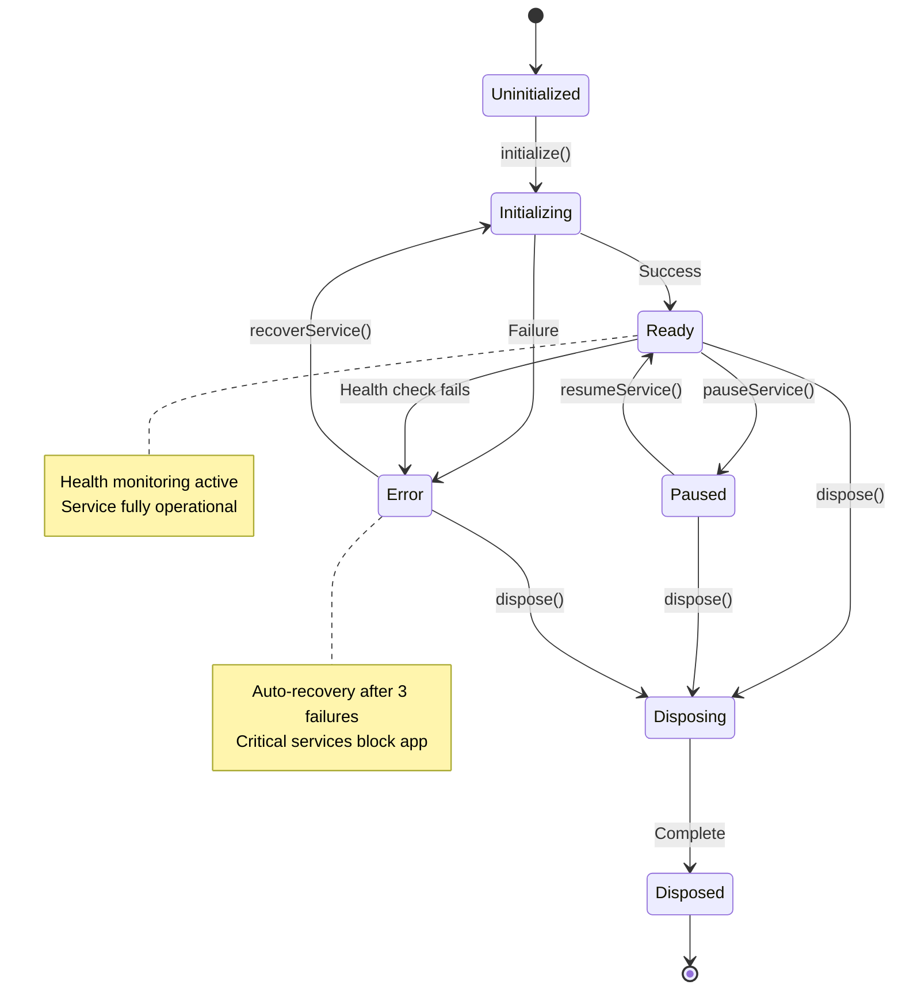
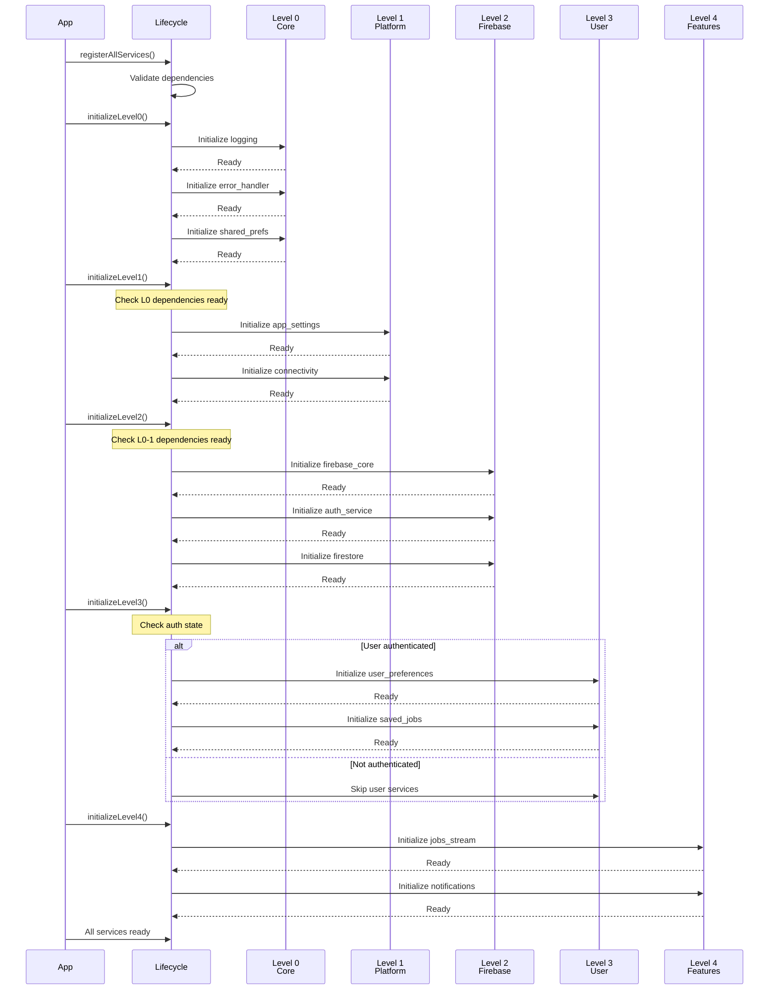

# Service Lifecycle Skill

## Overview

**Skill Owner**: Hierarchical Data Agent (State Management Domain)
**Purpose**: Implement comprehensive service lifecycle management using ServiceLifecycleManager to coordinate initialization, state transitions, health monitoring, graceful shutdowns, and dependency cleanup across all application services.

**Key Capabilities**:
- Hierarchical service initialization (Levels 0-4)
- Service state management (uninitialized → initializing → ready → error → disposed)
- Health monitoring and heartbeat tracking
- Dependency-aware shutdown sequences
- Resource cleanup and disposal
- Service restart and recovery
- Lifecycle event notifications
- Performance metric tracking

---

## Riverpod Integration

### Core ServiceLifecycleManager Provider

```dart
// lib/providers/service_lifecycle_provider.dart
import 'package:riverpod_annotation/riverpod_annotation.dart';
import 'package:journeyman_jobs/services/service_lifecycle_manager.dart';

part 'service_lifecycle_provider.g.dart';

/// Level 0: Core service lifecycle manager - no dependencies
@Riverpod(keepAlive: true)
class ServiceLifecycle extends _$ServiceLifecycle {
  late final ServiceLifecycleManager _manager;

  @override
  ServiceLifecycleManager build() {
    _manager = ServiceLifecycleManager(
      errorHandler: ref.read(errorHandlerProvider),
      logger: ref.read(loggingServiceProvider),
    );

    // Listen to app lifecycle events
    ref.listen(appLifecycleStateProvider, (previous, next) {
      _handleAppLifecycleChange(next);
    });

    return _manager;
  }

  Future<void> initializeAllServices() async {
    await _manager.initializeLevel0();
    await _manager.initializeLevel1();
    await _manager.initializeLevel2();
    await _manager.initializeLevel3();
    await _manager.initializeLevel4();
  }

  Future<void> shutdownAllServices() async {
    // Reverse order shutdown
    await _manager.shutdownLevel4();
    await _manager.shutdownLevel3();
    await _manager.shutdownLevel2();
    await _manager.shutdownLevel1();
    await _manager.shutdownLevel0();
  }

  void _handleAppLifecycleChange(AppLifecycleState state) {
    switch (state) {
      case AppLifecycleState.paused:
        _manager.pauseNonCriticalServices();
        break;
      case AppLifecycleState.resumed:
        _manager.resumeServices();
        break;
      case AppLifecycleState.detached:
        shutdownAllServices();
        break;
      default:
        break;
    }
  }
}

/// Stream of service lifecycle events
@riverpod
Stream<ServiceLifecycleEvent> serviceLifecycleEvents(
  ServiceLifecycleEventsRef ref,
) {
  final manager = ref.watch(serviceLifecycleProvider);
  return manager.eventStream;
}

/// Current service health status
@riverpod
class ServiceHealth extends _$ServiceHealth {
  @override
  Stream<Map<String, ServiceHealthStatus>> build() {
    final manager = ref.watch(serviceLifecycleProvider);
    return manager.healthStream;
  }

  ServiceHealthStatus? getServiceHealth(String serviceId) {
    final healthMap = state.value;
    return healthMap?[serviceId];
  }
}
```

---

## Implementation Patterns

### Pattern 1: Hierarchical Service Registration

**Use Case**: Register services with proper level-based dependencies

```dart
// lib/services/service_lifecycle_manager.dart
class ServiceLifecycleManager {
  final Map<int, List<ManagedService>> _servicesByLevel = {};
  final Map<String, ServiceState> _serviceStates = {};
  final StreamController<ServiceLifecycleEvent> _eventController;
  final StreamController<Map<String, ServiceHealthStatus>> _healthController;

  ServiceLifecycleManager({
    required ErrorHandler errorHandler,
    required LoggingService logger,
  }) : _errorHandler = errorHandler,
       _logger = logger,
       _eventController = StreamController.broadcast(),
       _healthController = StreamController.broadcast();

  /// Register a service at a specific initialization level
  void registerService({
    required String serviceId,
    required int level,
    required Future<void> Function() initialize,
    required Future<void> Function() dispose,
    List<String> dependencies = const [],
    bool critical = false,
    Duration? healthCheckInterval,
  }) {
    final service = ManagedService(
      id: serviceId,
      level: level,
      initialize: initialize,
      dispose: dispose,
      dependencies: dependencies,
      critical: critical,
      healthCheckInterval: healthCheckInterval,
    );

    _servicesByLevel.putIfAbsent(level, () => []).add(service);
    _serviceStates[serviceId] = ServiceState.uninitialized;

    _logger.info('Registered service: $serviceId at level $level');
  }

  /// Initialize all services at a specific level
  Future<void> initializeLevel(int level) async {
    final services = _servicesByLevel[level] ?? [];

    _logger.info('Initializing Level $level services (${services.length} services)');

    for (final service in services) {
      await _initializeService(service);
    }

    _logger.info('Level $level initialization complete');
  }

  Future<void> _initializeService(ManagedService service) async {
    try {
      // Check dependencies are ready
      for (final depId in service.dependencies) {
        final depState = _serviceStates[depId];
        if (depState != ServiceState.ready) {
          throw ServiceLifecycleException(
            'Dependency $depId not ready for ${service.id}. State: $depState',
          );
        }
      }

      _updateServiceState(service.id, ServiceState.initializing);

      final startTime = DateTime.now();
      await service.initialize();
      final duration = DateTime.now().difference(startTime);

      _updateServiceState(service.id, ServiceState.ready);

      _emitEvent(ServiceLifecycleEvent.initialized(
        serviceId: service.id,
        level: service.level,
        duration: duration,
      ));

      // Start health monitoring if configured
      if (service.healthCheckInterval != null) {
        _startHealthMonitoring(service);
      }

      _logger.info('Service ${service.id} initialized in ${duration.inMilliseconds}ms');

    } catch (e, stack) {
      _updateServiceState(service.id, ServiceState.error);
      _errorHandler.handleError(e, stack, context: 'ServiceLifecycle.initialize');

      _emitEvent(ServiceLifecycleEvent.failed(
        serviceId: service.id,
        error: e,
      ));

      if (service.critical) {
        throw ServiceLifecycleException(
          'Critical service ${service.id} failed to initialize: $e',
        );
      }
    }
  }
}

/// Managed service definition
class ManagedService {
  final String id;
  final int level;
  final Future<void> Function() initialize;
  final Future<void> Function() dispose;
  final List<String> dependencies;
  final bool critical;
  final Duration? healthCheckInterval;
  final Future<bool> Function()? healthCheck;

  ManagedService({
    required this.id,
    required this.level,
    required this.initialize,
    required this.dispose,
    this.dependencies = const [],
    this.critical = false,
    this.healthCheckInterval,
    this.healthCheck,
  });
}
```

### Pattern 2: Service State Transitions

**Use Case**: Manage service lifecycle state machine

```dart
/// Service lifecycle states
enum ServiceState {
  uninitialized,  // Not yet started
  initializing,   // Currently starting up
  ready,          // Fully operational
  paused,         // Temporarily suspended
  error,          // Failed state
  disposing,      // Shutting down
  disposed,       // Fully cleaned up
}

/// State transition validator
class ServiceStateTransition {
  static final Map<ServiceState, List<ServiceState>> _validTransitions = {
    ServiceState.uninitialized: [ServiceState.initializing],
    ServiceState.initializing: [ServiceState.ready, ServiceState.error],
    ServiceState.ready: [ServiceState.paused, ServiceState.disposing, ServiceState.error],
    ServiceState.paused: [ServiceState.ready, ServiceState.disposing],
    ServiceState.error: [ServiceState.initializing, ServiceState.disposing],
    ServiceState.disposing: [ServiceState.disposed],
    ServiceState.disposed: [], // Terminal state
  };

  static bool isValidTransition(ServiceState from, ServiceState to) {
    return _validTransitions[from]?.contains(to) ?? false;
  }

  static void validateTransition(
    String serviceId,
    ServiceState from,
    ServiceState to,
  ) {
    if (!isValidTransition(from, to)) {
      throw ServiceLifecycleException(
        'Invalid state transition for $serviceId: $from → $to',
      );
    }
  }
}

// In ServiceLifecycleManager:
void _updateServiceState(String serviceId, ServiceState newState) {
  final currentState = _serviceStates[serviceId] ?? ServiceState.uninitialized;

  ServiceStateTransition.validateTransition(serviceId, currentState, newState);

  _serviceStates[serviceId] = newState;

  _emitEvent(ServiceLifecycleEvent.stateChanged(
    serviceId: serviceId,
    oldState: currentState,
    newState: newState,
  ));

  _logger.debug('Service $serviceId: $currentState → $newState');
}
```

### Pattern 3: Health Monitoring

**Use Case**: Continuous service health checks with automatic recovery

```dart
class ServiceLifecycleManager {
  final Map<String, Timer> _healthTimers = {};
  final Map<String, int> _failureCounters = {};

  void _startHealthMonitoring(ManagedService service) {
    if (service.healthCheck == null || service.healthCheckInterval == null) {
      return;
    }

    _healthTimers[service.id]?.cancel();

    _healthTimers[service.id] = Timer.periodic(
      service.healthCheckInterval!,
      (_) => _performHealthCheck(service),
    );
  }

  Future<void> _performHealthCheck(ManagedService service) async {
    try {
      final isHealthy = await service.healthCheck!();

      final status = ServiceHealthStatus(
        serviceId: service.id,
        isHealthy: isHealthy,
        lastCheck: DateTime.now(),
        consecutiveFailures: isHealthy ? 0 : (_failureCounters[service.id] ?? 0) + 1,
      );

      if (isHealthy) {
        _failureCounters[service.id] = 0;
      } else {
        _failureCounters[service.id] = status.consecutiveFailures;

        _logger.warning(
          'Service ${service.id} health check failed '
          '(${status.consecutiveFailures} consecutive failures)',
        );

        // Auto-recovery after 3 failures
        if (status.consecutiveFailures >= 3) {
          _logger.info('Attempting auto-recovery for ${service.id}');
          await _recoverService(service);
        }
      }

      _updateHealthStatus(service.id, status);

    } catch (e, stack) {
      _errorHandler.handleError(e, stack, context: 'HealthCheck.${service.id}');

      _updateHealthStatus(
        service.id,
        ServiceHealthStatus(
          serviceId: service.id,
          isHealthy: false,
          lastCheck: DateTime.now(),
          error: e.toString(),
        ),
      );
    }
  }

  Future<void> _recoverService(ManagedService service) async {
    try {
      _updateServiceState(service.id, ServiceState.disposing);
      await service.dispose();

      _updateServiceState(service.id, ServiceState.uninitialized);
      await _initializeService(service);

      _failureCounters[service.id] = 0;

      _emitEvent(ServiceLifecycleEvent.recovered(
        serviceId: service.id,
      ));

    } catch (e, stack) {
      _errorHandler.handleError(e, stack, context: 'ServiceRecovery.${service.id}');
      _updateServiceState(service.id, ServiceState.error);
    }
  }
}

class ServiceHealthStatus {
  final String serviceId;
  final bool isHealthy;
  final DateTime lastCheck;
  final int consecutiveFailures;
  final String? error;

  const ServiceHealthStatus({
    required this.serviceId,
    required this.isHealthy,
    required this.lastCheck,
    this.consecutiveFailures = 0,
    this.error,
  });
}
```

---

## JJ-Specific Examples

### Example 1: Complete JJ Service Registration

```dart
// lib/core/app_initializer.dart
class AppInitializer {
  final Ref ref;

  AppInitializer(this.ref);

  Future<void> registerAllServices() async {
    final lifecycle = ref.read(serviceLifecycleProvider);

    // LEVEL 0: Core Services (No Dependencies)
    lifecycle.registerService(
      serviceId: 'logging',
      level: 0,
      initialize: () async {
        await ref.read(loggingServiceProvider.notifier).initialize();
      },
      dispose: () async {
        await ref.read(loggingServiceProvider.notifier).dispose();
      },
      critical: true,
      healthCheckInterval: Duration(minutes: 5),
      healthCheck: () async {
        return ref.read(loggingServiceProvider).isHealthy;
      },
    );

    lifecycle.registerService(
      serviceId: 'error_handler',
      level: 0,
      initialize: () async {
        await ref.read(errorHandlerProvider.notifier).initialize();
      },
      dispose: () async {
        await ref.read(errorHandlerProvider.notifier).dispose();
      },
      critical: true,
    );

    lifecycle.registerService(
      serviceId: 'shared_preferences',
      level: 0,
      initialize: () async {
        await ref.read(sharedPreferencesProvider.notifier).initialize();
      },
      dispose: () async {
        // SharedPreferences doesn't need disposal
      },
      critical: true,
    );

    // LEVEL 1: Platform Services (Depend on Level 0)
    lifecycle.registerService(
      serviceId: 'app_settings',
      level: 1,
      dependencies: ['shared_preferences', 'error_handler'],
      initialize: () async {
        await ref.read(appSettingsProvider.notifier).load();
      },
      dispose: () async {
        await ref.read(appSettingsProvider.notifier).save();
      },
      critical: false,
    );

    lifecycle.registerService(
      serviceId: 'connectivity',
      level: 1,
      dependencies: ['logging'],
      initialize: () async {
        await ref.read(connectivityProvider.notifier).initialize();
      },
      dispose: () async {
        await ref.read(connectivityProvider.notifier).dispose();
      },
      critical: false,
      healthCheckInterval: Duration(seconds: 30),
      healthCheck: () async {
        return ref.read(connectivityProvider).hasValue;
      },
    );

    // LEVEL 2: Firebase Services (Depend on Levels 0-1)
    lifecycle.registerService(
      serviceId: 'firebase_core',
      level: 2,
      dependencies: ['error_handler', 'logging'],
      initialize: () async {
        await Firebase.initializeApp(
          options: DefaultFirebaseOptions.currentPlatform,
        );
      },
      dispose: () async {
        // Firebase doesn't support disposal
      },
      critical: true,
    );

    lifecycle.registerService(
      serviceId: 'auth_service',
      level: 2,
      dependencies: ['firebase_core', 'error_handler'],
      initialize: () async {
        await ref.read(authServiceProvider.notifier).initialize();
      },
      dispose: () async {
        await ref.read(authServiceProvider.notifier).signOut();
      },
      critical: true,
      healthCheckInterval: Duration(minutes: 1),
      healthCheck: () async {
        final auth = ref.read(authServiceProvider);
        return auth.isInitialized;
      },
    );

    lifecycle.registerService(
      serviceId: 'firestore_service',
      level: 2,
      dependencies: ['firebase_core', 'auth_service', 'connectivity'],
      initialize: () async {
        await ref.read(firestoreServiceProvider.notifier).initialize();
      },
      dispose: () async {
        await ref.read(firestoreServiceProvider.notifier).dispose();
      },
      critical: true,
      healthCheckInterval: Duration(minutes: 2),
      healthCheck: () async {
        final firestore = ref.read(firestoreServiceProvider);
        return firestore.isHealthy;
      },
    );

    lifecycle.registerService(
      serviceId: 'fcm_service',
      level: 2,
      dependencies: ['firebase_core', 'auth_service', 'app_settings'],
      initialize: () async {
        await ref.read(fcmServiceProvider.notifier).initialize();
      },
      dispose: () async {
        await ref.read(fcmServiceProvider.notifier).dispose();
      },
      critical: false,
    );

    // LEVEL 3: User Services (Depend on Auth from Level 2)
    lifecycle.registerService(
      serviceId: 'user_preferences',
      level: 3,
      dependencies: ['auth_service', 'firestore_service'],
      initialize: () async {
        final userId = ref.read(authStateProvider).value?.uid;
        if (userId != null) {
          await ref.read(userPreferencesProvider.notifier).load(userId);
        }
      },
      dispose: () async {
        await ref.read(userPreferencesProvider.notifier).save();
      },
      critical: false,
    );

    lifecycle.registerService(
      serviceId: 'saved_jobs',
      level: 3,
      dependencies: ['auth_service', 'firestore_service'],
      initialize: () async {
        final userId = ref.read(authStateProvider).value?.uid;
        if (userId != null) {
          await ref.read(savedJobsProvider.notifier).load(userId);
        }
      },
      dispose: () async {
        // Saved jobs auto-sync with Firestore
      },
      critical: false,
    );

    // LEVEL 4: Feature Services (Depend on All Previous Levels)
    lifecycle.registerService(
      serviceId: 'jobs_stream',
      level: 4,
      dependencies: ['firestore_service', 'user_preferences'],
      initialize: () async {
        // Jobs stream auto-starts when provider is watched
      },
      dispose: () async {
        // Stream auto-closes when provider is disposed
      },
      critical: false,
      healthCheckInterval: Duration(minutes: 5),
      healthCheck: () async {
        final jobsState = ref.read(jobsProvider);
        return !jobsState.hasError;
      },
    );

    lifecycle.registerService(
      serviceId: 'notifications',
      level: 4,
      dependencies: ['fcm_service', 'user_preferences', 'jobs_stream'],
      initialize: () async {
        await ref.read(notificationsProvider.notifier).initialize();
      },
      dispose: () async {
        await ref.read(notificationsProvider.notifier).dispose();
      },
      critical: false,
    );
  }
}
```

### Example 2: Graceful Shutdown Sequence

```dart
// lib/services/service_lifecycle_manager.dart
extension GracefulShutdown on ServiceLifecycleManager {
  /// Shutdown all services in reverse level order
  Future<void> shutdownAllServices({
    Duration timeout = const Duration(seconds: 30),
  }) async {
    _logger.info('Beginning graceful shutdown sequence');

    try {
      await shutdownLevel4().timeout(timeout ~/ 5);
      await shutdownLevel3().timeout(timeout ~/ 5);
      await shutdownLevel2().timeout(timeout ~/ 5);
      await shutdownLevel1().timeout(timeout ~/ 5);
      await shutdownLevel0().timeout(timeout ~/ 5);

      _logger.info('Graceful shutdown complete');

    } catch (e, stack) {
      _errorHandler.handleError(e, stack, context: 'GracefulShutdown');
      throw ServiceLifecycleException('Shutdown failed: $e');
    }
  }

  Future<void> shutdownLevel(int level) async {
    final services = (_servicesByLevel[level] ?? []).reversed;

    _logger.info('Shutting down Level $level services');

    for (final service in services) {
      await _disposeService(service);
    }
  }

  Future<void> _disposeService(ManagedService service) async {
    try {
      // Cancel health monitoring
      _healthTimers[service.id]?.cancel();
      _healthTimers.remove(service.id);

      _updateServiceState(service.id, ServiceState.disposing);

      await service.dispose();

      _updateServiceState(service.id, ServiceState.disposed);

      _emitEvent(ServiceLifecycleEvent.disposed(
        serviceId: service.id,
      ));

      _logger.info('Service ${service.id} disposed successfully');

    } catch (e, stack) {
      _errorHandler.handleError(e, stack, context: 'ServiceDisposal.${service.id}');

      // Mark as disposed anyway to prevent hanging
      _updateServiceState(service.id, ServiceState.disposed);
    }
  }

  Future<void> shutdownLevel0() => shutdownLevel(0);
  Future<void> shutdownLevel1() => shutdownLevel(1);
  Future<void> shutdownLevel2() => shutdownLevel(2);
  Future<void> shutdownLevel3() => shutdownLevel(3);
  Future<void> shutdownLevel4() => shutdownLevel(4);
}
```

### Example 3: App Lifecycle Integration

```dart
// lib/providers/app_lifecycle_provider.dart
@riverpod
class AppLifecycle extends _$AppLifecycle {
  @override
  AppLifecycleState build() {
    final observer = _AppLifecycleObserver(ref);

    WidgetsBinding.instance.addObserver(observer);

    ref.onDispose(() {
      WidgetsBinding.instance.removeObserver(observer);
    });

    return AppLifecycleState.resumed;
  }
}

class _AppLifecycleObserver extends WidgetsBindingObserver {
  final Ref ref;

  _AppLifecycleObserver(this.ref);

  @override
  void didChangeAppLifecycleState(AppLifecycleState state) {
    ref.read(appLifecycleProvider.notifier).state = state;

    final lifecycle = ref.read(serviceLifecycleProvider);

    switch (state) {
      case AppLifecycleState.resumed:
        _handleAppResumed(lifecycle);
        break;
      case AppLifecycleState.paused:
        _handleAppPaused(lifecycle);
        break;
      case AppLifecycleState.inactive:
        // Brief pause, don't change services
        break;
      case AppLifecycleState.detached:
        _handleAppDetached(lifecycle);
        break;
    }
  }

  Future<void> _handleAppResumed(ServiceLifecycleManager lifecycle) async {
    // Resume paused services
    await lifecycle.resumeServices();

    // Refresh data that may be stale
    final jobs = ref.read(jobsProvider.notifier);
    await jobs.refresh();
  }

  Future<void> _handleAppPaused(ServiceLifecycleManager lifecycle) async {
    // Pause non-critical services to save battery
    await lifecycle.pauseNonCriticalServices();

    // Save user data
    await ref.read(userPreferencesProvider.notifier).save();
  }

  Future<void> _handleAppDetached(ServiceLifecycleManager lifecycle) async {
    // Full shutdown
    await lifecycle.shutdownAllServices();
  }
}
```

---

## Dependency Management

### Service Dependency Graph

```
Level 0 (Core - No Dependencies):
├── logging
├── error_handler
└── shared_preferences

Level 1 (Platform - Depend on Level 0):
├── app_settings → [shared_preferences, error_handler]
├── connectivity → [logging]
└── device_info → []

Level 2 (Firebase - Depend on Levels 0-1):
├── firebase_core → [error_handler, logging]
├── auth_service → [firebase_core, error_handler]
├── firestore_service → [firebase_core, auth_service, connectivity]
├── fcm_service → [firebase_core, auth_service, app_settings]
└── analytics → [firebase_core, app_settings]

Level 3 (User - Depend on Levels 0-2):
├── user_preferences → [auth_service, firestore_service]
├── saved_jobs → [auth_service, firestore_service]
└── user_profile → [auth_service, firestore_service]

Level 4 (Features - Depend on All):
├── jobs_stream → [firestore_service, user_preferences]
├── job_search → [firestore_service, user_preferences]
├── notifications → [fcm_service, user_preferences, jobs_stream]
└── offline_sync → [firestore_service, connectivity, saved_jobs]
```

### Dependency Validation

```dart
class ServiceDependencyValidator {
  static void validateDependencies(
    Map<int, List<ManagedService>> servicesByLevel,
  ) {
    final allServiceIds = <String>{};
    final servicesByLevel = <String, int>{};

    // Build service registry
    for (final entry in servicesByLevel.entries) {
      for (final service in entry.value) {
        allServiceIds.add(service.id);
        servicesByLevel[service.id] = entry.key;
      }
    }

    // Validate each service
    for (final entry in servicesByLevel.entries) {
      final level = entry.key;

      for (final service in entry.value) {
        _validateService(service, level, allServiceIds, servicesByLevel);
      }
    }
  }

  static void _validateService(
    ManagedService service,
    int level,
    Set<String> allServiceIds,
    Map<String, int> servicesByLevel,
  ) {
    // Check all dependencies exist
    for (final depId in service.dependencies) {
      if (!allServiceIds.contains(depId)) {
        throw ServiceLifecycleException(
          'Service ${service.id} depends on non-existent service: $depId',
        );
      }

      // Check dependency is at lower level
      final depLevel = servicesByLevel[depId]!;
      if (depLevel >= level) {
        throw ServiceLifecycleException(
          'Service ${service.id} at level $level cannot depend on '
          '$depId at level $depLevel (must be lower level)',
        );
      }
    }

    // Check for circular dependencies
    _checkCircularDependencies(service, servicesByLevel, []);
  }

  static void _checkCircularDependencies(
    ManagedService service,
    Map<String, int> servicesByLevel,
    List<String> visited,
  ) {
    if (visited.contains(service.id)) {
      throw ServiceLifecycleException(
        'Circular dependency detected: ${visited.join(' → ')} → ${service.id}',
      );
    }

    visited.add(service.id);

    for (final depId in service.dependencies) {
      final dep = _findService(depId, servicesByLevel);
      if (dep != null) {
        _checkCircularDependencies(dep, servicesByLevel, [...visited]);
      }
    }
  }
}
```

---

## State Flow Diagrams

### Service Lifecycle State Machine



### Hierarchical Initialization Sequence



---

## Testing Strategies

### Unit Testing Service Lifecycle

```dart
// test/services/service_lifecycle_manager_test.dart
void main() {
  group('ServiceLifecycleManager Tests', () {
    late ServiceLifecycleManager manager;
    late MockErrorHandler errorHandler;
    late MockLogger logger;

    setUp(() {
      errorHandler = MockErrorHandler();
      logger = MockLogger();
      manager = ServiceLifecycleManager(
        errorHandler: errorHandler,
        logger: logger,
      );
    });

    test('should initialize services in correct level order', () async {
      final initOrder = <String>[];

      manager.registerService(
        serviceId: 'level0_service',
        level: 0,
        initialize: () async {
          initOrder.add('level0');
        },
        dispose: () async {},
      );

      manager.registerService(
        serviceId: 'level1_service',
        level: 1,
        dependencies: ['level0_service'],
        initialize: () async {
          initOrder.add('level1');
        },
        dispose: () async {},
      );

      await manager.initializeLevel(0);
      await manager.initializeLevel(1);

      expect(initOrder, equals(['level0', 'level1']));
    });

    test('should throw error if dependency not ready', () async {
      manager.registerService(
        serviceId: 'dependent_service',
        level: 1,
        dependencies: ['missing_service'],
        initialize: () async {},
        dispose: () async {},
      );

      expect(
        () => manager.initializeLevel(1),
        throwsA(isA<ServiceLifecycleException>()),
      );
    });

    test('should recover unhealthy service after 3 failures', () async {
      var failureCount = 0;

      manager.registerService(
        serviceId: 'flaky_service',
        level: 0,
        initialize: () async {
          failureCount = 0; // Reset on init
        },
        dispose: () async {},
        healthCheckInterval: Duration(milliseconds: 100),
        healthCheck: () async {
          failureCount++;
          return failureCount <= 3 ? false : true;
        },
      );

      await manager.initializeLevel(0);

      // Wait for health checks and recovery
      await Future.delayed(Duration(milliseconds: 500));

      final state = manager.getServiceState('flaky_service');
      expect(state, equals(ServiceState.ready));
    });
  });
}
```

### Integration Testing Full Lifecycle

```dart
// integration_test/service_lifecycle_test.dart
void main() {
  testWidgets('Full app lifecycle integration', (tester) async {
    await tester.pumpWidget(
      ProviderScope(
        child: MaterialApp(home: SplashScreen()),
      ),
    );

    final container = ProviderScope.containerOf(
      tester.element(find.byType(MaterialApp)),
    );

    final lifecycle = container.read(serviceLifecycleProvider);

    // Initialize all levels
    await container.read(serviceLifecycleProvider.notifier).initializeAllServices();
    await tester.pumpAndSettle();

    // Verify Level 0 initialized
    expect(
      lifecycle.getServiceState('logging'),
      equals(ServiceState.ready),
    );

    // Verify Level 2 initialized after Level 0
    expect(
      lifecycle.getServiceState('auth_service'),
      equals(ServiceState.ready),
    );

    // Simulate app backgrounding
    tester.binding.handleAppLifecycleStateChanged(AppLifecycleState.paused);
    await tester.pumpAndSettle();

    // Verify services paused
    final healthStream = container.read(serviceHealthProvider.stream);
    await expectLater(
      healthStream,
      emits(predicate<Map<String, ServiceHealthStatus>>((health) {
        // Non-critical services should be paused
        return true;
      })),
    );

    // Simulate app shutdown
    await container.read(serviceLifecycleProvider.notifier).shutdownAllServices();

    // Verify all services disposed
    expect(
      lifecycle.getServiceState('auth_service'),
      equals(ServiceState.disposed),
    );
  });
}
```

---

## Best Practices

### 1. Always Register Services Before Initialization

```dart
// GOOD: Register all services first, then initialize
await registerAllServices();
await lifecycle.initializeAllServices();

// BAD: Initializing before all services registered
await lifecycle.initializeLevel0();
await registerMoreServices(); // TOO LATE!
```

### 2. Use Correct Dependency Levels

```dart
// GOOD: Higher level depends on lower level
lifecycle.registerService(
  serviceId: 'user_service',
  level: 3,
  dependencies: ['auth_service'], // Level 2 - OK!
  ...
);

// BAD: Same or higher level dependency
lifecycle.registerService(
  serviceId: 'user_service',
  level: 3,
  dependencies: ['feature_service'], // Level 4 - ERROR!
  ...
);
```

### 3. Mark Critical Services Appropriately

```dart
// Critical: App cannot function without this
lifecycle.registerService(
  serviceId: 'auth_service',
  critical: true, // App blocks if this fails
  ...
);

// Non-critical: App can degrade gracefully
lifecycle.registerService(
  serviceId: 'analytics',
  critical: false, // App continues if this fails
  ...
);
```

### 4. Implement Health Checks for Critical Services

```dart
lifecycle.registerService(
  serviceId: 'firestore_service',
  critical: true,
  healthCheckInterval: Duration(minutes: 2),
  healthCheck: () async {
    try {
      await FirebaseFirestore.instance
          .collection('_health')
          .limit(1)
          .get();
      return true;
    } catch (_) {
      return false;
    }
  },
  ...
);
```

### 5. Handle Disposal Errors Gracefully

```dart
dispose: () async {
  try {
    await service.cleanup();
  } catch (e) {
    // Log but don't throw - disposal should complete
    logger.error('Disposal error for $serviceId: $e');
  }
}
```

---

## Performance Optimization

### Parallel Initialization Within Levels

```dart
Future<void> initializeLevel(int level) async {
  final services = _servicesByLevel[level] ?? [];

  // Group services by dependencies
  final independent = services.where((s) => s.dependencies.isEmpty).toList();
  final dependent = services.where((s) => s.dependencies.isNotEmpty).toList();

  // Initialize independent services in parallel
  await Future.wait(
    independent.map((service) => _initializeService(service)),
  );

  // Initialize dependent services sequentially
  for (final service in dependent) {
    await _initializeService(service);
  }
}
```

### Lazy Service Initialization

```dart
// Don't initialize until actually needed
lifecycle.registerService(
  serviceId: 'expensive_feature',
  level: 4,
  initialize: () async {
    // Only initialize when first accessed
  },
  dispose: () async {},
  lazy: true, // Don't initialize during app startup
);

// Manually initialize when feature is accessed
Future<void> activateFeature() async {
  await lifecycle.initializeService('expensive_feature');
}
```

---

**Last Updated**: 2025-11-01
**Agent Owner**: Hierarchical Data Agent
**Domain**: State Management
**Skill Level**: Advanced
