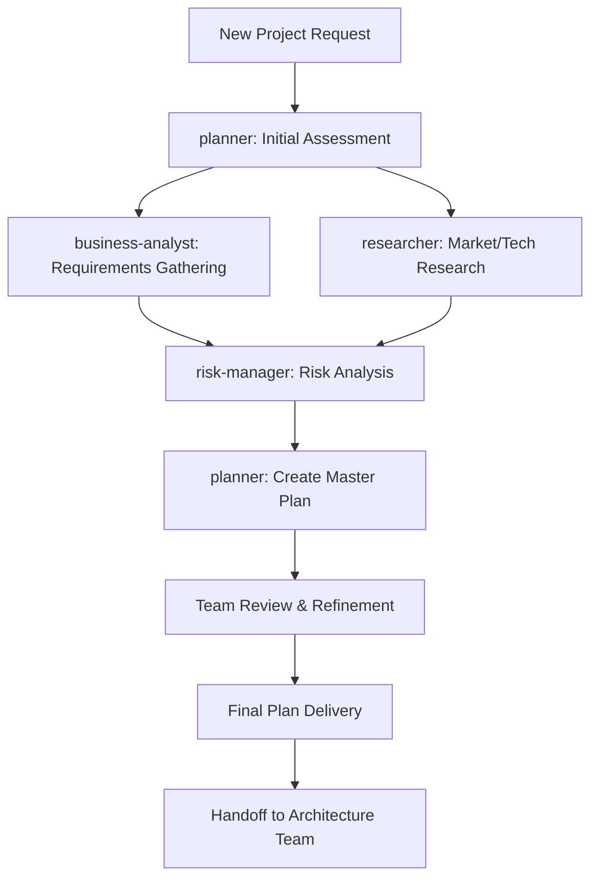

# Strategic Planning Team Decree

## Team Identity

- **Team Name**: Strategic Planning Team
- **Team Code**: SPT-001
- **Team Leader**: planner
- **Team Members**:
  - business-analyst (Strategic Analysis)
  - researcher (Market & Technical Research)
  - risk-manager (Risk Assessment)

## Team Mission

We are the foundation of successful project execution. Our mission is to transform ideas into actionable plans, analyze requirements comprehensively, and create roadmaps that guide all other teams to success.

## Core Responsibilities

### 1. Requirements Engineering

- Gather and document functional requirements
- Define non-functional requirements (performance, security, scalability)
- Create user stories and acceptance criteria
- Maintain requirements traceability matrix

### 2. Strategic Planning

- Develop project roadmaps with clear milestones
- Create work breakdown structures (WBS)
- Define sprint plans and release schedules
- Establish success metrics and KPIs

### 3. Risk Management

- Identify technical, business, and operational risks
- Develop mitigation strategies
- Create contingency plans
- Monitor risk indicators throughout project

### 4. Stakeholder Management

- Define stakeholder communication plans
- Manage expectations and requirements changes
- Facilitate decision-making processes
- Ensure alignment with business objectives

## Team Workflow

## Communication Protocols

### Internal Communication

- **Daily Sync**: 15-minute standup at project start
- **Planning Sessions**: 2-hour deep dives for complex requirements
- **Risk Reviews**: Weekly risk assessment meetings
- **Documentation**: All decisions logged in shared knowledge base

### External Communication

- **To Architecture Team**: Detailed requirements and constraints
- **To Coordination Team**: Progress updates and blockers
- **From All Teams**: Feedback on plan feasibility
- **To Stakeholders**: Regular status reports

## Information Flow

### Inputs Required

- Business objectives and constraints
- Technical requirements and limitations
- Market research and competitive analysis
- Historical project data and lessons learned
- Resource availability and timelines

### Outputs Produced

- Project charter and scope statement
- Requirements specification document
- Risk register and mitigation plans
- Project roadmap and timeline
- Resource allocation plan
- Success criteria and acceptance tests

## Decision Framework

### Consensus Building

1. Leader proposes initial direction
2. Each member provides domain expertise
3. Collaborative refinement of approach
4. Risk-weighted decision making
5. Document rationale for future reference

### Escalation Path

1. Team consensus attempt (15 minutes)
2. Leader decision with input (if no consensus)
3. Escalate to Coordination Team (if critical)
4. Stakeholder involvement (if business-critical)

## Tools & Resources

### Team-Specific Tools

- **Planning Tools**: JIRA, Asana, Microsoft Project
- **Documentation**: Confluence, Notion, SharePoint
- **Research Tools**: Web search, market analysis platforms
- **Risk Management**: Risk registers, Monte Carlo simulations
- **Communication**: Slack, Teams, Email

### Shared Resources

- Historical project database
- Industry best practices repository
- Template library for planning documents
- Stakeholder contact database

## Quality Standards

### Deliverable Requirements

- **Completeness**: All aspects of project covered
- **Clarity**: Unambiguous requirements and plans
- **Feasibility**: Technically and economically viable
- **Measurability**: Clear success metrics defined
- **Traceability**: Requirements linked to business goals

### Review Criteria

- Peer review by all team members
- Validation with Architecture Team
- Stakeholder approval for major decisions
- Risk assessment for all critical paths

## Performance Metrics

### Team KPIs

- Requirements stability: <5% change after approval
- Planning accuracy: ±10% of estimated timelines
- Risk identification: >80% of major risks identified early
- Stakeholder satisfaction: >4.5/5 rating
- On-time delivery: >95% of planning milestones

### Individual Contributions

- **planner**: Plan completeness and accuracy
- **business-analyst**: Requirements quality and clarity
- **researcher**: Research depth and relevance
- **risk-manager**: Risk coverage and mitigation effectiveness

## Continuous Improvement

### Retrospective Process

- Weekly team retrospectives
- Lessons learned documentation
- Process improvement suggestions
- Tool and technique evaluation
- Knowledge sharing sessions

### Learning Priorities

- Agile planning methodologies
- AI/ML project planning
- Cloud-native architecture planning
- DevOps integration strategies
- Emerging technology trends

## Integration Points

### Upstream Dependencies

- Executive approval for project initiation
- Business case and budget approval
- Market research and user feedback
- Technology constraints and standards

### Downstream Consumers

- Architecture Team: For system design
- Core Development Team: For implementation
- QA Team: For test planning
- All Teams: For timeline and resource planning

## Emergency Protocols

### Crisis Response

1. **Requirement Change**: Impact analysis within 2 hours
2. **Timeline Risk**: Immediate escalation to Coordination Team
3. **Resource Conflict**: Re-planning session within 24 hours
4. **Scope Creep**: Stakeholder alignment meeting

### Contingency Plans

- Maintain 15% schedule buffer for unknowns
- Identify alternative approaches for critical paths
- Keep resource pool for emergency allocation
- Document assumptions for quick reassessment

## Team Charter

**We, the Strategic Planning Team, commit to:**

- Delivering comprehensive, actionable plans
- Maintaining clear communication with all stakeholders
- Proactively identifying and mitigating risks
- Ensuring project success through thorough preparation
- Continuously improving our planning processes

**Our Success Means:**

- Projects start with clear direction
- Teams have the information they need
- Risks are managed, not discovered
- Stakeholders trust our planning
- Projects deliver expected value

---
*Decree Version: 1.0*
*Effective Date: 2024*
*Review Cycle: Quarterly*
