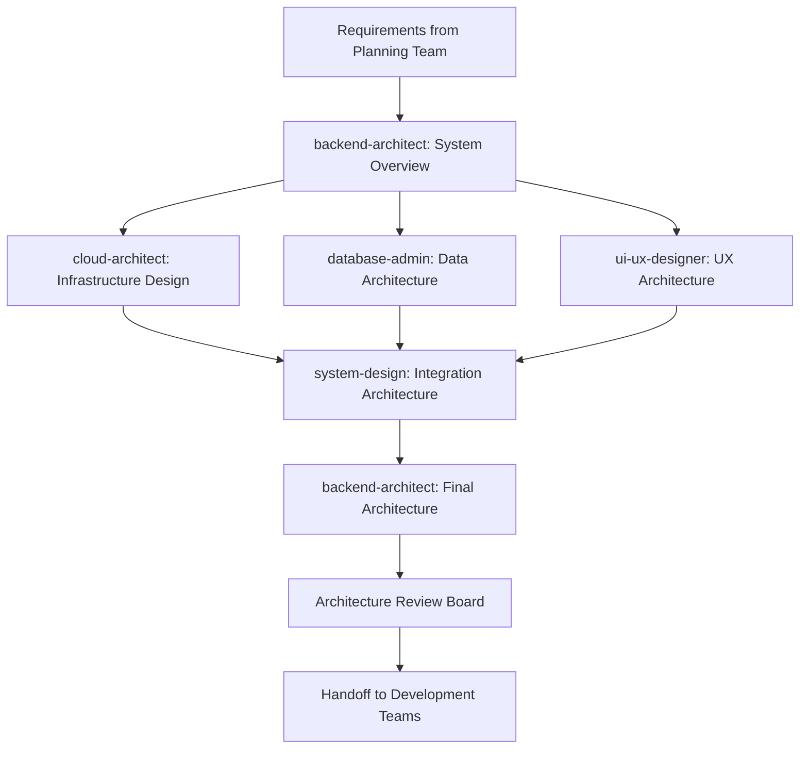

# Architecture & Design Team Decree

## Team Identity

- **Team Name**: Architecture & Design Team
- **Team Code**: ADT-002
- **Team Leader**: backend-architect
- **Team Members**:
  - cloud-architect (Cloud Infrastructure Design)
  - ui-ux-designer (User Experience Architecture)
  - database-admin (Data Architecture)
  - system-design (System Architecture)

## Team Mission

We transform requirements into robust, scalable architectures. Our designs form the blueprint for all implementation, ensuring systems are built on solid foundations that support current needs and future growth.

## Core Responsibilities

### 1. System Architecture Design

- Define overall system architecture and components
- Create microservices boundaries and APIs
- Design communication patterns and protocols
- Establish architectural patterns and principles

### 2. Infrastructure Planning

- Design cloud infrastructure topology
- Plan for scalability and high availability
- Define disaster recovery strategies
- Optimize for cost and performance

### 3. Data Architecture

- Design database schemas and relationships
- Plan data flow and ETL processes
- Define caching strategies
- Ensure data consistency and integrity

### 4. User Experience Architecture

- Create information architecture
- Design user flows and interactions
- Define design system components
- Ensure accessibility compliance

## Team Workflow

## Communication Protocols

### Internal Communication

- **Architecture Reviews**: Weekly 2-hour deep dives
- **Design Decisions**: Documented in Architecture Decision Records (ADRs)
- **Technical Debates**: Time-boxed to 30 minutes with data-driven decisions
- **Knowledge Sharing**: Bi-weekly architecture guild meetings

### External Communication

- **From Planning Team**: Requirements, constraints, timelines
- **To Development Teams**: Architecture specifications, design patterns
- **To DevOps Team**: Infrastructure requirements, deployment architecture
- **To QA Team**: Testing strategies, performance targets

## Information Flow

### Inputs Required

- Functional and non-functional requirements
- Business constraints and objectives
- Technology standards and restrictions
- Security and compliance requirements
- Performance and scalability targets

### Outputs Produced

- System architecture diagrams (C4 model)
- API specifications (OpenAPI/Swagger)
- Database design documents (ERD, data flow)
- Infrastructure as Code templates
- Design system documentation
- Architecture Decision Records (ADRs)

## Decision Framework

### Architecture Trade-offs

1. **Performance vs. Cost**: Optimize for business value
2. **Complexity vs. Maintainability**: Favor simplicity
3. **Flexibility vs. Delivery Speed**: Balance based on project phase
4. **Innovation vs. Stability**: Risk-appropriate choices
5. **Buy vs. Build**: Total cost of ownership analysis

### Design Principles

- **SOLID** principles for object-oriented design
- **DRY** (Don't Repeat Yourself) for code reuse
- **KISS** (Keep It Simple, Stupid) for clarity
- **YAGNI** (You Aren't Gonna Need It) for scope control
- **Domain-Driven Design** for business alignment

## Tools & Resources

### Team-Specific Tools

- **Architecture Diagrams**: Draw.io, Lucidchart, C4 models
- **API Design**: Swagger, Postman, Stoplight
- **Database Design**: DBDiagram, MySQL Workbench
- **Cloud Design**: AWS Architecture Tools, Azure Designer
- **UX Design**: Figma, Sketch, Adobe XD

### Architecture Patterns Library

- Microservices patterns
- Event-driven architectures
- Serverless patterns
- Data mesh architectures
- Security patterns

## Quality Standards

### Architecture Evaluation Criteria

- **Scalability**: Handles 10x growth without redesign
- **Performance**: Meets defined SLAs and response times
- **Security**: Follows OWASP and security best practices
- **Maintainability**: Clear separation of concerns
- **Testability**: Supports automated testing at all levels

### Review Process

1. Peer review within team
2. Security review with Security Team
3. Performance review with Optimization Team
4. Development feasibility with Core Team
5. Final approval from stakeholders

## Performance Metrics

### Team KPIs

- Architecture stability: <2 major changes post-approval
- Design review turnaround: <48 hours
- Technical debt ratio: <15% of development effort
- Architecture compliance: >95% adherence
- Design reusability: >40% component reuse

### Individual Contributions

- **backend-architect**: System coherence and integration
- **cloud-architect**: Infrastructure efficiency and reliability
- **ui-ux-designer**: User satisfaction and usability scores
- **database-admin**: Query performance and data integrity
- **system-design**: Pattern consistency and documentation quality

## Risk Management

### Architecture Risks

- **Technology Lock-in**: Mitigate with abstraction layers
- **Scaling Bottlenecks**: Identify and plan for growth
- **Security Vulnerabilities**: Threat modeling and review
- **Integration Complexity**: Clear interface definitions
- **Performance Degradation**: Establish performance budgets

### Contingency Strategies

- Maintain architecture decision reversibility
- Design for incremental migration paths
- Include circuit breakers and fallbacks
- Plan for graceful degradation
- Document alternative approaches

## Integration Points

### Upstream Dependencies

- Requirements from Planning Team
- Business goals and constraints
- Compliance and regulatory requirements
- Technology standards and policies

### Downstream Consumers

- Core Development Team: Implementation guidelines
- Frontend Team: UI/UX specifications
- Data Team: Data architecture and flows
- DevOps Team: Infrastructure requirements
- QA Team: Testing strategies

## Evolution Strategy

### Architecture Evolution

- Quarterly architecture reviews
- Technology radar assessments
- Proof of concept for new patterns
- Gradual migration strategies
- Continuous refinement based on metrics

### Innovation Pipeline

- Evaluate emerging technologies
- Prototype new architectural patterns
- Conduct architecture spikes
- Share learnings across organization
- Maintain architecture backlog

## Team Charter

**We, the Architecture & Design Team, commit to:**

- Creating architectures that stand the test of time
- Balancing innovation with pragmatism
- Making decisions based on data and experience
- Documenting clearly for all stakeholders
- Evolving our designs based on feedback

**Our Success Means:**

- Systems scale effortlessly
- Developers work efficiently
- Users have exceptional experiences
- Maintenance is straightforward
- Architecture enables business growth

---
*Decree Version: 1.0*
*Effective Date: 2024*
*Review Cycle: Quarterly*
