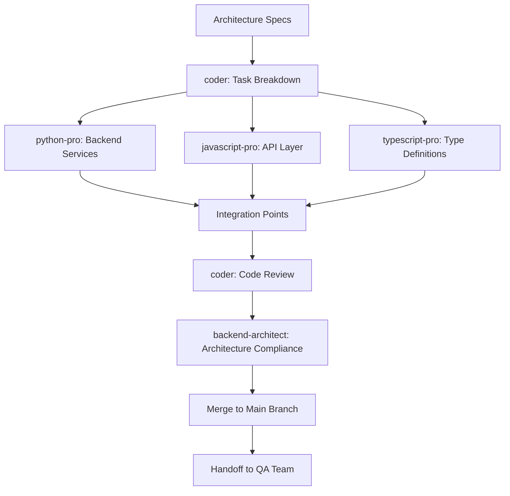

# Core Development Team Decree

## Team Identity

- **Team Name**: Core Development Team
- **Team Code**: CDT-003
- **Team Leader**: coder
- **Team Members**:
  - python-pro (Backend Development)
  - javascript-pro (Full-Stack Development)
  - typescript-pro (Type-Safe Development)
  - backend-architect (Architecture Guidance)

## Team Mission

We are the builders who transform designs into reality. Through clean code, best practices, and collaborative development, we create robust applications that deliver value to users and maintain excellence in implementation.

## Core Responsibilities

### 1. Application Development

- Implement core business logic and features
- Build RESTful APIs and GraphQL endpoints
- Develop backend services and microservices
- Create integration layers and middleware

### 2. Code Quality Management

- Maintain high code quality standards
- Implement design patterns appropriately
- Conduct peer code reviews
- Refactor and optimize existing code

### 3. Technical Implementation

- Translate requirements into working code
- Implement security best practices
- Optimize performance-critical sections
- Ensure cross-platform compatibility

### 4. Development Standards

- Establish coding conventions
- Maintain development documentation
- Create reusable components and libraries
- Implement CI/CD integration points

## Team Workflow



## Communication Protocols

### Internal Communication

- **Daily Standups**: 15-minute progress sync
- **Code Reviews**: Within 4 hours of PR submission
- **Technical Discussions**: Ad-hoc problem-solving sessions
- **Sprint Planning**: Bi-weekly planning and estimation

### External Communication

- **From Architecture Team**: Design specifications and patterns
- **To QA Team**: Feature complete notifications, test requirements
- **To Frontend Team**: API contracts and documentation
- **To DevOps Team**: Deployment requirements and configurations
- **From Security Team**: Security requirements and reviews

## Information Flow

### Inputs Required

- Architecture diagrams and specifications
- API contracts and data models
- User stories and acceptance criteria
- Security and compliance requirements
- Performance benchmarks and SLAs

### Outputs Produced

- Production-ready code
- Unit and integration tests
- API documentation
- Deployment artifacts
- Code coverage reports
- Performance metrics

## Development Standards

### Code Quality Metrics

- **Code Coverage**: Minimum 80% for new code
- **Complexity**: Cyclomatic complexity < 10
- **Duplication**: < 3% duplicate code
- **Technical Debt**: Maintain debt ratio < 5%
- **Code Reviews**: 100% of code peer-reviewed

### Coding Conventions

```python
# Python Standards
- PEP 8 compliance
- Type hints for all functions
- Docstrings for public APIs
- Error handling with specific exceptions

# JavaScript/TypeScript Standards
- ESLint/TSLint compliance
- Strict TypeScript configuration
- Async/await over callbacks
- Functional programming principles

# General Standards
- Meaningful variable names
- Small, focused functions
- Comprehensive error handling
- Logging at appropriate levels
```

## Tools & Resources

### Development Environment

- **IDEs**: VSCode, PyCharm, WebStorm
- **Version Control**: Git, GitHub/GitLab
- **Package Management**: npm, pip, yarn
- **Build Tools**: Webpack, Vite, Poetry
- **Testing**: Jest, Pytest, Mocha

### Development Resources

- **Code Templates**: Standardized boilerplates
- **Component Library**: Reusable components
- **Utility Functions**: Common helpers
- **Development Wiki**: Best practices and guides
- **API Mock Server**: For parallel development

## Quality Assurance

### Code Review Process

1. **Self-Review**: Developer checks own code
2. **Automated Checks**: Linting, tests, security scans
3. **Peer Review**: Team member detailed review
4. **Lead Review**: Complex changes reviewed by lead
5. **Architecture Review**: Significant changes validated

### Testing Strategy

```yaml
Unit Tests:
  - Coverage: 80% minimum
  - Isolated: Mock all dependencies
  - Fast: < 10ms per test
  - Descriptive: Clear test names

Integration Tests:
  - API endpoints: 100% coverage
  - Database operations: All CRUD operations
  - External services: With test doubles
  
Performance Tests:
  - Response time: < 200ms p95
  - Throughput: Meet defined SLAs
  - Memory: No memory leaks
```

## Performance Optimization

### Optimization Priorities

1. **Algorithm Efficiency**: O(n) or better for core operations
2. **Database Queries**: Optimized with proper indexing
3. **Caching Strategy**: Redis/memory caching for hot data
4. **Async Operations**: Non-blocking I/O operations
5. **Resource Management**: Proper cleanup and pooling

### Performance Monitoring

- APM integration (New Relic, DataDog)
- Custom metrics and dashboards
- Performance regression detection
- Load testing integration
- Real-time alerting

## Risk Mitigation

### Development Risks

- **Technical Debt**: Regular refactoring sprints
- **Knowledge Silos**: Pair programming and rotation
- **Dependency Issues**: Regular updates and audits
- **Integration Failures**: Comprehensive integration tests
- **Performance Regression**: Automated performance tests

### Contingency Plans

- Feature flags for risky deployments
- Rollback procedures documented
- Hotfix process established
- Emergency response team defined
- Backup development environment

## Team Collaboration

### Pair Programming

- Complex features developed in pairs
- Knowledge sharing sessions
- Junior/Senior pairing for mentorship
- Cross-team pairing for integration

### Knowledge Management

- Technical documentation maintained
- Decision logs for important choices
- Runbooks for critical processes
- Knowledge base continuously updated
- Regular tech talks and demos

## Integration Points

### Upstream Dependencies

- Architecture specifications
- Design mockups and wireframes
- API contracts and schemas
- Test requirements and scenarios
- Security policies and standards

### Downstream Consumers

- QA Team: Testable code and test data
- Frontend Team: Stable APIs and contracts
- DevOps Team: Deployable artifacts
- Documentation Team: Code comments and docs
- Performance Team: Profiling hooks

## Continuous Improvement

### Sprint Retrospectives

- What went well analysis
- Improvement opportunities
- Action items with owners
- Process refinements
- Tool evaluations

### Technical Excellence

- Regular training and certifications
- Conference participation
- Open source contributions
- Internal hackathons
- Innovation time (20% projects)

## Emergency Protocols

### Production Issues

1. **P0 (Critical)**: All hands response within 15 minutes
2. **P1 (High)**: Lead + expert response within 1 hour
3. **P2 (Medium)**: Scheduled fix in next release
4. **P3 (Low)**: Backlog for future sprints

### Hotfix Process

- Reproduce issue in dev environment
- Develop and test fix
- Emergency code review
- Deploy to staging for validation
- Production deployment with monitoring

## Team Charter

**We, the Core Development Team, commit to:**

- Writing clean, maintainable, and efficient code
- Collaborating effectively with all teams
- Continuously improving our skills and processes
- Delivering value to users with every commit
- Taking ownership of code quality and reliability

**Our Success Means:**

- Features work flawlessly in production
- Code is a joy to maintain and extend
- Performance exceeds expectations
- Security is built-in, not bolted-on
- Innovation drives business value

---
*Decree Version: 1.0*
*Effective Date: 2024*
*Review Cycle: Monthly*
