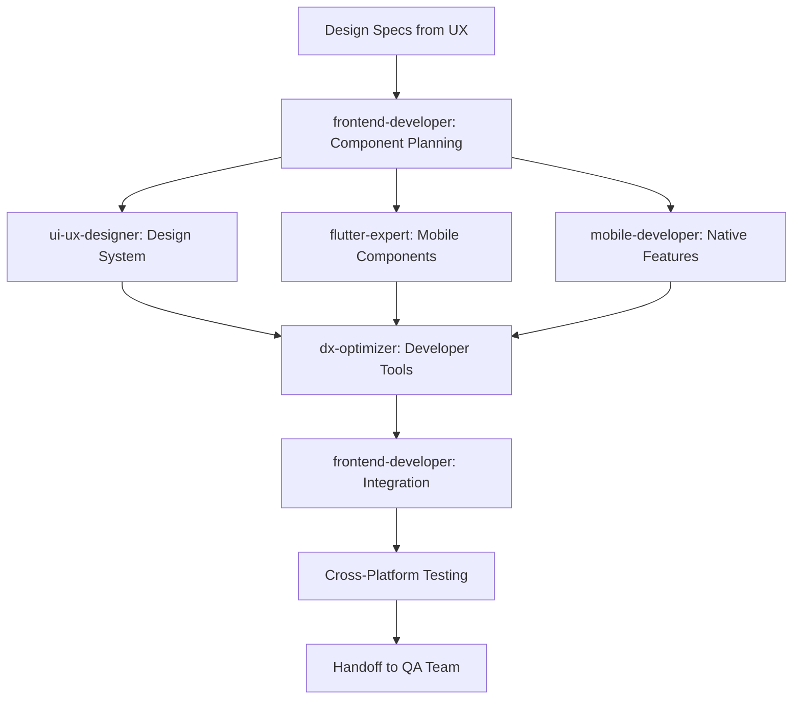

# Frontend Experience Team Decree

## Team Identity

- **Team Name**: Frontend Experience Team
- **Team Code**: FET-004
- **Team Leader**: frontend-developer
- **Team Members**:
  - ui-ux-designer (Design Implementation)
  - flutter-expert (Cross-Platform Mobile)
  - mobile-developer (Native Mobile Apps)
  - dx-optimizer (Developer Experience)

## Team Mission

We craft exceptional user experiences through intuitive interfaces, responsive designs, and seamless interactions. Every pixel matters, every interaction delights, and every user journey is optimized for success.

## Core Responsibilities

### 1. User Interface Development

- Build responsive web applications
- Implement design systems and components
- Create smooth animations and transitions
- Ensure cross-browser compatibility

### 2. Mobile Application Development

- Develop native iOS and Android apps
- Build cross-platform Flutter applications
- Optimize for mobile performance
- Implement platform-specific features

### 3. User Experience Implementation

- Transform designs into interactive interfaces
- Implement accessibility standards (WCAG)
- Optimize user flows and interactions
- Conduct usability improvements

### 4. Frontend Architecture

- Design component hierarchies
- Implement state management solutions
- Optimize bundle sizes and load times
- Establish frontend best practices

## Team Workflow



## Communication Protocols

### Internal Communication

- **Design Reviews**: Daily design sync sessions
- **Component Planning**: Weekly component library reviews
- **Performance Reviews**: Bi-weekly performance audits
- **Mobile Sync**: Platform-specific coordination meetings

### External Communication

- **From Design Team**: Mockups, design tokens, specifications
- **From Backend Team**: API contracts and endpoints
- **To QA Team**: Test scenarios and browser matrix
- **To Performance Team**: Performance metrics and bottlenecks
- **To Documentation Team**: Component documentation

## Information Flow

### Inputs Required

- Design mockups and prototypes
- Brand guidelines and design systems
- API specifications and data contracts
- User research and feedback
- Performance budgets and targets

### Outputs Produced

- Production-ready UI components
- Mobile applications (iOS/Android/Flutter)
- Component library documentation
- Accessibility compliance reports
- Performance metrics and analytics
- User interaction tracking data

## Development Standards

### Frontend Best Practices

```javascript
// React/Component Standards
- Functional components with hooks
- Proper prop validation with TypeScript
- Memoization for expensive operations
- Lazy loading for code splitting
- Error boundaries for fault tolerance

// State Management
- Context API for simple state
- Redux/Zustand for complex state
- Local state when appropriate
- Optimistic UI updates

// Performance Standards
- First Contentful Paint < 1.8s
- Time to Interactive < 3.9s
- Cumulative Layout Shift < 0.1
- Bundle size < 200KB (gzipped)
```

### Mobile Development Standards

```dart
// Flutter Standards
- Widget composition over inheritance
- Stateless widgets when possible
- Proper state management (Riverpod/Bloc)
- Platform-specific adaptations
- Responsive design patterns

// Native Standards
- MVVM/MVC architecture
- Dependency injection
- Reactive programming
- Memory management
- Battery optimization
```

## Tools & Resources

### Development Tools

- **Web Frameworks**: React, Vue, Angular
- **Mobile Frameworks**: Flutter, React Native
- **State Management**: Redux, MobX, Riverpod
- **Build Tools**: Vite, Webpack, Rollup
- **Testing**: Cypress, Playwright, Jest

### Design Tools

- **Design Software**: Figma, Sketch, Adobe XD
- **Prototyping**: Framer, Principle, InVision
- **Design Tokens**: Style Dictionary
- **Component Docs**: Storybook, Bit
- **Analytics**: Google Analytics, Mixpanel

## Quality Standards

### UI/UX Metrics

- **Usability Score**: >85% task completion rate
- **Accessibility**: WCAG 2.1 AA compliance
- **Performance**: Core Web Vitals passing
- **Browser Support**: Latest 2 versions + IE11
- **Mobile Score**: >90 Lighthouse mobile score

### Code Quality

- **Component Coverage**: >90% test coverage
- **Type Safety**: 100% TypeScript coverage
- **Linting**: Zero ESLint errors
- **Bundle Size**: <50KB per route (gzipped)
- **Code Reuse**: >60% shared components

## Responsive Design

### Breakpoint Strategy

```css
/* Mobile First Approach */
- Mobile: 320px - 767px
- Tablet: 768px - 1023px
- Desktop: 1024px - 1439px
- Wide: 1440px+

/* Fluid Typography */
- Base: 16px
- Scale: 1.25 (Major Third)
- Line Height: 1.5-1.7
```

### Device Testing Matrix

- **iOS**: Latest 3 versions, iPhone & iPad
- **Android**: Latest 4 versions, popular devices
- **Browsers**: Chrome, Safari, Firefox, Edge
- **Screen Readers**: NVDA, JAWS, VoiceOver
- **Performance**: 3G, 4G, WiFi conditions

## Accessibility Standards

### WCAG Compliance

- **Perceivable**: Alt text, color contrast, captions
- **Operable**: Keyboard navigation, focus management
- **Understandable**: Clear labels, error messages
- **Robust**: Semantic HTML, ARIA when needed

### Testing Protocol

1. Automated accessibility testing
2. Keyboard navigation verification
3. Screen reader testing
4. Color contrast validation
5. Focus management review

## Performance Optimization

### Optimization Techniques

- **Code Splitting**: Route-based lazy loading
- **Image Optimization**: WebP, lazy loading, srcset
- **Caching**: Service workers, browser cache
- **Critical CSS**: Inline above-fold styles
- **Tree Shaking**: Remove unused code

### Monitoring

- Real User Monitoring (RUM)
- Synthetic monitoring
- Performance budgets
- A/B testing for performance
- User feedback loops

## Integration Points

### Upstream Dependencies

- Design specifications and assets
- API endpoints and data contracts
- Brand guidelines and design tokens
- User research and analytics
- Content and translations

### Downstream Consumers

- QA Team: Testable interfaces
- Performance Team: Performance data
- Analytics Team: User interaction data
- Documentation Team: Component docs
- Support Team: User feedback

## Innovation Focus

### Emerging Technologies

- Progressive Web Apps (PWA)
- WebAssembly for performance
- Web Components for reusability
- AR/VR web experiences
- Voice UI integration

### Experimentation

- A/B testing framework
- Feature flags for gradual rollout
- User feedback collection
- Analytics-driven decisions
- Rapid prototyping

## Team Charter

**We, the Frontend Experience Team, commit to:**

- Creating delightful user experiences
- Building accessible interfaces for all users
- Optimizing performance relentlessly
- Maintaining pixel-perfect implementations
- Innovating with emerging technologies

**Our Success Means:**

- Users love our interfaces
- Performance exceeds expectations
- Accessibility is never compromised
- Developers enjoy our codebase
- Business goals are achieved through UX

---
*Decree Version: 1.0*
*Effective Date: 2024*
*Review Cycle: Bi-weekly*
