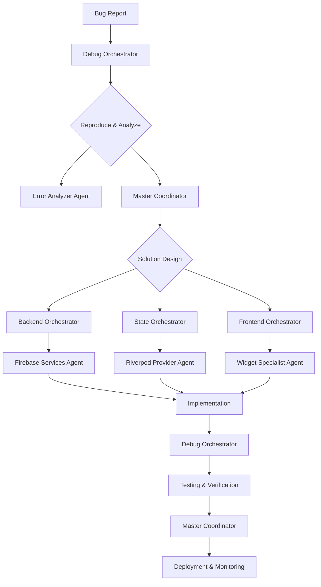

# Bug Fix Workflow

## Overview

This workflow outlines the process for identifying, analyzing, implementing, and deploying fixes for software defects. It emphasizes rapid resolution for critical issues while ensuring thorough testing and preventing regressions.

**Primary Use Cases**:
- Critical production bugs (crashes, data corruption)
- Functional defects (incorrect behavior, UI glitches)
- Performance regressions
- Security vulnerabilities

**Target Outcome**: A stable, thoroughly tested, and documented resolution to a reported defect, deployed with minimal impact and monitored for effectiveness.

---

## Prerequisites

### System Requirements
- [ ] All JJ agents initialized via `/jj:init`
- [ ] Access to bug tracking system (e.g., Jira, GitHub Issues)
- [ ] Development environment configured for debugging
- [ ] Access to production logs and monitoring tools

### Domain Readiness
- [ ] **Debug**: Error monitoring and root cause analysis tools active
- [ ] **Backend**: Access to database logs and schema
- [ ] **State**: Understanding of data flow and state mutation
- [ ] **Frontend**: UI component knowledge and reproduction steps

### Resource Verification
```bash
# Validate agent availability
@jj-master-coordinator "Verify all domain agents responsive"

# Check access to logs
tail -f /var/log/app/production.log
```

---

## Step-by-Step Process

### PHASE 1: Bug Triage & Analysis (SPARC: Specification)

**Duration**: 15-60 minutes
**Lead Agent**: `jj-debug-orchestrator` + `jj-error-analyzer-agent`
**Frameworks**: SPARC (Specification phase) + Root Cause Analysis

#### Step 1.1: Bug Reproduction & Confirmation
```bash
@jj-debug-orchestrator "Reproduce bug:
[BUG REPORT DETAILS]

Steps to reproduce:
1. [STEP 1]
2. [STEP 2]
3. [STEP 3]

Expected result: [EXPECTED]
Actual result: [ACTUAL]

Confirm reproducibility and gather context (user, environment, logs)."
```

**Debug Orchestrator Actions**:
- Attempt to reproduce the bug in a controlled environment.
- Collect relevant logs, stack traces, and user reports.
- Categorize bug severity and impact.

#### Step 1.2: Root Cause Analysis
```bash
@jj-error-analyzer-agent "Analyze root cause for bug:
[BUG ID]

Examine:
1. Stack traces and error logs
2. Recent code changes (git blame)
3. System dependencies and external services
4. Data inconsistencies

Identify the core problem, not just symptoms."
```

**Error Analyzer Agent Actions**:
- Perform static and dynamic analysis of code.
- Trace data flow to pinpoint origin of error.
- Consult `jj-dependency-resolver` for dependency-related issues.

#### Step 1.3: Impact Assessment & Prioritization
```bash
@jj-master-coordinator "Assess impact and prioritize bug fix:
[BUG ID]

Consider:
1. Number of affected users
2. Business critical functionality
3. Data integrity risks
4. Security implications
5. Workaround availability

Assign priority (Critical, High, Medium, Low) and estimate fix complexity."
```

**Master Coordinator Output**:
```markdown
## Bug Fix Plan
### Bug ID: [BUG ID]
### Severity: [CRITICAL/HIGH/MEDIUM/LOW]
### Root Cause: [DESCRIPTION OF ROOT CAUSE]
### Affected Components: [LIST OF COMPONENTS]
### Estimated Fix Complexity: [LOW/MEDIUM/HIGH]
### Priority: [PRIORITY]
```

**Quality Gate**: Bug reproduction confirmed, root cause identified, impact assessed, and priority assigned.

---

### PHASE 2: Solution Design (SPARC: Architecture)

**Duration**: 15-45 minutes
**Lead Agents**: Domain-specific orchestrators + `jj-master-coordinator`
**Frameworks**: SPARC (Architecture phase) + Minimal Impact Design

#### Step 2.1: Propose Solution
```bash
@jj-master-coordinator "Propose solution for bug:
[BUG ID]

Design a fix that:
1. Directly addresses the root cause
2. Has minimal side effects on other features
3. Adheres to existing architectural patterns
4. Includes necessary test cases (unit, integration, regression)

Consult relevant domain orchestrators for design input."
```

**Domain Orchestrator Actions**:
- Backend Orchestrator: Propose database changes, API modifications.
- State Orchestrator: Suggest state model adjustments, provider logic fixes.
- Frontend Orchestrator: Recommend UI component changes, interaction fixes.

#### Step 2.2: Review & Approval
```bash
@jj-master-coordinator "Review proposed solution for bug:
[BUG ID]

Evaluate:
1. Correctness and completeness of the fix
2. Potential for new bugs or regressions
3. Adherence to coding standards
4. Test plan adequacy

Seek approval from relevant stakeholders (e.g., tech lead, product owner)."
```

**Quality Gate**: Solution designed, reviewed, and approved.

---

### PHASE 3: Implementation & Testing (SPARC: Pseudocode → Code)

**Duration**: 1-4 hours (depending on complexity)
**Lead Agents**: Domain specialists + `jj-debug-orchestrator`
**Frameworks**: Swarm (parallel execution) + Test-Driven Development

#### Step 3.1: Implement Fix
```bash
@jj-master-coordinator "Implement fix for bug:
[BUG ID]

Execute implementation based on approved solution:
- Write code changes in affected components.
- Ensure changes are atomic and focused.
- Add comments for clarity if complex logic is involved.

Coordinate with domain specialists for code changes."
```

**Domain Specialist Actions**:
- Backend Agents: Implement database migrations, API endpoint fixes.
- State Agents: Modify providers, notifiers, or data models.
- Frontend Agents: Adjust widgets, layouts, or styling.

#### Step 3.2: Unit & Widget Testing
```bash
@jj-debug-orchestrator "Develop/update unit and widget tests for bug fix:
[BUG ID]

- Write new unit tests to specifically cover the bug scenario.
- Update existing tests if the fix changes expected behavior.
- Ensure high test coverage for the modified code.
- Run all relevant unit and widget tests."
```

**Debug Orchestrator Delegates To**:
- **Error Analysis Agent**: Ensure test cases cover the identified root cause.
- **Performance Monitor Agent**: Check for any performance regressions introduced by the fix.

#### Step 3.3: Integration & Regression Testing
```bash
@jj-debug-orchestrator "Perform integration and regression testing for bug fix:
[BUG ID]

- Run integration tests to verify cross-component interactions.
- Execute regression test suite to ensure no new bugs were introduced.
- Re-test the original bug reproduction steps to confirm fix.
- Conduct exploratory testing on related features."
```

**Quality Gate**: Fix implemented, all tests (unit, widget, integration, regression) pass, original bug is no longer reproducible.

---

### PHASE 4: Deployment & Monitoring (SPARC: Completion)

**Duration**: 30-90 minutes
**Lead Agent**: `jj-master-coordinator` + `jj-performance-monitor-agent`
**Frameworks**: Claude Flow (deployment workflows) + Proactive Monitoring

#### Step 4.1: Deployment Preparation
```bash
@jj-master-coordinator "Prepare for deployment of bug fix:
[BUG ID]

- Create release notes or changelog entry.
- Ensure all code changes are reviewed and merged.
- Build release artifacts (APK, IPA, web bundle).
- Document rollback plan in case of issues."
```

#### Step 4.2: Deployment
```bash
@jj-master-coordinator "Deploy bug fix:
[BUG ID]

Execute deployment to production environment:
- Use automated CI/CD pipelines if available.
- Perform phased rollout (e.g., canary deployment) for critical fixes.
- Monitor deployment process for errors."
```

#### Step 4.3: Post-Deployment Monitoring
```bash
@jj-performance-monitor-agent "Monitor bug fix in production:
[BUG ID]

- Track error rates and crash reports (e.g., Crashlytics, Sentry).
- Monitor key performance indicators (KPIs) for regressions.
- Observe user feedback and support tickets.
- Confirm bug is resolved and no new issues arise."
```

**Quality Gate**: Fix deployed, production environment stable, bug confirmed resolved, no regressions detected.

---

## Agent Coordination

### Primary Coordination Flow



### Agent Communication Patterns

**1. Urgent Hotfix Pattern**
```bash
# Master Coordinator initiates hotfix
@jj-master-coordinator "URGENT HOTFIX: [BUG ID] - [DESCRIPTION]

Fast-track workflow:
1. Debug Orchestrator: Reproduce & Root Cause
2. Relevant Domain Orchestrator: Implement Fix
3. Debug Orchestrator: Minimal Regression Testing
4. Master Coordinator: Immediate Deployment

Prioritize speed over comprehensive testing for critical issues."
```

**2. Standard Bug Fix Pattern**
```bash
# Debug Orchestrator assigns bug
@jj-debug-orchestrator "Assign bug [BUG ID] to [AGENT/TEAM]

Follow full workflow: Triage -> Design -> Implement -> Test -> Deploy"
```

---

## Quality Gates

### Gate 1: Bug Triage & Root Cause
**Trigger**: After Phase 1 (Triage & Analysis)
**Criteria**:
- [ ] Bug is reproducible with clear steps
- [ ] Root cause identified and documented
- [ ] Impact and severity assessed
- [ ] Priority assigned

**Responsible Agent**: `jj-debug-orchestrator`
**Escalation**: If root cause cannot be identified, escalate to `jj-root-cause-analyzer` (if available) or senior engineer.

---

### Gate 2: Solution Approval
**Trigger**: After Phase 2 (Solution Design)
**Criteria**:
- [ ] Proposed fix directly addresses root cause
- [ ] Minimal risk of regressions
- [ ] Solution aligns with architectural principles
- [ ] Test plan for verification is defined

**Responsible Agents**: Domain orchestrators + `jj-master-coordinator`
**Escalation**: If solution introduces significant changes or risks, require additional review.

---

### Gate 3: Test Coverage & Verification
**Trigger**: After Phase 3 (Implementation & Testing)
**Criteria**:
- [ ] Unit tests cover new/modified code
- [ ] Widget tests (if applicable) pass
- [ ] Integration tests pass
- [ ] Regression tests pass (no new failures)
- [ ] Original bug is no longer reproducible

**Responsible Agent**: `jj-debug-orchestrator`
**Escalation**: If tests fail or bug persists, revert to Phase 3.1 (Implement Fix).

---

### Gate 4: Production Stability
**Trigger**: After Phase 4 (Deployment & Monitoring)
**Criteria**:
- [ ] No increase in error rates or crashes
- [ ] No performance regressions
- [ ] User feedback confirms resolution
- [ ] Monitoring tools show stable system health

**Responsible Agent**: `jj-performance-monitor-agent` + `jj-self-healing-agent`
**Escalation**: If new issues arise, initiate emergency bug fix workflow or rollback.

---

## Validation Checkpoints

### Checkpoint 1: Reproduction Confirmation (15 min into Phase 1)
**Validation**:
```bash
@jj-debug-orchestrator "Confirm bug reproduction:
- Can the bug be consistently reproduced? (Yes/No)
- Are all necessary logs collected? (Yes/No)
- Is the environment setup for debugging? (Yes/No)"
```
**Expected Output**: Clear confirmation of bug reproducibility and readiness for analysis.

---

### Checkpoint 2: Root Cause Validation (30 min into Phase 1)
**Validation**:
```bash
@jj-error-analyzer-agent "Validate root cause:
- Is the identified root cause the actual source of the problem? (Yes/No)
- Are there any underlying systemic issues? (Yes/No)
- Is the scope of the fix clearly defined? (Yes/No)"
```
**Expected Output**: Agreement on the root cause and scope of the fix.

---

### Checkpoint 3: Regression Test Plan (15 min into Phase 3)
**Validation**:
```bash
@jj-debug-orchestrator "Review regression test plan:
- Are all affected areas covered by regression tests? (Yes/No)
- Are there specific tests for the bug scenario? (Yes/No)
- Is the test environment configured for regression testing? (Yes/No)"
```
**Expected Output**: Comprehensive regression test plan in place.

---

### Checkpoint 4: Post-Deployment Smoke Test (15 min into Phase 4)
**Validation**:
```bash
# Manual validation on physical device/web
1. Install release build
2. Test the fixed functionality
3. Test critical adjacent features
4. Check for obvious UI glitches or crashes
```
**Expected Output**: Confirmation that the fix is working as expected in production and no immediate regressions are visible.

---

## Rollback Procedures

### Level 1: Code Rollback (Minor Issues)
**Trigger**: Minor regression or unexpected behavior post-deployment.
**Procedure**:
```bash
# Revert specific commits
git revert <commit-hash> --no-commit
git commit -m "Rollback: [Bug Fix ID] - [Reason]"

# Rebuild and redeploy
flutter build apk --release
# Deploy via CI/CD or manual upload
```
**Responsibility**: `jj-master-coordinator`
**Recovery Time**: <30 minutes

---

### Level 2: Feature Flag Rollback (Controlled Disable)
**Trigger**: Bug fix introduces a critical issue that can be isolated by a feature flag.
**Procedure**:
```bash
# Disable feature flag
firebase remoteconfig:set bug_fix_[BUG_ID]_enabled=false

# Monitor impact
@jj-performance-monitor-agent "Monitor system after feature flag disable"
```
**Responsibility**: `jj-backend-orchestrator` + `jj-master-coordinator`
**Recovery Time**: 5-15 minutes

---

### Level 3: Full Version Rollback (Critical Issues)
**Trigger**: Bug fix causes widespread critical issues (e.g., app crashes for all users).
**Procedure**:
```bash
# 1. Immediate: Revert to last stable release
git checkout tags/vX.Y.Z  # Last stable version
git checkout -b hotfix/revert-bug-fix-[BUG_ID]

# 2. Rebuild and emergency deploy
flutter build apk --release
flutter build ios --release
# Fast-track CI/CD or manual deployment

# 3. Communicate to users
# Post in-app message about temporary service interruption

# 4. Post-mortem analysis
@jj-debug-orchestrator "Analyze root cause of failure:
- What went wrong?
- Why did testing not catch it?
- How to prevent recurrence?"
```
**Responsibility**: `jj-master-coordinator` + DevOps
**Recovery Time**: 2-4 hours

---

## Success Criteria

### Functional Success
- [ ] Original bug is no longer reproducible
- [ ] All reported symptoms are resolved
- [ ] No new functional defects introduced

### Technical Success
- [ ] Code changes are minimal and targeted
- [ ] All relevant tests pass (unit, widget, integration, regression)
- [ ] No performance regressions
- [ ] Adherence to coding standards

### User Experience Success
- [ ] User can complete affected workflows without issues
- [ ] UI behaves as expected
- [ ] No unexpected visual glitches

### Operational Success
- [ ] Production environment remains stable post-deployment
- [ ] Monitoring tools confirm resolution
- [ ] Bug tracking system updated with resolution details

---

## Example Commands

### Critical Hotfix
```bash
@jj-master-coordinator "URGENT HOTFIX: Fix critical crash on login for Android 13

Issue: NullPointerException in auth_service.dart line 120

Fast-track workflow:
1. Debug Orchestrator: Reproduce & Root Cause
2. Backend Orchestrator: Implement fix in auth_service.dart
3. Debug Orchestrator: Minimal regression testing for login flow
4. Master Coordinator: Immediate deployment

Target: <1 hour to deployed fix"
```

### Minor UI Bug
```bash
@jj-master-coordinator "Fix minor UI bug: Incorrect spacing in job_card widget

Issue: Padding is 8px instead of 16px in job_card.dart

Standard workflow:
1. Debug Orchestrator: Confirm reproduction
2. Frontend Orchestrator: Adjust padding in job_card.dart
3. Debug Orchestrator: Widget test for job_card
4. Master Coordinator: Standard deployment

Target: <4 hours to deployed fix"
```

---

## Common Issues & Solutions

### Issue 1: Bug Not Reproducible
**Symptom**: Cannot reproduce the bug reported by the user.
**Cause**: Insufficient information, environment-specific issue, intermittent bug.

**Solution**:
```bash
@jj-debug-orchestrator "Investigate non-reproducible bug:

1. Request more information from user (screenshots, video, exact steps).
2. Check logs for environment-specific errors.
3. Implement additional logging in suspected areas.
4. Use `jj-pattern-recognition` to identify similar past issues."
```
**Prevention**: Thorough bug reporting template, clear reproduction steps.

---

### Issue 2: Fix Introduces New Bug (Regression)
**Symptom**: After deploying a fix, a previously working feature breaks.
**Cause**: Side effects of the fix, insufficient regression testing.

**Solution**:
```bash
@jj-debug-orchestrator "Analyze regression:

1. Immediately rollback the problematic fix (if critical).
2. Identify the specific change that caused the regression (git bisect).
3. Expand regression test suite to cover the affected area.
4. Redesign fix to avoid side effects."
```
**Prevention**: Comprehensive regression testing, thorough code reviews.

---

### Issue 3: Performance Degradation After Fix
**Symptom**: Application becomes slower or consumes more resources after a bug fix.
**Cause**: Inefficient code introduced, unintended loops, excessive database queries.

**Solution**:
```bash
@jj-mobile-performance-optimizer "Analyze performance regression:

1. Profile the application to identify bottlenecks.
2. Review code changes for performance anti-patterns.
3. Optimize database queries or API calls.
4. Implement caching strategies if appropriate."
```
**Prevention**: Performance monitoring during testing, code reviews focusing on efficiency.

---

## Notes & Best Practices

### Prioritize Critical Bugs
- Critical bugs (crashes, data loss) should always take precedence.
- Use the "Urgent Hotfix Pattern" for rapid deployment.

### Test Thoroughly
- Never deploy a fix without verifying it through tests.
- Regression tests are crucial to prevent introducing new bugs.

### Document Everything
- Clear bug reports, root cause analysis, and solution details are vital.
- Update documentation (e.g., ARCHITECTURE.md) if the fix involves significant changes.

### Learn from Mistakes
- Conduct post-mortems for critical bugs to understand why they occurred and how to prevent similar issues.
- Update agent skills and workflows based on lessons learned.

---

**Workflow Version**: 1.0.0
**Last Updated**: 2025-11-01
**Maintained By**: JJ Master Coordinator
**Related Workflows**: feature-development-workflow.md, performance-optimization-workflow.md, deployment-workflow.md
