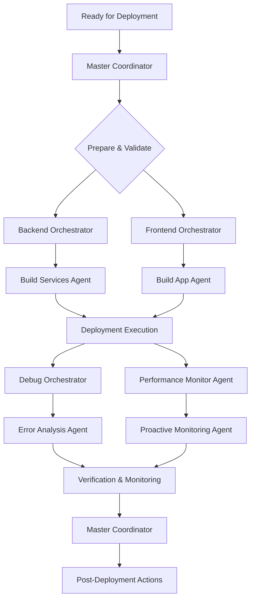

# Deployment Workflow

## Overview

This workflow defines the standardized process for releasing new features, bug fixes, and updates to various environments (e.g., staging, production). It emphasizes automation, reliability, and safety, ensuring minimal downtime and a consistent user experience.

**Primary Use Cases**:
- Releasing new features or major updates
- Deploying bug fixes or hotfixes
- Rolling out performance optimizations
- Infrastructure updates or configuration changes

**Target Outcome**: A successful, verified, and monitored deployment to the target environment, with a clear rollback strategy in case of issues.

---

## Prerequisites

### System Requirements
- [ ] All JJ agents initialized via `/jj:init`
- [ ] Access to CI/CD pipelines and deployment tools
- [ ] Credentials for target environments (e.g., Firebase, cloud providers)
- [ ] Monitoring and alerting systems configured

### Domain Readiness
- [ ] **Backend**: Database migrations ready, API endpoints tested
- [ ] **State**: State management logic compatible with new/updated features
- [ ] **Frontend**: UI components tested across devices and platforms
- [ ] **Debug**: Error tracking and performance monitoring integrated

### Resource Verification
```bash
# Validate agent availability
@jj-master-coordinator "Verify all domain agents responsive"

# Check CI/CD pipeline status
jenkins-cli status --job my-deployment-pipeline
```

---

## Step-by-Step Process

### PHASE 1: Preparation & Validation (SPARC: Specification)

**Duration**: 30-60 minutes
**Lead Agent**: `jj-master-coordinator`
**Frameworks**: SPARC (Specification phase) + Pre-Deployment Checklist

#### Step 1.1: Final Code Review & Merge
```bash
@jj-master-coordinator "Conduct final code review and merge for deployment:

- Ensure all feature branches are merged into the release branch.
- Verify all pull requests have been approved and passed CI checks.
- Confirm no outstanding issues or blockers."
```

**Master Coordinator Actions**:
- Trigger final static analysis and linting checks.
- Confirm all automated tests (unit, widget, integration) have passed.
- Ensure code coverage thresholds are met.

#### Step 1.2: Build Artifacts
```bash
@jj-master-coordinator "Build deployment artifacts:

- Trigger CI/CD pipeline to build release candidates (e.g., APK, IPA, web bundle).
- Ensure build process is clean (0 errors, 0 warnings).
- Tag the release commit with a version number (e.g., v1.0.0)."
```

**Master Coordinator Delegates To**:
- **Backend Orchestrator**: Build backend services, database migration scripts.
- **Frontend Orchestrator**: Build mobile/web application bundles.

#### Step 1.3: Pre-Deployment Checks
```bash
@jj-master-coordinator "Perform pre-deployment checks:

- Verify all required environment variables are set.
- Confirm database migrations are compatible and tested.
- Ensure rollback plan is documented and understood.
- Check monitoring and alerting systems are active."
```

**Quality Gate**: Code reviewed, artifacts built, and all pre-deployment checks passed.

---

### PHASE 2: Execution (SPARC: Architecture)

**Duration**: 10-60 minutes
**Lead Agent**: `jj-master-coordinator`
**Frameworks**: SPARC (Architecture phase) + Automated Deployment

#### Step 2.1: Deploy to Staging/Pre-Production (if applicable)
```bash
@jj-master-coordinator "Deploy release candidate to staging environment:

- Trigger staging deployment pipeline.
- Verify application starts successfully.
- Conduct smoke tests on staging to confirm basic functionality."
```

**Master Coordinator Actions**:
- Monitor staging deployment logs for errors.
- Coordinate with QA for staging verification.

#### Step 2.2: Deploy to Production
```bash
@jj-master-coordinator "Deploy release candidate to production environment:

- Trigger production deployment pipeline.
- Implement phased rollout (e.g., canary, percentage-based) if configured.
- Monitor deployment progress in real-time."
```

**Master Coordinator Delegates To**:
- **Backend Orchestrator**: Deploy backend services, apply database migrations.
- **Frontend Orchestrator**: Release mobile app updates to app stores, deploy web assets.

**Quality Gate**: Application successfully deployed to the target environment.

---

### PHASE 3: Verification & Monitoring (SPARC: Refinement)

**Duration**: 30-120 minutes
**Lead Agent**: `jj-debug-orchestrator` + `jj-performance-monitor-agent`
**Frameworks**: SPARC (Refinement phase) + Post-Deployment Observability

#### Step 3.1: Post-Deployment Smoke Tests
```bash
@jj-debug-orchestrator "Perform post-deployment smoke tests on production:

- Verify critical user flows are functional.
- Check key features for expected behavior.
- Confirm UI renders correctly."
```

**Debug Orchestrator Actions**:
- Run automated smoke tests against the live production environment.
- Coordinate manual verification of critical paths.

#### Step 3.2: Monitor System Health & Performance
```bash
@jj-performance-monitor-agent "Monitor system health and performance post-deployment:

- Observe error rates, crash reports, and latency.
- Track CPU, memory, and network utilization.
- Look for any sudden spikes or drops in metrics.
- Set up alerts for anomalies."
```

**Performance Monitor Agent Delegates To**:
- **Proactive Monitoring Agent**: Continuously track KPIs and alert on deviations.
- **Self-Healing Agent**: Automatically respond to minor issues if configured.

#### Step 3.3: User Feedback & Incident Response
```bash
@jj-master-coordinator "Monitor user feedback and prepare for incident response:

- Track incoming support tickets and social media mentions.
- Be ready to initiate rollback procedures if critical issues arise.
- Communicate proactively with users if widespread issues are detected."
```

**Quality Gate**: Deployment verified, system stable, and monitoring active.

---

### PHASE 4: Post-Deployment & Documentation (SPARC: Completion)

**Duration**: 15-30 minutes
**Lead Agent**: `jj-master-coordinator`
**Frameworks**: Claude Flow (documentation workflows) + Post-Mortem Analysis

#### Step 4.1: Release Communication
```bash
@jj-master-coordinator "Communicate release details:

- Announce new features/fixes to users (e.g., in-app message, blog post).
- Update internal stakeholders on successful deployment.
- Close out related tickets in bug tracking system."
```

#### Step 4.2: Update Documentation
```bash
@jj-master-coordinator "Update relevant documentation:

- Update API documentation for any changes.
- Revise user guides or FAQs if new features are introduced.
- Document deployment details (e.g., version, date, changes) in a release log."
```

#### Step 4.3: Post-Mortem (if necessary)
```bash
@jj-debug-orchestrator "Conduct post-mortem analysis if deployment issues occurred:

- Identify root causes of any failures or incidents.
- Document lessons learned and action items to prevent recurrence.
- Update deployment workflow based on findings."
```

**Quality Gate**: Release communicated, documentation updated, and lessons learned captured.

---

## Agent Coordination

### Primary Coordination Flow



### Agent Communication Patterns

**1. Deployment Request**
```bash
# Master Coordinator requests deployment
@jj-master-coordinator "Deploy [VERSION] to production:

- Release notes: [SUMMARY OF CHANGES]
- Rollback plan: [LINK TO PLAN]
- Expected impact: [LOW/MEDIUM/HIGH]"
```

**2. Status Update**
```bash
# Orchestrator reports deployment status
@jj-backend-orchestrator "Backend services deployed successfully to production. Version [VERSION]."

# Debug Orchestrator reports monitoring status
@jj-debug-orchestrator "Production monitoring active. No critical errors detected in last 15 minutes."
```

---

## Quality Gates

### Gate 1: Release Readiness
**Trigger**: Before Phase 1 (Preparation & Validation)
**Criteria**:
- [ ] All code reviews complete and approved
- [ ] All automated tests (unit, widget, integration) passed
- [ ] Build artifacts successfully generated
- [ ] Rollback plan documented

**Responsible Agent**: `jj-master-coordinator`
**Escalation**: If any criteria are not met, deployment is blocked until resolved.

---

### Gate 2: Staging Verification (if applicable)
**Trigger**: After Phase 2.1 (Deploy to Staging)
**Criteria**:
- [ ] Application starts and is accessible on staging
- [ ] Critical functionalities verified via smoke tests
- [ ] No major errors in staging logs

**Responsible Agent**: `jj-debug-orchestrator`
**Escalation**: If staging verification fails, halt production deployment and investigate.

---

### Gate 3: Production Health Check
**Trigger**: After Phase 3.1 (Post-Deployment Smoke Tests)
**Criteria**:
- [ ] Production application is live and responsive
- [ ] Critical user flows are functional
- [ ] No immediate increase in error rates or crashes
- [ ] Key performance indicators are stable

**Responsible Agent**: `jj-performance-monitor-agent`
**Escalation**: If production health check fails, initiate immediate rollback.

---

### Gate 4: Post-Deployment Stability
**Trigger**: After Phase 3.3 (User Feedback & Incident Response)
**Criteria**:
- [ ] No critical incidents reported within X hours/days
- [ ] User feedback is positive or neutral
- [ ] Monitoring systems show sustained stability

**Responsible Agent**: `jj-proactive-monitoring`
**Escalation**: If stability is compromised, trigger incident response and potential rollback.

---

## Validation Checkpoints

### Checkpoint 1: Build Artifact Integrity (15 min into Phase 1)
**Validation**:
```bash
@jj-master-coordinator "Validate build artifact integrity:
- Are all expected files present in the artifact? (Yes/No)
- Is the artifact size within expected limits? (Yes/No)
- Is the artifact signed correctly? (Yes/No)"
```
**Expected Output**: Confirmation that build artifacts are complete and valid.

---

### Checkpoint 2: Environment Configuration (30 min into Phase 1)
**Validation**:
```bash
@jj-backend-orchestrator "Verify environment configuration for deployment:
- Are all necessary environment variables correctly set? (Yes/No)
- Are database connection strings accurate? (Yes/No)
- Are API keys and secrets properly configured? (Yes/No)"
```
**Expected Output**: Confirmation of correct environment setup for deployment.

---

### Checkpoint 3: Phased Rollout Progress (Mid Phase 2)
**Validation**:
```bash
@jj-master-coordinator "Monitor phased rollout progress:
- What percentage of users have received the update? (e.g., 10%, 50%)
- Are there any error spikes in the deployed segment? (Yes/No)
- Is user feedback positive from the initial rollout group? (Yes/No)"
```
**Expected Output**: Real-time status of phased rollout and early detection of issues.

---

### Checkpoint 4: Critical Feature Verification (15 min into Phase 3)
**Validation**:
```bash
@jj-debug-orchestrator "Verify critical features post-deployment:
- Can users log in successfully? (Yes/No)
- Is the main dashboard/home screen loading correctly? (Yes/No)
- Are core functionalities (e.g., creating a job, viewing profile) working? (Yes/No)"
```
**Expected Output**: Confirmation of core application functionality in production.

---

## Rollback Procedures

### Level 1: Configuration Rollback (Minor Issues)
**Trigger**: Minor configuration error or unexpected behavior post-deployment.
**Procedure**:
```bash
# Revert specific configuration changes
firebase remoteconfig:rollback
# Or revert environment variable changes

# Monitor impact
@jj-proactive-monitoring "Monitor system after configuration rollback"
```
**Responsibility**: `jj-backend-orchestrator`
**Recovery Time**: <10 minutes

---

### Level 2: Code Rollback (Moderate Issues)
**Trigger**: Code-related issues causing moderate impact (e.g., non-critical feature broken).
**Procedure**:
```bash
# Revert specific commits or deploy previous stable version
git revert <commit-hash> --no-commit
git commit -m "Rollback: [Deployment ID] - [Reason]"

# Rebuild and redeploy
flutter build apk --release
# Deploy via CI/CD or manual upload
```
**Responsibility**: `jj-master-coordinator`
**Recovery Time**: 30-60 minutes

---

### Level 3: Full Version Rollback (Critical Issues)
**Trigger**: Deployment causes widespread critical issues (e.g., app crashes for all users, data corruption).
**Procedure**:
```bash
# 1. Immediate: Revert to last known good version
git checkout tags/vX.Y.Z  # Last stable version
git checkout -b hotfix/revert-deployment-[ID]

# 2. Rebuild and emergency deploy
flutter build apk --release
flutter build ios --release
# Fast-track CI/CD or manual deployment

# 3. Communicate to users
# Post in-app message about temporary service interruption

# 4. Post-mortem analysis
@jj-debug-orchestrator "Analyze root cause of failure:
- What went wrong?
- Why did testing not catch it?
- How to prevent recurrence?"
```
**Responsibility**: `jj-master-coordinator` + DevOps
**Recovery Time**: 2-4 hours

---

## Success Criteria

### Functional Success
- [ ] All deployed features function as expected
- [ ] No new bugs or regressions introduced
- [ ] Application remains accessible and responsive

### Technical Success
- [ ] Deployment process completes without errors
- [ ] All services and components start correctly
- [ ] Database migrations (if any) are applied successfully
- [ ] Monitoring and logging systems are fully operational

### User Experience Success
- [ ] Users experience minimal to no disruption during deployment
- [ ] No negative impact on application performance
- [ ] User feedback is positive or neutral post-deployment

### Operational Success
- [ ] Production environment remains stable and healthy
- [ ] Alerts are within normal thresholds
- [ ] Rollback procedures are effective if needed
- [ ] Deployment documentation is accurate and up-to-date

---

## Example Commands

### Standard Production Deployment
```bash
@jj-master-coordinator "Deploy release v1.2.0 to production:

Changes:
- New 'Job Matching' feature
- Bug fix for 'Profile Edit' crash
- Performance improvements for 'Home Screen'

Workflow:
1. Master Coordinator: Final code review, build artifacts.
2. Backend Orchestrator: Deploy API, run migrations.
3. Frontend Orchestrator: Release mobile apps to stores.
4. Debug Orchestrator: Post-deployment smoke tests.
5. Performance Monitor: Monitor production KPIs."
```

### Hotfix Deployment
```bash
@jj-master-coordinator "Deploy hotfix v1.2.1 for critical login bug:

Issue: Users unable to log in on iOS 17.

Workflow:
1. Master Coordinator: Fast-track build for iOS.
2. Frontend Orchestrator: Expedited release to Apple App Store.
3. Debug Orchestrator: Focused smoke test on iOS login.
4. Performance Monitor: Monitor login success rates.
5. Master Coordinator: Communicate fix to users."
```

---

## Common Issues & Solutions

### Issue 1: Deployment Failure
**Symptom**: Deployment pipeline fails, services don't start, or application is inaccessible.
**Cause**: Incorrect configuration, failed dependencies, build errors, network issues.

**Solution**:
```bash
@jj-debug-orchestrator "Analyze deployment failure:

1. Review deployment logs for error messages.
2. Check service status and dependencies.
3. Verify environment configuration.
4. Attempt to re-run deployment after addressing issues.
5. If critical, initiate immediate rollback."
```
**Prevention**: Thorough pre-deployment checks, robust CI/CD pipelines, automated testing.

---

### Issue 2: Post-Deployment Regressions
**Symptom**: New bugs or broken functionality appear after a successful deployment.
**Cause**: Insufficient testing, unexpected interactions, environment differences.

**Solution**:
```bash
@jj-debug-orchestrator "Investigate post-deployment regression:

1. Immediately initiate rollback if impact is critical.
2. Identify the specific change that caused the regression.
3. Enhance regression test suite to cover the affected area.
4. Conduct a post-mortem to understand why it wasn't caught."
```
**Prevention**: Comprehensive regression testing, phased rollouts, robust monitoring.

---

### Issue 3: Performance Degradation Post-Deployment
**Symptom**: Application performance degrades after a new deployment.
**Cause**: Unoptimized code, increased resource consumption, inefficient database queries.

**Solution**:
```bash
@jj-performance-monitor-agent "Analyze performance degradation:

1. Compare current performance metrics with pre-deployment baselines.
2. Identify new bottlenecks using profiling tools.
3. Initiate performance optimization workflow to address issues.
4. If severe, consider rolling back to the previous stable version."
```
**Prevention**: Performance testing in pre-production, continuous performance monitoring.

---

## Notes & Best Practices

### Automate Everything Possible
- Automate build, test, and deployment processes to reduce human error and increase speed.
- Use CI/CD pipelines for consistent and reliable releases.

### Monitor Continuously
- Deployment is not over once the code is live. Continuously monitor system health and performance.
- Set up comprehensive alerts to detect issues early.

### Plan for Failure (Rollbacks)
- Always have a clear and tested rollback strategy.
- Ensure you can quickly revert to a stable state if something goes wrong.

### Communicate Effectively
- Keep stakeholders informed throughout the deployment process.
- Communicate changes and potential impacts to users.

---

**Workflow Version**: 1.0.0
**Last Updated**: 2025-11-01
**Maintained By**: JJ Master Coordinator
**Related Workflows**: feature-development-workflow.md, bug-fix-workflow.md, performance-optimization-workflow.md
