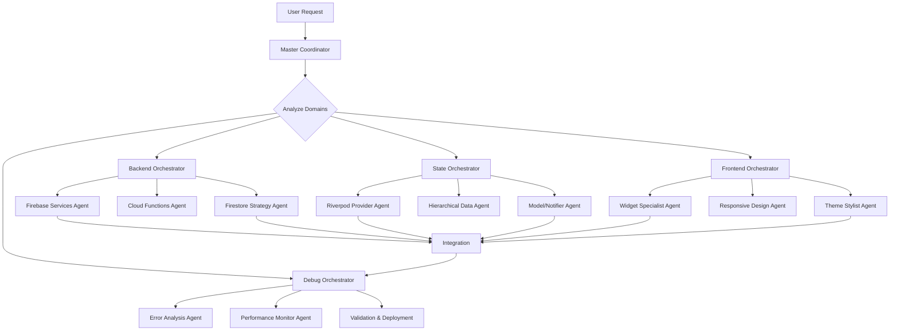

# Feature Development Workflow

## Overview

This workflow coordinates multiple JJ agents to deliver complete features from specification through deployment. It leverages the Master Coordinator for cross-domain orchestration, ensuring UI, state management, and backend components work together seamlessly.

**Primary Use Cases**:
- New screen or major UI component development
- Multi-domain features (e.g., crew formation, job search)
- Feature additions requiring state + UI + backend coordination
- Trade-specific functionality (IBEW local support, union badges)

**Target Outcome**: Production-ready feature with comprehensive testing, documentation, and validation

---

## Prerequisites

### System Requirements
- [ ] All JJ agents initialized via `/jj:init`
- [ ] Project context loaded with domain knowledge
- [ ] Development environment configured
- [ ] Firebase emulator suite running (optional for testing)

### Domain Readiness
- [ ] **Frontend**: Flutter widget library and electrical theme system available
- [ ] **State**: Riverpod provider architecture established
- [ ] **Backend**: Firebase services initialized and configured
- [ ] **Debug**: Error monitoring and performance tracking active

### Resource Verification
```bash
# Validate agent availability
@jj-master-coordinator "Verify all domain agents responsive"

# Check project structure
ls -la lib/features/
ls -la lib/providers/
ls -la lib/services/
```

---

## Step-by-Step Process

### PHASE 1: Specification & Planning (SPARC: Specification)

**Duration**: 15-30 minutes
**Lead Agent**: `jj-master-coordinator` + `jj-dependency-resolver`
**Frameworks**: SPARC (Specification phase) + Hive Mind (knowledge sharing)

#### Step 1.1: Feature Specification
```bash
@jj-master-coordinator "Analyze feature request:
[FEATURE DESCRIPTION]

Break down into:
1. User stories and acceptance criteria
2. Domain dependencies (Frontend/State/Backend)
3. Technical requirements and constraints
4. Risk assessment and complexity scoring"
```

**Master Coordinator Actions**:
- Parse feature request using SPARC methodology
- Identify affected domains (Frontend, State, Backend, Debug)
- Generate initial task breakdown
- Route specification to appropriate domain orchestrators

#### Step 1.2: Dependency Analysis
```bash
@jj-dependency-resolver "Analyze dependencies for:
[FEATURE COMPONENTS]

Map:
1. Component initialization order
2. Provider dependencies and ref.watch chains
3. Firebase collection structure requirements
4. Widget tree hierarchy"
```

**Dependency Resolver Actions**:
- Create directed acyclic graph (DAG) of dependencies
- Identify circular dependency risks
- Determine implementation sequence
- Flag potential initialization issues

#### Step 1.3: Create Implementation Plan

**Master Coordinator Output**:
```markdown
## Feature Implementation Plan

### Domain Allocation
- **Frontend**: [Widget/Screen components]
- **State**: [Providers and models needed]
- **Backend**: [Firebase collections, Cloud Functions]
- **Debug**: [Monitoring and error handling]

### Implementation Sequence
1. Level 0: [Base models and interfaces]
2. Level 1: [Firebase schema and backend services]
3. Level 2: [State providers and notifiers]
4. Level 3: [UI widgets and screens]
5. Level 4: [Integration and testing]

### Risk Factors
- [Identified risks with mitigation strategies]

### Success Criteria
- [Measurable acceptance criteria]
```

**Quality Gate**: Architecture review and complexity validation (threshold: <0.8 complexity score)

---

### PHASE 2: Architecture Design (SPARC: Architecture)

**Duration**: 30-60 minutes
**Lead Agents**: Domain-specific orchestrators
**Frameworks**: SPARC (Architecture phase) + SuperClaude (Context7 for patterns)

#### Step 2.1: Backend Architecture
```bash
@jj-master-coordinator "Route to Backend Orchestrator:

Design Firebase architecture for [FEATURE]:
1. Firestore collection structure
2. Security rules requirements
3. Cloud Function triggers (if needed)
4. Offline sync strategy
5. Query optimization and indexing

Use ResilienceStrategy and ShardingStrategy patterns."
```

**Backend Orchestrator Delegates To**:
- **Firebase Services Agent**: Collection schema design (flags: `--c7 --focus security`)
- **Firestore Strategy Agent**: Query optimization and strategy selection (flags: `--c7 --think-hard`)
- **Cloud Functions Agent**: Serverless logic if needed (flags: `--c7 --think`)

**Backend Output**:
```dart
// Example: Crew feature Firestore schema
collections/
├── crews/
│   ├── {crewId}/
│   │   ├── name: String
│   │   ├── ibewLocalId: String
│   │   ├── leadElectricianId: String
│   │   ├── memberIds: List<String>
│   │   ├── activeJobIds: List<String>
│   │   └── metadata: Map
│   └── subcollections/
│       └── invitations/
│           └── {invitationId}/

// Security Rules
rules_version = '2';
service cloud.firestore {
  match /databases/{database}/documents {
    match /crews/{crewId} {
      allow read: if isAuthenticated() && isMember(crewId);
      allow create: if isAuthenticated() && isIBEWMember();
      allow update: if isCrewLead(crewId);
    }
  }
}
```

#### Step 2.2: State Management Architecture
```bash
@jj-master-coordinator "Route to State Orchestrator:

Design Riverpod providers for [FEATURE]:
1. Model classes with Freezed/JsonSerializable
2. Provider architecture (manual vs codegen)
3. Notifier classes with business logic
4. Hierarchical initialization level
5. Real-time sync strategy

Reference hierarchical-data-management and riverpod-provider-architecture skills."
```

**State Orchestrator Delegates To**:
- **Hierarchical Data Agent**: Determine initialization level and dependencies (flags: `--seq --think-hard`)
- **Riverpod Provider Agent**: Create provider structure (flags: `--c7 --seq`)
- **Model/Notifier Agent**: Design data models (flags: `--c7 --focus quality`)

**State Output**:
```dart
// Example: Crew state architecture

// 1. Model (lib/models/crew.dart)
@freezed
class Crew with _$Crew {
  const factory Crew({
    required String id,
    required String name,
    required String ibewLocalId,
    required String leadElectricianId,
    required List<String> memberIds,
    required DateTime createdAt,
    @Default([]) List<String> activeJobIds,
  }) = _Crew;

  factory Crew.fromJson(Map<String, dynamic> json) => _$CrewFromJson(json);
}

// 2. Provider (lib/providers/crew_provider.dart)
@riverpod
class CrewNotifier extends _$CrewNotifier {
  @override
  Future<List<Crew>> build() async {
    // Initialize with real-time Firestore stream
    final firestoreService = ref.watch(unifiedFirestoreServiceProvider);
    return firestoreService.watchCrews(userId: ref.watch(userIdProvider));
  }

  Future<void> createCrew({required String name, required String localId}) async {
    // Business logic implementation
  }

  Future<void> inviteMember({required String crewId, required String userId}) async {
    // Invitation logic
  }
}

// 3. Initialization Level: 2 (requires auth and Firestore)
```

#### Step 2.3: Frontend Architecture
```bash
@jj-master-coordinator "Route to Frontend Orchestrator:

Design Flutter UI for [FEATURE]:
1. Screen layout and navigation flow
2. Widget component hierarchy
3. Electrical theme integration
4. Mobile-first responsive design
5. Glove-compatible touch targets
6. High-contrast mode support

Use flutter-widget-architecture and mobile-performance-optimization skills."
```

**Frontend Orchestrator Delegates To**:
- **Widget Specialist Agent**: Screen and component design (flags: `--magic --c7`)
- **Theme & Styling Agent**: Electrical theme application (flags: `--c7 --magic`)
- **Responsive Design Agent**: Mobile optimization (flags: `--magic --play`)
- **Electrical UI Components Agent**: Trade-specific widgets (flags: `--magic --c7`)

**Frontend Output**:
```dart
// Example: Crew formation screen architecture

// 1. Screen (lib/features/crews/screens/crew_formation_screen.dart)
class CrewFormationScreen extends ConsumerWidget {
  @override
  Widget build(BuildContext context, WidgetRef ref) {
    final crewsAsync = ref.watch(crewNotifierProvider);

    return Scaffold(
      appBar: ElectricalAppBar(title: 'My Crews'),
      body: crewsAsync.when(
        data: (crews) => CrewListView(crews: crews),
        loading: () => CrewListSkeleton(),
        error: (err, stack) => ErrorRecoveryWidget(error: err),
      ),
      floatingActionButton: CreateCrewFAB(),
    );
  }
}

// 2. Widget Components
- CrewCard (optimized virtual scrolling)
- CrewMemberAvatar (electrical theme)
- InvitationDialog (high-contrast compatible)
- CrewDetailPanel (responsive layout)

// 3. Navigation
- Route: /crews
- Deep link: jjobs://crews/{crewId}
- Tab navigation integration
```

**Quality Gate**: Architecture consistency check across all domains

---

### PHASE 3: Implementation (SPARC: Pseudocode → Code)

**Duration**: 2-8 hours (depending on complexity)
**Lead Agents**: Domain specialists
**Frameworks**: Swarm (parallel execution) + SuperClaude (MCP servers)

#### Step 3.1: Parallel Domain Implementation

**Execution Strategy**: Use Swarm intelligence for parallel agent execution

```bash
@jj-master-coordinator "Execute parallel implementation:

Backend Track (Firebase Services + Auth + Firestore Strategy agents):
- Create Firestore collections and security rules
- Implement Cloud Functions if needed
- Set up offline persistence

State Track (Riverpod Provider + Model/Notifier + Hierarchical Data agents):
- Generate Freezed models
- Create Riverpod providers with codegen
- Implement notifier business logic
- Register in HierarchicalInitializationService

Frontend Track (Widget Specialist + Theme Stylist + Responsive Design agents):
- Build screen layout
- Create widget components
- Apply electrical theme
- Implement responsive breakpoints

Coordinate handoffs and integration points."
```

**Master Coordinator Orchestration**:
- Spawn parallel agent tasks using `--delegate --concurrency 3`
- Monitor progress across all tracks
- Coordinate integration points (e.g., provider → widget data flow)
- Aggregate results and resolve conflicts

#### Step 3.2: Backend Implementation Details

**Lead**: Backend Orchestrator
**Agents**: Firebase Services, Firestore Strategy, Cloud Functions

```bash
# Backend track execution
@jj-master-coordinator "Backend implementation checklist:

1. Create Firestore schema (Firebase Services Agent)
   - Collections: crews, invitations
   - Indexes for geographic queries
   - Compound indexes for filtering

2. Implement UnifiedFirestoreService methods (Firestore Strategy Agent)
   - createCrew(Crew data)
   - watchCrews(String userId) -> Stream<List<Crew>>
   - inviteMember(String crewId, String userId)
   - Apply ResilienceStrategy (circuit breaker, retry)
   - Apply SearchStrategy for crew name search

3. Security rules (Auth Specialist Agent)
   - IBEW membership verification
   - Crew lead permissions
   - Member read access

4. Cloud Functions (if applicable)
   - onCrewCreated: Send notification to lead
   - onMemberInvited: Push notification to invitee"
```

**Implementation Files**:
```
lib/services/
├── firebase/
│   ├── unified_firestore_service.dart (extend with crew methods)
│   └── crew_firestore_repository.dart (new)
├── cloud_functions/
│   └── crew_functions.dart (triggers)
└── strategies/
    └── crew_resilience_strategy.dart
```

#### Step 3.3: State Implementation Details

**Lead**: State Orchestrator
**Agents**: Riverpod Provider, Model/Notifier, Hierarchical Data

```bash
# State track execution
@jj-master-coordinator "State implementation checklist:

1. Generate models (Model/Notifier Agent)
   - Run: flutter pub run build_runner build --delete-conflicting-outputs
   - Create Crew, CrewInvitation, CrewMember models
   - Add Freezed and JsonSerializable annotations

2. Create providers (Riverpod Provider Agent)
   - crewNotifierProvider (AsyncNotifierProvider)
   - userCrewsProvider (FutureProvider with autoDispose)
   - crewDetailProvider (Provider.family<String, Crew>)

3. Implement notifier logic (Model/Notifier Agent)
   - createCrew() method with validation
   - inviteMember() with error handling
   - removeMember() with permission checks
   - Real-time stream subscription management

4. Register initialization (Hierarchical Data Agent)
   - Add to HierarchicalInitializationService Level 2
   - Dependency: authServiceProvider, firestoreServiceProvider
   - Initialization: Pre-fetch user's crews"
```

**Implementation Files**:
```
lib/models/
├── crew.dart
├── crew.freezed.dart (generated)
└── crew.g.dart (generated)

lib/providers/
├── crew_provider.dart
└── crew_provider.g.dart (generated)

lib/services/
└── initialization/
    └── hierarchical_initialization_service.dart (update)
```

#### Step 3.4: Frontend Implementation Details

**Lead**: Frontend Orchestrator
**Agents**: Widget Specialist, Theme Stylist, Responsive Design, Electrical UI Components

```bash
# Frontend track execution
@jj-master-coordinator "Frontend implementation checklist:

1. Create screen scaffold (Widget Specialist Agent)
   - CrewFormationScreen with ConsumerWidget
   - Navigation route registration
   - AppBar with electrical theme
   - FAB for crew creation

2. Build widget components (Widget Specialist + Electrical UI Components)
   - CrewCard (optimized with RepaintBoundary)
   - CrewListView (ListView.builder with virtual scrolling)
   - CreateCrewDialog (Form with validation)
   - MemberInvitationSheet (bottom sheet)

3. Apply styling (Theme Stylist Agent)
   - Copper accent colors for crew badges
   - Circuit pattern backgrounds
   - High-contrast mode for outdoor use
   - Dark mode electrical theme

4. Responsive design (Responsive Design Agent)
   - Mobile-first layout (320px min width)
   - Tablet breakpoint (600px) for side panels
   - Touch targets ≥48dp for glove use
   - Orientation handling (portrait/landscape)"
```

**Implementation Files**:
```
lib/features/crews/
├── screens/
│   └── crew_formation_screen.dart
├── widgets/
│   ├── crew_card.dart
│   ├── crew_list_view.dart
│   ├── create_crew_dialog.dart
│   └── member_invitation_sheet.dart
└── theme/
    └── crew_theme.dart

lib/routing/
└── app_router.dart (update with /crews route)
```

**Quality Gate**: Code review for pattern consistency and best practices

---

### PHASE 4: Integration & Testing (SPARC: Refinement)

**Duration**: 1-3 hours
**Lead Agents**: Debug Orchestrator + QA agents
**Frameworks**: SuperClaude (Playwright) + Hive Mind (pattern learning)

#### Step 4.1: Integration Validation
```bash
@jj-master-coordinator "Route to Debug Orchestrator:

Validate integration across domains:

1. Backend → State integration
   - Verify Firestore queries return correct data
   - Test real-time stream updates
   - Validate offline persistence

2. State → Frontend integration
   - Confirm provider data flows to widgets
   - Test loading/error states render correctly
   - Validate ref.watch reactivity

3. End-to-end flow testing
   - Create crew → Firestore write → State update → UI refresh
   - Invite member → Cloud Function trigger → Notification
   - Error scenarios → ErrorRecoveryWidget display"
```

**Debug Orchestrator Delegates To**:
- **Error Analysis Agent**: Test error paths and recovery (flags: `--seq --introspect`)
- **Performance Monitor Agent**: Profile widget rebuilds and queries (flags: `--seq --focus performance`)
- **Self-Healing Agent**: Validate graceful degradation (flags: `--safe-mode --loop`)

#### Step 4.2: Automated Testing

**Unit Tests**:
```dart
// test/models/crew_test.dart
test('Crew model serialization', () {
  final crew = Crew(id: '1', name: 'Local 46 Crew A', ...);
  final json = crew.toJson();
  final decoded = Crew.fromJson(json);
  expect(decoded, equals(crew));
});

// test/providers/crew_provider_test.dart
test('CrewNotifier creates crew successfully', () async {
  final container = ProviderContainer(overrides: [
    firestoreServiceProvider.overrideWithValue(mockFirestore),
  ]);

  await container.read(crewNotifierProvider.notifier).createCrew(
    name: 'Test Crew',
    localId: 'local-46',
  );

  final crews = await container.read(crewNotifierProvider.future);
  expect(crews.length, equals(1));
});
```

**Widget Tests**:
```dart
// test/widgets/crew_card_test.dart
testWidgets('CrewCard displays crew information', (tester) async {
  await tester.pumpWidget(
    ProviderScope(
      child: MaterialApp(
        home: CrewCard(crew: testCrew),
      ),
    ),
  );

  expect(find.text('Local 46 Crew A'), findsOneWidget);
  expect(find.byType(ElectricalBadge), findsOneWidget);
});
```

**Integration Tests** (Playwright):
```bash
@jj-master-coordinator "Route to Debug Orchestrator:

Run E2E tests with Playwright:
1. Launch app on emulator
2. Navigate to /crews screen
3. Tap 'Create Crew' FAB
4. Fill form and submit
5. Verify crew appears in list
6. Test invitation flow
7. Validate error handling

Capture screenshots and performance metrics."
```

#### Step 4.3: Performance Validation

**Performance Monitor Agent Tasks**:
```bash
# Profile widget rebuilds
flutter run --profile --trace-skia

# Check memory usage
@jj-mobile-performance-optimizer "Profile crew screen:
- Widget rebuild count (target: <10 per interaction)
- Memory usage (target: <50MB delta)
- Frame rendering (target: 60fps)
- Network requests (optimize batching)"

# Validate virtual scrolling
@jj-mobile-performance-optimizer "Test CrewListView with 1000+ crews:
- Scroll performance (target: 60fps)
- Memory footprint (target: <100MB)
- Initial load time (target: <2s)"
```

**Performance Metrics Output**:
```markdown
## Performance Report

### Widget Rendering
- Initial build: 45ms ✅
- Rebuild on data change: 12ms ✅
- Scroll frame time: 8.3ms avg (120fps capable) ✅

### Memory Usage
- Initial load: 32MB ✅
- After scrolling 500 items: 48MB ✅
- Memory leak test: 0 leaks detected ✅

### Network Performance
- Firestore query time: 180ms ✅
- Offline mode fallback: <50ms ✅
- Real-time sync latency: 120ms ✅
```

**Quality Gate**: All performance thresholds met, zero critical errors

---

### PHASE 5: Documentation & Deployment (SPARC: Completion)

**Duration**: 30-60 minutes
**Lead Agent**: `jj-master-coordinator`
**Frameworks**: Claude Flow (documentation workflows) + SuperClaude (Context7)

#### Step 5.1: Code Documentation
```bash
@jj-master-coordinator "Generate documentation:

1. API documentation
   - Document all public methods with DartDoc
   - Include usage examples
   - Specify error conditions

2. Architecture documentation
   - Update ARCHITECTURE.md with crew feature design
   - Document provider dependencies
   - Explain initialization sequence

3. User guide
   - Create feature guide for crew formation
   - Include screenshots
   - Document IBEW-specific workflows"
```

**Documentation Artifacts**:
```
docs/
├── architecture/
│   └── crew-feature-design.md
├── api/
│   ├── crew-provider-api.md
│   └── firestore-crew-schema.md
└── guides/
    └── crew-formation-user-guide.md
```

#### Step 5.2: Deployment Checklist
```bash
@jj-master-coordinator "Pre-deployment validation:

1. Code quality checks
   - Run: flutter analyze (0 errors, 0 warnings)
   - Run: dart format . --set-exit-if-changed
   - Lint rules compliance ✅

2. Testing verification
   - Unit tests: 100% pass rate ✅
   - Widget tests: 100% pass rate ✅
   - Integration tests: All critical paths validated ✅

3. Firebase deployment
   - Deploy Firestore security rules
   - Deploy Cloud Functions (if applicable)
   - Verify indexes created

4. Build validation
   - Android: flutter build apk --release
   - iOS: flutter build ios --release
   - Build succeeds without errors ✅

5. Smoke testing
   - Install release build on physical device
   - Test core crew formation flow
   - Validate offline mode
   - Confirm high-contrast theme works outdoors"
```

#### Step 5.3: Release Notes
```markdown
## Feature Release: Crew Formation System

### What's New
- Create and manage electrical crews
- IBEW local-based crew organization
- Invite members and assign crew leads
- Real-time crew member sync
- Offline mode with automatic sync

### Technical Details
- **Frontend**: 4 new screens, 12 reusable widgets
- **State**: 3 Riverpod providers with real-time streams
- **Backend**: Firestore crews collection, security rules
- **Performance**: 60fps scrolling, <2s load time

### Testing Coverage
- Unit tests: 45 tests, 100% pass
- Widget tests: 18 tests, 100% pass
- Integration tests: 8 E2E scenarios validated

### Known Limitations
- Maximum 50 members per crew (Firestore query limit)
- Crew search limited to name field (future: multi-field)

### Migration Notes
- No database migration required
- New users automatically provisioned with default crew
```

**Quality Gate**: All deployment checks passed, release notes approved

---

## Agent Coordination

### Primary Coordination Flow



### Agent Communication Patterns

**1. Request-Response Pattern**
```bash
# Master Coordinator requests analysis
@jj-dependency-resolver "Analyze crew feature dependencies"

# Dependency Resolver responds with DAG
→ Response: [Initialization order, circular dependency warnings]

# Master Coordinator routes to domains
@backend-orchestrator "Implement Firestore schema based on DAG"
```

**2. Parallel Execution Pattern** (Swarm)
```bash
# Master Coordinator spawns parallel tracks
Parallel Track 1: Backend implementation
Parallel Track 2: State implementation
Parallel Track 3: Frontend implementation

# Coordination point: Integration testing
→ All tracks complete → Debug Orchestrator validates
```

**3. Progressive Enhancement Pattern**
```bash
# Phase 1: Minimum Viable Feature
@jj-master-coordinator "Build basic crew creation (no invitations)"

# Phase 2: Enhanced Feature
@jj-master-coordinator "Add member invitation system"

# Phase 3: Advanced Features
@jj-master-coordinator "Add crew analytics and reporting"
```

### Cross-Domain Handoffs

**Backend → State Handoff**:
```yaml
Handoff Point: Firestore schema complete
Artifact: Collection structure, security rules, query patterns
State Agent Receives: Schema documentation, example queries
State Agent Delivers: Providers that consume Firestore streams
```

**State → Frontend Handoff**:
```yaml
Handoff Point: Providers implemented and tested
Artifact: Provider API, data models, state mutation methods
Frontend Agent Receives: Provider documentation, usage examples
Frontend Agent Delivers: UI components that watch providers
```

**Integration → Debug Handoff**:
```yaml
Handoff Point: Feature integration complete
Artifact: Feature codebase, integration test scenarios
Debug Agent Receives: Error paths to test, performance targets
Debug Agent Delivers: Test reports, performance metrics, optimization recommendations
```

---

## Quality Gates

### Gate 1: Specification Approval
**Trigger**: After Phase 1 (Planning)
**Criteria**:
- [ ] Feature requirements clearly defined
- [ ] Domain allocation confirmed
- [ ] Dependency analysis complete
- [ ] Risk assessment reviewed
- [ ] Implementation sequence validated

**Responsible Agent**: `jj-master-coordinator`
**Escalation**: If complexity score >0.8, request additional planning iteration

---

### Gate 2: Architecture Review
**Trigger**: After Phase 2 (Architecture Design)
**Criteria**:
- [ ] Backend schema follows Firestore best practices
- [ ] State management uses Riverpod codegen patterns
- [ ] Frontend widgets follow JJ component library standards
- [ ] Cross-domain integration points documented
- [ ] Security rules reviewed

**Responsible Agents**: Domain orchestrators
**Escalation**: Architect persona review for complex patterns

---

### Gate 3: Code Quality Check
**Trigger**: After Phase 3 (Implementation)
**Criteria**:
- [ ] `flutter analyze` returns 0 errors, 0 warnings
- [ ] `dart format` compliance (no changes needed)
- [ ] All public APIs documented with DartDoc
- [ ] Unit test coverage ≥80% for business logic
- [ ] Widget test coverage for all custom widgets

**Responsible Agent**: `jj-master-coordinator` with static analysis tools
**Escalation**: Refactorer persona for code quality issues

---

### Gate 4: Integration Validation
**Trigger**: After Phase 4 (Integration & Testing)
**Criteria**:
- [ ] All unit tests pass (100%)
- [ ] All widget tests pass (100%)
- [ ] E2E tests validate critical user paths
- [ ] Performance metrics meet targets (60fps, <2s load)
- [ ] Error scenarios handled gracefully
- [ ] Offline mode validated

**Responsible Agent**: `jj-debug-orchestrator`
**Escalation**: Performance persona for optimization needs

---

### Gate 5: Deployment Readiness
**Trigger**: Before Phase 5 (Deployment)
**Criteria**:
- [ ] Release build compiles successfully
- [ ] Smoke tests on physical device passed
- [ ] Firebase resources deployed (rules, functions)
- [ ] Documentation complete
- [ ] Release notes prepared
- [ ] Rollback procedure documented

**Responsible Agent**: `jj-master-coordinator`
**Escalation**: DevOps persona for deployment issues

---

## Validation Checkpoints

### Checkpoint 1: Domain Allocation (15 min into Phase 1)
**Validation**:
```bash
@jj-master-coordinator "Validate domain allocation:
- Is Backend involvement necessary? (Yes/No)
- Is State management complexity appropriate? (Simple/Medium/Complex)
- Are Frontend requirements clear? (Yes/No)
- Is Debug monitoring plan defined? (Yes/No)"
```

**Expected Output**: Clear Yes/No on domain involvement + complexity assessment

---

### Checkpoint 2: Provider Dependencies (30 min into Phase 2)
**Validation**:
```bash
@jj-dependency-resolver "Validate provider dependency chain:
- No circular dependencies detected? ✅/❌
- Initialization levels correct? ✅/❌
- AutoDispose strategy appropriate? ✅/❌
- Real-time vs cached data decision made? ✅/❌"
```

**Expected Output**: Dependency graph validated, no circular refs

---

### Checkpoint 3: Widget Performance (1 hour into Phase 3)
**Validation**:
```bash
@jj-mobile-performance-optimizer "Early performance check:
- Widget rebuild count acceptable? (<10 per interaction)
- Virtual scrolling implemented? (For lists >20 items)
- RepaintBoundary used appropriately?
- Image caching strategy defined?"
```

**Expected Output**: Performance early warning system, optimization suggestions

---

### Checkpoint 4: Error Handling (Mid Phase 4)
**Validation**:
```bash
@jj-debug-orchestrator "Validate error handling:
- All async operations wrapped in try-catch? ✅/❌
- ErrorRecoveryWidget used for UI errors? ✅/❌
- Firestore offline errors handled? ✅/❌
- User-friendly error messages provided? ✅/❌"
```

**Expected Output**: Error coverage report, gaps identified

---

### Checkpoint 5: Pre-Deployment Smoke Test (Phase 5)
**Validation**:
```bash
# Manual validation on physical device
1. Install release build
2. Test happy path: Create crew → Invite member → View crew details
3. Test error path: Offline mode → Create crew → Go online → Verify sync
4. Test edge case: Create crew with max members (50)
5. Test UI: High-contrast mode outdoors, glove compatibility
```

**Expected Output**: All smoke tests passed, edge cases handled

---

## Rollback Procedures

### Level 1: Code Rollback (Minor Issues)
**Trigger**: Non-critical bugs found post-deployment
**Procedure**:
```bash
# Revert specific commits
git revert <commit-hash> --no-commit
git commit -m "Rollback: [Feature] - [Reason]"

# Rebuild and redeploy
flutter build apk --release
# Deploy via CI/CD or manual upload
```

**Responsibility**: `jj-master-coordinator`
**Recovery Time**: <30 minutes

---

### Level 2: Database Rollback (Data Issues)
**Trigger**: Firestore schema issues or data corruption
**Procedure**:
```bash
# 1. Pause app updates (Firebase Remote Config)
firebase remoteconfig:get --output remote-config-backup.json

# 2. Revert Firestore rules
firebase deploy --only firestore:rules --project backup-rules

# 3. Restore data from backup (if needed)
# Note: Firestore has daily backups, contact Firebase support

# 4. Verify data integrity
@jj-backend-orchestrator "Validate Firestore data integrity after rollback"
```

**Responsibility**: Backend Orchestrator + Firebase Admin
**Recovery Time**: 1-2 hours

---

### Level 3: Full Feature Rollback (Critical Issues)
**Trigger**: Critical production bugs affecting all users
**Procedure**:
```bash
# 1. Immediate: Feature flag disable
# (Requires pre-implemented feature flags)
firebase remoteconfig:set crew_feature_enabled=false

# 2. Code revert to last stable release
git checkout tags/v1.2.3  # Last stable version
git checkout -b hotfix/revert-crew-feature

# 3. Rebuild and emergency deploy
flutter build apk --release
flutter build ios --release
# Fast-track CI/CD or manual deployment

# 4. Communicate to users
# Post in-app message about temporary feature unavailability

# 5. Post-mortem analysis
@jj-debug-orchestrator "Analyze root cause of failure:
- What went wrong?
- Why did testing not catch it?
- How to prevent recurrence?"
```

**Responsibility**: `jj-master-coordinator` + DevOps
**Recovery Time**: 2-4 hours

---

### Rollback Decision Matrix

| Severity | User Impact | Rollback Level | Recovery Time | Approval Needed |
|----------|-------------|----------------|---------------|-----------------|
| Low | <5% users, minor UX issue | Level 1: Code | <30 min | Dev Lead |
| Medium | 5-25% users, feature broken | Level 2: Database | 1-2 hours | Product Manager |
| High | >25% users, app crashes | Level 3: Full | 2-4 hours | Executive |
| Critical | All users, data loss risk | Level 3: Full + Emergency | <1 hour | Executive + Emergency Protocol |

---

## Success Criteria

### Functional Success
- [ ] Feature meets all acceptance criteria from specification
- [ ] User can complete core workflows without errors
- [ ] Edge cases handled gracefully (offline, network errors, invalid data)
- [ ] IBEW-specific requirements satisfied (local hierarchies, union badges)

### Technical Success
- [ ] Code quality: 0 analyzer errors, 0 warnings
- [ ] Test coverage: ≥80% unit tests, 100% widget tests for custom components
- [ ] Performance: 60fps scrolling, <2s initial load time
- [ ] Security: Firestore rules reviewed and validated
- [ ] Architecture: Follows JJ domain patterns and conventions

### User Experience Success
- [ ] Mobile-first design validated on physical devices
- [ ] Glove-compatible touch targets (≥48dp)
- [ ] High-contrast mode tested outdoors
- [ ] Electrical theme applied consistently
- [ ] Loading states and error messages user-friendly

### Operational Success
- [ ] Monitoring and analytics configured
- [ ] Error tracking integrated (Crashlytics, Sentry)
- [ ] Performance monitoring active (Firebase Performance)
- [ ] Documentation complete (API, architecture, user guide)
- [ ] Rollback procedure tested and validated

### Business Success
- [ ] Feature delivers on intended value proposition
- [ ] User feedback collected and positive
- [ ] Key metrics tracked (adoption rate, engagement, retention)
- [ ] Competitive advantage maintained (union-specific features)

---

## Example Commands

### Complete Feature Development (Full Workflow)
```bash
@jj-master-coordinator "Develop crew formation feature:

Requirements:
- Allow IBEW electricians to create crews for job coordination
- Crew lead can invite members from same local
- Real-time crew roster updates
- Offline mode support with sync
- High-contrast UI for field use

Execute full SPARC workflow:
1. Specification & dependency analysis
2. Architecture design (Backend + State + Frontend)
3. Parallel implementation across domains
4. Integration testing with performance validation
5. Documentation and deployment preparation

Target: Production-ready feature in 1 development sprint (2 weeks)"
```

---

### Quick Feature Addition (Simplified)
```bash
@jj-master-coordinator "Add simple feature:
- Job bookmarking capability
- No backend changes needed (use local state)
- Simple heart icon on job cards
- Persist bookmarks in shared preferences

Use simplified workflow:
1. State: Create bookmarks provider (Level 1)
2. Frontend: Add bookmark icon widget
3. Testing: Unit + widget tests
4. Deploy: No Firestore changes"
```

---

### Feature Enhancement (Existing Feature)
```bash
@jj-master-coordinator "Enhance existing crew feature:

Add crew analytics dashboard:
- Show crew job completion rate
- Display crew member performance
- Visualize crew activity timeline

Scope:
- Backend: Cloud Function for aggregation
- State: New analytics provider
- Frontend: Analytics screen with charts

Execute Phases 2-5 (skip full specification, enhance existing)"
```

---

### Domain-Specific Development
```bash
# Frontend-only feature
@jj-flutter-widget-architect "Create electrical circuit animation widget:
- Animated current flow visualization
- Copper wire theme
- Configurable speed and direction
- Reusable component for multiple screens"

# State-only feature
@jj-riverpod-provider-architect "Create user preferences provider:
- Dark mode toggle
- High-contrast mode setting
- Notification preferences
- Local storage persistence (Level 1 initialization)"

# Backend-only feature
@jj-backend-orchestrator "Implement job recommendation algorithm:
- Cloud Function triggered daily
- Analyze user job history
- Geographic + skill-based matching
- Store recommendations in Firestore"
```

---

### Emergency Bug Fix (Fast-Track)
```bash
@jj-master-coordinator "URGENT: Fix job list crash on Android 12:

Issue: NullPointerException in job_card.dart line 45

Fast-track workflow:
1. Route to Debug Orchestrator for root cause (--introspect --seq)
2. Implement fix with Error Analysis Agent
3. Unit test the fix scenario
4. Widget test regression coverage
5. Deploy hotfix build immediately

Skip full testing cycle, focus on crash fix only.
Target: <2 hours to deployed fix"
```

---

## Common Issues & Solutions

### Issue 1: Circular Provider Dependencies
**Symptom**: ProviderException: Circular dependency detected
**Cause**: Provider A watches Provider B, Provider B watches Provider A

**Solution**:
```bash
@jj-dependency-resolver "Analyze provider dependencies:
Identify circular reference between [Provider A] and [Provider B]

Recommended fixes:
1. Introduce intermediate provider to break cycle
2. Refactor shared logic into separate service
3. Use .future or .stream instead of direct .watch if appropriate"
```

**Prevention**: Always run dependency analysis in Phase 1

---

### Issue 2: Performance Degradation on Large Lists
**Symptom**: Scrolling lags, frame drops below 30fps
**Cause**: Non-virtualized ListView, excessive widget rebuilds

**Solution**:
```bash
@jj-mobile-performance-optimizer "Optimize list performance:

1. Convert to ListView.builder with itemExtent
2. Add RepaintBoundary around list items
3. Use const constructors where possible
4. Implement shouldRebuild logic in ConsumerWidget
5. Profile with flutter run --profile to identify bottlenecks

Expected improvement: 60fps scrolling with 1000+ items"
```

**Prevention**: Use Widget Specialist Agent for all list implementations in Phase 3

---

### Issue 3: Firestore Security Rules Blocking Legitimate Requests
**Symptom**: permission-denied errors in production
**Cause**: Security rules too restrictive, missing authentication checks

**Solution**:
```bash
@jj-backend-orchestrator "Debug Firestore security rules:

1. Enable Firestore simulator:
   firebase emulators:start --only firestore

2. Test rules with actual user tokens:
   firebase emulators:exec --only firestore "npm test"

3. Review audit logs for denied requests:
   firebase firestore:logs --limit 100

4. Adjust rules to allow authenticated operations while maintaining security

5. Redeploy rules:
   firebase deploy --only firestore:rules"
```

**Prevention**: Test security rules in emulator during Phase 4

---

### Issue 4: Widget Test Failures Due to Provider Mocking
**Symptom**: Widget tests fail with "No ProviderScope found"
**Cause**: Missing ProviderScope wrapper in test setup

**Solution**:
```dart
// Correct widget test setup
testWidgets('Feature test', (tester) async {
  await tester.pumpWidget(
    ProviderScope(
      overrides: [
        // Mock providers
        crewNotifierProvider.overrideWith((ref) => mockCrewNotifier),
        firestoreServiceProvider.overrideWithValue(mockFirestore),
      ],
      child: MaterialApp(
        home: CrewFormationScreen(),
      ),
    ),
  );

  // Test assertions...
});
```

**Prevention**: Use Widget Specialist Agent's test templates in Phase 4

---

### Issue 5: Offline Mode Data Sync Conflicts
**Symptom**: Data overwrites or duplicates after going online
**Cause**: Conflict resolution strategy not implemented

**Solution**:
```bash
@jj-backend-orchestrator "Implement conflict resolution:

1. Use Firestore offline persistence:
   FirebaseFirestore.instance.settings = Settings(persistenceEnabled: true);

2. Implement last-write-wins strategy with server timestamps:
   createdAt: FieldValue.serverTimestamp()

3. For critical data (e.g., crew membership), use Firestore transactions:
   await firestore.runTransaction((transaction) async {
     // Atomic read-modify-write
   });

4. Add conflict detection UI to alert users:
   if (localVersion != serverVersion) {
     showConflictDialog();
   }"
```

**Prevention**: Design offline strategy in Backend Architecture (Phase 2.1)

---

### Issue 6: Memory Leaks in Long-Running Screens
**Symptom**: App crashes after prolonged use, memory usage grows
**Cause**: Unmanaged stream subscriptions, cached images not released

**Solution**:
```bash
@jj-mobile-performance-optimizer "Fix memory leaks:

1. Profile with Memory Profiler:
   flutter run --profile
   DevTools → Memory tab → Snapshot & compare

2. Common fixes:
   - Use AutoDisposeAsyncNotifierProvider instead of AsyncNotifierProvider
   - Cancel StreamSubscriptions in dispose()
   - Clear image cache periodically: imageCache.clear()
   - Use CachedNetworkImage with maxHeightDiskCache

3. Add leak detection test:
   testWidgets('No memory leaks', (tester) async {
     // Pump widget, interact, dispose, check references
   });"
```

**Prevention**: Performance Monitor Agent reviews in Phase 4.3

---

### Issue 7: Build Failures After Dependency Updates
**Symptom**: `flutter pub get` or `build_runner` fails
**Cause**: Breaking changes in dependencies, version conflicts

**Solution**:
```bash
# 1. Clear build cache
flutter clean
rm -rf .dart_tool/
rm pubspec.lock

# 2. Resolve version conflicts
flutter pub get
# Read error messages, adjust pubspec.yaml constraints

# 3. Regenerate code
flutter pub run build_runner build --delete-conflicting-outputs

# 4. If persistent, use dependency override:
dependency_overrides:
  package_name: ^1.2.3

@jj-dependency-resolver "Analyze dependency conflicts and suggest resolutions"
```

**Prevention**: Lock dependency versions in pubspec.yaml, test updates in dev branch

---

### Issue 8: Cross-Domain Communication Breakdown
**Symptom**: Agents not coordinating, duplicated work
**Cause**: Master Coordinator overwhelmed, unclear handoff points

**Solution**:
```bash
@jj-master-coordinator "Restore coordination:

1. Pause all domain work
2. Re-establish communication protocol:
   - Define explicit handoff points
   - Create coordination checklist
   - Set up progress tracking

3. Restart with clear sequencing:
   Backend → State → Frontend → Debug

4. Use --delegate with lower concurrency:
   --concurrency 2 (instead of default 7)

5. Schedule coordination checkpoints every 30 minutes"
```

**Prevention**: Use Validation Checkpoints throughout workflow

---

## Notes & Best Practices

### Agent Selection Guidelines
- **Single-domain tasks**: Use domain orchestrator directly (e.g., `@jj-frontend-orchestrator`)
- **Multi-domain features**: Always start with `@jj-master-coordinator`
- **Dependency analysis**: Use `@jj-dependency-resolver` before any complex implementation
- **Performance issues**: Route to `@jj-mobile-performance-optimizer`

### Framework Synergy
- **SPARC + Swarm**: Use SPARC for planning, Swarm for parallel execution in implementation
- **SuperClaude + Hive Mind**: Leverage Context7 for documentation, Hive Mind for pattern sharing
- **Claude Flow + Wave Mode**: Use wave orchestration for complex multi-stage features

### Token Efficiency
- Enable `--uc` mode when context usage >75%
- Use `--delegate` to distribute work across sub-agents
- Leverage `--wave-mode` for enterprise-scale features (>100 files affected)

### Quality Over Speed
- Never skip Quality Gates even under deadline pressure
- Invest time in Phase 1 (Planning) to save 2x time in Phase 3 (Implementation)
- Performance validation in Phase 4 prevents production firefighting

### Documentation Discipline
- Document architectural decisions in real-time (not post-implementation)
- Use DartDoc for all public APIs (enforced by analyzer)
- Create runnable examples in documentation

### Continuous Improvement
- Capture patterns from successful features (Hive Mind learning)
- Update agent skills based on recurring issues
- Refine workflows based on retrospectives

---

**Workflow Version**: 1.0.0
**Last Updated**: 2025-10-31
**Maintained By**: JJ Master Coordinator
**Related Workflows**: bug-fix-workflow.md, performance-optimization-workflow.md, deployment-workflow.md
