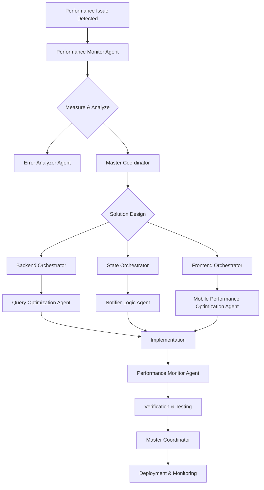

# Performance Optimization Workflow

## Overview

This workflow focuses on identifying, analyzing, and resolving performance bottlenecks within the application to enhance user experience, reduce resource consumption, and improve system responsiveness. It follows a data-driven approach, emphasizing measurement and verification.

**Primary Use Cases**:
- Slow application startup or screen loading times
- High CPU or memory usage
- Janky UI animations or scrolling
- Slow API response times or database queries
- Excessive network data transfer

**Target Outcome**: Measurable improvements in key performance indicators (KPIs) such as load time, frame rate, memory footprint, and API response times, without introducing regressions.

---

## Prerequisites

### System Requirements
- [ ] All JJ agents initialized via `/jj:init`
- [ ] Access to performance profiling tools (e.g., Flutter DevTools, Chrome DevTools, Firebase Performance Monitoring)
- [ ] Benchmarking environment configured
- [ ] Access to production monitoring dashboards

### Domain Readiness
- [ ] **Debug**: Performance monitoring and profiling tools active
- [ ] **Backend**: Access to database query logs and API performance metrics
- [ ] **State**: Understanding of state update mechanisms and data flow
- [ ] **Frontend**: UI rendering pipeline knowledge and widget tree analysis

### Resource Verification
```bash
# Validate agent availability
@jj-master-coordinator "Verify all domain agents responsive"

# Check access to profiling tools
flutter pub global activate devtools
```

---

## Step-by-Step Process

### PHASE 1: Identification & Measurement (SPARC: Specification)

**Duration**: 30-90 minutes
**Lead Agent**: `jj-performance-monitor-agent` + `jj-debug-orchestrator`
**Frameworks**: SPARC (Specification phase) + Baseline Benchmarking

#### Step 1.1: Identify Performance Bottlenecks
```bash
@jj-performance-monitor-agent "Identify performance bottlenecks:

Analyze:
1. User reports of slowness or unresponsiveness
2. Automated performance alerts (e.g., Firebase Performance)
3. Key user journeys with high latency
4. Resource utilization (CPU, memory, network) spikes

Pinpoint specific areas or features exhibiting poor performance."
```

**Performance Monitor Agent Actions**:
- Collect performance data from various sources (profilers, logs, monitoring tools).
- Correlate user complaints with system metrics.
- Prioritize bottlenecks based on user impact and frequency.

#### Step 1.2: Establish Baseline Metrics
```bash
@jj-performance-monitor-agent "Establish baseline performance metrics for [FEATURE/AREA]:

Measure:
1. Load time (e.g., screen load, API response)
2. Frame rate (FPS) during interactions (e.g., scrolling, animations)
3. Memory footprint (initial, peak, steady-state)
4. CPU usage during critical operations
5. Network data transfer and request count

Document current performance to quantify improvements."
```

**Debug Orchestrator Actions**:
- Run automated benchmarks and record results.
- Capture detailed traces using profiling tools.
- Store baseline data for comparison after optimization.

#### Step 1.3: Define Performance Targets
```bash
@jj-master-coordinator "Define performance targets for [FEATURE/AREA]:

Set clear, measurable goals:
1. Reduce load time by X%
2. Achieve Y FPS during Z interaction
3. Decrease memory usage by A MB
4. Improve API response time to B ms

Targets should be realistic and aligned with user expectations."
```

**Master Coordinator Output**:
```markdown
## Performance Optimization Plan
### Target Area: [FEATURE/AREA]
### Current Baseline:
- Load Time: [X] ms
- Frame Rate: [Y] FPS
- Memory Usage: [Z] MB
### Optimization Targets:
- Load Time: [X'] ms (e.g., 20% reduction)
- Frame Rate: [Y'] FPS (e.g., consistent 60 FPS)
- Memory Usage: [Z'] MB (e.g., 10% reduction)
```

**Quality Gate**: Bottlenecks identified, baseline metrics established, and clear performance targets defined.

---

### PHASE 2: Analysis & Solution Design (SPARC: Architecture)

**Duration**: 30-120 minutes
**Lead Agents**: Domain-specific orchestrators + `jj-optimization-strategy`
**Frameworks**: SPARC (Architecture phase) + Optimization Patterns

#### Step 2.1: Root Cause Analysis of Performance Issues
```bash
@jj-error-analyzer-agent "Analyze root causes of performance bottlenecks in [FEATURE/AREA]:

Examine:
1. Code hotspots from profiler traces
2. Inefficient algorithms or data structures
3. Excessive widget rebuilds or layout passes
4. Unoptimized database queries or API calls
5. Large asset sizes or uncompressed data

Identify the underlying reasons for poor performance."
```

**Error Analyzer Agent Actions**:
- Deep dive into code sections flagged by profilers.
- Consult `jj-dependency-resolver` for dependency-related performance issues.
- Use `jj-pattern-recognition` to identify known performance anti-patterns.

#### Step 2.2: Design Optimization Strategies
```bash
@jj-master-coordinator "Design optimization strategies for [FEATURE/AREA]:

Propose solutions that:
1. Directly address identified root causes
2. Leverage known performance patterns (e.g., caching, lazy loading, batching)
3. Have minimal impact on code readability and maintainability
4. Include a plan for verification and regression testing

Consult relevant domain orchestrators for specialized optimization techniques."
```

**Domain Orchestrator Actions**:
- Backend Orchestrator: Suggest query optimizations, indexing, server-side caching.
- State Orchestrator: Recommend state normalization, selective rebuilds, immutable data structures.
- Frontend Orchestrator: Propose widget tree optimization, image compression, virtual scrolling.

#### Step 2.3: Review & Approval of Optimization Plan
```bash
@jj-master-coordinator "Review proposed optimization plan for [FEATURE/AREA]:

Evaluate:
1. Effectiveness of proposed solutions against targets
2. Potential risks (e.g., increased complexity, new bugs)
3. Resource implications (e.g., development time, infrastructure cost)
4. Adequacy of verification plan

Seek approval from relevant stakeholders (e.g., tech lead, product owner)."
```

**Quality Gate**: Root causes analyzed, optimization strategies designed, and plan approved.

---

### PHASE 3: Implementation & Verification (SPARC: Pseudocode → Code)

**Duration**: 2-8 hours (depending on complexity)
**Lead Agents**: Domain specialists + `jj-performance-monitor-agent`
**Frameworks**: Swarm (parallel execution) + Iterative Refinement

#### Step 3.1: Implement Optimizations
```bash
@jj-master-coordinator "Implement optimizations for [FEATURE/AREA]:

Execute implementation based on approved plan:
- Apply code changes to address performance bottlenecks.
- Focus on one optimization at a time for easier measurement.
- Document changes and their expected impact."
```

**Domain Specialist Actions**:
- Backend Agents: Refactor database queries, optimize API endpoints, implement caching.
- State Agents: Adjust provider update logic, optimize data structures.
- Frontend Agents: Refactor widgets, implement virtual scrolling, optimize image loading.

#### Step 3.2: Measure & Verify Improvements
```bash
@jj-performance-monitor-agent "Measure and verify performance improvements for [FEATURE/AREA]:

- Re-run benchmarks and profiling tools.
- Compare new metrics against baseline and defined targets.
- Quantify the impact of each optimization.
- Ensure improvements are consistent and reproducible."
```

**Performance Monitor Agent Delegates To**:
- **Optimization Strategy Agent**: Validate the effectiveness of applied strategies.
- **Performance Profiling Agent**: Conduct detailed profiling to confirm bottleneck resolution.

#### Step 3.3: Regression Testing
```bash
@jj-debug-orchestrator "Perform regression testing for performance optimizations:

- Run full regression test suite to ensure no new bugs were introduced.
- Verify that existing functionality remains intact.
- Pay close attention to areas adjacent to optimized code."
```

**Quality Gate**: Optimizations implemented, performance targets met, and no regressions introduced.

---

### PHASE 4: Deployment & Monitoring (SPARC: Completion)

**Duration**: 30-90 minutes
**Lead Agent**: `jj-master-coordinator` + `jj-proactive-monitoring`
**Frameworks**: Claude Flow (deployment workflows) + Continuous Performance Monitoring

#### Step 4.1: Deployment Preparation
```bash
@jj-master-coordinator "Prepare for deployment of performance optimizations:
[FEATURE/AREA]

- Create release notes highlighting performance improvements.
- Ensure all code changes are reviewed and merged.
- Build release artifacts.
- Document rollback plan in case of unexpected issues."
```

#### Step 4.2: Deployment
```bash
@jj-master-coordinator "Deploy performance optimizations:
[FEATURE/AREA]

Execute deployment to production environment:
- Use automated CI/CD pipelines.
- Consider phased rollout for significant changes.
- Monitor deployment process for errors."
```

#### Step 4.3: Continuous Performance Monitoring
```bash
@jj-proactive-monitoring "Continuously monitor performance in production:
[FEATURE/AREA]

- Track key performance indicators (KPIs) over time.
- Set up alerts for performance degradations.
- Analyze user experience metrics (e.g., perceived speed).
- Gather feedback for further optimization opportunities."
```

**Quality Gate**: Optimized code deployed, performance improvements confirmed in production, and continuous monitoring established.

---

## Agent Coordination

### Primary Coordination Flow



### Agent Communication Patterns

**1. Bottleneck Analysis Request**
```bash
# Performance Monitor requests detailed analysis
@jj-error-analyzer-agent "Analyze CPU hotspot in [FUNCTION/METHOD]:

Examine:
- Profiler trace from [DATE/TIME]
- Code context around line [LINE NUMBER]
- Potential algorithmic inefficiencies"
```

**2. Optimization Strategy Proposal**
```bash
# Domain Orchestrator proposes optimization
@jj-frontend-orchestrator "Propose optimization for [SCREEN/WIDGET]:

Strategy:
- Implement virtual scrolling for large lists
- Compress images using WebP format
- Use `const` constructors for static widgets

Expected impact: [X]% FPS increase, [Y]% memory reduction"
```

---

## Quality Gates

### Gate 1: Baseline & Targets
**Trigger**: After Phase 1 (Identification & Measurement)
**Criteria**:
- [ ] Performance bottlenecks clearly identified
- [ ] Reliable baseline metrics established
- [ ] Measurable performance targets defined

**Responsible Agent**: `jj-performance-monitor-agent`
**Escalation**: If targets are unrealistic or baselines are inconsistent, re-evaluate Phase 1.

---

### Gate 2: Optimization Plan Approval
**Trigger**: After Phase 2 (Analysis & Solution Design)
**Criteria**:
- [ ] Root causes of performance issues understood
- [ ] Proposed solutions directly address root causes
- [ ] Plan includes verification and regression testing
- [ ] Risks associated with changes are assessed

**Responsible Agents**: Domain orchestrators + `jj-master-coordinator`
**Escalation**: If plan introduces significant complexity or new risks, require additional review.

---

### Gate 3: Performance Verification
**Trigger**: After Phase 3 (Implementation & Verification)
**Criteria**:
- [ ] Performance targets are met or exceeded
- [ ] No new performance regressions introduced
- [ ] All relevant tests (unit, widget, integration, regression) pass
- [ ] Code quality maintained (no new errors/warnings)

**Responsible Agent**: `jj-performance-monitor-agent`
**Escalation**: If targets are not met or regressions occur, revert to Phase 3.1 (Implement Optimizations) or Phase 2 (Analysis & Solution Design).

---

### Gate 4: Production Performance Stability
**Trigger**: After Phase 4 (Deployment & Monitoring)
**Criteria**:
- [ ] Production KPIs show sustained improvement
- [ ] No new performance alerts triggered
- [ ] User feedback is positive regarding performance
- [ ] System resources remain within acceptable limits

**Responsible Agent**: `jj-proactive-monitoring` + `jj-self-healing-agent`
**Escalation**: If performance degrades in production, initiate emergency performance optimization workflow or rollback.

---

## Validation Checkpoints

### Checkpoint 1: Bottleneck Confirmation (30 min into Phase 1)
**Validation**:
```bash
@jj-performance-monitor-agent "Confirm bottleneck:
- Is the identified bottleneck the primary cause of the performance issue? (Yes/No)
- Are the baseline metrics accurate and reproducible? (Yes/No)
- Is the scope of optimization clearly defined? (Yes/No)"
```
**Expected Output**: Clear confirmation of the bottleneck and readiness for detailed analysis.

---

### Checkpoint 2: Optimization Impact Prediction (30 min into Phase 2)
**Validation**:
```bash
@jj-optimization-strategy "Predict optimization impact:
- What is the estimated improvement for each proposed change? (e.g., 10% faster load)
- Are there any potential negative side effects? (Yes/No)
- Is the chosen strategy the most effective for the identified root cause? (Yes/No)"
```
**Expected Output**: Quantified prediction of impact and confirmation of strategy effectiveness.

---

### Checkpoint 3: Incremental Verification (Mid Phase 3)
**Validation**:
```bash
@jj-performance-monitor-agent "Verify incremental improvements:
- After each major optimization, re-measure and compare to baseline. (Met/Not Met)
- Are the improvements cumulative as expected? (Yes/No)
- Are there any unexpected performance degradations in other areas? (Yes/No)"
```
**Expected Output**: Confirmation of incremental gains and early detection of regressions.

---

### Checkpoint 4: Load Testing (End of Phase 3)
**Validation**:
```bash
@jj-performance-monitor-agent "Conduct load testing:
- Does the application maintain performance under high user load? (Yes/No)
- Are server response times stable? (Yes/No)
- Is resource utilization within acceptable limits during stress? (Yes/No)"
```
**Expected Output**: Confirmation of scalability and stability under load.

---

## Rollback Procedures

### Level 1: Code Rollback (Minor Issues)
**Trigger**: Minor performance regression or unexpected behavior post-deployment.
**Procedure**:
```bash
# Revert specific commits
git revert <commit-hash> --no-commit
git commit -m "Rollback: [Optimization ID] - [Reason]"

# Rebuild and redeploy
flutter build apk --release
# Deploy via CI/CD or manual upload
```
**Responsibility**: `jj-master-coordinator`
**Recovery Time**: <30 minutes

---

### Level 2: Feature Flag Rollback (Controlled Disable)
**Trigger**: Performance optimization introduces a critical issue that can be isolated by a feature flag.
**Procedure**:
```bash
# Disable feature flag
firebase remoteconfig:set performance_opt_[ID]_enabled=false

# Monitor impact
@jj-proactive-monitoring "Monitor system after feature flag disable"
```
**Responsibility**: `jj-backend-orchestrator` + `jj-master-coordinator`
**Recovery Time**: 5-15 minutes

---

### Level 3: Full Version Rollback (Critical Issues)
**Trigger**: Performance optimization causes widespread critical issues (e.g., app crashes, severe degradation).
**Procedure**:
```bash
# 1. Immediate: Revert to last stable release
git checkout tags/vX.Y.Z  # Last stable version
git checkout -b hotfix/revert-perf-opt-[ID]

# 2. Rebuild and emergency deploy
flutter build apk --release
flutter build ios --release
# Fast-track CI/CD or manual deployment

# 3. Communicate to users
# Post in-app message about temporary performance issues

# 4. Post-mortem analysis
@jj-debug-orchestrator "Analyze root cause of failure:
- What went wrong?
- Why did testing not catch it?
- How to prevent recurrence?"
```
**Responsibility**: `jj-master-coordinator` + DevOps
**Recovery Time**: 2-4 hours

---

## Success Criteria

### Functional Success
- [ ] All existing functionality remains intact
- [ ] No new bugs or regressions introduced

### Technical Success
- [ ] Performance targets are met or exceeded for identified KPIs
- [ ] Code quality maintained or improved
- [ ] Resource utilization (CPU, memory, network) reduced

### User Experience Success
- [ ] Perceived speed and responsiveness improved
- [ ] UI interactions are smooth (e.g., 60 FPS scrolling)
- [ ] User complaints related to performance are reduced

### Operational Success
- [ ] Production monitoring confirms sustained performance improvements
- [ ] Alerts for performance degradations are reduced
- [ ] Infrastructure costs potentially reduced due to efficiency gains

---

## Example Commands

### Optimize Slow Screen Load
```bash
@jj-master-coordinator "Optimize screen load time for [SCREEN_NAME]:

Issue: Screen takes >3 seconds to load on average.
Target: Reduce load time to <1.5 seconds.

Workflow:
1. Performance Monitor: Profile screen load, identify bottlenecks (e.g., large image, slow API).
2. Frontend Orchestrator: Implement lazy loading for images, optimize widget tree.
3. Backend Orchestrator: Optimize API query for initial data fetch.
4. Performance Monitor: Verify load time reduction, regression test.
5. Master Coordinator: Deploy and monitor."
```

### Improve Scrolling Performance
```bash
@jj-master-coordinator "Improve scrolling performance for [LIST_VIEW_NAME]:

Issue: Janky scrolling on lists with >50 items.
Target: Achieve consistent 60 FPS during scrolling.

Workflow:
1. Performance Monitor: Profile scrolling, identify excessive rebuilds.
2. Frontend Orchestrator: Implement virtual scrolling (ListView.builder), use `const` widgets, `RepaintBoundary`.
3. Performance Monitor: Verify FPS improvement, regression test.
4. Master Coordinator: Deploy and monitor."
```

---

## Common Issues & Solutions

### Issue 1: Premature Optimization
**Symptom**: Spending significant time optimizing code that has little impact on overall performance.
**Cause**: Optimizing without clear data, focusing on micro-optimizations.

**Solution**:
```bash
@jj-performance-monitor-agent "Re-evaluate optimization target:

1. Ensure bottlenecks are identified with data (profilers, metrics).
2. Prioritize optimizations based on impact vs. effort.
3. Focus on macro-optimizations (algorithms, network, rendering) first."
```
**Prevention**: Always start with Phase 1 (Identification & Measurement) and establish baselines.

---

### Issue 2: Optimization Introduces Bugs
**Symptom**: Optimized code breaks existing functionality or introduces new errors.
**Cause**: Overly aggressive optimization, insufficient testing.

**Solution**:
```bash
@jj-debug-orchestrator "Analyze bugs introduced by optimization:

1. Immediately rollback the problematic optimization.
2. Identify the specific change that caused the bug.
3. Enhance regression test suite for the affected area.
4. Redesign optimization with more caution and thorough testing."
```
**Prevention**: Thorough regression testing (Phase 3.3), incremental verification (Checkpoint 3).

---

### Issue 3: Performance Degradation Over Time
**Symptom**: Application performance slowly degrades after initial optimizations.
**Cause**: New features adding overhead, unoptimized code creeping in, data growth.

**Solution**:
```bash
@jj-proactive-monitoring "Investigate performance degradation:

1. Review recent code changes for performance impact.
2. Re-run full performance audit (Phase 1).
3. Identify new bottlenecks and repeat optimization workflow.
4. Implement automated performance regression tests in CI/CD."
```
**Prevention**: Continuous performance monitoring (Phase 4.3), automated performance tests.

---

## Notes & Best Practices

### Measure, Don't Guess
- Always start with data. Use profiling tools and metrics to identify actual bottlenecks.
- Avoid optimizing based on assumptions or intuition.

### Optimize Incrementally
- Implement one optimization at a time and measure its impact.
- This makes it easier to pinpoint effective changes and revert problematic ones.

### Balance Performance with Readability
- Don't sacrifice code clarity and maintainability for marginal performance gains.
- Document complex optimizations thoroughly.

### Continuous Monitoring
- Performance is not a one-time task. Continuously monitor production performance.
- Set up alerts for regressions to catch issues early.

---

**Workflow Version**: 1.0.0
**Last Updated**: 2025-11-01
**Maintained By**: JJ Master Coordinator
**Related Workflows**: feature-development-workflow.md, bug-fix-workflow.md, deployment-workflow.md
