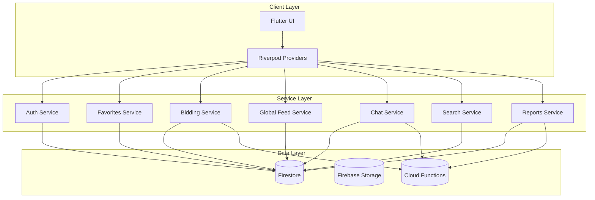

# 🔌 API Design Specification - Journeyman Jobs Phases 3-13

## Overview

This document defines the API contracts, service boundaries, and data flow for all new features in phases 3-13. Each API is designed with scalability, security, and maintainability in mind, following REST principles and Firebase best practices.

## Service Architecture Diagram



## Phase 3: Core Features APIs

### 3.1 Favorites API

#### Service Interface
```dart
abstract class FavoritesServiceInterface {
  /// Get user's favorite job IDs
  Future<List<String>> getUserFavorites(String userId);
  
  /// Toggle favorite status for a job
  Future<void> toggleFavorite(String userId, String jobId);
  
  /// Check if job is favorited by user
  Future<bool> isFavorite(String userId, String jobId);
  
  /// Get favorite jobs with details
  Future<List<JobModel>> getFavoriteJobs(String userId);
  
  /// Stream of user's favorites for real-time updates
  Stream<List<String>> watchUserFavorites(String userId);
}
```

#### Firestore Schema
```typescript
// Collection: /users/{userId}/favorites/{favoriteId}
interface FavoriteDocument {
  jobId: string;           // Reference to job
  createdAt: Timestamp;    // When favorited
  updatedAt: Timestamp;    // Last modified
}

// Firestore Rules
match /users/{userId}/favorites/{favoriteId} {
  allow read, write: if request.auth != null && 
                       request.auth.uid == userId;
}
```

#### API Endpoints
```dart
class FavoritesService implements FavoritesServiceInterface {
  // GET /users/{userId}/favorites
  @override
  Future<List<String>> getUserFavorites(String userId) async {
    final snapshot = await _firestore
        .collection('users')
        .doc(userId)
        .collection('favorites')
        .orderBy('createdAt', descending: true)
        .get();
    
    return snapshot.docs
        .map((doc) => doc.data()['jobId'] as String)
        .toList();
  }
  
  // POST /users/{userId}/favorites/{jobId}
  // DELETE /users/{userId}/favorites/{jobId}
  @override
  Future<void> toggleFavorite(String userId, String jobId) async {
    final docRef = _firestore
        .collection('users')
        .doc(userId)
        .collection('favorites')
        .doc(jobId);
    
    final exists = await docRef.get();
    
    if (exists.exists) {
      await docRef.delete();
    } else {
      await docRef.set({
        'jobId': jobId,
        'createdAt': FieldValue.serverTimestamp(),
        'updatedAt': FieldValue.serverTimestamp(),
      });
    }
  }
}
```

### 3.2 Job Bidding API

#### Service Interface
```dart
abstract class BiddingServiceInterface {
  /// Submit a bid for a job
  Future<String> submitBid(JobBid bid);
  
  /// Get all bids for a job (job owner only)
  Future<List<JobBid>> getJobBids(String jobId);
  
  /// Get user's bids
  Future<List<JobBid>> getUserBids(String userId);
  
  /// Update bid amount
  Future<void> updateBid(String bidId, double newAmount);
  
  /// Withdraw a bid
  Future<void> withdrawBid(String bidId);
  
  /// Accept a bid (job owner only)
  Future<void> acceptBid(String bidId);
  
  /// Stream bids for real-time updates
  Stream<List<JobBid>> watchJobBids(String jobId);
}
```

#### Data Models
```dart
class JobBid {
  final String id;
  final String jobId;
  final String bidderId;
  final String bidderName;
  final double bidAmount;
  final String? message;
  final BidStatus status;
  final DateTime createdAt;
  final DateTime? updatedAt;
  final DateTime? acceptedAt;
  
  const JobBid({
    required this.id,
    required this.jobId,
    required this.bidderId,
    required this.bidderName,
    required this.bidAmount,
    this.message,
    required this.status,
    required this.createdAt,
    this.updatedAt,
    this.acceptedAt,
  });
}

enum BidStatus {
  pending,
  accepted,
  rejected,
  withdrawn,
}
```

#### Firestore Schema
```typescript
// Collection: /jobs/{jobId}/bids/{bidId}
interface BidDocument {
  jobId: string;           // Reference to job
  bidderId: string;        // User who placed bid
  bidderName: string;      // Display name
  bidAmount: number;       // Bid amount in dollars
  message?: string;        // Optional message
  status: 'pending' | 'accepted' | 'rejected' | 'withdrawn';
  createdAt: Timestamp;
  updatedAt: Timestamp;
  acceptedAt?: Timestamp;
}

// Firestore Rules
match /jobs/{jobId}/bids/{bidId} {
  allow read: if isAuthenticated() && 
                (request.auth.uid == resource.data.bidderId ||
                 request.auth.uid == get(/databases/$(database)/documents/jobs/$(jobId)).data.authorId);
  allow create: if isAuthenticated() && 
                  request.auth.uid == request.data.bidderId;
  allow update: if isAuthenticated() && 
                  (request.auth.uid == resource.data.bidderId ||
                   request.auth.uid == get(/databases/$(database)/documents/jobs/$(jobId)).data.authorId);
}
```

### 3.3 Content Reporting API

#### Service Interface
```dart
abstract class ReportsServiceInterface {
  /// Submit a content report
  Future<String> submitReport(ContentReport report);
  
  /// Get reports for moderation (admin only)
  Future<List<ContentReport>> getReports({
    ReportStatus? status,
    int limit = 50,
  });
  
  /// Update report status (moderator only)
  Future<void> updateReportStatus(String reportId, ReportStatus status);
  
  /// Get user's submitted reports
  Future<List<ContentReport>> getUserReports(String userId);
}
```

#### Data Models
```dart
class ContentReport {
  final String id;
  final String reporterId;
  final String contentId;
  final ContentType contentType;
  final ReportReason reason;
  final String? description;
  final ReportStatus status;
  final DateTime createdAt;
  final DateTime? resolvedAt;
  final String? moderatorId;
  
  const ContentReport({
    required this.id,
    required this.reporterId,
    required this.contentId,
    required this.contentType,
    required this.reason,
    this.description,
    required this.status,
    required this.createdAt,
    this.resolvedAt,
    this.moderatorId,
  });
}

enum ContentType { post, comment, job, user }
enum ReportReason { spam, inappropriate, harassment, fake, other }
enum ReportStatus { pending, reviewing, resolved, dismissed }
```

### 3.4 Like/Unlike System API

#### Service Interface
```dart
abstract class LikesServiceInterface {
  /// Toggle like on content
  Future<void> toggleLike(String contentId, ContentType type);
  
  /// Get like count for content
  Future<int> getLikeCount(String contentId, ContentType type);
  
  /// Check if user liked content
  Future<bool> hasUserLiked(String contentId, ContentType type);
  
  /// Get users who liked content
  Future<List<String>> getLikers(String contentId, ContentType type);
  
  /// Stream like count for real-time updates
  Stream<int> watchLikeCount(String contentId, ContentType type);
}
```

## Phase 8: Global Feed API

### Feed Service Interface
```dart
abstract class FeedServiceInterface {
  /// Get global feed posts
  Future<List<FeedPost>> getGlobalFeed({
    int limit = 50,
    DocumentSnapshot? startAfter,
  });
  
  /// Create a new post
  Future<String> createPost(FeedPost post);
  
  /// Update a post
  Future<void> updatePost(String postId, FeedPost post);
  
  /// Delete a post
  Future<void> deletePost(String postId);
  
  /// Get posts by user
  Future<List<FeedPost>> getUserPosts(String userId);
  
  /// Search posts
  Future<List<FeedPost>> searchPosts(String query);
  
  /// Stream global feed for real-time updates
  Stream<List<FeedPost>> watchGlobalFeed({int limit = 50});
}
```

### Data Models
```dart
class FeedPost {
  final String id;
  final String authorId;
  final String authorName;
  final String? authorAvatar;
  final String content;
  final List<String> imageUrls;
  final String? jobId;
  final String? crewId;
  final bool isPublic;
  final int likeCount;
  final int commentCount;
  final List<String> tags;
  final DateTime createdAt;
  final DateTime? updatedAt;
  
  const FeedPost({
    required this.id,
    required this.authorId,
    required this.authorName,
    this.authorAvatar,
    required this.content,
    required this.imageUrls,
    this.jobId,
    this.crewId,
    required this.isPublic,
    required this.likeCount,
    required this.commentCount,
    required this.tags,
    required this.createdAt,
    this.updatedAt,
  });
}
```

### Firestore Schema
```typescript
// Collection: /globalFeed/{postId}
interface FeedPostDocument {
  authorId: string;
  authorName: string;
  authorAvatar?: string;
  content: string;
  imageUrls: string[];
  jobId?: string;          // Optional job reference
  crewId?: string;         // Optional crew reference
  isPublic: boolean;
  likeCount: number;
  commentCount: number;
  tags: string[];
  createdAt: Timestamp;
  updatedAt: Timestamp;
}

// Security Rules
match /globalFeed/{postId} {
  allow read: if isAuthenticated() && resource.data.isPublic == true;
  allow create: if isAuthenticated() && 
                  request.auth.uid == request.data.authorId;
  allow update, delete: if isAuthenticated() && 
                          request.auth.uid == resource.data.authorId;
}
```

## Phase 9-10: Chat & Messaging APIs

### Chat Service Interface
```dart
abstract class ChatServiceInterface {
  /// Send a message
  Future<String> sendMessage(Message message);
  
  /// Get conversation messages
  Future<List<Message>> getMessages(
    String conversationId, {
    int limit = 50,
    DocumentSnapshot? startAfter,
  });
  
  /// Create or get conversation
  Future<String> getOrCreateConversation(List<String> participantIds);
  
  /// Update message status
  Future<void> updateMessageStatus(String messageId, MessageStatus status);
  
  /// Delete message
  Future<void> deleteMessage(String messageId);
  
  /// Stream messages for real-time chat
  Stream<List<Message>> watchMessages(String conversationId);
  
  /// Stream conversations for user
  Stream<List<Conversation>> watchUserConversations(String userId);
}
```

### Data Models
```dart
class Message {
  final String id;
  final String conversationId;
  final String senderId;
  final String senderName;
  final String content;
  final MessageType type;
  final MessageStatus status;
  final DateTime sentAt;
  final DateTime? editedAt;
  final DateTime? deletedAt;
  final Map<String, DateTime> readReceipts;
  
  const Message({
    required this.id,
    required this.conversationId,
    required this.senderId,
    required this.senderName,
    required this.content,
    required this.type,
    required this.status,
    required this.sentAt,
    this.editedAt,
    this.deletedAt,
    required this.readReceipts,
  });
}

class Conversation {
  final String id;
  final List<String> participantIds;
  final Map<String, String> participantNames;
  final String? lastMessageId;
  final String? lastMessageContent;
  final DateTime? lastMessageAt;
  final Map<String, int> unreadCounts;
  final DateTime createdAt;
  final DateTime updatedAt;
  
  const Conversation({
    required this.id,
    required this.participantIds,
    required this.participantNames,
    this.lastMessageId,
    this.lastMessageContent,
    this.lastMessageAt,
    required this.unreadCounts,
    required this.createdAt,
    required this.updatedAt,
  });
}

enum MessageType { text, image, file, system }
enum MessageStatus { sending, sent, delivered, read, failed }
```

## Phase 11: Enhanced Search API

### Search Service Interface
```dart
abstract class SearchServiceInterface {
  /// Search across multiple collections
  Future<SearchResults> search(SearchQuery query);
  
  /// Search jobs with filters
  Future<List<JobModel>> searchJobs(JobSearchQuery query);
  
  /// Search union locals
  Future<List<LocalRecord>> searchLocals(LocalSearchQuery query);
  
  /// Search users/crews
  Future<List<SearchResult>> searchUsers(String query);
  
  /// Get search suggestions
  Future<List<String>> getSearchSuggestions(String query);
  
  /// Track search analytics
  Future<void> trackSearch(String query, int resultCount);
}
```

### Data Models
```dart
class SearchQuery {
  final String query;
  final List<SearchType> types;
  final Map<String, dynamic> filters;
  final int limit;
  final int offset;
  
  const SearchQuery({
    required this.query,
    required this.types,
    required this.filters,
    this.limit = 20,
    this.offset = 0,
  });
}

class SearchResults {
  final List<SearchResult> jobs;
  final List<SearchResult> locals;
  final List<SearchResult> users;
  final List<SearchResult> crews;
  final int totalCount;
  final Duration searchTime;
  
  const SearchResults({
    required this.jobs,
    required this.locals,
    required this.users,
    required this.crews,
    required this.totalCount,
    required this.searchTime,
  });
}

enum SearchType { jobs, locals, users, crews, all }
```

## Performance Optimizations

### Caching Strategy
```dart
class ApiCacheManager {
  static const Duration DEFAULT_CACHE_DURATION = Duration(minutes: 5);
  static const Duration LOCALS_CACHE_DURATION = Duration(hours: 24);
  static const Duration USER_CACHE_DURATION = Duration(minutes: 30);
  
  /// Cache configuration by API endpoint
  static const Map<String, Duration> CACHE_DURATIONS = {
    'favorites': Duration(minutes: 10),
    'locals': Duration(hours: 24),
    'feed': Duration(minutes: 5),
    'search': Duration(minutes: 15),
    'user_profile': Duration(minutes: 30),
  };
  
  static Future<T?> getCached<T>(String key) async {
    // Implementation using shared_preferences or hive
  }
  
  static Future<void> cache<T>(String key, T data, Duration? duration) async {
    // Implementation with expiration
  }
}
```

### Batch Operations
```dart
class BatchOperationManager {
  /// Execute multiple operations in a single batch
  static Future<void> executeBatch(List<BatchOperation> operations) async {
    final batch = FirebaseFirestore.instance.batch();
    
    for (final operation in operations) {
      switch (operation.type) {
        case BatchOperationType.create:
          batch.set(operation.reference, operation.data);
          break;
        case BatchOperationType.update:
          batch.update(operation.reference, operation.data);
          break;
        case BatchOperationType.delete:
          batch.delete(operation.reference);
          break;
      }
    }
    
    await batch.commit();
  }
}

class BatchOperation {
  final BatchOperationType type;
  final DocumentReference reference;
  final Map<String, dynamic> data;
  
  const BatchOperation({
    required this.type,
    required this.reference,
    required this.data,
  });
}

enum BatchOperationType { create, update, delete }
```

## Error Handling & Resilience

### API Error Response Format
```dart
class ApiResponse<T> {
  final bool success;
  final T? data;
  final ApiError? error;
  final Map<String, dynamic>? metadata;
  
  const ApiResponse({
    required this.success,
    this.data,
    this.error,
    this.metadata,
  });
  
  factory ApiResponse.success(T data, {Map<String, dynamic>? metadata}) {
    return ApiResponse(
      success: true,
      data: data,
      metadata: metadata,
    );
  }
  
  factory ApiResponse.error(ApiError error) {
    return ApiResponse(
      success: false,
      error: error,
    );
  }
}

class ApiError {
  final String code;
  final String message;
  final Map<String, dynamic>? details;
  final DateTime timestamp;
  
  const ApiError({
    required this.code,
    required this.message,
    this.details,
    required this.timestamp,
  });
}
```

### Retry Logic
```dart
class RetryPolicy {
  final int maxAttempts;
  final Duration initialDelay;
  final double backoffMultiplier;
  final Duration maxDelay;
  
  const RetryPolicy({
    this.maxAttempts = 3,
    this.initialDelay = Duration(seconds: 1),
    this.backoffMultiplier = 2.0,
    this.maxDelay = Duration(seconds: 30),
  });
  
  static Future<T> executeWithRetry<T>(
    Future<T> Function() operation,
    RetryPolicy policy,
  ) async {
    int attempt = 0;
    Duration delay = policy.initialDelay;
    
    while (attempt < policy.maxAttempts) {
      try {
        return await operation();
      } catch (e) {
        attempt++;
        
        if (attempt >= policy.maxAttempts || !_shouldRetry(e)) {
          rethrow;
        }
        
        await Future.delayed(delay);
        delay = Duration(
          milliseconds: (delay.inMilliseconds * policy.backoffMultiplier).round(),
        );
        
        if (delay > policy.maxDelay) {
          delay = policy.maxDelay;
        }
      }
    }
    
    throw Exception('Max retry attempts exceeded');
  }
  
  static bool _shouldRetry(dynamic error) {
    // Determine if error is retryable (network, timeout, etc.)
    return error is SocketException ||
           error is TimeoutException ||
           (error is FirebaseException && error.code == 'unavailable');
  }
}
```

## API Security

### Authentication & Authorization
```dart
class ApiSecurityManager {
  /// Validate API request permissions
  static Future<bool> validatePermission(
    String userId,
    ApiPermission permission,
    {Map<String, dynamic>? context},
  ) async {
    final userRoles = await getUserRoles(userId);
    
    for (final role in userRoles) {
      if (ROLE_PERMISSIONS[role]?.contains(permission) == true) {
        // Additional context-based validation
        if (context != null && !await validateContext(role, permission, context)) {
          continue;
        }
        return true;
      }
    }
    
    return false;
  }
  
  /// Rate limiting implementation
  static Future<bool> checkRateLimit(String userId, String endpoint) async {
    final key = '${userId}_$endpoint';
    final requests = await getRequestCount(key);
    final limit = RATE_LIMITS[endpoint] ?? DEFAULT_RATE_LIMIT;
    
    if (requests >= limit) {
      return false;
    }
    
    await incrementRequestCount(key);
    return true;
  }
}

enum ApiPermission {
  readJobs,
  writeJobs,
  readCrews,
  writeCrews,
  moderateContent,
  adminAccess,
}

const Map<String, int> RATE_LIMITS = {
  'search': 100,        // 100 requests per minute
  'favorites': 50,      // 50 requests per minute
  'messaging': 200,     // 200 requests per minute
  'feed': 100,          // 100 requests per minute
};
```

## Testing Strategy

### API Testing Framework
```dart
class ApiTestSuite {
  /// Test all CRUD operations for an endpoint
  static Future<void> testCrudOperations<T>(
    Repository<T> repository,
    T testModel,
    T updatedModel,
  ) async {
    // Create
    final id = await repository.create(testModel);
    expect(id, isNotEmpty);
    
    // Read
    final retrieved = await repository.getById(id);
    expect(retrieved, isNotNull);
    
    // Update
    await repository.update(id, updatedModel);
    final updated = await repository.getById(id);
    expect(updated, equals(updatedModel));
    
    // Delete
    await repository.delete(id);
    final deleted = await repository.getById(id);
    expect(deleted, isNull);
  }
  
  /// Test pagination functionality
  static Future<void> testPagination<T>(
    PaginatedRepository<T> repository,
    List<T> testData,
  ) async {
    // Create test data
    for (final item in testData) {
      await repository.create(item);
    }
    
    // Test first page
    final page1 = await repository.getPaginated(
      config: PaginationConfig(pageSize: 5),
    );
    expect(page1.items.length, equals(5));
    expect(page1.hasMore, isTrue);
    
    // Test second page
    final page2 = await repository.getPaginated(
      config: PaginationConfig(pageSize: 5),
      startAfter: page1.lastDocument,
    );
    expect(page2.items.length, greaterThan(0));
  }
}
```

This API specification provides a comprehensive foundation for implementing all features in phases 3-13 while maintaining consistency, scalability, and security across the entire system.