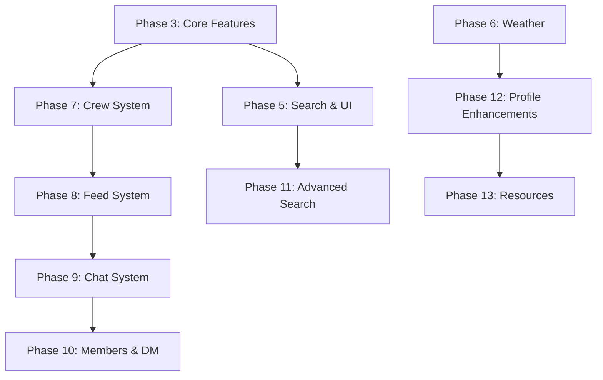

# 🏗️ Architectural Oversight Guide - Journeyman Jobs Phases 3-13

## Executive Summary

This document provides comprehensive architectural oversight for the remaining massive implementation phases (3-13) of the Journeyman Jobs project. As the backend system architect, this guide ensures proper system design, scalability, and integration across all new features while maintaining architectural consistency.

## Current Architecture Analysis

### ✅ Strong Foundation (Phase 1-2 Complete)
- **Riverpod 3.0+ State Management**: Properly configured with providers
- **Firebase Integration**: Authentication, Firestore, Storage properly initialized 
- **Go Router Navigation**: Type-safe routing with proper authentication guards
- **Design System**: Comprehensive electrical-themed components with copper/navy palette
- **Utility Classes**: Advanced performance engines already implemented (FilterPerformanceEngine, BoundedJobList, VirtualJobListState)

### 🔍 Critical Architecture Areas for Phases 3-13

## 1. Database Design Architecture

### Current Firestore Schema Review
**Status: ✅ SOLID FOUNDATION**

```typescript
// Existing Collections (Well-Architected)
/users/{userId}              // User profiles - proper security rules
/crews/{crewId}              // Crew management - RBAC implemented
/crews/{crewId}/members/     // Crew membership - role-based access
/jobs/{jobId}                // Job postings - authenticated access
/locals/{localId}            // IBEW locals (797+) - read-only for auth users
/conversations/{convId}      // Direct messaging - participant-based access
/conversations/{convId}/messages/ // Chat messages - participant validation
```

### Required Schema Extensions for Phases 3-13

```typescript
// Phase 3-6: Feature Extensions
/users/{userId}/favorites/   // Job favorites (Phase 3.1)
/jobs/{jobId}/bids/         // Job bidding system (Phase 3.2)
/reports/{reportId}         // Content reporting (Phase 3.3)
/comments/{commentId}/likes/ // Like/unlike system (Phase 3.4)

// Phase 7-10: Social Features  
/crews/{crewId}/feedPosts/   // ✅ Already defined in security rules
/crews/{crewId}/feedPosts/{postId}/comments/ // Comments on posts
/globalFeed/{postId}        // Global feed for all users (Phase 8)
/directMessages/{dmId}      // Direct messaging system (Phase 10)

// Phase 11-13: Search & Resources
/searchAnalytics/{queryId}  // Search performance tracking
/resources/{resourceId}     // Resource management system
/userSettings/{userId}      // Enhanced user preferences
```

### 🎯 Database Architecture Recommendations

#### 1. Compound Indexes Strategy
```json
// Critical indexes for performance (add to firestore.indexes.json)
{
  "collectionGroup": "favorites",
  "fields": [
    {"fieldPath": "userId", "order": "ASCENDING"},
    {"fieldPath": "createdAt", "order": "DESCENDING"}
  ]
},
{
  "collectionGroup": "bids", 
  "fields": [
    {"fieldPath": "jobId", "order": "ASCENDING"},
    {"fieldPath": "bidAmount", "order": "DESCENDING"}
  ]
},
{
  "collectionGroup": "globalFeed",
  "fields": [
    {"fieldPath": "isPublic", "order": "ASCENDING"},
    {"fieldPath": "createdAt", "order": "DESCENDING"}
  ]
}
```

#### 2. Data Partitioning Strategy
```dart
// Locals Collection Optimization (797+ records)
class LocalsPartitionStrategy {
  // Partition by state for better query performance
  static String getPartitionKey(String state) => 'locals_$state';
  
  // Use state-based subcollections for large datasets
  // /localsByState/{state}/locals/{localId}
  
  // Implement client-side caching for frequently accessed locals
  static const Duration CACHE_DURATION = Duration(hours: 24);
}
```

## 2. State Management Architecture

### Current Riverpod Implementation Review
**Status: ✅ EXCELLENT FOUNDATION**

The existing Riverpod providers show proper architecture:
- `JobsRiverpodProvider` - Well-structured with utility classes
- `LocalsRiverpodProvider` - Handles large dataset efficiently  
- `CrewsRiverpodProvider` - Role-based state management
- `MessagingRiverpodProvider` - Real-time chat state

### Required Provider Architecture for Phases 3-13

```dart
// Phase 3-6: Feature Providers
@riverpod
class FavoritesNotifier extends _$FavoritesNotifier {
  @override
  Future<List<String>> build() async {
    // Implement efficient favorites caching
    return await _favoritesService.getUserFavorites();
  }
  
  Future<void> toggleFavorite(String jobId) async {
    // Optimistic updates with rollback on failure
    state = AsyncValue.data([...state.value!, jobId]);
    try {
      await _favoritesService.toggleFavorite(jobId);
    } catch (e) {
      // Rollback optimistic update
      state = AsyncValue.data(
        state.value!.where((id) => id != jobId).toList()
      );
      rethrow;
    }
  }
}

// Phase 8-10: Social Features Providers  
@riverpod
class GlobalFeedNotifier extends _$GlobalFeedNotifier {
  static const int POSTS_PER_PAGE = 50;
  
  @override
  Future<List<FeedPost>> build() async {
    // Implement infinite scroll with pagination
    return await _feedService.getRecentPosts(limit: POSTS_PER_PAGE);
  }
  
  Future<void> loadMorePosts() async {
    // Pagination logic with performance monitoring
    final currentPosts = state.value ?? [];
    final newPosts = await _feedService.getPostsAfter(
      lastPostId: currentPosts.last.id,
      limit: POSTS_PER_PAGE,
    );
    state = AsyncValue.data([...currentPosts, ...newPosts]);
  }
}
```

### 🎯 State Management Architectural Principles

#### 1. Performance Optimization
- **Lazy Loading**: Only load data when screens are visited
- **Efficient Caching**: Use `@Riverpod(keepAlive: true)` for frequently accessed data
- **Memory Management**: Implement automatic cleanup for large lists
- **Real-time Updates**: Use Firebase streams with proper error handling

#### 2. Error Handling Strategy
```dart
// Consistent error handling across all providers
class ProviderErrorHandler {
  static AsyncValue<T> handleError<T>(Object error, StackTrace stack) {
    StructuredLogging.error(
      'Provider Error',
      error: error,
      stackTrace: stack,
      context: {'feature': 'state_management'},
    );
    
    if (error is FirebaseException) {
      return AsyncValue.error(
        AppException.fromFirebaseException(error),
        stack,
      );
    }
    
    return AsyncValue.error(AppException.unknown(error), stack);
  }
}
```

## 3. Service Layer Architecture

### Current Service Analysis
**Status: ✅ WELL-DESIGNED**

Existing services show proper separation of concerns:
- `AuthService` - Firebase Auth integration
- `CrewService` - Complex RBAC with proper error handling
- `NotificationService` - Comprehensive notification management

### Required Service Architecture for Phases 3-13

```dart
// Base service interface for consistency
abstract class BaseService {
  final FirebaseFirestore _firestore;
  final OfflineDataService _offlineService;
  final ConnectivityService _connectivityService;
  
  BaseService({
    required FirebaseFirestore firestore,
    required OfflineDataService offlineService, 
    required ConnectivityService connectivityService,
  }) : _firestore = firestore,
       _offlineService = offlineService,
       _connectivityService = connectivityService;
  
  // Consistent error handling across all services
  Future<T> executeWithErrorHandling<T>(
    Future<T> Function() operation,
    String operationName,
  ) async {
    try {
      return await operation();
    } catch (e, stack) {
      StructuredLogging.error(
        'Service Operation Failed',
        error: e,
        stackTrace: stack,
        context: {
          'service': runtimeType.toString(),
          'operation': operationName,
        },
      );
      rethrow;
    }
  }
}

// Phase 3: Features Service Layer
class FavoritesService extends BaseService {
  Future<List<String>> getUserFavorites(String userId) async {
    return executeWithErrorHandling(() async {
      final snapshot = await _firestore
          .collection('users')
          .doc(userId)
          .collection('favorites')
          .orderBy('createdAt', descending: true)
          .get();
      
      return snapshot.docs.map((doc) => doc.data()['jobId'] as String).toList();
    }, 'getUserFavorites');
  }
  
  Future<void> toggleFavorite(String userId, String jobId) async {
    return executeWithErrorHandling(() async {
      final favRef = _firestore
          .collection('users')
          .doc(userId)
          .collection('favorites')
          .doc(jobId);
      
      final exists = await favRef.get();
      if (exists.exists) {
        await favRef.delete();
      } else {
        await favRef.set({
          'jobId': jobId,
          'createdAt': FieldValue.serverTimestamp(),
        });
      }
    }, 'toggleFavorite');
  }
}

// Phase 8: Global Feed Service
class GlobalFeedService extends BaseService {
  static const int MAX_POSTS_PER_LOAD = 50;
  
  Stream<List<FeedPost>> getGlobalFeedStream() {
    return _firestore
        .collection('globalFeed')
        .where('isPublic', isEqualTo: true)
        .orderBy('createdAt', descending: true)
        .limit(MAX_POSTS_PER_LOAD)
        .snapshots()
        .map((snapshot) => snapshot.docs
            .map((doc) => FeedPost.fromFirestore(doc))
            .toList());
  }
  
  Future<void> createPost(FeedPost post) async {
    return executeWithErrorHandling(() async {
      // Validate post content
      if (!ValidationUtils.isValidPostContent(post.content)) {
        throw AppException.validation('Invalid post content');
      }
      
      // Add to global feed and user's crew feed
      final batch = _firestore.batch();
      
      batch.set(
        _firestore.collection('globalFeed').doc(),
        post.toFirestore(),
      );
      
      if (post.crewId != null) {
        batch.set(
          _firestore
              .collection('crews')
              .doc(post.crewId)
              .collection('feedPosts')
              .doc(),
          post.toFirestore(),
        );
      }
      
      await batch.commit();
    }, 'createPost');
  }
}
```

### 🎯 Service Layer Architectural Principles

#### 1. Single Responsibility Principle
- Each service handles one domain (auth, crews, jobs, feed, etc.)
- Services should not depend on UI components
- Business logic stays in services, not in providers or widgets

#### 2. Dependency Injection
```dart
// Proper DI setup for testability
final serviceContainer = ProviderContainer(
  overrides: [
    // Production services
    favoritesServiceProvider.overrideWithValue(
      FavoritesService(
        firestore: FirebaseFirestore.instance,
        offlineService: ref.read(offlineDataServiceProvider),
        connectivityService: ref.read(connectivityServiceProvider),
      ),
    ),
    
    // Test overrides
    if (kDebugMode) ...[
      favoritesServiceProvider.overrideWithValue(MockFavoritesService()),
    ],
  ],
);
```

## 4. Security Architecture Integration

### Current Security Review
**Status: ✅ ROBUST SECURITY FOUNDATION**

The existing Firestore security rules show excellent RBAC implementation:
- Role-based crew access (foreman/lead/member)
- Proper participant validation for messaging
- Authenticated access for all sensitive collections

### Security Extensions for Phases 3-13

```javascript
// Additional security rules for new features
rules_version = '2';
service cloud.firestore {
  match /databases/{database}/documents {
    
    // Favorites: Users can only access their own
    match /users/{userId}/favorites/{favoriteId} {
      allow read, write: if request.auth != null && 
                           request.auth.uid == userId;
    }
    
    // Global Feed: Public read, authenticated write
    match /globalFeed/{postId} {
      allow read: if isAuthenticated();
      allow create: if isAuthenticated() && 
                      request.auth.uid == request.data.authorId;
      allow update, delete: if isAuthenticated() && 
                              request.auth.uid == resource.data.authorId;
    }
    
    // Job Bids: Bidder can read/write own bids
    match /jobs/{jobId}/bids/{bidId} {
      allow read: if isAuthenticated() && 
                    (request.auth.uid == resource.data.bidderId ||
                     request.auth.uid == get(/databases/$(database)/documents/jobs/$(jobId)).data.authorId);
      allow create: if isAuthenticated() && 
                      request.auth.uid == request.data.bidderId;
      allow update: if isAuthenticated() && 
                      request.auth.uid == resource.data.bidderId;
    }
    
    // Content Reports: Authenticated users can report
    match /reports/{reportId} {
      allow create: if isAuthenticated() && 
                      request.auth.uid == request.data.reporterId;
      allow read: if isAuthenticated() && 
                    (request.auth.uid == resource.data.reporterId ||
                     hasAdminRole(request.auth.uid));
    }
  }
}
```

## 5. Performance & Scalability Architecture

### Current Performance Analysis
**Status: ✅ OPTIMIZATION-READY**

Existing performance infrastructure:
- `FilterPerformanceEngine` - Advanced filtering optimization
- `BoundedJobList` - Memory-efficient job management 
- `VirtualJobListState` - Virtual scrolling for large lists
- Firebase offline persistence with 100MB cache limit

### Scalability Strategy for 797+ Locals

#### 1. Data Virtualization
```dart
class LocalsVirtualizationStrategy {
  static const int VIEWPORT_SIZE = 50;
  static const int PRELOAD_BUFFER = 10;
  
  // Implement virtual scrolling for locals list
  static Widget buildVirtualizedLocalsList({
    required List<LocalRecord> allLocals,
    required ScrollController scrollController,
  }) {
    return ListView.builder(
      controller: scrollController,
      itemCount: allLocals.length,
      itemBuilder: (context, index) {
        // Only build visible items + buffer
        if (index >= scrollController.offset / ITEM_HEIGHT - PRELOAD_BUFFER &&
            index <= scrollController.offset / ITEM_HEIGHT + VIEWPORT_SIZE + PRELOAD_BUFFER) {
          return LocalCard(local: allLocals[index]);
        }
        return SizedBox(height: ITEM_HEIGHT);
      },
    );
  }
}
```

#### 2. Query Optimization Strategy
```dart
class QueryOptimizationService {
  // Use compound indexes for complex queries
  static Query<Map<String, dynamic>> optimizedJobQuery({
    String? classification,
    String? local,
    String? constructionType,
  }) {
    Query<Map<String, dynamic>> query = FirebaseFirestore.instance
        .collection('jobs');
    
    // Use efficient query patterns
    if (local != null) {
      query = query.where('local', isEqualTo: local);
    }
    
    if (classification != null) {
      query = query.where('classification', isEqualTo: classification);
    }
    
    if (constructionType != null) {
      query = query.where('constructionType', isEqualTo: constructionType);
    }
    
    // Always order by timestamp for consistent pagination
    return query.orderBy('timestamp', descending: true);
  }
  
  // Implement cursor-based pagination for better performance
  static Future<List<JobModel>> getPaginatedJobs({
    DocumentSnapshot? lastDoc,
    int limit = 20,
    Map<String, dynamic>? filters,
  }) async {
    Query query = FirebaseFirestore.instance
        .collection('jobs')
        .orderBy('timestamp', descending: true)
        .limit(limit);
    
    if (lastDoc != null) {
      query = query.startAfterDocument(lastDoc);
    }
    
    final snapshot = await query.get();
    return snapshot.docs
        .map((doc) => JobModel.fromFirestore(doc))
        .toList();
  }
}
```

## 6. Cross-Feature Integration Architecture

### Phase Integration Dependencies



### Integration Points & APIs

```dart
// Cross-feature service integration
class FeatureIntegrationService {
  // Favorites → Jobs integration
  static Future<List<JobModel>> getFavoriteJobs(String userId) async {
    final favoriteIds = await FavoritesService.getUserFavorites(userId);
    return await JobService.getJobsByIds(favoriteIds);
  }
  
  // Crew → Feed integration
  static Future<void> shareJobToCrew(String jobId, String crewId) async {
    final job = await JobService.getJobById(jobId);
    final feedPost = FeedPost.fromJob(job, crewId: crewId);
    await GlobalFeedService.createPost(feedPost);
  }
  
  // Chat → Notifications integration
  static Future<void> sendMessageWithNotification({
    required String conversationId,
    required Message message,
  }) async {
    await MessageService.sendMessage(conversationId, message);
    await NotificationService.sendMessageNotification(
      recipientId: message.recipientId,
      senderName: message.senderName,
      preview: message.content,
    );
  }
}
```

## 7. Quality Gates & Validation Framework

### Architectural Quality Checklist

#### 1. Database Design Validation
- [ ] All new collections have proper security rules
- [ ] Compound indexes created for complex queries
- [ ] Data models follow consistent naming conventions
- [ ] Pagination implemented for large datasets
- [ ] Offline support considered for critical features

#### 2. State Management Validation  
- [ ] All providers follow Riverpod 3.0+ patterns
- [ ] Error handling is consistent across providers
- [ ] Memory leaks prevented with proper disposal
- [ ] Loading states handled gracefully
- [ ] Optimistic updates with rollback capability

#### 3. Service Layer Validation
- [ ] Single responsibility principle followed
- [ ] Dependency injection properly implemented
- [ ] Error handling standardized
- [ ] Logging integrated for debugging
- [ ] Unit tests cover critical business logic

#### 4. Performance Validation
- [ ] Large lists use virtualization
- [ ] Images use caching strategies
- [ ] Database queries are optimized
- [ ] Memory usage stays within limits
- [ ] Frame drops minimized during animations

#### 5. Security Validation
- [ ] All API endpoints are authenticated
- [ ] User permissions validated on server-side
- [ ] Sensitive data is not logged
- [ ] HTTPS enforced for all requests
- [ ] Input validation prevents injection attacks

## 8. Implementation Roadmap & Coordination

### Phase 3-6: Foundation Features (Week 2)
**Dependencies: None - Can start immediately**

1. **Phase 3.1-3.4**: Core features (favorites, bidding, reporting, likes)
   - **Database**: Simple collections with proper indexing
   - **State**: Basic CRUD providers with caching
   - **Security**: User-scoped access rules

2. **Phase 4**: Testing & Quality establishment
   - **Integration**: End-to-end testing for new features
   - **Performance**: Baseline metrics establishment
   - **Monitoring**: Error tracking implementation

3. **Phase 5-6**: UI enhancements and weather
   - **Search**: Optimized query architecture
   - **Weather**: External API integration
   - **Caching**: Strategic caching for performance

### Phase 7-10: Social Architecture (Week 3-4)
**Dependencies: Phase 3-6 complete**

1. **Phase 7**: Crew system overhaul
   - **Complex State**: Multi-role permissions
   - **Real-time**: Live crew updates
   - **Performance**: Efficient member management

2. **Phase 8-10**: Feed, chat, and messaging
   - **Scalability**: Global feed with pagination
   - **Real-time**: Live chat with message status
   - **Integration**: Cross-feature communication

### Phase 11-13: Advanced Features (Week 4)
**Dependencies: Social features functional**

1. **Phase 11**: Advanced search and settings
   - **Performance**: Complex query optimization
   - **UX**: Search analytics and improvements

2. **Phase 12-13**: Profile and resources
   - **Integration**: Cross-feature data display
   - **Finalization**: Polish and optimization

## 9. Monitoring & Observability

### Performance Monitoring Strategy
```dart
class ArchitecturalMonitoring {
  // Monitor database performance
  static void trackQueryPerformance(String queryName, Duration duration) {
    FirebaseAnalytics.instance.logEvent(
      name: 'query_performance',
      parameters: {
        'query_name': queryName,
        'duration_ms': duration.inMilliseconds,
      },
    );
  }
  
  // Monitor state management performance  
  static void trackProviderPerformance(String providerName, Duration buildTime) {
    if (buildTime.inMilliseconds > 100) {
      StructuredLogging.warning(
        'Slow provider build',
        context: {
          'provider': providerName,
          'build_time_ms': buildTime.inMilliseconds,
        },
      );
    }
  }
  
  // Monitor feature adoption
  static void trackFeatureUsage(String featureName, Map<String, dynamic> context) {
    FirebaseAnalytics.instance.logEvent(
      name: 'feature_usage',
      parameters: {
        'feature': featureName,
        ...context,
      },
    );
  }
}
```

## 10. Risk Mitigation Strategy

### High-Risk Areas & Mitigation

#### 1. Database Performance with 797+ Locals
**Risk**: Query timeouts and poor user experience
**Mitigation**: 
- Implement state-based partitioning
- Use efficient compound indexes  
- Virtual scrolling for large lists
- Client-side caching strategy

#### 2. Real-time Features Scalability
**Risk**: Firebase costs and connection limits
**Mitigation**:
- Implement connection pooling
- Use batch operations where possible
- Monitor and optimize listener counts
- Implement graceful degradation

#### 3. Complex State Dependencies
**Risk**: State inconsistencies and race conditions
**Mitigation**:
- Use dependency injection properly
- Implement optimistic updates with rollback
- Add comprehensive error boundaries
- Use atomic operations for critical updates

#### 4. Cross-Feature Integration Complexity
**Risk**: Tight coupling and maintenance issues
**Mitigation**:
- Define clear service boundaries
- Use event-driven communication patterns
- Implement proper error propagation
- Maintain comprehensive integration tests

## Implementation Guidelines

### Daily Architecture Reviews
1. **Database Changes**: Review all new collections and security rules
2. **Provider Updates**: Validate state management patterns
3. **Service Integration**: Check cross-feature communication
4. **Performance**: Monitor query performance and memory usage

### Weekly Architecture Checkpoints
1. **Scalability Review**: Assess performance with increased load
2. **Security Audit**: Validate all new access patterns
3. **Integration Testing**: End-to-end feature validation
4. **Documentation Updates**: Keep architectural decisions recorded

### Critical Success Metrics
- **Database Query Performance**: <200ms for 95% of queries
- **State Management**: <100ms provider build times
- **Memory Usage**: <512MB peak on mobile devices
- **Error Rates**: <0.1% for critical operations
- **User Experience**: <3s screen load times

---

## Conclusion

This architectural oversight guide provides the foundation for successfully implementing phases 3-13 while maintaining system integrity, performance, and scalability. The key is to enforce these architectural principles consistently across all implementations while adapting to specific feature requirements.

**Next Steps:**
1. Begin Phase 3 implementation with database schema extensions
2. Implement monitoring and quality gates
3. Coordinate cross-team feature integration
4. Maintain regular architecture reviews

The architecture is designed to scale efficiently with the IBEW's 797+ locals while providing a seamless user experience for electrical workers across all classifications and construction types.