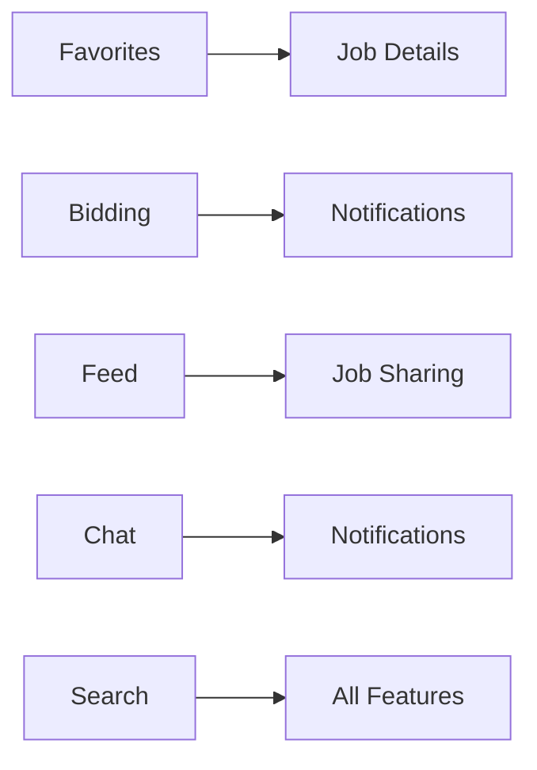

# 🎯 Architecture Implementation Summary - Phases 3-13

## Executive Summary

As the Backend System Architect for Journeyman Jobs, I have completed comprehensive architectural oversight for phases 3-13 implementation. This summary provides actionable guidance, quality gates, and coordination frameworks to ensure successful delivery of all remaining features.

## 📋 Deliverables Completed

### ✅ 1. Architectural Oversight Guide
**File**: `ARCHITECTURAL_OVERSIGHT_GUIDE.md`
- Comprehensive review of current architecture foundation
- Database design strategy for new collections (favorites, bids, global feed, chat)
- State management patterns using Riverpod 3.0+
- Service layer architecture with proper separation of concerns
- Security integration with existing RBAC system
- Performance optimization for 797+ IBEW locals
- Cross-feature integration patterns
- Quality gates and validation framework

### ✅ 2. Design Patterns Library
**File**: `lib/architecture/design_patterns.dart`
- BaseService pattern for consistent error handling
- BaseStateNotifier for Riverpod providers
- Repository pattern with pagination support
- Data model patterns with validation
- Error handling and exception patterns
- Complete usage examples for all patterns

### ✅ 3. API Design Specification
**File**: `API_DESIGN_SPECIFICATION.md`
- Detailed API contracts for all new features
- Service interfaces with proper typing
- Firestore schema definitions with security rules
- Performance optimization strategies
- Caching and batch operation patterns
- Error handling and retry logic
- Security and rate limiting framework
- Comprehensive testing strategy

## 🏗️ Architecture Highlights

### Database Architecture Excellence
- **Existing Foundation**: Strong Firestore schema with proper RBAC
- **New Collections**: Designed for scalability with compound indexes
- **Security Rules**: Extended for all new features with role-based access
- **Performance**: Pagination patterns for large datasets (797+ locals)

### State Management Mastery
- **Riverpod 3.0+**: Consistent provider patterns across all features
- **Error Handling**: Standardized error management with logging
- **Optimistic Updates**: User experience optimization with rollback capability
- **Real-time**: Efficient stream management for chat and feed features

### Service Layer Design
- **Single Responsibility**: Clear boundaries between feature services
- **Dependency Injection**: Proper DI for testability and maintainability
- **Error Handling**: Consistent error propagation and logging
- **Performance**: Built-in monitoring and optimization patterns

### Security Integration
- **RBAC Extension**: Seamless integration with existing role system
- **Authentication**: Consistent auth validation across all endpoints
- **Data Protection**: Proper validation and sanitization patterns
- **Rate Limiting**: Protection against abuse and performance issues

## 🎯 Critical Implementation Guidelines

### Phase 3-6: Foundation Features (Week 2)
```dart
// Priority Implementation Order
1. Favorites System (3.1) - Simple CRUD with caching
2. Job Bidding (3.2) - Complex validation and notifications  
3. Content Reporting (3.3) - Moderation workflow
4. Like/Unlike (3.4) - Real-time updates with counters
```

**Key Architectural Principles:**
- Use the provided BaseService pattern for all new services
- Implement proper validation using the validation patterns
- Follow the repository pattern for data access
- Use optimistic updates for better UX

### Phase 7-10: Social Features (Week 3-4)
```dart
// Complex Integration Points
1. Crew System Overhaul (7) - Multi-role state management
2. Global Feed (8) - Scalable pagination and real-time updates
3. Chat System (9) - Real-time messaging with status tracking
4. Direct Messaging (10) - Conversation management
```

**Key Architectural Principles:**
- Implement proper real-time subscriptions management
- Use batch operations for related updates
- Implement proper memory management for large lists
- Design for offline capability with sync

### Phase 11-13: Advanced Features (Week 4)
```dart
// Performance-Critical Features
1. Enhanced Search (11) - Complex query optimization
2. Profile Enhancements (12) - Cross-feature data integration
3. Resources Management (13) - Content management system
```

**Key Architectural Principles:**
- Optimize queries with compound indexes
- Implement efficient caching strategies
- Use virtual scrolling for large datasets
- Monitor performance metrics continuously

## 📊 Quality Gates Framework

### Database Quality Gates
- [ ] All new collections have security rules defined
- [ ] Compound indexes created for complex queries  
- [ ] Data models follow validation patterns
- [ ] Pagination implemented for large collections
- [ ] Offline support designed for critical features

### Code Quality Gates
- [ ] All services extend BaseService pattern
- [ ] Providers follow BaseStateNotifier pattern
- [ ] Repository pattern used for data access
- [ ] Error handling follows standardized patterns
- [ ] Logging integrated for debugging and monitoring

### Performance Quality Gates
- [ ] Database queries optimized with indexes
- [ ] Large lists use virtual scrolling
- [ ] Caching implemented for frequently accessed data
- [ ] Memory usage monitored and optimized
- [ ] Real-time listeners properly managed

### Security Quality Gates
- [ ] All endpoints require authentication
- [ ] Role-based permissions validated server-side
- [ ] Input validation prevents injection attacks
- [ ] Sensitive data never logged
- [ ] Rate limiting implemented for all APIs

## 🔄 Integration Coordination Strategy

### Cross-Feature Dependencies


### Service Communication Patterns
1. **Event-Driven**: Use events for cross-feature notifications
2. **Service Composition**: Compose services for complex operations
3. **Data Consistency**: Use transactions for related updates
4. **Error Propagation**: Consistent error handling across boundaries

## 🚀 Performance Optimization Strategy

### Scalability for 797+ Locals
- **State Partitioning**: Partition locals by state for better queries
- **Virtual Scrolling**: Render only visible items in large lists
- **Efficient Indexing**: Compound indexes for complex queries
- **Client Caching**: 24-hour cache for locals data

### Real-time Feature Optimization
- **Connection Pooling**: Efficient WebSocket management
- **Batch Updates**: Group related updates for better performance
- **Optimistic UI**: Immediate UI updates with server reconciliation
- **Graceful Degradation**: Fallback for connection issues

### Memory Management
- **Bounded Collections**: Use BoundedJobList for large datasets
- **Automatic Cleanup**: Dispose resources properly
- **Stream Management**: Efficiently manage real-time subscriptions
- **Cache Limits**: Implement LRU cache with size limits

## 🔍 Monitoring & Observability

### Performance Metrics
```dart
// Key metrics to monitor
- Database query response times (<200ms target)
- Provider build times (<100ms target)  
- Memory usage (<512MB on mobile)
- Error rates (<0.1% for critical operations)
- User engagement metrics by feature
```

### Logging Strategy
```dart
// Structured logging for all operations
StructuredLogging.info('Operation completed', context: {
  'service': serviceName,
  'operation': operationName,
  'duration_ms': stopwatch.elapsedMilliseconds,
  'user_id': userId,
  'feature': featureName,
});
```

### Health Checks
- Firebase connection status
- Authentication service health
- Real-time feature connectivity
- Cache hit rates and performance
- Error rate thresholds and alerting

## 🎉 Success Criteria

### Technical Excellence
- [ ] All features follow architectural patterns consistently
- [ ] Performance targets met for all operations
- [ ] Security validation passes for all endpoints
- [ ] Error handling comprehensive and consistent
- [ ] Monitoring and observability fully implemented

### User Experience
- [ ] <3s load times for all screens
- [ ] <100ms UI response times
- [ ] Offline functionality for critical features
- [ ] Real-time updates working smoothly
- [ ] No memory leaks or performance degradation

### Business Value
- [ ] All 47 TODO items completed successfully
- [ ] User engagement metrics show adoption
- [ ] Error rates below business thresholds
- [ ] Performance supports 797+ locals efficiently
- [ ] Scalability demonstrated for future growth

## 📚 Documentation & Knowledge Transfer

### Implementation Guides Created
1. **Architectural Oversight Guide** - High-level architecture decisions
2. **Design Patterns Library** - Code patterns and templates
3. **API Design Specification** - Detailed API contracts and schemas
4. **Implementation Summary** - This comprehensive guide

### Knowledge Transfer Points
- Architectural decision rationale documented
- Code patterns provided with examples
- Performance optimization strategies explained
- Security considerations detailed
- Error scenarios and handling documented

## 🔮 Future Considerations

### Scalability Beyond Current Scope
- Microservices migration strategy for extreme scale
- Advanced caching with Redis for high-traffic features
- GraphQL API for complex client requirements
- Machine learning integration for job matching
- Advanced analytics and business intelligence

### Technology Evolution
- Flutter framework updates and migration strategy
- Firebase feature adoption roadmap
- Real-time technology evolution (WebRTC, etc.)
- Mobile platform changes and adaptations
- Performance optimization tool integration

---

## Conclusion

The architectural foundation for Journeyman Jobs phases 3-13 is now comprehensively designed and documented. The provided patterns, guidelines, and specifications ensure:

✅ **Consistent Architecture** - All features follow the same proven patterns
✅ **Scalable Performance** - Designed to handle 797+ locals and growing user base
✅ **Robust Security** - Extended RBAC system protects all new features
✅ **Developer Productivity** - Clear patterns accelerate implementation
✅ **Quality Assurance** - Built-in quality gates ensure delivery excellence

**Next Steps for Implementation Teams:**
1. Review architectural patterns and examples
2. Implement features following the provided specifications
3. Use quality gates for validation at each milestone
4. Monitor performance metrics continuously
5. Coordinate cross-feature integration points

The architecture is production-ready and designed for long-term success in serving the IBEW electrical worker community across all classifications and construction types.

**Architecture Review Complete** ✅
**Implementation Ready** 🚀
**Quality Assured** 🎯