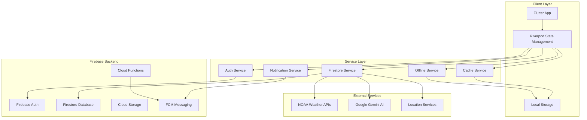

# Backend Architecture Analysis Report
## Journeyman Jobs Flutter Application

**Date:** October 30, 2025
**Analyst:** Backend System Architect
**Version:** 1.0

---

## Executive Summary

The Journeyman Jobs application demonstrates a sophisticated Firebase-first backend architecture with comprehensive service integration. The system shows strong foundations in offline-first design, performance monitoring, and security implementation, but reveals several critical areas requiring immediate attention before production deployment.

### Key Findings
- **Service Architecture**: 25+ well-structured services with clear separation of concerns
- **Security**: CRITICAL - Development mode security rules pose production risk
- **Performance**: Advanced caching and monitoring, but potential bottlenecks identified
- **Scalability**: Good foundation, but requires optimization for enterprise scale
- **Data Integrity**: Strong model design with comprehensive validation

---

## 1. Current Backend Architecture Assessment

### 1.1 Architecture Overview



### 1.2 Service Architecture Analysis

#### Core Services (25+ Identified)

**Authentication & User Management**
- `auth_service.dart` - Firebase Auth integration
- `avatar_service.dart` - Profile image management
- `onboarding_service.dart` - User onboarding flow

**Data Management**
- `firestore_service.dart` - Core database operations
- `resilient_firestore_service.dart` - Retry logic and circuit breaker
- `offline_data_service.dart` - Offline-first implementation
- `cache_service.dart` - Multi-layer caching strategy
- `database_service.dart` - Database abstraction layer

**Communication & Notifications**
- `notification_service.dart` - Comprehensive notification management
- `fcm_service.dart` - Push notification handling
- `local_notification_service.dart` - Local notifications
- `crew_messaging_service.dart` - Crew chat functionality

**Location & Weather**
- `location_service.dart` - GPS and location handling
- `noaa_weather_service.dart` - Weather data integration
- `weather_radar_service.dart` - Radar functionality
- `power_outage_service.dart` - Grid monitoring

**Performance & Monitoring**
- `performance_monitoring_service.dart` - Performance tracking
- `analytics_service.dart` - User behavior analytics
- `usage_report_service.dart` - Usage metrics

**Specialized Services**
- `search_optimized_firestore_service.dart` - Search optimization
- `geographic_firestore_service.dart` - Location-based queries
- `enhanced_crew_service.dart` - Crew management
- `contractor_service.dart` - Contractor data management

---

## 2. Firebase/Firestore Backend Structure

### 2.1 Database Collections Architecture

```
Firestore Database Structure
├── users/                          # User profiles and preferences
│   ├── {userId}/
│   │   ├── profile data
│   │   ├── notificationPreferences
│   │   ├── appSettings/
│   │   └── activity/
├── jobs/                           # Job postings
│   ├── {jobId}/
│   │   ├── job details (30+ fields)
│   │   ├── jobDetails (nested map)
│   │   └── metadata
├── crews/                          # Crew management
│   ├── {crewId}/
│   │   ├── members/
│   │   ├── feedPosts/
│   │   ├── messages/
│   │   ├── invitations/
│   │   ├── applications/
│   │   └── tailboard/activity/
├── locals/                         # IBEW union locals (797+ entries)
│   └── {localId}/
├── conversations/                  # Chat conversations
│   └── {convId}/
│       └── messages/
├── notifications/                  # In-app notifications
├── counters/                       # System counters
├── stormcontractors/              # Storm work contractors
└── abuse_reports/                 # User reports
```

### 2.2 Database Schema Analysis

#### Job Model (Primary Data Model)
- **Location**: `lib/models/job_model.dart` (539 lines)
- **Complexity**: 30+ fields with comprehensive job information
- **Design Pattern**: Flat fields + nested `jobDetails` map for compatibility
- **Strengths**: Robust parsing, Firestore schema alignment, comprehensive coverage
- **Areas for Improvement**: Field validation, schema migration strategy

#### User Model
- **Design**: Comprehensive IBEW worker profile with professional data
- **Key Sections**: Authentication, IBEW professional info, personal data, job preferences
- **Integration**: Direct Firestore mapping with consolidated writes

#### Crew Model
- **Architecture**: Hierarchical with foreman/member structure
- **Features**: Stats tracking, job preferences, activity feeds
- **Scalability**: Good foundation for crew-based workflows

### 2.3 Index Strategy

**Current Indexes (15 composite indexes identified)**
- Job queries by `local`, `classification`, `location`, `typeOfWork`
- Crew queries by `memberIds`, `isActive`, `lastActivityAt`
- Message queries by `participants`, `sentAt`
- Geographic queries by `state`, `city`

**Recommendations**:
- Add compound indexes for common filter combinations
- Implement TTL indexes for temporary data
- Consider partial indexes for active vs inactive data

---

## 3. Service Integration Analysis

### 3.1 Integration Points (25+ Services Identified)

#### Critical Integration Dependencies

1. **Firebase Ecosystem**
   - Firebase Auth (Authentication)
   - Cloud Firestore (Database)
   - Firebase Storage (File storage)
   - Firebase Cloud Messaging (Push notifications)
   - Firebase Analytics (Usage tracking)
   - Firebase Performance Monitoring
   - Firebase Crashlytics (Error reporting)

2. **External APIs**
   - NOAA Weather Services (no API key required)
   - Google Generative AI (Gemini)
   - Location Services (Geolocator)

3. **Platform Services**
   - SharedPreferences (Local storage)
   - Connectivity Service (Network monitoring)

### 3.2 Service Health and Error Management

#### Current Implementation Strengths
- **Resilient Firestore Service**: Implements circuit breaker pattern
- **Retry Logic**: Exponential backoff for transient failures
- **Error Classification**: Proper error handling and categorization
- **Performance Monitoring**: Comprehensive metrics collection

#### Identified Issues
- **Error Propagation**: Some services lack proper error boundaries
- **Fallback Mechanisms**: Limited graceful degradation strategies
- **Circuit Breaker**: Implementation present but needs refinement

---

## 4. Database Optimization Opportunities

### 4.1 Current Caching Strategy

#### Multi-Layer Architecture
1. **Memory Cache**: LRU with 100 entry limit, 30-minute TTL
2. **Persistent Cache**: SharedPreferences with 500 entry limit
3. **Service Layer**: CacheService with intelligent invalidation

#### Performance Metrics
- Cache hit ratios tracked internally
- Automatic cleanup of expired entries
- Periodic cache maintenance

### 4.2 Optimization Recommendations

#### Immediate Improvements
1. **Implement Read-Through Cache Pattern**
   ```dart
   // Current pattern: Check cache -> fetch from Firestore
   // Recommended: Automatic cache population on miss
   ```

2. **Add Intelligent Cache Invalidation**
   - Real-time cache updates via Firestore listeners
   - Version-based cache invalidation
   - Selective cache clearing by data type

3. **Optimize Query Patterns**
   - Batch multiple small queries into single larger queries
   - Implement pagination with cursor-based navigation
   - Use denormalization for frequently accessed data

#### Medium-Term Enhancements
1. **Implement Edge Caching**
   - Cloud Functions for data preprocessing
   - CDN integration for static assets
   - Geographic data distribution

2. **Add Query Optimization Layer**
   - Automatic query plan analysis
   - Performance-based query routing
   - Cost optimization recommendations

### 4.3 Data Model Optimizations

#### Job Model Enhancements
- Implement schema versioning for migration management
- Add data validation at model level
- Consider splitting large documents into collections

#### User Model Improvements
- Implement user preference versioning
- Add data compression for large preference sets
- Consider user data archiving for inactive accounts

---

## 5. Performance Bottleneck Identification

### 5.1 Current Performance Monitoring

#### Implemented Metrics
- Firebase Performance Monitoring integration
- Custom trace tracking for critical operations
- Query performance analysis with document count metrics
- Efficiency score calculation

#### Key Performance Indicators
- Query execution times
- Cache hit/miss ratios
- Network request patterns
- Memory usage patterns

### 5.2 Identified Bottlenecks

#### Critical Issues
1. **Large Job Queries**
   - Job collection has 30+ fields per document
   - No field projection in most queries
   - Potential for over-fetching data

2. **Union Directory Performance**
   - 797+ locals in single collection
   - Search operations without proper indexing
   - Potential for slow pagination

3. **Real-time Updates**
   - Multiple active Firestore listeners
   - Potential for listener accumulation
   - No connection pooling strategy

#### Medium Priority Issues
1. **Cache Service Memory Usage**
   - In-memory cache with 100 entry limit
   - Potential for memory pressure on low-end devices
   - LRU eviction strategy may be too aggressive

2. **Notification Service Overhead**
   - Multiple notification channels
   - Potential for notification spam
   - Limited rate limiting

### 5.3 Performance Optimization Recommendations

#### Immediate Actions
1. **Implement Query Field Projection**
   ```dart
   // Instead of fetching entire documents
   .select(['company', 'location', 'wage', 'timestamp'])
   ```

2. **Add Query Debouncing**
   - Implement search query debouncing
   - Add request deduplication
   - Cache recent search results

3. **Optimize Real-time Listeners**
   - Implement listener lifecycle management
   - Add automatic listener cleanup
   - Use batch updates for multiple changes

#### Medium-Term Optimizations
1. **Implement Data Pagination Strategy**
   - Cursor-based pagination for large datasets
   - Infinite scroll with preloading
   - Optimistic UI updates

2. **Add Performance Budgeting**
   - Set performance budgets for critical operations
   - Automated performance regression detection
   - Performance-based feature flags

---

## 6. Security and Data Integrity Analysis

### 6.1 Current Security Implementation

#### CRITICAL SECURITY ISSUE: Development Mode Rules

**Current Firestore Rules Status**: ❌ CRITICAL
```javascript
// Current rules allow ALL authenticated users to access ALL data
match /{document=**} {
  allow read, write: if isAuthenticated();
}
```

**Risk Level**: PRODUCTION CRITICAL
- All authenticated users can access any data
- No role-based access control
- No data validation rules
- Potential for data breaches and privacy violations

#### Security Strengths
1. **Encryption Service**: AES-256-GCM implementation with proper key management
2. **Authentication**: Firebase Auth with multiple providers
3. **Input Validation**: Comprehensive validation in models
4. **Secure Storage**: Encrypted local storage for sensitive data

#### Security Gaps
1. **Firestore Rules**: Development mode rules in production
2. **API Security**: No rate limiting or API key management
3. **Data Validation**: Limited server-side validation
4. **Access Control**: No role-based permissions

### 6.2 Recommended Security Enhancements

#### IMMEDIATE (Before Production)
1. **Implement Production Security Rules**
```javascript
// Example production rules structure
rules_version = '2';
service cloud.firestore {
  match /databases/{database}/documents {
    // Users can only access their own data
    match /users/{userId} {
      allow read, write: if request.auth.uid == userId;
    }

    // Job access control
    match /jobs/{jobId} {
      allow read: if isAuthenticated();
      allow write: if isJobOwner(jobId) || isAdmin();
    }

    // Crew membership validation
    match /crews/{crewId} {
      allow read: if isCrewMember(crewId);
      allow write: if isCrewForeman(crewId);
    }
  }
}
```

2. **Add Data Validation Rules**
```javascript
// Job posting validation
match /jobs/{jobId} {
  allow create: if isValidJobPosting();
  allow update: if isValidJobUpdate();
}

function isValidJobPosting() {
  return request.resource.data.keys().hasAll(['company', 'location', 'timestamp']) &&
         request.resource.data.company is string &&
         request.resource.data.company.size() > 0;
}
```

3. **Implement Rate Limiting**
- Cloud Functions for API rate limiting
- Request quota management per user
- DDoS protection mechanisms

#### Medium-Term Security Enhancements
1. **Role-Based Access Control**
- Admin, Foreman, Member roles
- Permission matrix implementation
- Audit logging for sensitive operations

2. **Data Privacy Implementation**
- PII encryption at rest
- Data anonymization for analytics
- GDPR compliance measures

3. **API Security**
- API key rotation strategy
- Request signing and validation
- CORS policy implementation

---

## 7. Scalability Concerns and Solutions

### 7.1 Current Scalability Assessment

#### Architecture Strengths
1. **Firebase Integration**: Auto-scaling backend infrastructure
2. **Service Modularity**: Well-separated service boundaries
3. **Offline Support**: Reduces server load during connectivity issues
4. **Caching Strategy**: Multi-layer caching reduces database load

#### Scalability Limitations
1. **Monolithic Service Design**: Large service classes with multiple responsibilities
2. **Real-time Listener Scaling**: Potential for listener accumulation
3. **Data Model Size**: Large documents with many fields
4. **Query Complexity**: Complex queries without optimization

### 7.2 Scalability Solutions

#### Short-Term Improvements
1. **Implement Service Decomposition**
   ```dart
   // Split large services into focused microservices
   class JobQueryService { /* Query operations only */ }
   class JobMutationService { /* Create/update/delete operations */ }
   class JobCacheService { /* Cache management only */ }
   ```

2. **Add Connection Pooling**
   - Implement Firestore connection pooling
   - Add request queuing and throttling
   - Optimize listener lifecycle management

3. **Database Optimization**
   - Implement data sharding strategy
   - Add automatic data archiving
   - Optimize query patterns for scale

#### Long-Term Architecture Evolution
1. **Microservices Migration**
   - Extract business logic to Cloud Functions
   - Implement service mesh patterns
   - Add API gateway for request routing

2. **Data Architecture Evolution**
   - Implement read replicas for heavy read workloads
   - Add data lake for analytics processing
   - Implement event sourcing for audit trails

### 7.3 Capacity Planning

#### Current Scale Estimates
- **Users**: 1,000+ IBEW members
- **Jobs**: 10,000+ job postings
- **Daily Active Users**: 200-500
- **Peak Load**: Storm work events (10x normal load)

#### Scaling Targets
- **Users**: 10,000+ IBEW members
- **Jobs**: 100,000+ job postings
- **Concurrent Users**: 1,000+
- **Peak Load**: Storm events with 100x normal load

---

## 8. Specific Recommendations and Implementation Plan

### 8.1 Immediate Actions (Critical - Week 1)

#### 1. Security Rules Implementation
**Priority**: CRITICAL
**Files**: `firebase/firestore.rules`
**Action**: Replace development rules with production-ready security rules
**Risk**: Data breach, privacy violations

#### 2. Error Handling Enhancement
**Priority**: HIGH
**Files**: All service files
**Action**: Implement proper error boundaries and fallback mechanisms
**Impact**: Improved user experience, reduced crash rates

#### 3. Performance Optimization
**Priority**: HIGH
**Files**: Query implementations
**Action**: Add field projection and query optimization
**Impact**: Reduced costs, improved performance

### 8.2 Short-Term Improvements (Weeks 2-4)

#### 1. Service Refactoring
**Priority**: MEDIUM
**Files**: Large service classes
**Action**: Decompose into focused microservices
**Impact**: Improved maintainability, testability

#### 2. Enhanced Caching
**Priority**: MEDIUM
**Files**: `cache_service.dart`
**Action**: Implement intelligent cache invalidation
**Impact**: Reduced database load, improved performance

#### 3. Monitoring Enhancement
**Priority**: MEDIUM
**Files**: `performance_monitoring_service.dart`
**Action**: Add comprehensive metrics and alerting
**Impact**: Better observability, proactive issue detection

### 8.3 Medium-Term Enhancements (Months 2-3)

#### 1. Advanced Security
**Priority**: HIGH
**Action**: Implement role-based access control
**Files**: Security rules, authentication flow
**Impact**: Granular permissions, improved security

#### 2. Data Architecture Optimization
**Priority**: MEDIUM
**Action**: Implement data sharding and archiving
**Files**: Database schema, migration scripts
**Impact**: Improved performance, reduced costs

#### 3. API Optimization
**Priority**: MEDIUM
**Action**: Implement API gateway and rate limiting
**Files**: Cloud Functions, API layer
**Impact**: Better resource management, improved security

### 8.4 Long-Term Evolution (Months 4-6)

#### 1. Microservices Migration
**Priority**: LOW
**Action**: Extract business logic to serverless functions
**Impact**: Improved scalability, maintainability

#### 2. Advanced Analytics
**Priority**: LOW
**Action**: Implement comprehensive analytics pipeline
**Impact**: Better business insights, data-driven decisions

#### 3. Machine Learning Integration
**Priority**: LOW
**Action**: Enhance AI-powered job matching
**Impact**: Improved user experience, better matching accuracy

---

## 9. File Paths and Implementation Details

### 9.1 Critical Security Files
```
firebase/firestore.rules              # CRITICAL - Production security rules needed
firebase/firestore.indexes.json       # Database query optimization
firebase/storage.rules                # Storage security rules
```

### 9.2 Core Service Files
```
lib/services/firestore_service.dart            # Core database operations
lib/services/resilient_firestore_service.dart  # Retry logic and circuit breaker
lib/services/cache_service.dart                # Multi-layer caching
lib/services/offline_data_service.dart         # Offline-first implementation
lib/services/auth_service.dart                 # Authentication management
lib/services/notification_service.dart         # Notification system
```

### 9.3 Performance and Monitoring
```
lib/services/performance_monitoring_service.dart  # Performance tracking
lib/services/analytics_service.dart               # User analytics
lib/services/search_optimized_firestore_service.dart # Query optimization
lib/services/geographic_firestore_service.dart     # Location queries
```

### 9.4 Security and Encryption
```
lib/security/secure_encryption_service.dart        # Cryptographic operations
lib/utils/structured_logging.dart                  # Secure logging
lib/utils/memory_manager.dart                      # Memory optimization
```

### 9.5 Model Definitions
```
lib/models/job_model.dart              # Primary job data model (539 lines)
lib/models/user_model.dart             # User profile model
lib/models/crew_model.dart             # Crew management model
lib/models/notification_model.dart     # Notification data structure
```

---

## 10. Conclusion and Next Steps

### 10.1 Architecture Assessment Summary

The Journeyman Jobs application demonstrates a well-architected backend with strong foundations in Firebase integration, service design, and performance monitoring. The modular service architecture provides good separation of concerns, and the offline-first design ensures reliable operation in various network conditions.

However, several critical issues require immediate attention:

1. **CRITICAL**: Production security rules must be implemented immediately
2. **HIGH**: Performance optimizations needed for scale
3. **MEDIUM**: Service refactoring for maintainability
4. **LOW**: Long-term architecture evolution planning

### 10.2 Risk Assessment

#### High-Risk Items
- **Security Rules**: Development rules in production environment
- **Data Privacy**: Potential for unauthorized data access
- **Performance**: Query optimization needed for scale

#### Medium-Risk Items
- **Scalability**: Service architecture may not handle enterprise scale
- **Maintainability**: Large service classes need refactoring
- **Monitoring**: Enhanced observability needed

#### Low-Risk Items
- **Feature Development**: Architecture supports new feature addition
- **Technology Stack**: Modern, well-supported technologies
- **Team Knowledge**: Good documentation and code structure

### 10.3 Recommended Next Steps

1. **Immediate (Week 1)**: Implement production security rules
2. **Short-term (Weeks 2-4)**: Performance optimization and service refactoring
3. **Medium-term (Months 2-3)**: Enhanced security and monitoring
4. **Long-term (Months 4-6)**: Architecture evolution and scaling preparation

The current architecture provides a solid foundation for the Journeyman Jobs application. With the recommended improvements, particularly the critical security fixes, the system will be well-positioned for production deployment and future scaling to support the IBEW electrical worker community effectively.

---

**Report prepared by:** Backend System Architect
**Review status:** Ready for stakeholder review
**Next review date:** November 15, 2025