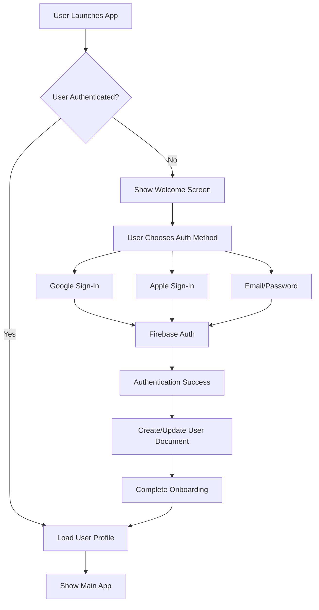

# Journeyman Jobs - Full Stack Technical Documentation

## Table of Contents
1. [System Architecture Overview](#system-architecture-overview)
2. [Frontend Architecture](#frontend-architecture)
3. [Backend Services](#backend-services)
4. [Database Design](#database-design)
5. [API Documentation](#api-documentation)
6. [Authentication & Security](#authentication--security)
7. [Real-time Features](#real-time-features)
8. [Performance Optimization](#performance-optimization)
9. [Monitoring & Observability](#monitoring--observability)
10. [Deployment & CI/CD](#deployment--cicd)
11. [Testing Strategy](#testing-strategy)
12. [Troubleshooting Guide](#troubleshooting-guide)

---

## System Architecture Overview

### High-Level Architecture

```
┌─────────────────────────────────────────────────────────────┐
│                    Client Applications                      │
├─────────────────────┬───────────────────────────────────────┤
│   Flutter Mobile    │        Flutter Web                    │
│  (iOS, Android)     │         (Desktop)                      │
└─────────┬───────────┴─────────────────────┬─────────────────┘
          │                               │
          ▼                               ▼
┌─────────────────────────────────────────────────────────────┐
│                    Firebase Backend                         │
├─────────────────────────────────────────────────────────────┤
│ ┌─────────────┐ ┌─────────────┐ ┌─────────────┐ ┌─────────┐ │
│ │   Auth      │ │ Firestore   │ │  Storage    │ │ Functions│ │
│ │ Service     │ │   Database  │ │   Service   │ │         │ │
│ └─────────────┘ └─────────────┘ └─────────────┘ └─────────┘ │
└─────────────────────────────────────────────────────────────┘
          │                               │
          ▼                               ▼
┌─────────────────────────────────────────────────────────────┐
│                   External Services                         │
├─────────────────────────────────────────────────────────────┤
│  • NOAA Weather APIs  • Google Maps • Firebase Hosting      │
└─────────────────────────────────────────────────────────────┘
```

### Technology Stack

#### Frontend
- **Framework**: Flutter 3.6.0+ with null safety
- **State Management**: Flutter Riverpod with code generation
- **Navigation**: go_router for type-safe routing
- **UI Framework**: Custom design system with shadcn_ui components
- **Animations**: flutter_animate with electrical theme

#### Backend
- **Backend-as-a-Service**: Firebase (Auth, Firestore, Storage, Functions)
- **Database**: Cloud Firestore with offline persistence
- **Authentication**: Firebase Auth (Google, Apple, Email/Password)
- **File Storage**: Firebase Cloud Storage
- **Serverless Functions**: Firebase Cloud Functions (Node.js/TypeScript)

#### External Integrations
- **Weather Data**: NOAA/NWS APIs (no API key required)
- **Maps**: flutter_map with OpenStreetMap
- **Notifications**: Firebase Cloud Messaging (FCM)
- **Analytics**: Firebase Analytics & Performance Monitoring

---

## Frontend Architecture

### Project Structure

```
lib/
├── main.dart                          # App entry point
├── firebase_options.dart              # Firebase configuration
├── navigation/
│   └── app_router.dart                # Type-safe routing
├── screens/                           # Screen widgets
│   ├── auth/                         # Authentication screens
│   ├── storm/                        # Storm work & weather
│   ├── jobs/                         # Job board
│   ├── crews/                        # Crew management
│   └── settings/                     # App settings
├── widgets/                          # Reusable UI components
│   ├── electrical_components/        # Theme-specific widgets
│   ├── dialogs/                      # Modal dialogs
│   └── forms/                        # Form components
├── models/                           # Data models
├── providers/                        # State management
├── services/                         # Business logic
├── utils/                           # Utility functions
└── design_system/                    # Theme & styling
```

### State Management Architecture

```dart
// Riverpod Provider Architecture
final routerProvider = Provider<AppRouter>((ref) => AppRouter());

// Authentication
final authServiceProvider = Provider<AuthService>((ref) => AuthService());
final authStateProvider = StreamProvider<User?>((ref) {
  return ref.watch(authServiceProvider).authStateChanges;
});

// Data Providers
final jobsProvider = StreamProvider<List<JobModel>>((ref) {
  return ref.watch(jobServiceProvider).getJobsStream();
});

// State Notifiers
final jobFilterProvider = StateNotifierProvider<JobFilterNotifier, FilterCriteria>((ref) {
  return JobFilterNotifier();
});
```

### Key Components

#### 1. Authentication Service
```dart
class AuthService {
  final FirebaseAuth _auth = FirebaseAuth.instance;
  final GoogleSignIn _googleSignIn = GoogleSignIn();

  // Sign in with email/password
  Future<UserCredential> signInWithEmailAndPassword(String email, String password);

  // Sign in with Google
  Future<UserCredential> signInWithGoogle();

  // Sign in with Apple
  Future<UserCredential> signInWithApple();

  // Sign out
  Future<void> signOut();

  // Session management
  Stream<User?> get authStateChanges => _auth.authStateChanges();
}
```

#### 2. Job Service
```dart
class JobService {
  final FirebaseFirestore _firestore = FirebaseFirestore.instance;

  // Get jobs stream
  Stream<List<JobModel>> getJobsStream(FilterCriteria? filters);

  // Apply for job
  Future<void> applyForJob(String jobId, String userId);

  // Save job preferences
  Future<void> saveJobPreferences(JobPreferences preferences);
}
```

#### 3. Weather Service
```dart
class NOAAWeatherService {
  static const String _baseUrl = 'https://api.weather.gov';

  // Get weather alerts
  Future<List<WeatherAlert>> getWeatherAlerts(LatLng location);

  // Get radar imagery
  Future<RadarData> getRadarImagery(String stationId);

  // Get forecast
  Future<WeatherForecast> getForecast(LatLng location);
}
```

---

## Backend Services

### Firebase Configuration

#### Firestore Database Structure

```
journeyman-jobs-prod/
├── users/                          # User profiles and preferences
│   └── {userId}/
│       ├── profile                # Basic user information
│       ├── preferences           # Job and notification preferences
│       ├── certifications        # Professional certifications
│       └── activity              # User activity logs
├── jobs/                          # Job postings
│   └── {jobId}/
│       ├── basic                 # Basic job information
│       ├── details               # Extended job details
│       ├── requirements          # Job requirements
│       └── applications          # Job applications
├── crews/                         # Crew management
│   └── {crewId}/
│       ├── info                  # Crew information
│       ├── members               # Crew members
│       ├── messages              # Crew messages
│       └── posts                 # Crew posts
├── unions/                        # IBEW union data
│   └── {localId}/
│       ├── info                  # Local union information
│       ├── contacts              # Contact information
│       └── contractors           # Associated contractors
├── weather/                       # Weather data cache
│   ├── alerts/                   # Weather alerts
│   ├── radar/                    # Radar imagery
│   └── forecasts/                # Weather forecasts
└── system/                        # System configuration
    ├── feature_flags             # Feature flags
    ├── app_config                # App configuration
    └── analytics                 # Analytics data
```

#### Security Rules

```javascript
// firestore.rules
rules_version = '2';
service cloud.firestore {
  match /databases/{database}/documents {
    // Users can read/write their own documents
    match /users/{userId} {
      allow read, write: if request.auth != null && request.auth.uid == userId;

      // Public profile information
      match /profile {
        allow read: if request.auth != null;
      }
    }

    // Job postings - public read, authenticated write
    match /jobs/{jobId} {
      allow read: if true;
      allow write: if request.auth != null &&
        request.auth.uid == resource.data.ownerId;
    }

    // Crew access control
    match /crews/{crewId} {
      allow read, write: if request.auth != null &&
        request.auth.uid in resource.data.members;
    }

    // System configuration - admin only
    match /system/{document} {
      allow read, write: if request.auth != null &&
        request.auth.token.admin == true;
    }
  }
}
```

### Cloud Functions Architecture

```typescript
// functions/src/index.ts
import * as functions from 'firebase-functions';
import * as admin from 'firebase-admin';

admin.initializeApp();

// Job processing functions
export const processJobApplication = functions.https.onCall(async (data, context) => {
  // Process job application
});

export const validateJobPosting = functions.firestore
  .document('jobs/{jobId}')
  .onWrite(async (change, context) => {
    // Validate job posting data
  });

// Weather data processing
export const updateWeatherAlerts = functions.pubsub
  .schedule('every 15 minutes')
  .onRun(async (context) => {
    // Fetch and cache weather alerts
  });

// Notification functions
export const sendJobAlerts = functions.pubsub
  .schedule('every 1 hour')
  .onRun(async (context) => {
    // Send job matching notifications
  });

// Analytics aggregation
export const aggregateUserActivity = functions.pubsub
  .schedule('every 24 hours')
  .onRun(async (context) => {
    // Aggregate user activity data
  });
```

---

## Database Design

### Data Models

#### User Model
```dart
class UserModel {
  final String uid;
  final String email;
  final String firstName;
  final String lastName;
  final int? local;
  final List<String> classifications;
  final List<String> constructionTypes;
  final JobPreferences preferences;
  final DateTime createdAt;
  final DateTime lastActiveAt;
  final Map<String, dynamic> metadata;
}
```

#### Job Model
```dart
class JobModel {
  final String id;
  final String company;
  final double? wage;
  final int? local;
  final String classification;
  final String location;
  final Map<String, dynamic> jobDetails;
  final List<String> requirements;
  final DateTime timestamp;
  final DateTime? deadline;
  final bool deleted;
  final String ownerId;
  final List<String> applicants;
  final Map<String, dynamic> metadata;
}
```

#### Crew Model
```dart
class CrewModel {
  final String id;
  final String name;
  final String description;
  final String ownerId;
  final List<String> members;
  final List<String> admins;
  final Map<String, dynamic> settings;
  final DateTime createdAt;
  final DateTime lastActiveAt;
  final CrewStats stats;
}
```

### Indexes

```json
{
  "indexes": [
    {
      "collectionGroup": "jobs",
      "queryScope": "COLLECTION",
      "fields": [
        {
          "fieldPath": "local",
          "order": "ASCENDING",
          "arrayConfig": "CONTAINS"
        },
        {
          "fieldPath": "deleted",
          "order": "ASCENDING"
        },
        {
          "fieldPath": "timestamp",
          "order": "DESCENDING"
        },
        {
          "fieldPath": "__name__",
          "order": "DESCENDING"
        }
      ]
    },
    {
      "collectionGroup": "users",
      "queryScope": "COLLECTION",
      "fields": [
        {
          "fieldPath": "local",
          "order": "ASCENDING"
        },
        {
          "fieldPath": "classifications",
          "order": "ASCENDING",
          "arrayConfig": "CONTAINS"
        },
        {
          "fieldPath": "lastActiveAt",
          "order": "DESCENDING"
        }
      ]
    }
  ],
  "fieldOverrides": []
}
```

---

## API Documentation

### REST Endpoints (Cloud Functions)

#### Authentication
```
POST /api/auth/register
POST /api/auth/login
POST /api/auth/logout
POST /api/auth/reset-password
```

#### Jobs
```
GET /api/jobs - List jobs with filtering
POST /api/jobs - Create new job posting
GET /api/jobs/{id} - Get job details
POST /api/jobs/{id}/apply - Apply for job
PUT /api/jobs/{id} - Update job posting
DELETE /api/jobs/{id} - Delete job posting
```

#### Crews
```
GET /api/crews - List user's crews
POST /api/crews - Create new crew
GET /api/crews/{id} - Get crew details
POST /api/crews/{id}/join - Join crew
POST /api/crews/{id}/leave - Leave crew
POST /api/crews/{id}/messages - Send message
```

#### Weather
```
GET /api/weather/alerts - Get weather alerts
GET /api/weather/radar - Get radar data
GET /api/weather/forecast - Get weather forecast
```

### WebSocket Connections (Real-time)

```dart
// Real-time job updates
Stream<List<JobModel>> getJobsStream() {
  return FirebaseFirestore.instance
      .collection('jobs')
      .where('deleted', isEqualTo: false)
      .orderBy('timestamp', descending: true)
      .snapshots()
      .map((snapshot) => snapshot.docs
          .map((doc) => JobModel.fromFirestore(doc))
          .toList());
}

// Real-time crew messages
Stream<List<MessageModel>> getCrewMessagesStream(String crewId) {
  return FirebaseFirestore.instance
      .collection('crews')
      .doc(crewId)
      .collection('messages')
      .orderBy('timestamp', descending: true)
      .snapshots()
      .map((snapshot) => snapshot.docs
          .map((doc) => MessageModel.fromFirestore(doc))
          .toList());
}
```

---

## Authentication & Security

### Authentication Flow



### Security Measures

#### 1. Firebase Security Rules
```javascript
// User document access control
match /users/{userId} {
  allow read, write: if request.auth != null && request.auth.uid == userId;
  allow read: if request.auth != null &&
    request.auth.uid in resource.data.crewMembers;
}

// Job posting validation
match /jobs/{jobId} {
  allow create: if request.auth != null &&
    request.auth.uid == resource.data.ownerId &&
    resource.data.keys().hasAll(['company', 'location', 'classification']);

  allow read: if true; // Public access

  allow update: if request.auth != null &&
    request.auth.uid == resource.data.ownerId;
}
```

#### 2. Data Validation (Cloud Functions)
```typescript
export const validateJobPosting = functions.firestore
  .document('jobs/{jobId}')
  .onWrite(async (change, context) => {
    const jobData = change.after.data();

    // Required fields validation
    const requiredFields = ['company', 'location', 'classification'];
    for (const field of requiredFields) {
      if (!jobData[field]) {
        throw new functions.https.HttpsError(
          'invalid-argument',
          `Missing required field: ${field}`
        );
      }
    }

    // Data sanitization
    jobData.company = sanitizeHtml(jobData.company);
    jobData.description = sanitizeHtml(jobData.description);

    // Update document with sanitized data
    await change.after.ref.set(jobData, { merge: true });
  });
```

#### 3. API Security
```typescript
// Rate limiting middleware
const rateLimiter = require('express-rate-limit');

const limiter = rateLimiter({
  windowMs: 15 * 60 * 1000, // 15 minutes
  max: 100, // limit each IP to 100 requests per windowMs
  message: 'Too many requests from this IP'
});

// Apply to all API endpoints
app.use('/api/', limiter);
```

---

## Real-time Features

### Real-time Data Synchronization

```dart
class RealtimeDataService {
  final FirebaseFirestore _firestore = FirebaseFirestore.instance;

  // Real-time job updates
  Stream<List<JobModel>> getJobsStream({FilterCriteria? filters}) {
    Query query = _firestore
        .collection('jobs')
        .where('deleted', isEqualTo: false);

    if (filters?.locals != null) {
      query = query.where('local', whereIn: filters!.locals);
    }

    if (filters?.classifications != null) {
      query = query.where('classification', whereIn: filters!.classifications);
    }

    return query
        .orderBy('timestamp', descending: true)
        .snapshots()
        .map((snapshot) => snapshot.docs
            .map((doc) => JobModel.fromFirestore(doc))
            .toList());
  }

  // Real-time crew messages
  Stream<List<MessageModel>> getCrewMessagesStream(String crewId) {
    return _firestore
        .collection('crews')
        .doc(crewId)
        .collection('messages')
        .orderBy('timestamp', descending: true)
        .snapshots()
        .map((snapshot) => snapshot.docs
            .map((doc) => MessageModel.fromFirestore(doc))
            .toList());
  }
}
```

### Offline Support

```dart
class OfflineDataService {
  final FirebaseFirestore _firestore = FirebaseFirestore.instance;

  // Enable offline persistence
  Future<void> initializeOfflineSupport() async {
    await _firestore.settings = const Settings(
      persistenceEnabled: true,
      cacheSizeBytes: 100 * 1024 * 1024, // 100MB
    );
  }

  // Sync status monitoring
  Stream<bool> get syncStatus {
    return _firestore.snapshotsInSync();
  }

  // Clear cache
  Future<void> clearCache() async {
    await _firestore.clearPersistence();
  }
}
```

---

## Performance Optimization

### Frontend Performance

#### 1. Widget Optimization
```dart
// Use const constructors where possible
class JobCard extends StatelessWidget {
  const JobCard({
    Key? key,
    required this.job,
    this.onTap,
  }) : super(key: key);

  @override
  Widget build(BuildContext context) {
    return const Card( // Use const for static widgets
      child: Padding(
        padding: EdgeInsets.all(16.0),
        child: JobCardContent(),
      ),
    );
  }
}

// Use automatic keep alive for complex lists
class OptimizedListView extends StatelessWidget {
  @override
  Widget build(BuildContext context) {
    return ListView.builder(
      cacheExtent: 500.0, // Cache extent for smooth scrolling
      itemCount: items.length,
      itemBuilder: (context, index) {
        return AutomaticKeepAliveClientMixin(
          child: JobCard(job: items[index]),
        );
      },
    );
  }
}
```

#### 2. Image Optimization
```dart
class OptimizedImage extends StatelessWidget {
  final String imageUrl;
  final double? width;
  final double? height;

  const OptimizedImage({
    Key? key,
    required this.imageUrl,
    this.width,
    this.height,
  }) : super(key: key);

  @override
  Widget build(BuildContext context) {
    return CachedNetworkImage(
      imageUrl: imageUrl,
      width: width,
      height: height,
      placeholder: (context, url) => const CircularProgressIndicator(),
      errorWidget: (context, url, error) => const Icon(Icons.error),
      memCacheWidth: width?.toInt(),
      memCacheHeight: height?.toInt(),
    );
  }
}
```

### Backend Performance

#### 1. Database Optimization
```dart
class OptimizedJobService {
  final FirebaseFirestore _firestore = FirebaseFirestore.instance;

  // Batch operations for better performance
  Future<void> updateMultipleJobs(List<JobModel> jobs) async {
    final batch = _firestore.batch();

    for (final job in jobs) {
      final docRef = _firestore.collection('jobs').doc(job.id);
      batch.set(docRef, job.toFirestore());
    }

    await batch.commit();
  }

  // Efficient pagination
  Stream<List<JobModel>> getPaginatedJobs({
    DocumentSnapshot? lastDocument,
    int limit = 20,
  }) {
    Query query = _firestore
        .collection('jobs')
        .where('deleted', isEqualTo: false)
        .orderBy('timestamp', descending: true)
        .limit(limit);

    if (lastDocument != null) {
      query = query.startAfterDocument(lastDocument);
    }

    return query.snapshots().map((snapshot) => snapshot.docs
        .map((doc) => JobModel.fromFirestore(doc))
        .toList());
  }
}
```

#### 2. Caching Strategy
```typescript
// Cloud Functions with caching
export const getCachedWeatherData = functions.https.onCall(async (data, context) => {
  const { location } = data;
  const cacheKey = `weather_${location.lat}_${location.lng}`;

  // Check cache first
  const cached = await admin.firestore()
    .collection('cache')
    .doc(cacheKey)
    .get();

  if (cached.exists &&
      Date.now() - cached.data()?.timestamp < 15 * 60 * 1000) { // 15 minutes
    return cached.data()?.data;
  }

  // Fetch fresh data
  const weatherData = await fetchWeatherData(location);

  // Update cache
  await admin.firestore()
    .collection('cache')
    .doc(cacheKey)
    .set({
      data: weatherData,
      timestamp: Date.now(),
    });

  return weatherData;
});
```

---

## Monitoring & Observability

### Firebase Performance Monitoring

```dart
// Custom performance traces
class PerformanceService {
  static final FirebasePerformance _performance = FirebasePerformance.instance;

  // Job loading performance
  static Future<List<JobModel>> loadJobsWithTrace() async {
    final trace = _performance.newTrace('load_jobs');
    trace.start();

    try {
      final jobs = await JobService().getJobs();
      trace.putMetric('job_count', jobs.length);
      return jobs;
    } finally {
      trace.stop();
    }
  }

  // API call performance
  static Future<T> traceApiCall<T>(
    String name,
    Future<T> Function() apiCall,
  ) async {
    final trace = _performance.newTrace('api_call_$name');
    trace.start();

    try {
      final result = await apiCall();
      trace.putMetric('success', 1);
      return result;
    } catch (e) {
      trace.putMetric('error', 1);
      rethrow;
    } finally {
      trace.stop();
    }
  }
}
```

### Custom Analytics

```dart
class AnalyticsService {
  static final FirebaseAnalytics _analytics = FirebaseAnalytics.instance;

  // Track job applications
  static Future<void> trackJobApplication({
    required String jobId,
    required String companyId,
    required String userId,
  }) async {
    await _analytics.logEvent(
      name: 'job_application',
      parameters: {
        'job_id': jobId,
        'company_id': companyId,
        'user_id': userId,
        'timestamp': DateTime.now().toIso8601String(),
      },
    );
  }

  // Track crew creation
  static Future<void> trackCrewCreation({
    required String crewId,
    required String userId,
    required int memberCount,
  }) async {
    await _analytics.logEvent(
      name: 'crew_creation',
      parameters: {
        'crew_id': crewId,
        'user_id': userId,
        'initial_member_count': memberCount,
      },
    );
  }

  // Track user engagement
  static Future<void> trackUserEngagement({
    required String action,
    required String screen,
    Map<String, dynamic>? parameters,
  }) async {
    await _analytics.logEvent(
      name: 'user_engagement',
      parameters: {
        'action': action,
        'screen': screen,
        ...?parameters,
      },
    );
  }
}
```

### Error Handling & Crash Reporting

```dart
class ErrorReportingService {
  static final FirebaseCrashlytics _crashlytics = FirebaseCrashlytics.instance;

  // Report custom error
  static Future<void> reportError(
    dynamic error,
    StackTrace? stackTrace, {
    Map<String, dynamic>? context,
  }) async {
    // Add context information
    if (context != null) {
      for (final entry in context.entries) {
        _crashlytics.setCustomKey(entry.key, entry.value.toString());
      }
    }

    await _crashlytics.recordError(error, stackTrace, fatal: false);
  }

  // Set user information
  static Future<void> setUser(User user) async {
    await _crashlytics.setUserIdentifier(user.uid);
    await _crashlytics.setCustomKey('user_email', user.email);
    await _crashlytics.setCustomKey('user_local', user.local?.toString());
  }
}
```

---

## Deployment & CI/CD

### Production Deployment Pipeline

```yaml
# .github/workflows/production.yml
name: 🚀 Production Deployment

on:
  push:
    branches: [main]

jobs:
  test:
    runs-on: ubuntu-latest
    steps:
      - name: Test
        run: flutter test --coverage

  build:
    needs: test
    runs-on: ubuntu-latest
    steps:
      - name: Build
        run: flutter build web --release

  deploy:
    needs: build
    runs-on: ubuntu-latest
    steps:
      - name: Deploy to Firebase
        run: firebase deploy --only hosting
```

### Environment Configuration

```dart
// lib/config/environment.dart
abstract class Environment {
  static const String production = 'production';
  static const String staging = 'staging';
  static const String development = 'development';

  static String get current {
    // Read from environment or compile-time constant
    return String.fromEnvironment('ENVIRONMENT',
      defaultValue: Environment.development);
  }

  static bool get isProduction => current == production;
  static bool get isStaging => current == staging;
  static bool get isDevelopment => current == development;
}
```

### Feature Flags

```dart
class FeatureFlags {
  static final FirebaseFirestore _firestore = FirebaseFirestore.instance;

  static Stream<bool> isFeatureEnabled(String featureName) {
    return _firestore
        .collection('system')
        .doc('feature_flags')
        .snapshots()
        .map((snapshot) => snapshot.data()?[featureName] ?? false);
  }

  // Usage example
  static Widget conditionalFeature({
    required String featureName,
    required Widget child,
    Widget? fallback,
  }) {
    return StreamBuilder<bool>(
      stream: isFeatureEnabled(featureName),
      builder: (context, snapshot) {
        if (snapshot.data == true) {
          return child;
        }
        return fallback ?? const SizedBox.shrink();
      },
    );
  }
}
```

---

## Testing Strategy

### Test Architecture

```
test/
├── unit/                          # Unit tests
│   ├── models/                   # Model tests
│   ├── services/                 # Service tests
│   └── providers/                # Provider tests
├── widget/                       # Widget tests
│   ├── screens/                  # Screen tests
│   ├── components/               # Component tests
│   └── dialogs/                  # Dialog tests
├── integration/                  # Integration tests
│   ├── flows/                    # User flow tests
│   └── api/                      # API integration tests
└── e2e/                         # End-to-end tests
    ├── auth_flow/               # Authentication flows
    ├── job_application/         # Job application flows
    └── crew_management/         # Crew management flows
```

### Test Examples

#### Unit Test
```dart
// test/unit/services/job_service_test.dart
void main() {
  group('JobService', () {
    late JobService jobService;
    late MockFirebaseFirestore mockFirestore;

    setUp(() {
      mockFirestore = MockFirebaseFirestore();
      jobService = JobService(firestore: mockFirestore);
    });

    test('should get jobs stream', () async {
      // Arrange
      final mockQuerySnapshot = MockQuerySnapshot();
      when(mockFirestore.collection('jobs')).thenReturn(MockCollectionReference());

      // Act
      final result = jobService.getJobsStream();

      // Assert
      expect(result, isA<Stream<List<JobModel>>>());
    });
  });
}
```

#### Widget Test
```dart
// test/widget/screens/jobs_screen_test.dart
void main() {
  testWidgets('JobsScreen displays job list', (tester) async {
    // Arrange
    final mockJobs = [MockJob(), MockJob()];

    await tester.pumpWidget(
      ProviderScope(
        overrides: [
          jobsProvider.overrideWithValue(Stream.value(mockJobs)),
        ],
        child: MaterialApp(home: JobsScreen()),
      ),
    );

    // Act
    await tester.pumpAndSettle();

    // Assert
    expect(find.byType(JobCard), findsNWidgets(mockJobs.length));
    expect(find.text('Job Opportunities'), findsOneWidget);
  });
}
```

#### Integration Test
```dart
// test/integration/job_application_flow_test.dart
void main() {
  integrationTest('Complete job application flow', () async {
    // Initialize Firebase for testing
    await Firebase.initializeApp();

    // Start app
    await app.main();
    await tester.pumpAndSettle();

    // Navigate through application flow
    await tester.tap(find.byIcon(Icons.work));
    await tester.pumpAndSettle();

    // Select job and apply
    await tester.tap(find.byType(JobCard).first);
    await tester.pumpAndSettle();

    await tester.tap(find.text('Apply for Job'));
    await tester.pumpAndSettle();

    // Verify application submitted
    expect(find.text('Application Submitted'), findsOneWidget);
  });
}
```

---

## Troubleshooting Guide

### Common Issues & Solutions

#### 1. Firebase Connection Issues
```dart
// Debug Firebase connection
void debugFirebaseConnection() async {
  try {
    await FirebaseFirestore.instance
        .collection('test')
        .limit(1)
        .get();

    print('✅ Firebase connection successful');
  } catch (e) {
    print('❌ Firebase connection failed: $e');

    // Check common issues
    if (e.toString().contains('permission-denied')) {
      print('   → Check Firestore security rules');
    } else if (e.toString().contains('unavailable')) {
      print('   → Check internet connection');
    } else if (e.toString().contains('not-found')) {
      print('   → Check Firebase project configuration');
    }
  }
}
```

#### 2. Performance Issues
```dart
// Monitor app performance
class PerformanceMonitor {
  static void startMonitoring() {
    FlutterError.onError = (FlutterErrorDetails details) {
      // Log performance issues
      if (details.exception.toString().contains('RenderFlex')) {
        print('⚠️ Layout overflow detected');
      }

      // Report to Crashlytics
      FirebaseCrashlytics.instance.recordFlutterError(details);
    };
  }

  static void logPerformanceMetrics() {
    // Monitor frame rate
    WidgetsBinding.instance.addTimingsCallback((timings) {
      if (timings.totalSpan.inMilliseconds > 16) {
        print('⚠️ Frame time: ${timings.totalSpan.inMilliseconds}ms');
      }
    });
  }
}
```

#### 3. State Management Issues
```dart
// Debug Riverpod state
class StateDebugger {
  static void debugProviderState<T>(ProviderListenable<T> provider) {
    print('🔍 Debugging provider: ${provider.runtimeType}');

    // Listen to provider changes
    final container = ProviderContainer();
    final subscription = container.listen<T>(provider, (previous, next) {
      print('   State changed: $previous → $next');
    });

    // Cleanup after debugging
    Timer(Duration(seconds: 10), () {
      subscription.close();
      container.dispose();
    });
  }
}
```

### Debug Tools

#### 1. Firebase Debug Console
```bash
# Install Firebase CLI
npm install -g firebase-tools

# Login to Firebase
firebase login

# View project status
firebase projects:list

# View Firestore data
firebase firestore:count --project journeyman-jobs-prod
```

#### 2. Flutter Debug Tools
```bash
# Run app with debug flags
flutter run --debug --profile

# Analyze app size
flutter build apk --analyze-size

# Run performance profiling
flutter run --profile
```

#### 3. Network Debugging
```dart
// HTTP debugging interceptor
class DebugHttpOverrides extends HttpOverrides {
  @override
  HttpClient createHttpClient(SecurityContext? context) {
    final client = super.createHttpClient(context);

    // Log all HTTP requests
    client.badCertificateCallback = (cert, host, port) => true;

    return client;
  }
}
```

---

## Conclusion

This technical documentation provides a comprehensive overview of the Journeyman Jobs full-stack application. The system is designed with scalability, performance, and maintainability in mind, following industry best practices for Flutter development and Firebase backend integration.

### Key Strengths
- **Scalable Architecture**: Modular design with clear separation of concerns
- **Real-time Capabilities**: Live data synchronization and messaging
- **Performance Optimized**: Efficient caching and lazy loading
- **Comprehensive Testing**: Multi-layer testing strategy
- **Production Ready**: CI/CD pipeline with monitoring and alerting

### Future Enhancements
- Machine learning for job matching
- Advanced crew management features
- Enhanced weather prediction capabilities
- Offline-first architecture improvements
- Cross-platform desktop support

For specific implementation details or questions about any component, refer to the relevant sections above or contact the development team.