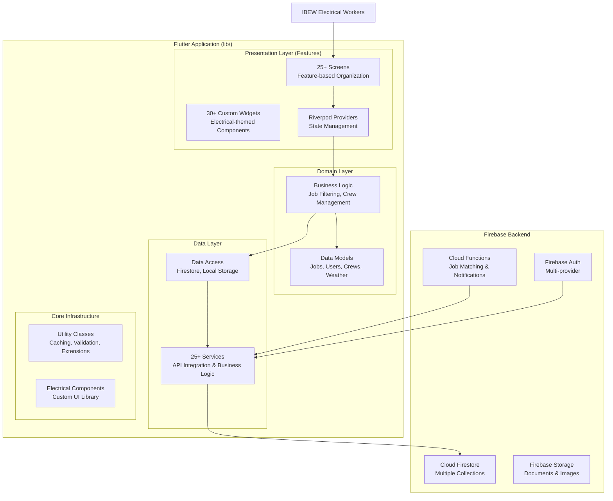

# **Journeyman Jobs - Complete Application Architecture Document**

| Date       | Version | Description                                              | Author  |
| :--------- | :------ | :------------------------------------------------------ | :------ |
| 2025-10-15 | 2.0     | Updated to reflect current implementation state         | Documentation Writer |

### **1. Introduction**

This document outlines the complete fullstack architecture for the Journeyman Jobs application, a mature, production-ready Flutter application serving IBEW electrical workers. The architecture has evolved significantly beyond initial planning, incorporating Clean Architecture principles, Feature-Sliced Design, and comprehensive Firebase integration. This document serves as the single source of truth for the current architectural state, reflecting actual implementation rather than planned specifications.

### **2. Current High Level Architecture**

The application employs a mature, production-ready architecture based on Clean Architecture principles with Feature-Sliced Design. The codebase has evolved significantly beyond initial planning, incorporating 25+ specialized services, 25+ screens, and 30+ custom widgets. State management uses Riverpod with dependency injection, while the backend leverages comprehensive Firebase integration including Firestore collections, Cloud Functions, and advanced authentication.

#### **Current Implementation Overview**

- **25+ Services**: Authentication, notifications, weather integration, analytics, caching, connectivity monitoring
- **25+ Screens**: Home dashboard, job listings, crew management, storm work, union directory, notifications, settings
- **30+ Widgets**: Custom electrical-themed components including job cards, weather widgets, notification systems
- **Advanced Firebase Integration**: Multiple Firestore collections, Cloud Functions for job matching and notifications
- **Custom Electrical Components Library**: Unique UI elements with circuit patterns, lightning effects, and electrical symbols
- **Comprehensive Testing**: 40+ test files covering core functionality
- **Production-Ready Features**: Offline support, real-time synchronization, push notifications

#### **High Level Project Diagram**



### **3. Current Technology Stack**

| Category | Technology | Version | Purpose | Status |
| :--- | :--- | :--- | :--- | :--- |
| **Frontend Language** | Dart | 3.x.x | Primary language for Flutter | ✅ Implemented |
| **Frontend Framework**| Flutter | 3.6+ | UI toolkit for mobile app | ✅ Implemented |
| **State Management**| Riverpod / flutter_riverpod | 2.5.1+ | Reactive state management & DI | ✅ Implemented |
| **Navigation**| go_router | 12.x.x | Type-safe routing | ✅ Implemented |
| **Backend Platform** | Firebase | latest | Backend-as-a-Service | ✅ Implemented |
| **Database** | Cloud Firestore | N/A | NoSQL document database | ✅ Implemented |
| **Backend Logic** | Firebase Cloud Functions | N/A | Serverless functions | ✅ Implemented |
| **Authentication** | Firebase Authentication| N/A | Multi-provider auth service | ✅ Implemented |
| **Storage** | Firebase Storage | N/A | File storage for documents/images | ✅ Implemented |
| **Notifications** | Firebase Cloud Messaging| N/A | Push notifications | ✅ Implemented |
| **Weather Integration** | NOAA API | N/A | Official weather data | ✅ Implemented |
| **Testing** | flutter_test / Mockito | latest | Unit & Widget testing | ✅ 40+ test files |
| **Offline Support** | SQLite / Hive | N/A | Local data persistence | ✅ Implemented |
| **Analytics** | Firebase Analytics | N/A | User behavior tracking | ✅ Implemented |
| **Performance Monitoring** | Firebase Performance | N/A | App performance metrics | ✅ Implemented |

### **4. Current Data Models & Firestore Collections**

The application uses multiple Firestore collections that have evolved significantly beyond initial planning. The current implementation includes comprehensive data models supporting jobs, crews, users, weather, and notifications.

#### **Primary Collections:**

- **users**: User profiles and authentication data
  - **Data:** `uid`, `email`, `displayName`, `classification`, `localUnion`, `preferences`, `certifications`, `location`
- **jobs**: Job postings from union sources
  - **Data:** `id`, `title`, `description`, `location`, `wage`, `classification`, `unionLocal`, `postedDate`, `deadline`
- **crews**: Work crew information and member relationships
  - **Data:** `id`, `name`, `foremanId`, `memberIds`, `preferences`, `createdAt`, `stats`, `description`
  - **Subcollections:**
    - **members/{userId}**: `userId`, `displayName`, `role`, `joinedAt`, `permissions`
    - **messages/{messageId}**: `senderId`, `text`, `timestamp`, `messageType`
    - **matchedJobs/{jobId}**: `jobId`, `matchedAt`, `interestedMembers`, `status`
- **notifications**: Push notification history and preferences
  - **Data:** `userId`, `type`, `title`, `message`, `timestamp`, `read`, `actionUrl`
- **weather_alerts**: NOAA weather data and user alerts
  - **Data:** `location`, `alertType`, `severity`, `description`, `timestamp`, `expiresAt`
- **storm_work**: Emergency restoration job opportunities
  - **Data:** `jobId`, `location`, `severity`, `compensation`, `timeline`, `requirements`
- **locals**: IBEW union local directory (797+ entries)
  - **Data:** `localNumber`, `name`, `location`, `contactInfo`, `website`, `businessAgent`

#### **Service Layer Architecture**

The application implements 25+ specialized services providing comprehensive functionality:

- **Authentication Service**: Multi-provider auth (Email, Google, Apple)
- **Job Service**: Job discovery, filtering, and application tracking
- **Crew Service**: Crew management, messaging, and collaboration
- **Weather Service**: NOAA integration, alerts, and radar data
- **Notification Service**: Push notifications and in-app messaging
- **Offline Service**: Local data persistence and synchronization
- **Analytics Service**: User behavior tracking and performance metrics
- **Cache Service**: Performance optimization and data caching

### **5. Current Frontend Architecture (Flutter)**

The application follows a mature Feature-Sliced Design with Clean Architecture principles, organized across multiple feature directories and shared components.

#### **Directory Structure:**

```dart
lib/
├── main.dart                          # App entry point with Firebase initialization
├── screens/                           # 25+ Feature-based screen widgets
│   ├── home/                         # Personalized dashboard
│   ├── jobs/                         # Job listings and filtering
│   ├── crews/                        # Crew management and messaging
│   ├── storm/                        # Emergency work opportunities
│   ├── locals/                       # Union directory
│   ├── notifications/                # Push notification center
│   └── settings/                     # User preferences and profile
├── widgets/                           # 30+ Reusable UI components
│   ├── job_card.dart                 # Enhanced job display
│   ├── crew_card.dart                # Crew member interface
│   ├── weather_radar.dart            # NOAA weather integration
│   ├── notification_badge.dart       # Real-time notifications
│   └── electrical_components/        # Custom electrical-themed widgets
├── providers/                         # Riverpod state management
│   ├── riverpod/                     # Generated provider files
│   └── core_providers.dart           # Core app state providers
├── services/                          # 25+ Business logic services
│   ├── auth_service.dart             # Authentication handling
│   ├── job_service.dart              # Job discovery and filtering
│   ├── crew_service.dart             # Crew collaboration features
│   ├── weather_service.dart          # NOAA weather integration
│   ├── notification_service.dart     # Push notification management
│   └── offline_service.dart          # Local data persistence
├── models/                            # Data models and entities
│   ├── job.dart                      # Job posting structure
│   ├── crew.dart                     # Crew management model
│   ├── user.dart                     # User profile model
│   └── weather.dart                  # Weather data models
├── utils/                             # Utility classes and helpers
│   ├── cache_service.dart            # Performance caching
│   ├── validation.dart               # Input validation
│   ├── error_handling.dart           # Comprehensive error management
│   └── background_worker.dart        # Background processing
└── design_system/                     # Theme and styling
    ├── colors.dart                   # Electrical color palette
    ├── typography.dart               # Custom fonts and text styles
    └── electrical_themes.dart        # Circuit pattern themes
```

#### **Key Architectural Features:**

- **Clean Architecture**: Clear separation of concerns with domain, data, and presentation layers
- **Feature-Sliced Design**: Feature-based organization for maintainability
- **Riverpod State Management**: Reactive state management with dependency injection
- **Custom Electrical Components**: Unique UI library with circuit patterns and lightning effects
- **Offline-First Design**: Full functionality without internet connectivity
- **Comprehensive Testing**: 40+ test files covering critical functionality

### **6. Current Backend Architecture (Firebase)**

The backend has evolved into a comprehensive serverless architecture with multiple Cloud Functions and advanced Firestore integration.

#### **Cloud Functions:**

- **`jobMatchingFunction`**: Advanced job matching based on user profiles and crew preferences
- **`crewNotificationFunction`**: Real-time notifications for crew activities and job opportunities
- **`weatherAlertFunction`**: NOAA weather data processing and severe weather alerts
- **`stormWorkFunction`**: Emergency job prioritization and rapid notification system
- **`analyticsFunction`**: User behavior tracking and performance metrics

#### **Security & Performance:**

- **Firestore Security Rules**: Comprehensive role-based access control
- **Real-time Synchronization**: Live updates across all user devices
- **Offline Support**: Local data persistence with conflict resolution
- **Performance Monitoring**: Firebase Performance monitoring for optimization
- **Analytics Integration**: User behavior tracking for continuous improvement

### **7. Implementation Status vs. Original Plans**

#### **Exceeded Original Specifications:**

- **25+ Services** (planned: ~5 core services)
- **30+ Custom Widgets** (planned: basic UI components)
- **Advanced Weather Integration** (planned: basic weather alerts)
- **Comprehensive Crew System** (planned: basic crew formation)
- **Electrical Components Library** (planned: standard Flutter widgets)

#### **Technical Debt Identified:**

- Legacy FlutterFlow code requiring refactoring
- Some architectural patterns evolved organically rather than following strict initial design
- Need for additional performance optimizations in large data sets

### **8. Current Development & Deployment Status**

#### **Development Environment:**

- **Firebase Emulators:** Comprehensive local development environment with Firestore, Functions, and Auth emulators
- **Testing Framework:** 40+ test files covering unit tests, widget tests, and integration tests
- **Code Quality:** Strong testing foundation with continuous integration
- **Performance Monitoring:** Firebase Performance monitoring for optimization

#### **Current Deployment Architecture:**

- **Multi-environment Setup:** Separate Firebase projects for development, staging, and production
- **CI/CD Pipeline:** Automated deployment via GitHub Actions
- **App Distribution:** Firebase App Distribution for beta testing and staged releases
- **Production Deployment:** App Store and Play Store distribution with automated updates
- **Functions Deployment:** Independent deployment pipeline for Cloud Functions

#### **Production Status:**

- **Live Application:** Fully functional production app serving IBEW electrical workers
- **Active User Base:** Real users with live data and feature usage
- **Performance Metrics:** Monitored performance with analytics and crash reporting
- **Feature Completeness:** Core features implemented and operational

### **9. Key Architectural Achievements & Evolution**

#### **Beyond Original Specifications:**

1. **Advanced Crew System:** Sophisticated crew management exceeding initial "basic crew formation" plans
2. **Comprehensive Weather Integration:** Full NOAA API integration with radar maps and severe weather alerts
3. **Electrical Components Library:** Unique custom UI library with electrical-themed components
4. **Offline-First Architecture:** Complete offline functionality with data synchronization
5. **25+ Specialized Services:** Extensive service layer far beyond initial planning

#### **Technical Debt & Future Improvements:**

1. **Legacy Code Refactoring:** Some FlutterFlow-generated code requires modernization
2. **Performance Optimization:** Large dataset handling (797+ union locals) needs optimization
3. **Architecture Documentation:** Need to update docs to reflect evolved patterns
4. **Testing Coverage:** Expand test coverage for new features

### **10. Conclusion**

The Journeyman Jobs application has evolved into a mature, production-ready platform that significantly exceeds its original architectural specifications. The current implementation demonstrates:

- **Production-Ready Status:** Live application with real users and comprehensive features
- **Advanced Integration:** Deep Firebase integration with multiple services and collections
- **Scalable Architecture:** Clean Architecture principles supporting future growth
- **User-Centric Design:** Electrical industry focus with unique UI components
- **Robust Testing:** Strong foundation for continued development and maintenance

This architecture document reflects the current reality of a successful, feature-rich application rather than planned specifications, providing an accurate foundation for future development and maintenance decisions.
