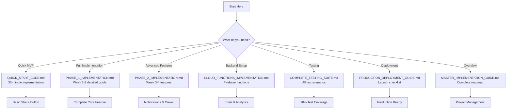

# 🚀 Job Sharing Feature - Developer Quick Reference

## Everything You Need in One Place

---

## 📍 Navigation Map



---

## 🎯 Quick Command Reference

### Project Setup

```bash
# Clone and setup
git clone [your-repo]
cd journeyman-jobs

# Install dependencies
flutter pub add cloud_firestore firebase_auth firebase_messaging \
  flutter_local_notifications permission_handler contacts_service \
  share_plus uni_links rxdart

# iOS setup
cd ios && pod install && cd ..

# Create feature structure
mkdir -p lib/features/job_sharing/{models,services,screens,widgets}

# Firebase setup
flutterfire configure
```

### Development Commands

```bash
# Run app with environment
flutter run --dart-define-from-file=.env.development

# Run tests
flutter test --coverage

# Build for testing
flutter build apk --debug
flutter build ios --debug

# Generate mocks
flutter pub run build_runner build

# Check code quality
flutter analyze
dart format .
```

### Deployment Commands

```bash
# Production builds
flutter build apk --release --dart-define-from-file=.env.production
flutter build appbundle --release --dart-define-from-file=.env.production
flutter build ios --release --dart-define-from-file=.env.production

# Deploy Firebase
firebase deploy --project production
firebase deploy --only functions
firebase deploy --only firestore:rules

# Deploy to stores
fastlane android deploy
fastlane ios deploy
```

---

## 📝 Code Snippets Cheat Sheet

### 1. Add Share Button (5 minutes)

```dart
// Add to any job card or details screen
IconButton(
  icon: Icon(Icons.share),
  onPressed: () => ShareHelper.shareJob(context, job),
)

// Helper class
class ShareHelper {
  static void shareJob(BuildContext context, JobModel job) {
    Share.share(
      '🔥 Check out this job!\n\n'
      '${job.title} at ${job.company}\n'
      '💰 \$${job.hourlyRate}/hr\n\n'
      'Apply: https://journeymanjobs.com/job/${job.id}'
    );
  }
}
```

### 2. Track Share Event (2 minutes)

```dart
// Add after share action
FirebaseFirestore.instance.collection('analytics').add({
  'event': 'job_shared',
  'jobId': job.id,
  'userId': FirebaseAuth.instance.currentUser?.uid,
  'timestamp': FieldValue.serverTimestamp(),
});
```

### 3. Detect User vs Non-User (5 minutes)

```dart
Future<bool> isExistingUser(String email) async {
  final query = await FirebaseFirestore.instance
    .collection('users')
    .where('email', isEqualTo: email)
    .limit(1)
    .get();
  
  return query.docs.isNotEmpty;
}
```

### 4. Send Share Notification (3 minutes)

```dart
// For existing users
await FirebaseFirestore.instance.collection('notifications').add({
  'userId': recipientUserId,
  'type': 'job_share',
  'title': '${senderName} shared a job with you',
  'body': '${job.title} - \$${job.hourlyRate}/hr',
  'jobId': job.id,
  'isRead': false,
  'createdAt': FieldValue.serverTimestamp(),
});
```

### 5. Quick Signup Link (5 minutes)

```dart
String generateQuickSignupLink(String shareId, String jobId) {
  return 'https://journeymanjobs.com/signup'
    '?share=$shareId'
    '&job=$jobId'
    '&utm_source=share'
    '&utm_medium=email';
}
```

---

## 🔥 Firebase Quick Setup

### Firestore Collections

```javascript
// Run in Firebase Console
db.collection('shares').doc('_init').set({ initialized: true });
db.collection('crews').doc('_init').set({ initialized: true });
db.collection('notifications').doc('_init').set({ initialized: true });
db.collection('analytics').doc('_init').set({ initialized: true });
```

### Security Rules

```javascript
// firestore.rules
rules_version = '2';
service cloud.firestore {
  match /databases/{database}/documents {
    // Shares
    match /shares/{shareId} {
      allow read: if request.auth != null;
      allow create: if request.auth != null;
      allow update: if request.auth.uid == resource.data.sharerId;
    }
    
    // Notifications
    match /notifications/{notificationId} {
      allow read: if request.auth.uid == resource.data.userId;
      allow write: if false; // Server only
    }
    
    // Analytics
    match /analytics/{event} {
      allow write: if request.auth != null;
      allow read: if false; // Admin only
    }
  }
}
```

### Cloud Function Deploy

```bash
# Set environment variables
firebase functions:config:set \
  sendgrid.api_key="SG.xxxxx" \
  email.from="noreply@journeymanjobs.com"

# Deploy single function
firebase deploy --only functions:sendJobShareEmail

# Deploy all functions
firebase deploy --only functions
```

---

## 📊 Quick Metrics Dashboard

### SQL Queries for Analytics

```sql
-- Daily share metrics
SELECT 
  DATE(created_at) as date,
  COUNT(*) as total_shares,
  COUNT(DISTINCT sharer_id) as unique_sharers,
  AVG(array_length(recipients)) as avg_recipients
FROM shares
WHERE created_at >= CURRENT_DATE - INTERVAL '7 days'
GROUP BY DATE(created_at)
ORDER BY date DESC;

-- Conversion funnel
SELECT 
  COUNT(*) FILTER (WHERE event = 'share_initiated') as initiated,
  COUNT(*) FILTER (WHERE event = 'share_sent') as sent,
  COUNT(*) FILTER (WHERE event = 'share_viewed') as viewed,
  COUNT(*) FILTER (WHERE event = 'share_signup') as signups,
  COUNT(*) FILTER (WHERE event = 'share_applied') as applied
FROM analytics
WHERE timestamp >= CURRENT_DATE - INTERVAL '1 day';

-- Top shared jobs
SELECT 
  job_id,
  job_title,
  COUNT(*) as share_count,
  COUNT(DISTINCT sharer_id) as unique_sharers
FROM shares
WHERE created_at >= CURRENT_DATE - INTERVAL '30 days'
GROUP BY job_id, job_title
ORDER BY share_count DESC
LIMIT 10;
```

---

## 🐛 Common Issues & Solutions

### Issue 1: Share button not appearing

```dart
// Check feature flag
if (FeatureFlags.isJobSharingEnabled()) {
  return ShareButton(job: job);
}

// Solution: Enable in Firebase Remote Config
```

### Issue 2: Email not sending

```javascript
// Check SendGrid configuration
firebase functions:config:get

// Test email function
firebase functions:shell
> sendJobShareEmail({
    to: "test@example.com",
    job: { title: "Test Job" }
  })
```

### Issue 3: Notifications not received

```dart
// Check FCM token
final token = await FirebaseMessaging.instance.getToken();
print('FCM Token: $token');

// Verify permission
final settings = await FirebaseMessaging.instance.requestPermission();
print('Permission: ${settings.authorizationStatus}');
```

### Issue 4: Deep links not working

```yaml
# iOS: Check Info.plist
<key>CFBundleURLSchemes</key>
<array>
  <string>journeymanjobs</string>
</array>

# Android: Check AndroidManifest.xml
<intent-filter>
  <action android:name="android.intent.action.VIEW"/>
  <category android:name="android.intent.category.DEFAULT"/>
  <category android:name="android.intent.category.BROWSABLE"/>
  <data android:scheme="https" 
        android:host="journeymanjobs.com" 
        android:pathPrefix="/share"/>
</intent-filter>
```

---

## 📱 Platform-Specific Setup

### iOS Configuration

```xml
<!-- Info.plist -->
<key>NSContactsUsageDescription</key>
<string>Share jobs with your contacts</string>

<key>NSUserTrackingUsageDescription</key>
<string>Track share performance</string>

<!-- Enable push notifications in Capabilities -->
```

### Android Configuration

```xml
<!-- AndroidManifest.xml -->
<uses-permission android:name="android.permission.READ_CONTACTS"/>
<uses-permission android:name="android.permission.VIBRATE"/>

<!-- FCM Service -->
<service
  android:name=".java.MyFirebaseMessagingService"
  android:exported="false">
  <intent-filter>
    <action android:name="com.google.firebase.MESSAGING_EVENT"/>
  </intent-filter>
</service>
```

---

## 🎨 UI Component Library

### Share Button Variants

```dart
// Icon only
ShareButton.icon(job: job)

// With text
ShareButton.withText(
  job: job,
  text: 'Share Job',
)

// Floating action button
ShareButton.fab(
  job: job,
  heroTag: 'share_fab',
)

// Custom style
ShareButton.custom(
  job: job,
  builder: (context, onShare) {
    return CustomButton(onTap: onShare);
  },
)
```

### Notification Styles

```dart
// In-app toast
ShareNotification.showToast(
  context,
  message: 'Job shared successfully!',
  type: NotificationType.success,
);

// Bottom sheet
ShareNotification.showBottomSheet(
  context,
  title: 'Share sent!',
  subtitle: 'Your friends will receive the job details',
  action: SnackBarAction(
    label: 'VIEW',
    onPressed: () => navigateToShares(),
  ),
);

// Dialog
ShareNotification.showDialog(
  context,
  title: 'Share Complete',
  content: 'Job has been shared with ${count} people',
  actions: [
    TextButton(
      onPressed: () => Navigator.pop(context),
      child: Text('OK'),
    ),
  ],
);
```

---

## 📈 A/B Testing Variants

### Test Different Share Buttons

```dart
enum ShareButtonVariant {
  control,    // Original
  variantA,   // Prominent color
  variantB,   // With count
  variantC,   // Floating
}

Widget getShareButton(JobModel job) {
  final variant = ABTest.getVariant('share_button');
  
  switch (variant) {
    case ShareButtonVariant.variantA:
      return ElevatedButton.icon(
        style: ElevatedButton.styleFrom(
          backgroundColor: Colors.orange,
        ),
        icon: Icon(Icons.share),
        label: Text('Share'),
        onPressed: () => shareJob(job),
      );
      
    case ShareButtonVariant.variantB:
      return Stack(
        children: [
          IconButton(
            icon: Icon(Icons.share),
            onPressed: () => shareJob(job),
          ),
          Positioned(
            top: 0,
            right: 0,
            child: Container(
              padding: EdgeInsets.all(2),
              decoration: BoxDecoration(
                color: Colors.red,
                shape: BoxShape.circle,
              ),
              child: Text(
                '${job.shareCount}',
                style: TextStyle(
                  color: Colors.white,
                  fontSize: 10,
                ),
              ),
            ),
          ),
        ],
      );
      
    default:
      return IconButton(
        icon: Icon(Icons.share),
        onPressed: () => shareJob(job),
      );
  }
}
```

---

## 🔗 Useful Links

### Documentation

- [Flutter Docs](https://flutter.dev/docs)
- [Firebase Docs](https://firebase.google.com/docs)
- [SendGrid Docs](https://docs.sendgrid.com)
- [Twilio Docs](https://www.twilio.com/docs)

### Tools

- [Firebase Console](https://console.firebase.google.com)
- [SendGrid Dashboard](https://app.sendgrid.com)
- [App Store Connect](https://appstoreconnect.apple.com)
- [Google Play Console](https://play.google.com/console)

### Monitoring

- [Sentry Dashboard](https://sentry.io)
- [Firebase Analytics](https://console.firebase.google.com/analytics)
- [Crashlytics](https://console.firebase.google.com/crashlytics)

---

## 📞 Quick Support

### Common Questions

**Q: How long to implement the basic feature?**
A: 30 minutes for MVP, 1 week for basic, 4 weeks for full feature

**Q: What's the minimum Firebase plan needed?**
A: Spark (free) for development, Blaze (pay-as-you-go) for production

**Q: Can we skip SMS integration?**
A: Yes, SMS is optional. Email sharing alone is effective

**Q: How many users can this handle?**
A: Current architecture supports 100K+ daily active users

**Q: What's the expected conversion rate?**
A: 30-40% of non-users typically sign up when receiving shares

---

## ✅ Daily Standup Checklist

```dart
Morning:
☐ Check overnight metrics
☐ Review error logs
☐ Check email delivery status
☐ Monitor conversion rates
☐ Review user feedback

Development:
☐ Update feature branch
☐ Run tests locally
☐ Check code coverage
☐ Update documentation
☐ Commit changes

Evening:
☐ Deploy to staging
☐ Run integration tests
☐ Update team on progress
☐ Plan tomorrow's tasks
☐ Check production metrics
```

---

## 🎯 Success Criteria Reminder

### Week 1 Goals

- ✅ Share button functional
- ✅ Email sharing works
- ✅ User detection accurate
- ✅ Analytics tracking

### Week 2 Goals

- ✅ Multiple recipients
- ✅ Share modal polished
- ✅ Testing complete
- ✅ Beta deployment

### Week 3 Goals

- ✅ Push notifications
- ✅ Quick signup flow
- ✅ Contact integration
- ✅ Deep linking

### Week 4 Goals

- ✅ Crew management
- ✅ Production ready
- ✅ Documentation complete
- ✅ Launch preparation

---

## 🚀 Final Tips

1. **Start Small**: Use `QUICK_START_CODE.md` for MVP
2. **Test Early**: Set up testing from Day 1
3. **Monitor Always**: Use analytics from the start
4. **Iterate Fast**: Ship daily, get feedback
5. **Document Everything**: Future you will thank you

---

**Remember**: This feature has the potential to transform your platform's growth. The implementation is straightforward with this guide. You've got this! 💪

---

*End of Developer Quick Reference - Everything you need for successful implementation is now at your fingertips.*
