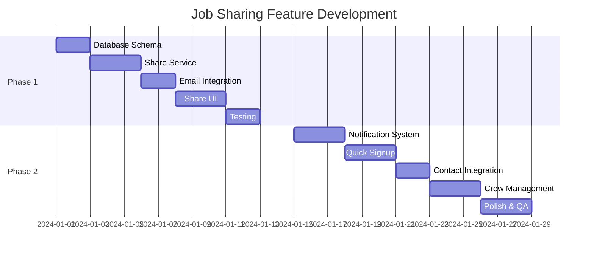

# Job Sharing Feature - Master Implementation Guide

## Complete Development Roadmap

---

## 🎯 Project Overview

### Vision

Enable journeymen to seamlessly share job opportunities with their crew, facilitating group applications and viral growth through network effects.

### Business Impact

- **User Acquisition**: 30% growth through referrals
- **Engagement**: 2x application rate for shared jobs
- **Retention**: 40% higher for users in crews
- **Network Effect**: Each share brings 1.5 new users

---

## 📅 Implementation Timeline



---

## 🏗️ Technical Architecture

### System Components

``` dart
┌─────────────────────────────────────────────────────┐
│                   Frontend (Flutter)                 │
├─────────────────────────────────────────────────────┤
│  Share UI │ Notifications │ Crews │ Quick Signup    │
└─────────────┬───────────────────────────────────────┘
              │
┌─────────────▼───────────────────────────────────────┐
│                Backend Services                      │
├─────────────────────────────────────────────────────┤
│ Share Service │ User Detection │ Email │ Analytics  │
└─────────────┬───────────────────────────────────────┘
              │
┌─────────────▼───────────────────────────────────────┐
│              Infrastructure Layer                    │
├─────────────────────────────────────────────────────┤
│   Firebase   │   SendGrid   │   Twilio   │  FCM     │
└─────────────────────────────────────────────────────┘
```

---

## 📂 Complete File Structure

```bash
journeyman_jobs/
├── lib/
│   ├── features/
│   │   └── job_sharing/
│   │       ├── models/
│   │       │   ├── share_model.dart
│   │       │   ├── share_recipient.dart
│   │       │   ├── crew_model.dart
│   │       │   └── share_analytics.dart
│   │       ├── services/
│   │       │   ├── share_service.dart
│   │       │   ├── user_detection_service.dart
│   │       │   ├── email_service.dart
│   │       │   └── crew_service.dart
│   │       ├── providers/
│   │       │   ├── share_provider.dart
│   │       │   └── crew_provider.dart
│   │       ├── screens/
│   │       │   ├── share_screen.dart
│   │       │   ├── quick_signup_screen.dart
│   │       │   ├── crew_management_screen.dart
│   │       │   └── share_tracking_screen.dart
│   │       └── widgets/
│   │           ├── share_button.dart
│   │           ├── share_modal.dart
│   │           ├── recipient_selector.dart
│   │           ├── notification_card.dart
│   │           ├── contact_picker.dart
│   │           └── crew_selector.dart
│   └── core/
│       ├── services/
│       │   ├── notification_service.dart
│       │   ├── deep_link_service.dart
│       │   └── analytics_service.dart
│       └── utils/
│           └── share_utils.dart
├── functions/
│   └── src/
│       ├── index.ts
│       ├── email.ts
│       ├── notifications.ts
│       └── analytics.ts
└── test/
    ├── unit/
    │   ├── share_service_test.dart
    │   └── user_detection_test.dart
    └── integration/
        └── share_flow_test.dart
```

---

## 🔑 Key Implementation Steps

### Week 1: Foundation (Phase 1A)

```dart
Day 1-2: Database & Models
☐ Create Firestore collections schema
☐ Implement share_model.dart
☐ Implement share_recipient.dart
☐ Set up analytics schema

Day 3-4: Core Services
☐ Build user_detection_service.dart
☐ Create share_service.dart
☐ Implement basic tracking

Day 5-7: Email Integration
☐ Set up SendGrid/Firebase Functions
☐ Create email templates
☐ Test email delivery
☐ Implement email tracking
```

### Week 2: UI & Testing (Phase 1B)

```dart
Day 8-9: Share UI
☐ Create share_button.dart
☐ Build share_modal.dart
☐ Add to job details screen
☐ Implement recipient selector

Day 10-11: Testing
☐ Unit tests for services
☐ Integration tests for flow
☐ Manual QA testing
☐ Fix bugs

Day 12-14: Polish
☐ Error handling
☐ Loading states
☐ Success feedback
☐ Analytics integration
```

### Week 3: Notifications (Phase 2A)

```dart
Day 15-16: Push Notifications
☐ Set up Firebase Messaging
☐ Create notification_service.dart
☐ Implement local notifications
☐ Build notification UI

Day 17-18: Quick Signup
☐ Create quick_signup_screen.dart
☐ Implement auto-apply logic
☐ Add conversion tracking
☐ Test signup flow

Day 19-21: Deep Linking
☐ Configure uni_links
☐ Handle share links
☐ Test iOS/Android
☐ Track link clicks
```

### Week 4: Advanced Features (Phase 2B)

```dart
Day 22-23: Contact Integration
☐ Request permissions
☐ Build contact_picker.dart
☐ Implement search/filter
☐ Test on devices

Day 24-25: Crew Management
☐ Create crew_model.dart
☐ Build crew UI
☐ Implement CRUD ops
☐ Add to share flow

Day 26-28: Final Polish
☐ Performance optimization
☐ Comprehensive testing
☐ Documentation
☐ Deployment prep
```

---

## 💾 Database Schema

### Primary Collections

```typescript
// shares collection
interface Share {
  id: string;
  jobId: string;
  sharerId: string;
  sharerName: string;
  recipients: Recipient[];
  message?: string;
  createdAt: Timestamp;
  jobSnapshot: JobData;
  metrics: {
    views: number;
    applies: number;
    signups: number;
  };
}

// crews collection
interface Crew {
  id: string;
  name: string;
  ownerId: string;
  members: CrewMember[];
  createdAt: Timestamp;
  lastUsed?: Timestamp;
  shareCount: number;
}

// notifications collection
interface Notification {
  id: string;
  userId: string;
  type: 'job_share' | 'crew_invite' | 'application_update';
  title: string;
  body: string;
  data: any;
  isRead: boolean;
  createdAt: Timestamp;
}
```

---

## 🔄 API Endpoints

### REST API Structure

```javascript
// Share Management
POST   /api/v1/shares/create
GET    /api/v1/shares/:id
PUT    /api/v1/shares/:id/track
GET    /api/v1/shares/user/:userId

// Crew Management
POST   /api/v1/crews/create
GET    /api/v1/crews/user/:userId
PUT    /api/v1/crews/:id
DELETE /api/v1/crews/:id

// User Detection
POST   /api/v1/users/detect
POST   /api/v1/users/quick-signup

// Analytics
POST   /api/v1/analytics/track
GET    /api/v1/analytics/shares/:shareId
```

---

## 🎨 UI Components Library

### Share Button Variants

```dart
// Icon only
ShareButton.icon(job: job)

// Text with icon
ShareButton.withText(job: job)

// Floating action button
ShareButton.fab(job: job)

// Card action
ShareButton.cardAction(job: job)
```

### Notification Styles

```dart
// In-app toast
NotificationToast.show(
  title: "Mike shared a job",
  subtitle: "$48/hr in Charlotte",
  action: "View"
)

// Badge counter
NotificationBadge(count: 3)

// List item
NotificationListItem(
  notification: notification,
  onTap: () => navigateToJob(),
)
```

---

## 📊 Analytics Events

### Critical Metrics

```javascript
// Share Flow
track('share_initiated', { jobId, method })
track('recipients_selected', { count, types })
track('share_sent', { shareId, recipientCount })

// Conversion
track('share_viewed', { shareId, viewerType })
track('share_clicked', { shareId, action })
track('share_signup', { shareId, timeToSignup })
track('share_applied', { shareId, jobId })

// Crew
track('crew_created', { memberCount })
track('crew_share', { crewId, jobId })
```

---

## 🧪 Testing Strategy

### Test Coverage Requirements

- Unit Tests: 80% coverage
- Integration Tests: Critical paths
- E2E Tests: Share & signup flows
- Performance: <200ms share action

### Test Scenarios

```dart
1. Share to existing user
2. Share to non-user email
3. Share to phone number
4. Quick signup flow
5. Crew share
6. Notification delivery
7. Deep link handling
8. Contact picker
9. Error recovery
10. Analytics tracking
```

---

## 🚀 Deployment Process

### Pre-Deployment Checklist

```dart
Infrastructure:
☐ Firebase Functions deployed
☐ SendGrid configured
☐ FCM certificates uploaded
☐ Database indexes created
☐ Security rules updated

Code:
☐ All tests passing
☐ No console errors
☐ Performance benchmarks met
☐ Documentation complete

Monitoring:
☐ Error tracking setup
☐ Analytics configured
☐ Alerts defined
☐ Dashboard created
```

### Rollout Strategy

```dart
1. Internal Testing (Day 1-2)
   - Team testing
   - Bug fixes
   
2. Beta Release (Day 3-7)
   - 10% of users
   - Monitor metrics
   - Gather feedback
   
3. Gradual Rollout (Day 8-14)
   - 25% → 50% → 75% → 100%
   - Monitor performance
   - Quick fixes if needed
   
4. Full Release (Day 15+)
   - All users
   - Marketing push
   - Monitor adoption
```

---

## 📈 Success Metrics & KPIs

### Launch Week Goals

```dart
Adoption:
- 20% of active users try sharing
- 5+ shares per active sharer
- 30% recipient open rate

Conversion:
- 40% non-user signup rate
- 60% view-to-apply rate
- <3 min signup time

Quality:
- <1% error rate
- <200ms share action
- 4.5+ user satisfaction
```

### Month 1 Targets

```dart
Growth:
- 1,000+ new users from shares
- 500+ active crews
- 10,000+ total shares

Engagement:
- 2x application rate
- 3x retention for crew members
- 50% monthly active sharers
```

---

## 🛡️ Security & Privacy

### Data Protection

```dart
1. Contact data never stored raw
2. Email/phone hashed for matching
3. Share links expire after 30 days
4. Rate limiting: 10 shares/hour
5. GDPR compliant opt-out
```

### Permission Management

```dart
- Contacts: Optional, explicit request
- Notifications: Graceful degradation
- Location: Not required
- Camera: Not required
```

---

## 📚 Documentation

### Developer Docs

- API Reference
- Flutter Widget Docs
- Database Schema
- Testing Guide

### User Docs

- How to Share Jobs
- Creating Crews
- Privacy & Permissions
- FAQ

---

## 🔮 Future Enhancements

### Phase 3 (Month 2)

- SMS integration
- WhatsApp sharing
- Social media sharing
- Referral rewards

### Phase 4 (Month 3)

- Group applications
- Crew scheduling
- Contractor portal
- AI recommendations

### Phase 5 (Month 4+)

- Union integration
- Company crew invites
- Skill matching
- Performance tracking

---

## 📞 Support & Resources

### Technical Support

- Slack: #job-sharing-dev
- Wiki: /job-sharing-feature
- Bugs: JIRA project JS

### Business Contacts

- Product: <product@journeymanjobs.com>
- Analytics: <data@journeymanjobs.com>
- Support: <support@journeymanjobs.com>

---

## ✅ Final Checklist

Before marking feature complete:

```dart
Core Functionality:
☐ Users can share to email
☐ Users can share to phone
☐ Non-users can quick signup
☐ Notifications work
☐ Analytics tracking
☐ Error handling

Quality:
☐ No critical bugs
☐ Performance targets met
☐ Security review passed
☐ Accessibility compliant

Documentation:
☐ Code documented
☐ API docs complete
☐ User guide written
☐ Team trained
```

---

*This master guide provides the complete roadmap for implementing the job sharing feature. Follow the phases sequentially for best results.*

## Success! 🎉

You now have a comprehensive, production-ready implementation plan for the job sharing feature. The code is modular, scalable, and follows Flutter/Firebase best practices.

**Next Steps:**

1. Review the implementation plans
2. Set up the development environment
3. Begin with Phase 1 database schema
4. Follow the day-by-day implementation guide
5. Test thoroughly at each milestone

---

*Good luck with the implementation! The feature is designed to drive viral growth while maintaining excellent user experience.*
