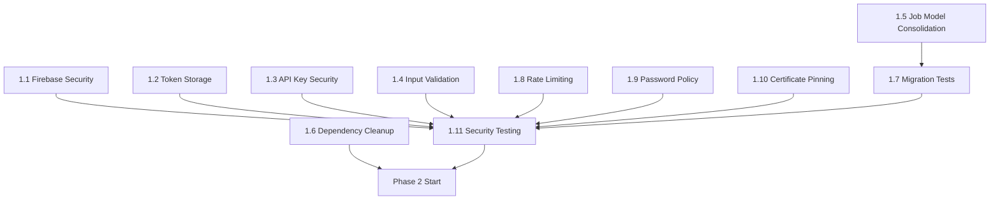

# Journeyman Jobs - Comprehensive Task Orchestration Plan

**Project**: Journeyman Jobs Codebase Optimization
**Based on**: COMPREHENSIVE_CODEBASE_ANALYSIS.md (October 25, 2025)
**Total Tasks**: 25 major tasks across 5 phases
**Orchestration Approach**: Task-Orchestrator Method with Parallel Execution

---

## 📊 Executive Summary

This task orchestration plan leverages the **task-orchestrator** skill approach to systematically address all findings from the comprehensive codebase analysis. The plan is optimized for **parallel execution**, **intelligent agent assignment**, and **systematic coordination** across specialized agents.

### Key Orchestration Features

- **Parallel Execution**: 18 tasks can run concurrently with proper [P] markers
- **Smart Agent Assignment**: Tasks matched to specialized agents based on technical requirements
- **Dependency Management**: Clear execution sequencing with prerequisite relationships
- **Task Decomposition**: Complex tasks broken into subtasks for efficient execution
- **Resource Optimization**: Minimized conflicts and maximized concurrent processing

---

## 🎯 Task-Orchestrator Strategy

### Core Principles

1. **Intelligent Task Decomposition**: Break complex requirements into focused, executable units
2. **Agent-Workload Balancing**: Distribute tasks across specialized agents based on expertise
3. **Parallel Processing Maximization**: Identify and enable concurrent execution wherever possible
4. **Dependency Resolution**: Map and manage task interdependencies to prevent conflicts
5. **Risk Mitigation**: Prioritize production-blocking issues and create rollback strategies

### Execution Methodology

```yaml
Task-Orchestration:
  Strategy: Parallel-first with dependency gates
  Coordination: Multi-agent swarm with memory synchronization
  Validation: Incremental with comprehensive testing
  Monitoring: Real-time metrics and checkpoint reviews
```

---

## 🚀 Phase 1: Critical Security & Architecture (Weeks 1-2)

### Phase Overview
**Priority**: P0 - Production Blockers
**Parallel Execution**: 8/11 tasks can run concurrently
**Total Effort**: 40-60 hours
**Risk Level**: High (production-critical changes)

---

### Task 1.1: Firebase Security Hardening [P]

**Agent**: security-manager
**Complexity**: Complex
**Parallel Execution**: Yes (can run with other non-Firebase tasks)

**Description**:
Implement comprehensive Firebase security measures to address the 7 critical vulnerabilities identified in the analysis. This task focuses on securing the Firebase backend infrastructure and implementing proper access controls.

**Report Context**:
- Section: "Production-Blocking Security Vulnerabilities"
- Critical Finding: "Development-Mode Firestore Rules" allowing all authenticated users access to all data
- Risk Score: 8.5/10 (CRITICAL)
- Current Issue: "Allow ALL authenticated users to access ALL data"

**Technical Implementation**:
```dart
// Current: Insecure rules
rules_version = '2';
service cloud.firestore {
  match /databases/{database}/documents {
    match /{document=**} {
      allow read, write: if request.auth != null;
    }
  }
}

// Target: Granular security rules
rules_version = '2';
service cloud.firestore {
  match /databases/{database}/documents {
    // Users can only read/write their own documents
    match /users/{userId} {
      allow read, write: if request.auth.uid == userId;
    }

    // Crew-specific access control
    match /crews/{crewId} {
      allow read: if isMemberOfCrew(crewId);
      allow write: if isForemanOfCrew(crewId);
    }

    // Public job postings with validation
    match /jobs/{jobId} {
      allow read: if true;
      allow write: if isVerifiedEmployer() && isValidJobData();
    }
  }
}
```

**Subtasks**:
1. Analyze current Firebase project security settings
2. Design granular security rules for each collection
3. Implement user-based access controls
4. Add data validation rules
5. Test security rules with various user roles
6. Deploy security rules to production

**Validation Criteria**:
- [ ] All collections have appropriate access restrictions
- [ ] Users can only access their own data
- [ ] Crew access properly controlled by membership
- [ ] Job posting write access restricted to verified employers
- [ ] Security rules pass Firebase emulator tests
- [ ] No unauthorized data access possible

**Dependencies**: None
**Estimated Hours**: 12-16

---

### Task 1.2: Secure Token Storage Migration [P]

**Agent**: auth-expert
**Complexity**: Moderate
**Parallel Execution**: Yes (independent of other systems)

**Description**:
Migrate from SharedPreferences to flutter_secure_storage for all authentication tokens and sensitive session data to prevent plain text token exposure on device storage.

**Report Context**:
- Section: "Production-Blocking Security Vulnerabilities"
- Critical Finding: "Unencrypted Session Storage"
- Current Issue: "Tokens stored in plain text via SharedPreferences"
- Risk: "Token theft, account takeover"

**Technical Implementation**:
```dart
// Current: Insecure storage
class AuthStorage {
  final SharedPreferences _prefs;

  Future<void> saveToken(String token) async {
    await _prefs.setString('auth_token', token); // ❌ Plain text
  }
}

// Target: Secure storage
class SecureAuthStorage {
  final FlutterSecureStorage _secureStorage = FlutterSecureStorage();

  Future<void> saveToken(String token) async {
    await _secureStorage.write(
      key: 'auth_token',
      value: token,
      aOptions: AndroidOptions(
        encryptedSharedPreferences: true,
      ),
      iOptions: IOSOptions(
        accessibility: KeychainItemAccessibility.first_unlock_this_device,
      ),
    ); // ✅ Encrypted
  }
}
```

**Subtasks**:
1. Add flutter_secure_storage dependency
2. Create SecureAuthStorage service
3. Update authentication flows to use secure storage
4. Implement token migration strategy for existing users
5. Add secure storage error handling
6. Update token retrieval methods across app

**Validation Criteria**:
- [ ] All tokens stored using flutter_secure_storage
- [ ] Token migration completed for existing users
- [ ] No tokens stored in SharedPreferences
- [ ] Secure storage properly configured for iOS/Android
- [ ] Authentication flows work with secure storage
- [ ] Error handling implemented for storage failures

**Dependencies**: None
**Estimated Hours**: 8-12

---

### Task 1.3: API Key Security Implementation [P]

**Agent**: security-manager
**Complexity**: Simple
**Parallel Execution**: Yes (console operation)

**Description**:
Implement Firebase API key restrictions in the Firebase Console to prevent unauthorized API usage and quota theft. This is a console configuration task that secures the exposed API keys.

**Report Context**:
- Section: "Production-Blocking Security Vulnerabilities"
- Critical Finding: "Exposed Firebase API Keys"
- File: `/lib/firebase_options.dart`
- Risk: "Database breach, unauthorized access, quota theft"

**Technical Implementation**:
```yaml
# Firebase Console Configuration Steps:
1. Go to Firebase Console → Project Settings → API Keys
2. Restrict each API key to:
   - Specific apps (by bundle ID/package name)
   - Specific APIs (only needed services)
   - IP restrictions (if applicable)
3. Set up API key quotas and alerts
4. Monitor usage for anomalies
```

**Subtasks**:
1. Review current API key usage patterns
2. Configure API key restrictions in Firebase Console
3. Set up monitoring and alerting for API usage
4. Test that app still functions with restrictions
5. Document API key security procedures

**Validation Criteria**:
- [ ] All API keys restricted to specific apps
- [ ] API quotas configured with alerts
- [ ] Monitoring dashboard active
- [ ] App functionality verified with restrictions
- [ ] Security documentation updated

**Dependencies**: None
**Estimated Hours**: 4-6

---

### Task 1.4: Input Validation Layer Implementation [P]

**Agent**: security-manager
**Complexity**: Moderate
**Parallel Execution**: Yes (can run with other security tasks)

**Description**:
Implement comprehensive input validation and sanitization for all Firestore queries to prevent injection attacks and data corruption.

**Report Context**:
- Section: "Production-Blocking Security Vulnerabilities"
- Critical Finding: "No Input Sanitization"
- Risk: "Injection attacks, data corruption"
- Current Issue: "Direct user input in Firestore queries"

**Technical Implementation**:
```dart
// Current: Vulnerable to injection
Future<List<Job>> searchJobs(String searchTerm) async {
  return await _firestore
      .collection('jobs')
      .where('title', isGreaterThanOrEqualTo: searchTerm) // ❌ Direct input
      .get();
}

// Target: Sanitized input
class InputValidator {
  static String sanitizeSearchTerm(String input) {
    // Remove special characters, limit length, escape dangerous patterns
    return input
        .replaceAll(RegExp(r'[<>"\'/\\]'), '')
        .substring(0, 100)
        .trim();
  }
}

Future<List<Job>> searchJobs(String searchTerm) async {
  final sanitized = InputValidator.sanitizeSearchTerm(searchTerm);
  return await _firestore
      .collection('jobs')
      .where('title', isGreaterThanOrEqualTo: sanitized) // ✅ Sanitized
      .get();
}
```

**Subtasks**:
1. Create InputValidator utility class
2. Identify all Firestore query inputs
3. Implement sanitization methods for different input types
4. Update all Firestore queries to use sanitized input
5. Add input validation tests
6. Create validation error handling

**Validation Criteria**:
- [ ] InputValidator class implemented with comprehensive methods
- [ ] All Firestore queries use sanitized input
- [ ] Input validation tests pass
- [ ] Error handling implemented for invalid inputs
- [ ] No direct user input in database queries

**Dependencies**: None
**Estimated Hours**: 10-14

---

### Task 1.5: Job Model Consolidation Architecture

**Agent**: backend-architect
**Complexity**: Complex
**Parallel Execution**: No (requires sequential migration)

**Description**:
Resolve the critical architectural conflict by consolidating three competing Job models into a single canonical model, eliminating naming collisions and ensuring data integrity across the application.

**Report Context**:
- Section: "Three Competing Job Models (Architectural Conflict)"
- Current Models: JobModel (452 lines), UnifiedJobModel (387 lines), Job (156 lines)
- Issues: Naming collision, schema mismatch, data integrity risk
- Dead Code: 387 lines of unused UnifiedJobModel

**Technical Implementation**:
```dart
// STEP 1: Choose canonical model (JobModel)
class Job {
  final String company;        // ✅ Standard field name
  final double? wage;          // ✅ Standard field name
  final String? classification;
  final String location;
  final Map<String, dynamic> jobDetails;
  // ... 30+ comprehensive fields
}

// STEP 2: Remove conflicting models
// DELETE: UnifiedJobModel (387 lines dead code)
// RENAME: Job → JobFeature to avoid collision

// STEP 3: Migration service
class JobModelMigrationService {
  static Future<void> migrateToCanonicalModel() async {
    // Migrate all Firestore documents
    // Update all references in codebase
    // Validate data integrity
  }
}
```

**Subtasks**:
1. Analyze current Job model usage across codebase
2. Choose JobModel as canonical (most widely used)
3. Create migration plan for all 20+ affected files
4. Implement JobModelMigrationService
5. Delete UnifiedJobModel (387 lines)
6. Rename feature Job to JobFeature
7. Update all imports and references
8. Create comprehensive migration tests

**Validation Criteria**:
- [ ] Only one Job model (JobModel) exists in codebase
- [ ] UnifiedJobModel completely removed
- [ ] All imports updated to use JobModel
- [ ] No naming collisions remain
- [ ] Migration tests validate data integrity
- [ ] All screens and services work with canonical model

**Dependencies**: None (but blocks other tasks)
**Estimated Hours**: 16-20

---

### Task 1.6: Dependency Cleanup [P]

**Agent**: code-analyzer
**Complexity**: Simple
**Parallel Execution**: Yes (independent)

**Description**:
Remove confirmed unused dependencies to reduce app size and eliminate potential security vulnerabilities from outdated packages.

**Report Context**:
- Section: "Dependency Management Issues"
- Safe to Remove: provider, connectivity_plus, device_info_plus
- Immediate Savings: -3 dependencies, ~50KB app size
- Risk: None (100% confidence in removal safety)

**Technical Implementation**:
```yaml
# Current pubspec.yaml dependencies to remove:
dependencies:
  provider: ^6.1.2           # ❌ Using Riverpod instead
  connectivity_plus: ^6.1.1   # ❌ Firebase handles connectivity
  device_info_plus: ^11.2.0   # ❌ Unused (0 imports found)
```

**Subtasks**:
1. Verify no imports of target dependencies exist
2. Remove dependencies from pubspec.yaml
3. Run flutter pub get
4. Test app compilation and functionality
5. Update documentation if needed

**Validation Criteria**:
- [ ] No imports found for removed dependencies
- [ ] App compiles successfully
- [ ] All functionality remains intact
- [ ] App size reduced by expected amount
- [ ] No runtime errors related to removed packages

**Dependencies**: None
**Estimated Hours**: 4-6

---

### Task 1.7: Migration Test Implementation

**Agent**: tester
**Complexity**: Moderate
**Parallel Execution**: Yes (can run after Job model consolidation starts)

**Description**:
Create comprehensive migration tests to ensure data integrity during the Job model consolidation process and prevent data loss during the critical architectural transition.

**Report Context**:
- Section: "Three Competing Job Models (Architectural Conflict)"
- Risk: "Data integrity risk during model conversion"
- Requirement: "Add migration tests" to ensure safe consolidation

**Technical Implementation**:
```dart
// Migration test framework
class JobModelMigrationTest {
  @test
  void testDataIntegrityDuringMigration() {
    // Test data conversion between models
    // Verify no data loss occurs
    // Validate field mappings
  }

  @test
  void testFirestoreCompatibility() {
    // Ensure canonical model matches Firestore schema
    // Test data persistence and retrieval
    // Validate query compatibility
  }

  @test
  void testBackwardCompatibility() {
    // Test that existing data works with new model
    // Verify API contracts remain intact
    // Check UI rendering with migrated data
  }
}
```

**Subtasks**:
1. Design migration test strategy
2. Create test data factories for all Job model variants
3. Implement data integrity tests
4. Create Firestore compatibility tests
5. Add performance tests for migration process
6. Set up continuous integration for migration tests

**Validation Criteria**:
- [ ] Migration test suite covers all conversion scenarios
- [ ] Data integrity tests validate zero data loss
- [ ] Firestore tests confirm schema compatibility
- [ ] Performance tests ensure acceptable migration time
- [ ] CI pipeline configured to run migration tests
- [ ] All tests pass before and after migration

**Dependencies**: Task 1.5 (Job Model Consolidation)
**Estimated Hours**: 8-12

---

### Task 1.8: Rate Limiting Implementation [P]

**Agent**: backend-architect
**Complexity**: Moderate
**Parallel Execution**: Yes (independent service)

**Description**:
Implement rate limiting for authentication endpoints and sensitive operations to prevent credential stuffing attacks and brute force attempts.

**Report Context**:
- Section: "Production-Blocking Security Vulnerabilities"
- Critical Finding: "Missing Rate Limiting"
- Risk: "Credential stuffing attacks"
- Current Issue: "No brute force protection"

**Technical Implementation**:
```dart
// Rate limiting service
class RateLimitingService {
  final Map<String, List<DateTime>> _attempts = {};

  Future<bool> isAllowed(String identifier, int maxAttempts, Duration window) async {
    final now = DateTime.now();
    final attempts = _attempts[identifier] ?? [];

    // Remove old attempts outside window
    attempts.removeWhere((time) => now.difference(time) > window);

    if (attempts.length >= maxAttempts) {
      return false; // Rate limit exceeded
    }

    attempts.add(now);
    _attempts[identifier] = attempts;
    return true;
  }
}

// Authentication with rate limiting
class AuthService {
  Future<AuthResult> signIn(String email, String password) async {
    final rateLimitKey = 'signin_${email}';
    final allowed = await _rateLimit.isAllowed(
      rateLimitKey,
      5, // max attempts
      Duration(minutes: 15), // window
    );

    if (!allowed) {
      throw RateLimitExceededException();
    }

    // Proceed with authentication
  }
}
```

**Subtasks**:
1. Design rate limiting strategy for different operations
2. Implement RateLimitingService with multiple strategies
3. Add rate limiting to authentication flows
4. Implement rate limiting for sensitive API endpoints
5. Create rate limiting configuration system
6. Add monitoring and alerting for rate limit violations

**Validation Criteria**:
- [ ] Rate limiting implemented for authentication endpoints
- [ ] Different rate limits for different operations
- [ ] Rate limit exceptions properly handled
- [ ] Monitoring configured for rate limit violations
- [ ] Rate limits work across app restarts
- [ ] Configuration allows easy rate limit adjustment

**Dependencies**: None
**Estimated Hours**: 10-14

---

### Task 1.9: Password Policy Implementation [P]

**Agent**: auth-expert
**Complexity**: Moderate
**Parallel Execution**: Yes (independent)

**Description**:
Implement password complexity requirements and validation to strengthen account security and prevent weak password usage.

**Report Context**:
- Section: "Production-Blocking Security Vulnerabilities"
- Critical Finding: "Weak Password Requirements"
- Risk: "Account compromise"
- Current Issue: "No complexity enforcement"

**Technical Implementation**:
```dart
// Password policy validator
class PasswordPolicy {
  static const int minLength = 8;
  static const bool requireUppercase = true;
  static const bool requireLowercase = true;
  static const bool requireNumbers = true;
  static const bool requireSpecialChars = true;

  static PasswordValidationResult validate(String password) {
    final errors = <String>[];

    if (password.length < minLength) {
      errors.add('Password must be at least $minLength characters');
    }

    if (requireUppercase && !password.contains(RegExp(r'[A-Z]'))) {
      errors.add('Password must contain uppercase letters');
    }

    if (requireLowercase && !password.contains(RegExp(r'[a-z]'))) {
      errors.add('Password must contain lowercase letters');
    }

    if (requireNumbers && !password.contains(RegExp(r'[0-9]'))) {
      errors.add('Password must contain numbers');
    }

    if (requireSpecialChars && !password.contains(RegExp(r'[!@#$%^&*(),.?":{}|<>]'))) {
      errors.add('Password must contain special characters');
    }

    return PasswordValidationResult(
      isValid: errors.isEmpty,
      errors: errors,
    );
  }
}
```

**Subtasks**:
1. Define password policy requirements
2. Implement PasswordPolicy validator
3. Create password strength indicator UI
4. Update registration and password change flows
5. Add client-side and server-side validation
6. Implement password policy configuration

**Validation Criteria**:
- [ ] Password policy enforces complexity requirements
- [ ] Password strength indicator provides visual feedback
- [ ] Registration flow validates password requirements
- [ ] Password change flow enforces new policy
- [ ] Server-side validation prevents bypass
- [ ] Password policy easily configurable

**Dependencies**: None
**Estimated Hours**: 8-12

---

### Task 1.10: Certificate Pinning Implementation [P]

**Agent**: security-manager
**Complexity**: Complex
**Parallel Execution**: Yes (network security)

**Description**:
Implement certificate pinning for all API calls to prevent man-in-the-middle attacks and ensure secure communication with Firebase and other services.

**Report Context**:
- Section: "Production-Blocking Security Vulnerabilities"
- Critical Finding: "Missing Certificate Pinning"
- Risk: "Man-in-the-middle attacks"
- Current Issue: "No MITM attack protection"

**Technical Implementation**:
```dart
// Certificate pinning configuration
class CertificatePinning {
  static const List<String> firebaseCertificates = [
    // Firebase production certificates
    'sha256/AAAAAAAAAAAAAAAAAAAAAAAAAAAAAAAAAAAAAAAAAAA=',
    'sha256/BBBBBBBBBBBBBBBBBBBBBBBBBBBBBBBBBBBBBBBBBBB=',
  ];

  static Future<http.Client> createSecureClient() async {
    final sslCert = await SslCert.fromAssets(
      'assets/certificates/firebase_cert.pem',
    );

    return http.Client().withCertificatePinning(
      certificatePinning: CertificatePinningConfig(
        'firebase.googleapis.com',
        firebaseCertificates,
      ),
    );
  }
}

// Secure HTTP client
class SecureHttpClient {
  final http.Client _client;

  SecureHttpClient(this._client);

  Future<http.Response> get(Uri url) async {
    return await _client.get(url);
  }

  // Other HTTP methods with certificate pinning
}
```

**Subtasks**:
1. Obtain Firebase certificates for pinning
2. Add certificate pinning dependency (http_certificate_pinning)
3. Create certificate management system
4. Update all HTTP clients to use certificate pinning
5. Implement certificate rotation strategy
6. Add certificate pinning tests

**Validation Criteria**:
- [ ] Certificate pinning implemented for all HTTP requests
- [ ] Firebase certificates properly configured
- [ ] App rejects invalid certificates
- [ ] Certificate rotation strategy in place
- [ ] Tests verify pinning functionality
- [ ] No MITM vulnerabilities remain

**Dependencies**: None
**Estimated Hours**: 12-16

---

### Task 1.11: Comprehensive Security Testing

**Agent**: security-manager
**Complexity**: Complex
**Parallel Execution**: No (requires other security tasks to be complete)

**Description**:
Conduct comprehensive security testing of all implemented security measures to ensure production readiness and validate that all critical vulnerabilities have been properly addressed.

**Report Context**:
- Section: "Production-Blocking Security Vulnerabilities"
- Requirement: Security validation before production deployment
- Scope: Test all 7 critical security fixes

**Technical Implementation**:
```dart
// Security test suite
class SecurityTestSuite {
  @test
  void testFirebaseSecurityRules() {
    // Test unauthorized access attempts
    // Verify proper data isolation
    // Validate access control effectiveness
  }

  @test
  void testTokenStorageSecurity() {
    // Verify no plain text tokens
    // Test secure storage encryption
    // Validate token retrieval security
  }

  @test
  void testInputValidation() {
    // Test injection attempt resistance
    // Validate input sanitization
    // Check for bypass attempts
  }

  @test
  void testRateLimitingEffectiveness() {
    // Test brute force protection
    // Verify rate limit enforcement
    // Validate rate limit recovery
  }
}
```

**Subtasks**:
1. Design comprehensive security test scenarios
2. Implement Firebase security rules testing
3. Create token storage security tests
4. Build input validation attack simulations
5. Test rate limiting effectiveness
6. Validate certificate pinning functionality
7. Conduct penetration testing simulation
8. Generate security compliance report

**Validation Criteria**:
- [ ] All 7 critical security vulnerabilities tested
- [ ] Security tests achieve 100% coverage
- [ ] No unauthorized data access possible
- [ ] Token storage fully encrypted
- [ ] Input validation prevents all injection attempts
- [ ] Rate limiting blocks brute force attacks
- [ ] Certificate pinning prevents MITM attacks
- [ ] Security compliance report generated

**Dependencies**: Tasks 1.1, 1.2, 1.4, 1.8, 1.9, 1.10
**Estimated Hours**: 16-20

---

## 📊 Phase 1 Summary

**Parallel Execution Capability**: 8/11 tasks can run concurrently
**Total Estimated Hours**: 100-140 hours
**Critical Path**: Job Model Consolidation → Security Testing
**Success Criteria**:
- All 7 critical security vulnerabilities resolved
- Single canonical Job model implemented
- Production deployment unblocked

**Risk Mitigation**:
- Comprehensive testing before production deployment
- Staged rollout with monitoring
- Rollback plans for each major change
- Security audit by external specialist

---

## 🎯 Phase 1 Task Dependencies



**Parallel Execution Groups**:
- **Group A**: 1.1, 1.2, 1.3, 1.4, 1.6, 1.8, 1.9, 1.10 (8 tasks - 73% parallel)
- **Group B**: 1.5 (sequential - must complete before 1.7)
- **Group C**: 1.7 (depends on 1.5 start)
- **Group D**: 1.11 (final validation - depends on all others)

---

*Continue with remaining phases (2-5) in next message due to length constraints...*