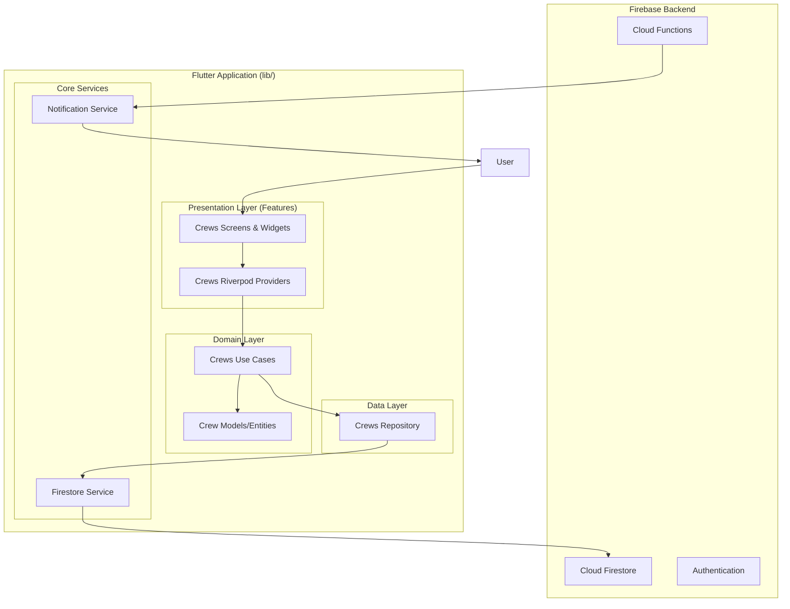

Excellent. Here is the complete and final Fullstack Architecture Document for the "Crews" feature. I recommend you save this as `docs/architecture.md` in your project folder.

---

# **Journeyman Jobs - "Crews" Feature Fullstack Architecture Document**

| Date       | Version | Description                                   | Author  |
| :--------- | :------ | :-------------------------------------------- | :------ |
| 2024-05-24 | 1.0     | Initial draft based on PRD and repo structure | Winston |

### **1. Introduction**

This document outlines the complete fullstack architecture for the "Crews" Feature, including the Flutter frontend implementation, the Firebase backend systems, and their integration. It serves as the single source of truth for development, ensuring all new components adhere to the application's established architectural patterns. This feature is an enhancement to a mature, existing Flutter application, and the architecture is designed to integrate seamlessly into the project's established Polyrepo, Clean Architecture, and Feature-Sliced Design patterns.

### **2. High Level Architecture**

The application employs a robust architecture based on Clean Architecture principles. The presentation layer is organized using a Feature-Sliced Design, with state management and dependency injection handled by Riverpod. The backend is a serverless architecture leveraging Firebase.

#### **High Level Project Diagram**



### **3. Tech Stack**

| Category | Technology | Version | Purpose | Rationale |
| :--- | :--- | :--- | :--- | :--- |
| **Frontend Language** | Dart | ~3.x.x | Primary language for Flutter | Native language for Flutter |
| **Frontend Framework**| Flutter | ~3.x.x | UI toolkit for mobile app | Existing application framework |
| **State Management**| Riverpod / flutter\_riverpod | ~2.5.1 | State management & DI | Established pattern in the app |
| **Backend Platform** | Firebase | latest | Backend-as-a-Service | Existing backend infrastructure |
| **Database** | Cloud Firestore | N/A | NoSQL document database | Existing application database |
| **Backend Logic** | Firebase Cloud Functions | N/A | Serverless functions | For job matching & notifications |
| **Authentication** | Firebase Authentication| N/A | User authentication service | Existing authentication system |
| **Notifications** | Firebase Cloud Messaging| N/A | Push notifications | For notifying crews of jobs |
| **External SMS** | Twilio (or similar) | TBD | Inviting non-users via SMS | Required by PRD for growth loop|
| **Testing** | flutter\_test / Mockito | latest | Unit & Widget testing | Standard Flutter testing stack |

### **4. Data Models**

New data will be stored in a top-level `crews` collection in Firestore with the following structure:

* **/crews/{crewId}**: Root document for a crew.
  * **Data:** `name`, `foremanUserId`, `memberUserIds`, `preferences`, `createdAt`, `stats`.
* **/crews/{crewId}/members/{userId}**: Sub-collection for member details.
  * **Data:** `userId`, `displayName`, `role`, `joinedAt`.
* **/crews/{crewId}/messages/{messageId}**: Sub-collection for chat.
  * **Data:** `senderUserId`, `senderDisplayName`, `text`, `timestamp`.
* **/crews/{crewId}/matchedJobs/{jobId}**: Sub-collection for matched jobs.
  * **Data:** `jobId`, `matchedAt`, `interestedMembers`.

### **5. API Specification (Service Layer Contract)**

The UI will interact with a `CrewsService` that provides the following methods: `createCrew`, `inviteMember`, `acceptInvitation`, `leaveCrew`, `updateCrewPreferences`, `watchCrew`, `watchCrewMembers`, `watchMatchedJobs`, `watchMessages`, `sendMessage`, and `expressInterestInJob`.

### **6. Frontend Architecture (Flutter)**

The feature will be encapsulated within the `lib/features/crews/` directory, following the existing Feature-Sliced Design.

* **UI:** Organized into `screens` and reusable `widgets`.
* **State:** Managed by `Riverpod` providers located in `lib/features/crews/providers/`.
* **Services:** All Firebase interactions will be abstracted by the `CrewsService` in `lib/features/crews/services/`. Widgets will never interact directly with Firebase.

### **7. Backend Architecture (Firebase)**

The backend is serverless, implemented as Firebase Cloud Functions (TypeScript).

* **`onNewJobCreated` Function:** Triggered when a job is created, matches it against crew preferences, and sends notifications.
* **`updateCrewStats` Function:** Triggered when a member joins/leaves, and updates the `memberCount` on the main crew document.
* **Security:** Data is protected by Firestore Security Rules that enforce Foreman vs. Member roles.

### **8. Unified Project Structure**

New files will be added to the existing `lib/` directory as follows:

```plaintext
lib/
├── features/
│   ├── crews/
│   │   ├── models/
│   │   ├── providers/
│   │   ├── screens/
│   │   ├── services/
│   │   └── widgets/
...
functions/
├── src/
│   ├── index.ts
│   ├── crew-management.ts
│   └── job-matching.ts
...
```

### **9. Development Workflow**

* **Local Development:** Must use the **Firebase Local Emulator Suite** for Firestore and Cloud Functions to ensure a safe and cost-effective development environment. The Flutter app will be configured to connect to the emulators in debug mode.
* **Environments:** The project must use separate Firebase projects for development/staging and production.

### **10. Deployment Architecture**

* **CI/CD:** Use GitHub Actions (or existing provider) to automate deployments.
* **Triggers:** Deploy to dev project on pushes to `develop`, deploy to prod project on pushes to `main`.
* **App Deployment:** Builds distributed via Firebase App Distribution for testing and uploaded to app stores for production.
* **Functions Deployment:** Deployed via the Firebase CLI as a separate step in the CI/CD pipeline.

---

### **Next Step: Handoff to the Product Owner**

My work as the Architect is now complete. We have a validated, comprehensive technical blueprint.

According to the BMad workflow, the next step is to hand off this architecture document and the PRD to the **Product Owner (Sarah)**. Her role is to perform a final validation of all project artifacts, ensuring they are consistent and complete before development begins. She will also manage the process of breaking these documents down into smaller pieces for the development team.

Here is what you should do:

1. **Save this document** as `docs/architecture.md`.
2. Switch agents by typing: `*agent po`
3. When she introduces herself, tell her: **"Here are the final PRD and Architecture documents for the 'Crews' feature. Please validate them and prepare the project for development."**

This will ensure a smooth transition into the final pre-development stage. You are now ready to proceed.
