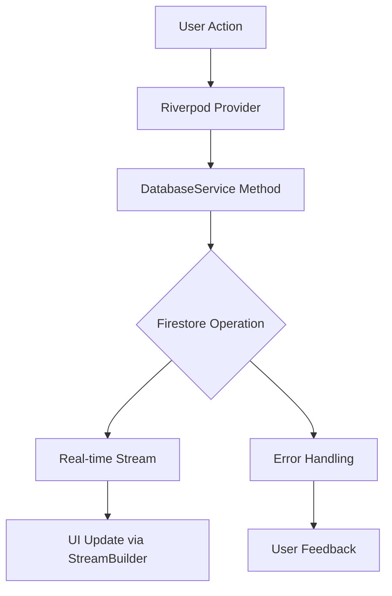

# Backend Architecture Plan for Tailboard Feature

## Overview

This document outlines the technical specification and implementation plan for completing the Firestore backend logic for the Tailboard screen. It addresses critical fixes for Sections 1-3 (Firebase setup, models, DatabaseService/StorageService) identified in the code review, and provides detailed architecture for Sections 4-13 (Riverpod providers through deployment).

The plan leverages existing synergies with `firestore_service.dart`, Riverpod providers, and maintains backward compatibility while adding RBAC, real-time updates, offline support, and performance optimizations.

## 1. Fixes for Sections 1-3

### 1.1 Firebase Setup Fixes (Section 1)

**Cache Configuration Fix:**
- **Issue**: Unlimited cache size in `main.dart` risks OOM on mobile devices
- **Fix**: Set bounded cache to 100MB with monitoring
- **Implementation**: Update `FirebaseFirestore.instance.settings` in `main.dart`:
  ```dart
  FirebaseFirestore.instance.settings = const Settings(
    persistenceEnabled: true,
    cacheSizeBytes: 100 * 1024 * 1024, // 100MB limit
  );
  ```
- **Monitoring**: Add cache size logging via `PerformanceMonitoringService`

**Auth Check Timing:**
- **Issue**: Auth check in `tailboard_screen.dart` may execute before Firebase initialization
- **Fix**: Move auth check to provider level with proper async handling
- **Implementation**: Create `authCheckProvider` that waits for Firebase initialization

### 1.2 Data Models Enhancements (Section 2)

**UserModel Extensions:**
- **Issue**: Missing Tailboard-specific fields (role, permissions)
- **Fix**: Add RBAC fields while maintaining backward compatibility
- **New Fields**:
  ```dart
  // In UserModel
  String? crewRole; // 'foreman' or 'crew_member'
  bool hasTailboardAccess; // Default: true for crew members
  Map<String, dynamic> permissions; // RBAC permissions map
  ```
- **Serialization**: Update `toJson()` and `fromJson()` with null safety
- **Validation**: Add `isValidForTailboard()` method checking required fields

**Soft Delete Support:**
- **Issue**: No soft delete mechanism for recovery
- **Fix**: Add `isDeleted` flag to all models with `deletedAt` timestamp
- **Implementation**: Extend base model class or add to each model

### 1.3 DatabaseService/StorageService Fixes (Section 3)

**Error Handling & Validation:**
- **Issue**: Missing try-catch blocks and input validation
- **Fix**: Comprehensive error handling with user-facing feedback
- **Implementation**:
  ```dart
  Future<TailboardModel?> addTailboard(TailboardModel tailboard) async {
    try {
      if (tailboard.crewId == null) throw ArgumentError('Crew ID required');
      final docRef = await _firestore.collection(kTailboards).add(tailboard.toJson());
      return tailboard.copyWith(id: docRef.id);
    } catch (e) {
      _logger.e('Error adding tailboard: $e');
      rethrow;
    }
  }
  ```

**Constants & Imports:**
- **Issue**: Hardcoded collection paths
- **Fix**: Create `lib/constants/firestore_constants.dart`:
  ```dart
  const String kUsersCollection = 'users';
  const String kCrewsCollection = 'crews';
  const String kTailboardsCollection = 'tailboards';
  const String kFeedPostsSubcollection = 'feedPosts';
  ```

**StorageService Enhancements:**
- **Issue**: No progress tracking or error handling
- **Fix**: Add `Stream<UploadProgress>` and comprehensive error handling
- **Implementation**: Return progress stream from upload methods

## 2. Architecture for Sections 4-13

### 2.1 Riverpod Providers (Section 4)

**Scoped Provider Design:**
- **Location**: `lib/features/crews/providers/tailboard_providers.dart`
- **Pattern**: Family providers for crew-specific data to avoid global pollution
- **Key Providers**:
  ```dart
  @riverpod
  Stream<List<TailboardPost>> tailboardPostsStream(Ref ref, String crewId) {
    final db = ref.watch(databaseServiceProvider);
    return db.streamTailboardPosts(crewId);
  }

  @riverpod
  List<TailboardPost> tailboardPosts(Ref ref, String crewId) {
    final postsAsync = ref.watch(tailboardPostsStreamProvider(crewId));
    return postsAsync.when(
      data: (posts) => posts,
      loading: () => [],
      error: (_, __) => [],
    );
  }
  ```

**Integration with UI:**
- **StreamBuilder**: Use in tab widgets for real-time updates
- **Error Handling**: Provider-level error states with user feedback
- **Dependencies**: Inject `DatabaseService` instance via provider

### 2.2 Real-Time Listeners & Streams (Section 5)

**Stream Architecture:**
- **Pagination**: Implement cursor-based pagination for large datasets
- **Debouncing**: Add debouncing for frequent updates (typing indicators)
- **Connection Handling**: Graceful degradation on network issues

**UI Integration:**
```dart
StreamBuilder<List<TailboardPost>>(
  stream: ref.watch(tailboardPostsStreamProvider(crewId)),
  builder: (context, snapshot) {
    if (snapshot.hasError) return ErrorWidget(snapshot.error!);
    if (!snapshot.hasData) return LoadingWidget();
    return PostsList(posts: snapshot.data!);
  },
);
```

### 2.3 CRUD Operations (Section 6)

**Batch Operations:**
- **Implementation**: Use `WriteBatch` for atomic multi-document updates
- **Soft Deletes**: Add `isDeleted: true` flag instead of hard deletes
- **Optimistic Updates**: Update UI immediately, rollback on failure

**RBAC Integration:**
- **Permission Checks**: Validate user permissions before operations
- **Role-Based Access**: Foreman vs crew member permissions
- **Audit Trail**: Log all operations for compliance

### 2.4 Job Matching Algorithm (Section 7)

**Enhanced _computeJobMatch:**
```dart
bool _computeJobMatch(Map<String, dynamic> jobDetails, Map<String, dynamic> prefs) {
  // Hours check
  if (jobDetails['hours'] < prefs['minHours']) return false;

  // Pay rate check
  if (jobDetails['payRate'] < prefs['minPayRate']) return false;

  // Location distance (using Geolocator)
  final jobLoc = jobDetails['location'] as GeoPoint;
  final prefLoc = prefs['preferredLocation'] as GeoPoint;
  final distance = Geolocator.distanceBetween(
    jobLoc.latitude, jobLoc.longitude,
    prefLoc.latitude, prefLoc.longitude,
  ) / 1000; // km
  if (distance > prefs['maxDistanceKm']) return false;

  return true;
}
```

**Scoring System:**
- **Match Score**: Weighted calculation for sorting/filtering
- **Analytics**: Update crew stats with average match scores

### 2.5 Notification Integration (Section 8)

**NotificationService Extension:**
- **Base**: Extend existing `enhanced_notification_service.dart`
- **Tailboard Events**: New post, job match, message, member activity
- **FCM Integration**: Send push notifications for important events

**In-App Notifications:**
- **Badge Updates**: Real-time unread count updates
- **Sound/Vibration**: Configurable notification preferences

### 2.6 Security Rules (Section 9)

**Firestore Rules Structure:**
```
rules_version = '2';
service cloud.firestore {
  match /databases/{database}/documents {
    // Users can read/write their own data
    match /users/{userId} {
      allow read, write: if request.auth != null && request.auth.uid == userId;
    }

    // Crew access with RBAC
    match /crews/{crewId} {
      allow read: if request.auth != null &&
        (request.auth.uid in get(/databases/$(database)/documents/crews/$(crewId)).data.memberIds ||
         request.auth.uid == get(/databases/$(database)/documents/crews/$(crewId)).data.foremanId);
      allow write: if request.auth != null &&
        request.auth.uid == get(/databases/$(database)/documents/crews/$(crewId)).data.foremanId;
    }
  }
}
```

### 2.7 Error Handling & Edge Cases (Section 10)

**Comprehensive Strategy:**
- **Network Errors**: Retry logic with exponential backoff
- **Offline Queue**: Store operations for sync when online
- **Validation**: Client-side validation before Firestore operations
- **User Feedback**: Snackbar/toast messages for all error states

### 2.8 Performance Optimizations (Section 11)

**Query Optimization:**
- **Composite Indexes**: For complex queries (crewId + timestamp)
- **Pagination**: Limit query results with cursor-based loading
- **Caching**: Leverage Firestore offline persistence

**Memory Management:**
- **Stream Limits**: Dispose streams when not needed
- **Image Optimization**: Compress uploads in StorageService

### 2.9 Testing Suite (Section 12)

**Unit Tests:**
- **Services**: Mock Firestore for DatabaseService tests
- **Providers**: Test Riverpod provider logic
- **Models**: Serialization/deserialization tests

**Integration Tests:**
- **End-to-End**: Full user flows with Firebase Emulator
- **Offline Testing**: Network disconnection scenarios

### 2.10 Deployment (Section 13)

**CI/CD Pipeline:**
- **GitHub Actions**: Automated testing and deployment
- **Firebase Hosting**: Web deployment if needed
- **App Store**: Mobile app distribution

**Environment Management:**
- **Dev/Staging/Prod**: Separate Firebase projects
- **Feature Flags**: Gradual rollout capabilities

## 3. Overall System Design

### 3.1 Service Layer Architecture

```
User Interface (TailboardScreen tabs)
    ↓
Riverpod Providers (tailboard_providers.dart)
    ↓
DatabaseService (CRUD operations)
    ↓
FirestoreService (low-level Firestore operations)
    ↓
Firebase Firestore
```

### 3.2 Data Flow Diagram



### 3.3 Dependencies & Injection

**Firebase Instance Injection:**
```dart
final firebaseFirestoreProvider = Provider<FirebaseFirestore>((ref) {
  return FirebaseFirestore.instance;
});

final databaseServiceProvider = Provider<DatabaseService>((ref) {
  return DatabaseService(ref.watch(firebaseFirestoreProvider));
});
```

### 3.4 Performance Considerations

- **Query Limits**: Maximum 20 items per page, load more on demand
- **Offline Sync**: Automatic sync when connection restored
- **Memory Bounds**: 100MB cache limit with monitoring
- **Debouncing**: 500ms delay for search/filter operations

### 3.5 Security Architecture

- **RBAC**: Role-based permissions (foreman vs member)
- **Data Validation**: Client and server-side validation
- **Audit Logging**: Track all data modifications
- **Encryption**: Firebase handles data encryption at rest/transit

## 4. Integration with Existing Codebase

### 4.1 Leveraging Existing Providers

**Crew State Management:**
- **Reuse**: `crews_riverpod_provider.dart` for crew selection
- **Compose**: Combine with `jobs_riverpod_provider.dart` for shared jobs
- **No Conflicts**: Scoped providers prevent state pollution

**Authentication:**
- **Existing**: Use `AuthService` for user authentication
- **Integration**: Auth state drives Tailboard access permissions

### 4.2 Backward Compatibility

- **Non-Breaking**: All changes maintain existing API contracts
- **Migration Path**: Gradual rollout with feature flags
- **Data Migration**: Handle existing data without required updates

### 4.3 Monitoring & Analytics

**Performance Monitoring:**
- **Integration**: Use existing `PerformanceMonitoringService`
- **Metrics**: Track query performance, cache hit rates, error rates

**User Analytics:**
- **Events**: Track Tailboard usage patterns
- **Crash Reporting**: Firebase Crashlytics integration

## 5. Implementation Roadmap

### Phase 1: Critical Fixes (1-2 days)
1. Fix cache configuration in `main.dart`
2. Add error handling to DatabaseService methods
3. Extend UserModel with RBAC fields
4. Create Firestore constants file

### Phase 2: Core Architecture (3-4 days)
1. Implement scoped Riverpod providers
2. Add real-time streams with pagination
3. Enhance CRUD with batch operations
4. Complete job matching algorithm

### Phase 3: Advanced Features (2-3 days)
1. Notification integration
2. Security rules implementation
3. Error handling strategy
4. Performance optimizations

### Phase 4: Testing & Deployment (2-3 days)
1. Comprehensive test suite
2. CI/CD pipeline setup
3. Production deployment
4. Monitoring and analytics

## 6. Success Criteria

- **Functionality**: All Tailboard features working with real-time updates
- **Performance**: <2s load times, <100MB memory usage
- **Reliability**: 99.9% uptime with offline support
- **Security**: RBAC enforced, no data leaks
- **Maintainability**: Clean architecture, comprehensive tests

This plan ensures efficient implementation by providing clear, actionable steps while maintaining system integrity and user experience.