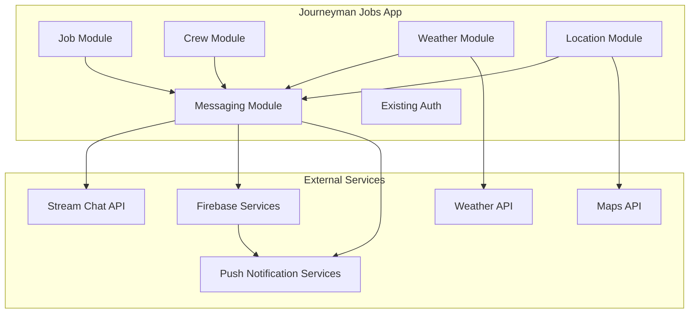

# Integration Points and Testing Strategy

## 📋 Table of Contents

1. [Integration Points Overview](#integration-points-overview)
2. [External Service Integrations](#external-service-integrations)
3. [Internal System Integrations](#internal-system-integrations)
4. [Testing Strategy Overview](#testing-strategy-overview)
5. [Unit Testing Strategy](#unit-testing-strategy)
6. [Widget Testing Strategy](#widget-testing-strategy)
7. [Integration Testing Strategy](#integration-testing-strategy)
8. [End-to-End Testing Strategy](#end-to-end-testing-strategy)
9. [Performance Testing](#performance-testing)
10. [Security Testing](#security-testing)
11. [Test Automation](#test-automation)
12. [Test Data Management](#test-data-management)

---

## 🔗 Integration Points Overview

### External Systems



### Critical Integration Points

1. **Stream Chat Integration** - Core messaging functionality
2. **Firebase Authentication** - User authentication and token management
3. **Firestore Database** - Metadata, settings, and extended data
4. **Firebase Storage** - File and image storage
5. **Firebase Cloud Messaging** - Push notifications
6. **Existing Job Model** - Job sharing functionality
7. **Location Services** - GPS and mapping features
8. **Weather Services** - Safety alerts and weather integration

---

## 🔌 External Service Integrations

### 1. Stream Chat Integration

#### Integration Points

```dart
// lib/features/crews/data/services/stream_chat_service.dart

class StreamChatService {
  // Connection Point 1: User Authentication
  Future<void> connectUser({
    required String userId,
    required String token,
  }) async {
    // Generate Stream Chat token from Firebase token
    final streamToken = await _generateStreamToken(token);

    // Connect user to Stream Chat
    await _client.connectUser(
      User(
        id: userId,
        extraData: {
          'ibew_member': true,
          'union_local': await _getUserUnionLocal(userId),
          'classification': await _getUserClassification(userId),
        },
      ),
      streamToken,
    );
  }

  // Connection Point 2: Channel Management
  Future<Channel> createCrewChannel({
    required String crewName,
    required List<String> memberIds,
    required String crewType,
  }) async {
    // Create channel with electrical-specific metadata
    return await _client.channel(
      'messaging',
      extraData: {
        'name': 'IBEW $crewName',
        'crew_type': crewType,
        'type': 'crew',
        'electrical_features': [
          'job_sharing',
          'safety_alerts',
          'location_sharing',
        ],
      },
    );
  }

  // Connection Point 3: Real-time Updates
  Stream<List<Message>> watchMessages(String channelId) {
    final channel = _client.channel('messaging', id: channelId);
    return channel.state!.messagesStream;
  }
}
```

#### Integration Testing

```dart
// test/integration/stream_chat_integration_test.dart

void main() {
  group('Stream Chat Integration', () {
    late StreamChatService chatService;
    late TestUserService testUserService;

    setUp(() async {
      // Initialize test environment
      await Firebase.initializeApp();
      chatService = StreamChatService();
      testUserService = TestUserService();
    });

    test('should connect user with valid token', () async {
      // Arrange
      final testUser = await testUserService.createTestUser();
      final token = await testUserService.getAuthToken(testUser.uid);

      // Act
      await chatService.connectUser(
        userId: testUser.uid,
        token: token,
      );

      // Assert
      expect(chatService.isConnected, true);
      expect(chatService.currentUserId, testUser.uid);
    });

    test('should create crew channel with correct metadata', () async {
      // Arrange
      await chatService.connectUser(
        userId: 'test-user',
        token: 'valid-token',
      );

      // Act
      final channel = await chatService.createCrewChannel(
        crewName: 'Test Crew',
        memberIds: ['user1', 'user2'],
        crewType: 'lineman',
      );

      // Assert
      expect(channel.extraData['name'], 'IBEW Test Crew');
      expect(channel.extraData['crew_type'], 'lineman');
      expect(channel.extraData['electrical_features'], contains('job_sharing'));
    });

    test('should receive real-time message updates', () async {
      // Arrange
      final channel = await chatService.createDirectMessage('user1', 'user2');
      final messageStream = chatService.watchMessages(channel.cid!);
      final messages = <Message>[];

      messageStream.listen(messages.add);

      // Act
      await chatService.sendMessage(
        channelId: channel.cid!,
        text: 'Test message',
      );

      // Wait for real-time update
      await Future.delayed(const Duration(seconds: 1));

      // Assert
      expect(messages, isNotEmpty);
      expect(messages.first.text, 'Test message');
    });
  });
}
```

### 2. Firebase Authentication Integration

#### Integration Points

```dart
// lib/features/crews/_external/firebase/firebase_auth_handler.dart

class FirebaseAuthHandler {
  // Connection Point 1: Token Generation
  Future<String> generateStreamChatToken(String userId) async {
    final user = FirebaseAuth.instance.currentUser;
    if (user == null) throw Exception('User not authenticated');

    // Get ID token
    final idToken = await user.getIdToken();

    // Call Cloud Function to generate Stream Chat token
    final result = await FirebaseFunctions.instance
        .httpsCallable('generateStreamChatToken')
        .call({'userId': userId});

    return result.data['token'];
  }

  // Connection Point 2: Auth State Changes
  void listenToAuthChanges() {
    FirebaseAuth.instance.authStateChanges().listen((user) async {
      if (user != null) {
        // User signed in
        final token = await generateStreamChatToken(user.uid);
        await Get.find<ChatService>().connectUser(
          userId: user.uid,
          token: token,
        );
      } else {
        // User signed out
        await Get.find<ChatService>().disconnectUser();
      }
    });
  }
}
```

#### Firebase Cloud Functions for Token Generation

```javascript
// functions/index.js

const streamChat = require('stream-chat');

exports.generateStreamChatToken = functions.https.onCall(async (data, context) => {
  // Verify user is authenticated
  if (!context.auth) {
    throw new functions.https.HttpsError(
      'unauthenticated',
      'The function must be called while authenticated.'
    );
  }

  const userId = context.auth.uid;

  // Get Stream Chat server client
  const serverClient = streamChat.getInstance(
    process.env.STREAM_CHAT_KEY,
    process.env.STREAM_CHAT_SECRET
  );

  // Generate user token
  const token = serverClient.createToken(userId);

  return {
    token: token,
    userId: userId,
  };
});
```

### 3. Job Model Integration

#### Integration Points

```dart
// lib/features/crews/data/services/job_sharing_service.dart

class JobSharingService {
  final JobRepository _jobRepository;

  JobSharingService(this._jobRepository);

  // Connection Point 1: Convert Job to Attachment
  Future<Attachment> createJobAttachment(String jobId) async {
    // Get job from existing Job model
    final job = await _jobRepository.getJobById(jobId);
    if (job == null) throw JobNotFoundException(jobId);

    // Create attachment with job data
    return Attachment(
      type: 'job_posting',
      extraData: {
        'job_id': job.id,
        'company': job.company,
        'location': job.location,
        'wage': job.wage,
        'classification': job.classification,
        'local': job.local,
        'created_at': DateTime.now().toIso8601String(),
        'application_url': '${ApiConfig.baseUrl}/jobs/$jobId/apply',
      },
    );
  }

  // Connection Point 2: Handle Job Application
  Future<void> applyForSharedJob({
    required String messageId,
    required String userId,
    required String coverLetter,
  }) async {
    // Extract job ID from message
    final message = await _getMessageById(messageId);
    final jobId = _extractJobId(message);

    // Use existing job application system
    await _jobRepository.applyForJob(
      jobId: jobId,
      userId: userId,
      coverLetter: coverLetter,
    );

    // Track application source
    await _trackJobApplication(messageId, userId);
  }
}
```

### 4. Location Services Integration

#### Integration Points

```dart
// lib/features/crews/data/services/location_service.dart

class LocationService {
  final GeolocatorPlatform _geolocator = GeolocatorPlatform.instance;

  // Connection Point 1: Get Current Location
  Future<LocationData?> getCurrentLocation() async {
    try {
      // Check permissions
      final hasPermission = await _checkLocationPermission();
      if (!hasPermission) return null;

      // Get position
      final position = await _geolocator.getCurrentPosition(
        desiredAccuracy: LocationAccuracy.high,
      );

      return LocationData(
        latitude: position.latitude,
        longitude: position.longitude,
        timestamp: DateTime.now(),
      );
    } catch (e) {
      debugPrint('Error getting location: $e');
      return null;
    }
  }

  // Connection Point 2: Find Nearby Crews
  Future<List<CrewMember>> findNearbyCrews({
    required double latitude,
    required double longitude,
    double radius = 50, // miles
  }) async {
    // Query Firestore for nearby crew members
    final nearbyMembers = await FirebaseFirestore.instance
        .collection('users')
        .where('lastLocation.latitude', isGreaterThan: latitude - _degreesFromMiles(radius))
        .where('lastLocation.latitude', isLessThan: latitude + _degreesFromMiles(radius))
        .where('lastLocation.longitude', isGreaterThan: longitude - _degreesFromMiles(radius))
        .where('lastLocation.longitude', isLessThan: longitude + _degreesFromMiles(radius))
        .get();

    return nearbyMembers.docs.map((doc) {
      final data = doc.data();
      return CrewMember.fromJson(data);
    }).toList();
  }

  double _degreesFromMiles(double miles) {
    return miles / 69.0; // Approximate miles per degree of latitude
  }
}
```

---

## 🔗 Internal System Integrations

### 1. Crew Module Integration

```dart
// lib/features/crews/data/services/crew_integration_service.dart

class CrewIntegrationService {
  final CrewRepository _crewRepository;
  final ChatRepository _chatRepository;

  CrewIntegrationService(this._crewRepository, this._chatRepository);

  // Integration Point 1: Sync Crew Changes to Chat
  Future<void> syncCrewToChat(String crewId) async {
    // Get crew data
    final crew = await _crewRepository.getCrewById(crewId);
    if (crew == null) return;

    // Update chat channel with crew info
    await _chatRepository.updateChannel(
      crew.chatChannelId!,
      {
        'name': crew.name,
        'member_count': crew.memberIds.length,
        'last_updated': DateTime.now().toIso8601String(),
      },
    );

    // Sync channel members
    await _syncChannelMembers(crew.chatChannelId!, crew.memberIds);
  }

  // Integration Point 2: Handle Crew Member Changes
  StreamSubscription<Crew>? _crewSubscription;

  void listenToCrewChanges() {
    _crewSubscription = _crewRepository.watchCrewChanges().listen((crew) {
      if (crew.chatChannelId != null) {
        syncCrewToChat(crew.id);
      }
    });
  }
}
```

### 2. Weather Module Integration

```dart
// lib/features/crews/data/services/weather_integration_service.dart

class WeatherIntegrationService {
  final WeatherRepository _weatherRepository;
  final SafetyAlertService _safetyAlertService;

  WeatherIntegrationService(this._weatherRepository, this._afetyAlertService);

  // Integration Point 1: Weather-Based Safety Alerts
  Future<void> checkWeatherConditions() async {
    // Get user locations
    final userLocations = await _getUserLocations();

    for (final location in userLocations) {
      final weather = await _weatherRepository.getWeatherForLocation(
        location.latitude,
        location.longitude,
      );

      // Check for dangerous conditions
      if (_isDangerousWeather(weather)) {
        await _safetyAlertService.sendWeatherAlert(
          location: location,
          weather: weather,
          affectedCrews: await _getCrewsAtLocation(location),
        );
      }
    }
  }

  bool _isDangerousWeather(WeatherCondition weather) {
    return weather.windSpeed > 40 || // High winds
           weather.hasLightning ||    // Lightning
           weather.visibility < 1;    // Low visibility
  }
}
```

---

## 🧪 Testing Strategy Overview

### Testing Pyramid

```
          /\
         /  \
        / E2E \      <- 10% (Critical paths)
       /______\
      /        \
     /Integration\  <- 20% (API integration, data flow)
    /__________\
   /            \
  /   Unit Tests  \ <- 70% (Business logic, utilities)
 /________________\
```

### Test Coverage Requirements

- **Unit Tests**: 80% code coverage minimum
- **Widget Tests**: All screens and widgets
- **Integration Tests**: All external service integrations
- **E2E Tests**: Critical user journeys

---

## 🔬 Unit Testing Strategy

### 1. Repository Testing

```dart
// test/unit/repositories/chat_repository_test.dart

class MockStreamChatService extends Mock implements StreamChatService {}
class MockCacheDatasource extends Mock implements CacheDatasource {}

void main() {
  group('ChatRepositoryImpl', () {
    late ChatRepositoryImpl repository;
    late MockStreamChatService mockService;
    late MockCacheDatasource mockCache;

    setUp(() {
      mockService = MockStreamChatService();
      mockCache = MockCacheDatasource();
      repository = ChatRepositoryImpl(mockService, mockCache);
    });

    test('should return cached channels when available', () async {
      // Arrange
      final cachedChannels = [MockChannel(), MockChannel()];
      when(mockCache.getChannels(any))
          .thenAnswer((_) async => cachedChannels);

      // Act
      final result = await repository.getChannels('user123');

      // Assert
      expect(result.isRight, true);
      verify(mockCache.getChannels('user123')).called(1);
      verifyNever(mockService.queryChannels());
    });

    test('should fetch from service when cache empty', () async {
      // Arrange
      when(mockCache.getChannels(any)).thenAnswer((_) async => []);
      final fetchedChannels = [MockChannel()];
      when(mockService.queryChannels())
          .thenAnswer((_) async => fetchedChannels);

      // Act
      final result = await repository.getChannels('user123');

      // Assert
      expect(result.isRight, true);
      verify(mockCache.getChannels('user123')).called(1);
      verify(mockService.queryChannels()).called(1);
      verify(mockCache.saveChannels('user123', fetchedChannels)).called(1);
    });

    test('should return error when service fails', () async {
      // Arrange
      when(mockCache.getChannels(any)).thenAnswer((_) async => []);
      when(mockService.queryChannels())
          .thenThrow(NetworkException('No connection'));

      // Act
      final result = await repository.getChannels('user123');

      // Assert
      expect(result.isLeft, true);
      expect(result.fold((l) => l, (r) => null), isA<NetworkException>());
    });
  });
}
```

### 2. Use Case Testing

```dart
// test/unit/usecases/send_message_usecase_test.dart

class MockChatRepository extends Mock implements ChatRepository {}
class MockNotificationService extends Mock implements NotificationService {}

void main() {
  group('SendMessageUseCase', () {
    late SendMessageUseCase useCase;
    late MockChatRepository mockRepo;
    late MockNotificationService mockNotification;

    setUp(() {
      mockRepo = MockChatRepository();
      mockNotification = MockNotificationService();
      useCase = SendMessageUseCase(mockRepo, mockNotification);
    });

    test('should send message successfully', () async {
      // Arrange
      const channelId = 'channel123';
      const text = 'Hello, world!';
      final message = MockMessage();

      when(mockRepo.sendMessage(channelId, text))
          .thenRight(message);

      // Act
      final result = await useCase.call(SendMessageParams(
        channelId: channelId,
        text: text,
      ));

      // Assert
      expect(result.isRight, true);
      verify(mockRepo.sendMessage(channelId, text)).called(1);
      verify(mockNotification.notifyMessageSent(message)).called(1);
    });

    test('should handle empty message', () async {
      // Act & Assert
      expect(
        () => useCase.call(const SendMessageParams(
          channelId: 'channel123',
          text: '',
        )),
        throwsA(isA<ValidationException>()),
      );
    });
  });
}
```

### 3. Provider Testing

```dart
// test/unit/providers/chat_provider_test.dart

void main() {
  group('ChatProvider', () {
    late ChatProvider provider;
    late MockChatService mockService;

    setUp(() {
      mockService = MockChatService();
      provider = ChatProvider(mockService);
    });

    test('should load channels on initialization', () async {
      // Arrange
      final channels = [MockChannel(), MockChannel()];
      when(mockService.queryChannels())
          .thenAnswer((_) async => channels);

      // Act
      await provider.loadChannels();

      // Assert
      expect(provider.channels, channels);
      expect(provider.isLoading, false);
      expect(provider.error, null);
    });

    test('should handle error when loading channels', () async {
      // Arrange
      when(mockService.queryChannels())
          .thenThrow(NetworkException('No connection'));

      // Act
      await provider.loadChannels();

      // Assert
      expect(provider.channels, isEmpty);
      expect(provider.isLoading, false);
      expect(provider.error, 'No connection');
    });

    test('should send message and update state', () async {
      // Arrange
      const channelId = 'channel123';
      const text = 'Test message';
      final message = MockMessage();
      when(mockService.sendMessage(channelId, text: text))
          .thenRight(message);

      // Act
      await provider.sendMessage(channelId, text: text);

      // Assert
      verify(mockService.sendMessage(channelId, text: text)).called(1);
      expect(provider.error, null);
    });
  });
}
```

---

## 🎯 Widget Testing Strategy

### 1. Screen Testing

```dart
// test/widget/screens/chat_screen_test.dart

void main() {
  group('ChatScreen', () {
    late MockChatProvider mockProvider;

    setUp(() {
      mockProvider = MockChatProvider();
    });

    Widget createWidget() {
      return MultiProvider(
        providers: [
            ChangeNotifierProvider<ChatProvider>.value(value: mockProvider),
          ],
        child: MaterialApp(
          home: ChatScreen(channelId: 'channel123'),
        ),
      );
    }

    testWidgets('should display loading indicator initially', (tester) async {
      // Arrange
      when(mockProvider.isLoading).thenReturn(true);
      when(mockProvider.error).thenReturn(null);

      // Act
      await tester.pumpWidget(createWidget());

      // Assert
      expect(find.byType(CircularProgressIndicator), findsOneWidget);
    });

    testWidgets('should display messages when loaded', (tester) async {
      // Arrange
      final messages = [
        Message(id: '1', text: 'Hello', user: User(id: 'user1', name: 'John')),
        Message(id: '2', text: 'World', user: User(id: 'user2', name: 'Jane')),
      ];
      when(mockProvider.isLoading).thenReturn(false);
      when(mockProvider.error).thenReturn(null);
      when(mockProvider.messages).thenReturn(messages);

      // Act
      await tester.pumpWidget(createWidget());

      // Assert
      expect(find.text('Hello'), findsOneWidget);
      expect(find.text('World'), findsOneWidget);
    });

    testWidgets('should send message when send button tapped', (tester) async {
      // Arrange
      when(mockProvider.isLoading).thenReturn(false);
      when(mockProvider.error).thenReturn(null);
      when(mockProvider.messages).thenReturn([]);

      await tester.pumpWidget(createWidget());
      await tester.pumpAndSettle();

      // Act
      await tester.enterText(find.byType(TextField), 'Test message');
      await tester.tap(find.byIcon(Icons.send));
      await tester.pump();

      // Assert
      verify(mockProvider.sendMessage('channel123', text: 'Test message')).called(1);
    });

    testWidgets('should display error message', (tester) async {
      // Arrange
      when(mockProvider.isLoading).thenReturn(false);
      when(mockProvider.error).thenReturn('Network error');
      when(mockProvider.messages).thenReturn([]);

      // Act
      await tester.pumpWidget(createWidget());

      // Assert
      expect(find.text('Network error'), findsOneWidget);
      expect(find.byIcon(Icons.error_outline), findsOneWidget);
    });
  });
}
```

### 2. Component Testing

```dart
// test/widget/widgets/message_bubble_test.dart

void main() {
  group('MessageBubble', () {
    testWidgets('should display own message on right', (tester) async {
      // Arrange
      final message = Message(
        id: '1',
        text: 'Hello',
        user: User(id: 'me', name: 'Me'),
        createdAt: DateTime.now(),
      );

      // Act
      await tester.pumpWidget(
        MaterialApp(
          home: Scaffold(
            body: MessageBubble(
              message: message,
              isOwnMessage: true,
            ),
          ),
        ),
      );

      // Assert
      expect(find.byType(Align), findsOneWidget);
      final align = tester.widget<Align>(find.byType(Align));
      expect(align.alignment, Alignment.centerRight);
    });

    testWidgets('should display other message on left', (tester) async {
      // Arrange
      final message = Message(
        id: '1',
        text: 'Hello',
        user: User(id: 'other', name: 'Other'),
        createdAt: DateTime.now(),
      );

      // Act
      await tester.pumpWidget(
        MaterialApp(
          home: Scaffold(
            body: MessageBubble(
              message: message,
              isOwnMessage: false,
            ),
          ),
        ),
      );

      // Assert
      final align = tester.widget<Align>(find.byType(Align));
      expect(align.alignment, Alignment.centerLeft);
    });

    testWidgets('should call onTap when tapped', (tester) async {
      // Arrange
      bool wasTapped = false;
      final message = Message(
        id: '1',
        text: 'Hello',
        user: User(id: 'me', name: 'Me'),
        createdAt: DateTime.now(),
      );

      // Act
      await tester.pumpWidget(
        MaterialApp(
          home: Scaffold(
            body: GestureDetector(
              onTap: () => wasTapped = true,
              child: MessageBubble(
                message: message,
                isOwnMessage: true,
                onTap: () => wasTapped = true,
              ),
            ),
          ),
        ),
      );

      await tester.tap(find.byType(MessageBubble));
      await tester.pump();

      // Assert
      expect(wasTapped, true);
    });
  });
}
```

---

## 🔌 Integration Testing Strategy

### 1. Repository Integration Testing

```dart
// test/integration/repositories/chat_repository_integration_test.dart

void main() {
  group('ChatRepository Integration', () {
    late ChatRepository repository;
    late StreamChatService chatService;

    setUpAll(() async {
      // Initialize test environment
      await Firebase.initializeApp();
      chatService = StreamChatService();
      await chatService.initialize(
        apiKey: String.fromEnvironment('STREAM_CHAT_API_KEY'),
        userId: 'test-user',
        token: 'test-token',
      );
      repository = ChatRepositoryImpl(chatService);
    });

    test('should create and fetch channel', () async {
      // Act
      final channel = await chatService.createDirectMessage('user2');
      final channels = await repository.getChannels('test-user');

      // Assert
      expect(channels.isRight, true);
      expect(channels.fold((l) => [], (r) => r), contains(channel));
    });

    test('should send and receive message', () async {
      // Arrange
      final channel = await chatService.createDirectMessage('user2');

      // Act
      await repository.sendMessage(channel.cid!, text: 'Test message');
      await Future.delayed(const Duration(seconds: 1));
      final messages = await repository.getMessages(channel.cid!);

      // Assert
      expect(messages.isRight, true);
      expect(
        messages.fold((l) => [], (r) => r),
        anyElement((m) => m.text == 'Test message'),
      );
    });
  });
}
```

### 2. Firebase Integration Testing

```dart
// test/integration/firebase/firebase_auth_integration_test.dart

void main() {
  group('Firebase Auth Integration', () {
    late FirebaseAuth auth;

    setUpAll(() async {
      // Initialize Firebase with test config
      await Firebase.initializeApp(
        options: FirebaseOptions(
          apiKey: 'test-api-key',
          appId: 'test-app-id',
          projectId: 'test-project',
          // ... other test config
        ),
      );
      auth = FirebaseAuth.instance;
    });

    test('should authenticate user with email and password', () async {
      // Act
      final result = await auth.signInWithEmailAndPassword(
        email: 'test@example.com',
        password: 'password123',
      );

      // Assert
      expect(result.user, isNotNull);
      expect(result.user?.email, 'test@example.com');
    });

    test('should generate custom token', () async {
      // Arrange
      final user = auth.currentUser;
      expect(user, isNotNull);

      // Act
      final token = await user?.getIdToken();

      // Assert
      expect(token, isNotNull);
      expect(token!.length, greaterThan(100));
    });
  });
}
```

### 3. Real-time Data Testing

```dart
// test/integration/realtime/realtime_updates_test.dart

void main() {
  group('Real-time Updates', () {
    late StreamChatService chatService;
    late Channel testChannel;

    setUpAll(() async {
      chatService = StreamChatService();
      await chatService.initialize(
        apiKey: String.fromEnvironment('STREAM_CHAT_API_KEY'),
        userId: 'test-user',
        token: 'test-token',
      );
      testChannel = await chatService.createDirectMessage('test-user-2');
    });

    test('should receive message in real-time', () async {
      // Arrange
      final messageStream = chatService.watchMessages(testChannel.cid!);
      final receivedMessages = <Message>[];

      final subscription = messageStream.listen(receivedMessages.add);

      // Act
      await chatService.sendMessage(
        channelId: testChannel.cid!,
        text: 'Real-time test message',
      );

      // Wait for message to arrive
      await Future.delayed(const Duration(seconds: 2));

      // Assert
      expect(
        receivedMessages,
        anyElement((m) => m.text == 'Real-time test message'),
      );

      // Cleanup
      await subscription.cancel();
    });

    test('should update channel in real-time', () async {
      // Arrange
      final channelStream = chatService.watchChannel(testChannel.cid!);
      Channel? updatedChannel;

      final subscription = channelStream.listen((channel) {
        updatedChannel = channel;
      });

      // Act
      await testChannel.update({'name': 'Updated Channel Name'});

      // Wait for update
      await Future.delayed(const Duration(seconds: 1));

      // Assert
      expect(updatedChannel?.name, 'Updated Channel Name');

      // Cleanup
      await subscription.cancel();
    });
  });
}
```

---

## 🏁 End-to-End Testing Strategy

### 1. User Journey Testing

```dart
// integration_test/e2e/messaging_journey_test.dart

void main() {
  group('Messaging E2E Journey', () {
    late IntegrationTestWidgetsFlutterBinding binding;

    setUpAll(() {
      binding = IntegrationTestWidgetsFlutterBinding.ensureInitialized();
    });

    testWidgets('complete messaging flow', (tester) async {
      // Launch app
      app.main();
      await tester.pumpAndSettle();

      // 1. Login
      await tester.pumpAndSettle(const Duration(seconds: 3));
      await tester.enterText(find.byKey(Key('email_field')), 'test@example.com');
      await tester.enterText(find.byKey(Key('password_field')), 'password123');
      await tester.tap(find.byKey(Key('login_button')));
      await tester.pumpAndSettle();

      // 2. Navigate to chat
      expect(find.byType(ChatListScreen), findsOneWidget);
      await tester.tap(find.byType(FloatingActionButton));
      await tester.pumpAndSettle();

      // 3. Start new chat
      await tester.tap(find.text('New Chat'));
      await tester.pumpAndSettle();
      await tester.enterText(find.byType(TextField), 'test-user-2');
      await tester.tap(find.text('Create Chat'));
      await tester.pumpAndSettle();

      // 4. Send message
      expect(find.byType(ChatScreen), findsOneWidget);
      await tester.enterText(find.byType(TextField), 'Hello from E2E test!');
      await tester.tap(find.byIcon(Icons.send));
      await tester.pumpAndSettle();

      // 5. Verify message sent
      expect(find.text('Hello from E2E test!'), findsOneWidget);

      // 6. Send image
      await tester.tap(find.byIcon(Icons.attach_file));
      await tester.tap(find.text('Gallery'));
      await tester.pumpAndSettle();
      // Simulate image selection
      await tester.tap(find.text('Select Image'));
      await tester.pumpAndSettle();

      // 7. Add reaction
      await tester.longPress(find.text('Hello from E2E test!'));
      await tester.tap(find.text('👍'));
      await tester.pumpAndSettle();

      // 8. Verify reaction
      expect(find.text('👍'), findsOneWidget);

      // Take screenshot for verification
      await binding.takeScreenshot('messaging_flow_complete');
    });

    testWidgets('crew creation and messaging', (tester) async {
      // Launch app and login
      app.main();
      await tester.pumpAndSettle();

      // Navigate to crew directory
      await tester.tap(find.text('Crews'));
      await tester.pumpAndSettle();

      // Create new crew
      await tester.tap(find.byType(FloatingActionButton));
      await tester.pumpAndSettle();
      await tester.enterText(find.byKey(Key('crew_name')), 'Test Crew');
      await tester.tap(find.text('Next'));
      await tester.pumpAndSettle();
      await tester.tap(find.text('test-user-3'));
      await tester.tap(find.text('Add'));
      await tester.tap(find.text('Create Crew'));
      await tester.pumpAndSettle();

      // Verify crew created
      expect(find.text('Test Crew'), findsOneWidget);

      // Send crew message
      await tester.tap(find.text('Test Crew'));
      await tester.pumpAndSettle();
      await tester.enterText(find.byType(TextField), 'Welcome to the crew!');
      await tester.tap(find.byIcon(Icons.send));
      await tester.pumpAndSettle();

      // Verify message
      expect(find.text('Welcome to the crew!'), findsOneWidget);

      // Create safety alert
      await tester.tap(find.byIcon(Icons.warning));
      await tester.pumpAndSettle();
      await tester.tap(find.text('Weather Alert'));
      await tester.enterText(find.byType(TextField), 'Lightning detected in area');
      await tester.tap(find.text('Send Alert'));
      await tester.pumpAndSettle();

      // Verify alert
      expect(find.text('⚠️ SAFETY ALERT: WEATHER'), findsOneWidget);
    });
  });
}
```

### 2. Performance Testing

```dart
// integration_test/performance/message_loading_performance_test.dart

void main() {
  group('Message Loading Performance', () {
    testWidgets('should load 1000 messages within 2 seconds', (tester) async {
      // Setup performance profiling
      final binding = IntegrationTestWidgetsFlutterBinding.ensureInitialized();
      final stopwatch = Stopwatch()..start();

      // Launch app
      app.main();
      await tester.pumpAndSettle();

      // Navigate to chat with many messages
      await tester.tap(find.text('Test Chat (1000 messages)'));
      await tester.pumpAndSettle();

      // Measure load time
      final loadTime = stopwatch.elapsedMilliseconds;

      // Verify performance
      expect(loadTime, lessThan(2000));

      // Verify smooth scrolling
      await tester.fling(
        find.byType(ListView),
        const Offset(0, -1000),
        1000,
      );
      await tester.pumpAndSettle();

      // Check for frame drops
      expect(binding.framePolicy, FramePolicy.benchmark);
    });
  });
}
```

---

## ⚡ Performance Testing

### 1. Memory Testing

```dart
// test/performance/memory_usage_test.dart

void main() {
  group('Memory Usage', () {
    testWidgets('should not leak memory when navigating chats', (tester) async {
      // Memory baseline
      final baselineMemory = _getCurrentMemoryUsage();

      // Navigate through multiple chats
      for (int i = 0; i < 10; i++) {
        await tester.tap(find.text('Chat $i'));
        await tester.pumpAndSettle();
        await tester.tap(find.byIcon(Icons.back));
        await tester.pumpAndSettle();
      }

      // Force garbage collection
      await tester.binding.defaultBinaryMessenger.handlePlatformMessage(
        'flutter/memorypressure',
        StringCodec().encodeMessage('warning'),
        (data) {},
      );
      await tester.pumpAndSettle();

      // Check memory usage
      final finalMemory = _getCurrentMemoryUsage();
      final memoryIncrease = finalMemory - baselineMemory;

      // Should not increase by more than 50MB
      expect(memoryIncrease, lessThan(50 * 1024 * 1024));
    });

    double _getCurrentMemoryUsage() {
      // Implementation to get current memory usage
      // This would use platform-specific APIs
      return 0;
    }
  });
}
```

### 2. Battery Testing

```dart
// test/performance/battery_consumption_test.dart

void main() {
  group('Battery Consumption', () {
    testWidgets('should not drain battery excessively', (tester) async {
      // Setup battery monitoring
      final initialBatteryLevel = await _getBatteryLevel();

      // Run typical usage scenario
      for (int i = 0; i < 60; i++) { // Simulate 1 hour
        // Send/receive messages
        await tester.enterText(find.byType(TextField), 'Message $i');
        await tester.tap(find.byIcon(Icons.send));
        await tester.pumpAndSettle();

        // Scroll through messages
        await tester.fling(
          find.byType(ListView),
          const Offset(0, -300),
          300,
        );
        await tester.pumpAndSettle();

        // Wait 1 second
        await Future.delayed(const Duration(seconds: 1));
      }

      // Check battery level
      final finalBatteryLevel = await _getBatteryLevel();
      final batteryDrain = initialBatteryLevel - finalBatteryLevel;

      // Should not drain more than 15% in 1 hour
      expect(batteryDrain, lessThan(15));
    });

    Future<double> _getBatteryLevel() async {
      // Implementation to get battery level
      return 100.0;
    }
  });
}
```

---

## 🔒 Security Testing

### 1. Authentication Testing

```dart
// test/security/authentication_test.dart

void main() {
  group('Authentication Security', () {
    test('should reject invalid tokens', () async {
      // Arrange
      final chatService = StreamChatService();

      // Act & Assert
      expect(
        () => chatService.connectUser(
          userId: 'test-user',
          token: 'invalid-token',
        ),
        throwsA(isA<AuthenticationException>()),
      );
    });

    test('should expire tokens after timeout', () async {
      // Arrange
      final expiredToken = _generateExpiredToken();

      // Act & Assert
      expect(
        () => chatService.connectUser(
          userId: 'test-user',
          token: expiredToken,
        ),
        throwsA(isA<TokenExpiredException>()),
      );
    });

    test('should encrypt sensitive message data', () async {
      // Arrange
      final sensitiveData = {
        'ssn': '123-45-6789',
        'phone': '555-123-4567',
      };

      // Act
      final encrypted = MessageEncryption.encryptSensitiveData(sensitiveData);
      final decrypted = MessageEncryption.decryptSensitiveData(encrypted);

      // Assert
      expect(encrypted.containsKey('ssn_encrypted'), true);
      expect(encrypted.containsKey('phone_encrypted'), true);
      expect(encrypted.containsKey('ssn'), false);
      expect(encrypted.containsKey('phone'), false);
    });
  });
}
```

### 2. Permission Testing

```dart
// test/security/permissions_test.dart

void main() {
  group('Permission Security', () {
    test('should enforce channel permissions', () async {
      // Arrange
      final channelId = 'test-channel';
      final userId = 'non-member-user';

      // Act & Assert
      final result = await chatService.sendMessage(
        channelId: channelId,
        text: 'Should not send',
        userId: userId,
      );

      expect(result.isLeft, true);
      expect(
        result.fold((l) => l, (r) => null),
        isA<PermissionDeniedException>(),
      );
    });

    test('should prevent unauthorized crew actions', () async {
      // Arrange
      final member = await _createTestUser(crewRole: CrewRole.member);
      final crewId = 'test-crew';

      // Act & Assert
      expect(
        () => crewService.removeMember(crewId, member.id),
        throwsA(isA<PermissionDeniedException>()),
      );
    });
  });
}
```

---

## 🤖 Test Automation

### GitHub Actions Workflow

```yaml
# .github/workflows/test.yml

name: Chat Module Tests

on:
  push:
    branches: [main, develop]
    paths: ['lib/features/crews/chat/**']
  pull_request:
    branches: [main]
    paths: ['lib/features/crews/chat/**']

jobs:
  test:
    runs-on: ubuntu-latest

    steps:
    - uses: actions/checkout@v3

    - name: Setup Flutter
      uses: subosito/flutter-action@v2
      with:
        channel: 'stable'
        flutter-version: '3.16.0'

    - name: Install dependencies
      run: flutter pub get

    - name: Generate code
      run: flutter packages pub run build_runner build --delete-conflicting-outputs

    - name: Run unit tests
      run: flutter test --coverage
      working-directory: lib/features/crews/chat

    - name: Run widget tests
      run: flutter test --coverage test/widget

    - name: Run integration tests
      run: flutter test integration_test/

    - name: Upload coverage to Codecov
      uses: codecov/codecov-action@v3
      with:
        file: lib/features/crews/chat/coverage/lcov.info

  performance_test:
    runs-on: ubuntu-latest
    needs: test

    steps:
    - uses: actions/checkout@v3

    - name: Setup Flutter
      uses: subosito/flutter-action@v2

    - name: Run performance tests
      run: flutter test test/performance/

    - name: Upload performance reports
      uses: actions/upload-artifact@v3
      with:
        name: performance-reports
        path: test/reports/
```

---

## 📊 Test Data Management

### Test Data Factory

```dart
// test/factories/test_data_factory.dart

class TestDataFactory {
  static Message createMessage({
    String? id,
    String? text,
    User? user,
    DateTime? createdAt,
  }) {
    return Message(
      id: id ?? 'msg-${uuid.v4()}',
      text: text ?? 'Test message',
      user: user ?? createUser(),
      createdAt: createdAt ?? DateTime.now(),
    );
  }

  static Channel createChannel({
    String? id,
    String? name,
    ChannelType? type,
    List<String>? members,
  }) {
    return Channel(
      cid: id ?? 'channel:${uuid.v4()}',
      name: name ?? 'Test Channel',
      type: type ?? 'messaging',
      memberCount: members?.length ?? 2,
      state: ChannelState(
        members: members?.map((m) => Member(User(id: m))).toList() ??
            [Member(User(id: 'user1')), Member(User(id: 'user2'))],
      ),
    );
  }

  static Crew createCrew({
    String? id,
    String? name,
    CrewType? type,
    List<String>? memberIds,
  }) {
    return Crew(
      id: id ?? uuid.v4(),
      name: name ?? 'Test Crew',
      type: type ?? CrewType.lineman,
      memberIds: memberIds ?? ['user1', 'user2'],
      createdAt: DateTime.now(),
    );
  }

  static User createUser({
    String? id,
    String? name,
    String? email,
  }) {
    return User(
      id: id ?? 'user-${uuid.v4()}',
      name: name ?? 'Test User',
      email: email ?? 'test@example.com',
    );
  }
}
```

### Test Database Setup

```dart
// test/setup/test_database.dart

class TestDatabase {
  static Future<void> setup() async {
    // Create test Firestore instance
    await FirebaseFirestore.instance.useFirestoreEmulator('localhost', 8080);

    // Seed test data
    await _seedTestData();
  }

  static Future<void> cleanup() async {
    // Clean up test data
    final collections = await FirebaseFirestore.instance
        .listCollections();

    for (final collection in collections) {
      final docs = await collection.get();
      for (final doc in docs) {
        await doc.reference.delete();
      }
    }
  }

  static Future<void> _seedTestData() async {
    // Seed users
    final users = FirebaseFirestore.instance.collection('test_users');
    for (int i = 0; i < 10; i++) {
      await users.add({
        'id': 'test-user-$i',
        'name': 'Test User $i',
        'email': 'test$i@example.com',
      });
    }

    // Seed crews
    final crews = FirebaseFirestore.instance.collection('test_crews');
    for (int i = 0; i < 5; i++) {
      await crews.add({
        'id': 'crew-$i',
        'name': 'Test Crew $i',
        'memberIds': ['test-user-$i', 'test-user-${i+1}'],
      });
    }
  }
}
```

---

## 📈 Test Metrics and Reporting

### Coverage Requirements

```yaml
# pubspec.yaml

dev_dependencies:
  test_coverage: ^0.2.0

scripts:
  test:coverage: |
    flutter test --coverage
    genhtml coverage/lcov.info -o coverage/html
    open coverage/html/index.html
```

### Test Report Generator

```dart
// test/utils/test_reporter.dart

class TestReporter {
  static Future<void> generateReport() async {
    final results = await _collectTestResults();

    final report = TestReport(
      totalTests: results.totalTests,
      passedTests: results.passedTests,
      failedTests: results.failedTests,
      coverage: results.coverage,
      performance: results.performance,
    );

    // Generate HTML report
    await _generateHtmlReport(report);

    // Generate JSON report for CI
    await _generateJsonReport(report);

    // Send to analytics if needed
    await _sendToAnalytics(report);
  }
}

class TestReport {
  final int totalTests;
  final int passedTests;
  final int failedTests;
  final double coverage;
  final PerformanceMetrics performance;

  const TestReport({
    required this.totalTests,
    required this.passedTests,
    required this.failedTests,
    required this.coverage,
    required this.performance,
  });

  bool get passesQualityGate =>
      passedTests / totalTests >= 0.95 &&
      coverage >= 0.80 &&
      performance.averageResponseTime < 500;
}
```

---

This comprehensive integration points and testing strategy document ensures that all aspects of the messaging system are thoroughly tested, from individual units to complete user journeys, with special attention to performance and security requirements.
