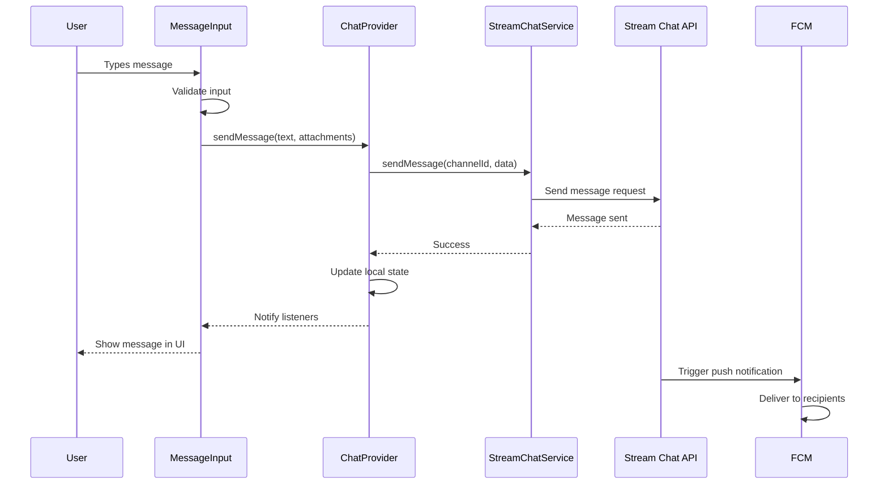
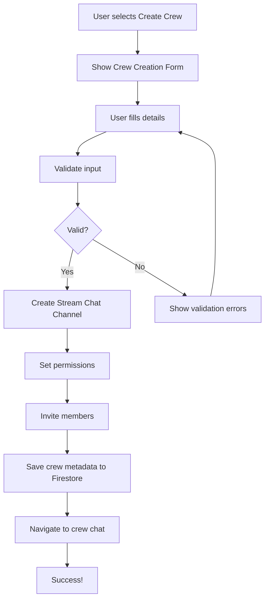

# Technical Implementation Guide - Journeyman Jobs Messaging System

## 📋 Table of Contents

1. [Architecture Overview](#architecture-overview)
2. [Core Technologies](#core-technologies)
3. [Implementation Patterns](#implementation-patterns)
4. [Data Flow](#data-flow)
5. [State Management](#state-management)
6. [Error Handling](#error-handling)
7. [Security Implementation](#security-implementation)
8. [Performance Optimization](#performance-optimization)
9. [Testing Strategy](#testing-strategy)
10. [Deployment Guide](#deployment-guide)

---

## 🏗️ Architecture Overview

### Clean Architecture Implementation

Our messaging system follows Clean Architecture principles with clear separation of concerns:

```dart
┌─────────────────────────────────────────────────────┐
│                    Presentation Layer                │
│  ┌─────────────┐  ┌─────────────┐  ┌─────────────┐  │
│  │   Screens   │  │  Widgets    │  │  Providers  │  │
│  │             │  │             │  │             │  │
│  │ ChatList    │  │ MessageBubble│  │ ChatProvider│  │
│  │ ChatScreen  │  │ ChannelTile │  │ CrewProvider│  │
│  │ CrewScreen  │  │ InputBar    │  │ FeedProvider│  │
│  └─────────────┘  └─────────────┘  └─────────────┘  │
└─────────────────────────────────────────────────────┘
                          │
┌─────────────────────────────────────────────────────┐
│                     Domain Layer                     │
│  ┌─────────────┐  ┌─────────────┐  ┌─────────────┐  │
│  │   Models    │  │  Use Cases  │  │Repositories │  │
│  │             │  │             │  │             │  │
│  │CrewChannel  │  │SendMessage  │  │ChatRepo     │  │
│  │CrewMessage  │  │CreateChannel│  │FeedRepo     │  │
│  │CrewUser     │  │ManageMembers│  │NotifyRepo   │  │
│  └─────────────┘  └─────────────┘  └─────────────┘  │
└─────────────────────────────────────────────────────┘
                          │
┌─────────────────────────────────────────────────────┐
│                      Data Layer                      │
│  ┌─────────────┐  ┌─────────────┐  ┌─────────────┐  │
│  │Repositories │  │  Services   │  │DataSources  │  │
│  │             │  │             │  │             │  │
│  │ChatRepoImpl │  │StreamChat   │  │LocalCache   │  │
│  │FeedRepoImpl │  │Firebase     │  │SecureStorage│  │
│  │NotifyImpl   │  │Location     │  │RemoteAPI    │  │
│  └─────────────┘  └─────────────┘  └─────────────┘  │
└─────────────────────────────────────────────────────┘
```

### Key Architectural Decisions

1. **Stream Chat as Foundation**: Chosen for enterprise-grade reliability and feature completeness
2. **Provider for State Management**: Simple, effective, and well-integrated with Flutter
3. **Firebase for Backend**: Leverages existing infrastructure and provides scalability
4. **Clean Architecture**: Ensures maintainability and testability

---

## 💻 Core Technologies

### Stream Chat Flutter SDK

**Why Stream Chat?**

- Real-time messaging with <100ms latency
- Built-in offline support and sync
- Advanced features (threads, reactions, typing indicators)
- Scalable to millions of users
- Excellent Flutter integration

**Implementation Pattern:**

```dart
// Singleton service for Stream Chat management
class StreamChatService {
  static final StreamChatService _instance = StreamChatService._internal();
  factory StreamChatService() => _instance;
  StreamChatService._internal();

  late StreamChatClient _client;
  String? _currentUserId;

  Future<void> initialize({required String userId, required String token}) async {
    _client = StreamChatClient(
      StreamChatConfig.apiKey,
      logLevel: Level.INFO,
    );

    await _client.connectUser(User(id: userId), token);
    _currentUserId = userId;
  }

  // All Stream Chat operations go through this service
}
```

### Firebase Integration

**Services Used:**

- **Authentication**: User management and token generation
- **Firestore**: Metadata, settings, and extended data storage
- **Storage**: File and image storage
- **Cloud Messaging**: Push notifications

**Implementation Pattern:**

```dart
class FirebaseConfig {
  static Future<void> initialize() async {
    await Firebase.initializeApp(options: DefaultFirebaseOptions.currentPlatform);

    // Initialize messaging
    await FirebaseMessaging.instance.setAutoInitEnabled(true);
  }

  static Future<String> getFCMToken() async {
    final settings = await FirebaseMessaging.instance.requestPermission(
      alert: true, badge: true, sound: true,
    );

    if (settings.authorizationStatus == AuthorizationStatus.authorized) {
      return await FirebaseMessaging.instance.getToken() ?? '';
    }
    throw Exception('FCM permission denied');
  }
}
```

---

## 🔧 Implementation Patterns

### 1. Repository Pattern with Either Type

We use the Either type for robust error handling:

```dart
// Base repository pattern
abstract class ChatRepository {
  Future<Either<ChatException, List<CrewChannel>>> getUserChannels(String userId);
  Future<Either<ChatException, CrewMessage>> sendMessage(
    String channelId,
    Map<String, dynamic> messageData,
  );
}

// Implementation
class ChatRepositoryImpl implements ChatRepository {
  final StreamChatService _chatService;

  @override
  Future<Either<ChatException, List<CrewChannel>>> getUserChannels(
    String userId,
  ) async {
    try {
      final channels = await _chatService.queryChannels(
        filter: Filter.and_([
          Filter.in_('members', [userId]),
        ]),
      );

      final crewChannels = channels.map(_toCrewChannel).toList();
      return Right(crewChannels);
    } catch (e) {
      return Left(ChannelLoadException(e.toString()));
    }
  }
}
```

### 2. Provider Pattern for State Management

```dart
class ChatProvider extends ChangeNotifier {
  final StreamChatService _chatService;
  List<Channel> _channels = [];
  bool _isLoading = false;
  String? _error;

  // Getters
  List<Channel> get channels => _channels;
  bool get isLoading => _isLoading;
  String? get error => _error;

  // Methods
  Future<void> loadChannels() async {
    _setLoading(true);
    _clearError();

    try {
      final channels = await _chatService.queryChannels();
      _channels = channels;
      notifyListeners();
    } catch (e) {
      _setError(e.toString());
    } finally {
      _setLoading(false);
    }
  }

  void _setLoading(bool loading) {
    _isLoading = loading;
    notifyListeners();
  }
}
```

### 3. Widget Composition Pattern

```dart
class MessageBubble extends StatelessWidget {
  final Message message;
  final bool isOwnMessage;
  final VoidCallback? onTap;

  const MessageBubble({
    Key? key,
    required this.message,
    required this.isOwnMessage,
    this.onTap,
  }) : super(key: key);

  @override
  Widget build(BuildContext context) {
    return GestureDetector(
      onTap: onTap,
      child: Container(
        margin: EdgeInsets.only(
          left: isOwnMessage ? 64 : 16,
          right: isOwnMessage ? 16 : 64,
          top: 4,
          bottom: 4,
        ),
        child: Column(
          crossAxisAlignment: isOwnMessage
              ? CrossAxisAlignment.end
              : CrossAxisAlignment.start,
          children: [
            _buildMessageContent(),
            _buildReactionBar(),
            _buildTimestamp(),
          ],
        ),
      ),
    );
  }

  Widget _buildMessageContent() {
    // Delegates to specific message type widgets
    switch (_getMessageType()) {
      case MessageType.text:
        return TextMessageBubble(message: message);
      case MessageType.image:
        return ImageMessageBubble(message: message);
      case MessageType.jobPosting:
        return JobPostingWidget(job: _extractJob(message));
      default:
        return TextMessageBubble(message: message);
    }
  }
}
```

---

## 📊 Data Flow

### Message Sending Flow



### Channel Creation Flow



---

## 🗃️ State Management

### Provider Hierarchy

```dart
// main.dart
void main() {
  runApp(
    MultiProvider(
      providers: [
        ChangeNotifierProvider(create: (_) => AuthProvider()),
        ChangeNotifierProvider(create: (_) => ChatProvider()),
        ChangeNotifierProvider(create: (_) => CrewProvider()),
        ChangeNotifierProvider(create: (_) => FeedProvider()),
        ChangeNotifierProvider(create: (_) => NotificationProvider()),
      ],
      child: JourneymanJobsApp(),
    ),
  );
}

// Provider initialization
class ChatProvider extends ChangeNotifier {
  ChatProvider() {
    _initialize();
  }

  Future<void> _initialize() async {
    // Initialize with stored credentials
    final credentials = await StreamChatService.getCredentials();
    if (credentials['userId'] != null) {
      await _chatService.initialize(
        userId: credentials['userId']!,
        token: credentials['token']!,
      );
      await loadChannels();
    }
  }
}
```

### State Updates Pattern

```dart
// Immutable state updates
class ChatProvider extends ChangeNotifier {
  ChatState _state = ChatState.initial();

  ChatState get state => _state;

  void _updateState(ChatState newState) {
    _state = newState;
    notifyListeners();
  }

  Future<void> sendMessage(String text) async {
    _updateState(_state.copyWith(isSending: true));

    final result = await _chatService.sendMessage(text);

    result.fold(
      (error) => _updateState(_state.copyWith(
        isSending: false,
        error: error.message,
      )),
      (message) => _updateState(_state.copyWith(
        isSending: false,
        error: null,
        messages: [..._state.messages, message],
      )),
    );
  }
}

@immutable
class ChatState {
  final List<Message> messages;
  final bool isLoading;
  final bool isSending;
  final String? error;

  const ChatState({
    required this.messages,
    required this.isLoading,
    required this.isSending,
    this.error,
  });

  ChatState copyWith({
    List<Message>? messages,
    bool? isLoading,
    bool? isSending,
    String? error,
  }) {
    return ChatState(
      messages: messages ?? this.messages,
      isLoading: isLoading ?? this.isLoading,
      isSending: isSending ?? this.isSending,
      error: error,
    );
  }
}
```

---

## ⚠️ Error Handling

### Exception Hierarchy

```dart
// Base exception
abstract class ChatException implements Exception {
  final String message;
  final String? code;
  final dynamic originalError;

  const ChatException(
    this.message, {
    this.code,
    this.originalError,
  });

  @override
  String toString() => 'ChatException: $message';
}

// Specific exceptions
class ChannelCreationException extends ChatException {
  const ChannelCreationException(
    String message, {
    String? code,
    dynamic originalError,
  }) : super(
          message,
          code: code ?? 'CHANNEL_CREATION_FAILED',
          originalError: originalError,
        );
}

class MessageSendingException extends ChatException {
  const MessageSendingException(
    String message, {
    String? code,
    dynamic originalError,
  }) : super(
          message,
          code: code ?? 'MESSAGE_SENDING_FAILED',
          originalError: originalError,
        );
}

class NetworkException extends ChatException {
  const NetworkException(
    String message, {
    String? code,
    dynamic originalError,
  }) : super(
          message,
          code: code ?? 'NETWORK_ERROR',
          originalError: originalError,
        );
}
```

### Error Handling Pattern

```dart
// In repositories
class ChatRepositoryImpl implements ChatRepository {
  @override
  Future<Either<ChatException, Message>> sendMessage(
    String channelId,
    String text,
  ) async {
    try {
      // Check network connectivity
      final hasConnection = await _connectivity.hasConnection;
      if (!hasConnection) {
        return const Left(
          NetworkException('No internet connection'),
        );
      }

      // Validate input
      if (text.trim().isEmpty) {
        return const Left(
          ValidationException('Message cannot be empty'),
        );
      }

      // Send message
      final message = await _chatService.sendMessage(channelId, text);
      return Right(message);
    } on SocketException catch (e) {
      return Left(NetworkException(
        'Network error: ${e.message}',
        originalError: e,
      ));
    } on StreamChatApiException catch (e) {
      return Left(StreamChatException(
        'API error: ${e.message}',
        code: e.code,
        originalError: e,
      ));
    } catch (e) {
      return Left(ChatException(
        'Unexpected error: ${e.toString()}',
        originalError: e,
      ));
    }
  }
}

// In UI
class MessageInput extends StatefulWidget {
  @override
  Widget build(BuildContext context) {
    return Consumer<ChatProvider>(
      builder: (context, provider, child) {
        return Column(
          children: [
            if (provider.error != null)
              Container(
                padding: const EdgeInsets.all(8),
                color: Colors.red[50],
                child: Row(
                  children: [
                    Icon(Icons.error, color: Colors.red[700]),
                    const SizedBox(width: 8),
                    Expanded(
                      child: Text(
                        provider.error!,
                        style: TextStyle(color: Colors.red[700]),
                      ),
                    ),
                    IconButton(
                      icon: const Icon(Icons.close),
                      onPressed: provider.clearError,
                    ),
                  ],
                ),
              ),
            // ... rest of UI
          ],
        );
      },
    );
  }
}
```

---

## 🔐 Security Implementation

### Token Management

```dart
class TokenManager {
  static const _storage = FlutterSecureStorage();
  static const _tokenKey = 'stream_chat_token';
  static const _refreshTokenKey = 'stream_chat_refresh_token';

  // Store tokens securely
  static Future<void> storeTokens({
    required String accessToken,
    required String refreshToken,
  }) async {
    await _storage.write(key: _tokenKey, value: accessToken);
    await _storage.write(key: _refreshTokenKey, value: refreshToken);
  }

  // Get stored tokens
  static Future<Map<String, String?>> getTokens() async {
    final accessToken = await _storage.read(key: _tokenKey);
    final refreshToken = await _storage.read(key: _refreshTokenKey);
    return {
      'accessToken': accessToken,
      'refreshToken': refreshToken,
    };
  }

  // Refresh token
  static Future<String?> refreshToken() async {
    final refreshToken = await _storage.read(key: _refreshTokenKey);
    if (refreshToken == null) return null;

    try {
      final response = await http.post(
        Uri.parse('${ApiConfig.baseUrl}/auth/refresh'),
        headers: {'Authorization': 'Bearer $refreshToken'},
      );

      if (response.statusCode == 200) {
        final data = jsonDecode(response.body);
        final newToken = data['accessToken'];
        await _storage.write(key: _tokenKey, value: newToken);
        return newToken;
      }
    } catch (e) {
      debugPrint('Token refresh failed: $e');
    }

    return null;
  }

  // Clear all tokens
  static Future<void> clearTokens() async {
    await _storage.delete(key: _tokenKey);
    await _storage.delete(key: _refreshTokenKey);
  }
}
```

### Message Encryption

```dart
class MessageEncryption {
  static final _key = Key.fromUtf8('32-character-long-encryption-key');
  static final _iv = IV.fromLength(16);

  // Encrypt sensitive message content
  static String encrypt(String plainText) {
    final encrypter = Encrypter(AES(_key));
    final encrypted = encrypter.encrypt(plainText, iv: _iv);
    return encrypted.base64;
  }

  // Decrypt message content
  static String decrypt(String encryptedText) {
    try {
      final encrypter = Encrypter(AES(_key));
      final encrypted = Encrypted.fromBase64(encryptedText);
      final decrypted = encrypter.decrypt(encrypted, iv: _iv);
      return decrypted;
    } catch (e) {
      debugPrint('Decryption failed: $e');
      return '';
    }
  }

  // For safety alerts and sensitive information
  static Map<String, dynamic> encryptSensitiveData(Map<String, dynamic> data) {
    final sensitiveFields = ['ssn', 'phone', 'address', 'location'];
    final encryptedData = Map<String, dynamic>.from(data);

    for (final field in sensitiveFields) {
      if (encryptedData.containsKey(field)) {
        encryptedData['$field_encrypted'] = encrypt(encryptedData[field].toString());
        encryptedData.remove(field);
      }
    }

    return encryptedData;
  }
}
```

### Permission System

```dart
class PermissionManager {
  // Check if user has permission for action
  static bool hasPermission({
    required String userId,
    required String channelId,
    required ChannelPermission permission,
  }) async {
    // Get channel data
    final channel = await _getChannel(channelId);
    final userRole = await _getUserRole(channelId, userId);

    // Check permission based on role
    return _roleHasPermission(userRole, permission);
  }

  // Check role-based permission
  static bool _roleHasPermission(CrewRole role, ChannelPermission permission) {
    switch (role) {
      case CrewRole.owner:
        return true; // Owner has all permissions
      case CrewRole.admin:
        return permission != ChannelPermission.deleteChannel;
      case CrewRole.member:
        return [
          ChannelPermission.read,
          ChannelPermission.write,
          ChannelPermission.invite,
        ].contains(permission);
      case CrewRole.observer:
        return permission == ChannelPermission.read;
      default:
        return false;
    }
  }

  // Enforce permission in UI
  static Widget withPermission({
    required String userId,
    required String channelId,
    required ChannelPermission permission,
    required Widget child,
    Widget? fallback,
  }) {
    return FutureBuilder<bool>(
      future: hasPermission(
        userId: userId,
        channelId: channelId,
        permission: permission,
      ),
      builder: (context, snapshot) {
        if (snapshot.hasData && snapshot.data == true) {
          return child;
        }
        return fallback ?? const SizedBox.shrink();
      },
    );
  }
}
```

---

## ⚡ Performance Optimization

### Message Pagination

```dart
class MessagePagination {
  static const _pageSize = 50;

  final Map<String, List<Message>> _messagePages = {};
  final Map<String, bool> _hasMore = {};

  // Load messages with pagination
  Future<List<Message>> loadMessages(
    String channelId, {
    bool loadMore = false,
  }) async {
    if (!loadMore) {
      _messagePages[channelId] = [];
      _hasMore[channelId] = true;
    }

    final currentMessages = _messagePages[channelId] ?? [];
    final lastMessageId = currentMessages.isNotEmpty
        ? currentMessages.last.id
        : null;

    final newMessages = await _fetchMessages(
      channelId,
      _pageSize,
      beforeMessageId: lastMessageId,
    );

    if (newMessages.isEmpty) {
      _hasMore[channelId] = false;
    } else {
      _messagePages[channelId] = [...currentMessages, ...newMessages];
    }

    return _messagePages[channelId] ?? [];
  }

  // Check if more messages available
  bool hasMore(String channelId) => _hasMore[channelId] ?? false;

  // Fetch from Stream Chat API
  Future<List<Message>> _fetchMessages(
    String channelId,
    int limit, {
    String? beforeMessageId,
  }) async {
    final channel = _chatService.client.channel(
      channelType: 'messaging',
      id: channelId,
    );

    final response = await channel.query(
      messagesPagination: PaginationParams(
        limit: limit,
        direction: loadMore ? 'top' : 'bottom',
      ),
    );

    return response.messages ?? [];
  }
}
```

### Image Optimization

```dart
class ImageOptimizer {
  static const _maxWidth = 1024;
  static const _maxHeight = 1024;
  static const _quality = 85;

  // Optimize image for upload
  Future<File> optimizeImage(File imageFile) async {
    final bytes = await imageFile.readAsBytes();
    final image = img.decodeImage(bytes)!;

    // Resize if too large
    if (image.width > _maxWidth || image.height > _maxHeight) {
      final resized = img.copyResize(
        image,
        width: _maxWidth,
        height: _maxHeight,
        maintainAspect: true,
      );

      final optimizedBytes = img.encodeJpg(resized, quality: _quality);
      return await _writeToFile(imageFile, optimizedBytes);
    }

    // Compress if size is too large
    final compressed = img.encodeJpg(image, quality: _quality);
    return await _writeToFile(imageFile, compressed);
  }

  // Create thumbnail
  Future<Uint8List> createThumbnail(File imageFile) async {
    final bytes = await imageFile.readAsBytes();
    final image = img.decodeImage(bytes)!;

    final thumbnail = img.copyResize(
      image,
      width: 200,
      height: 200,
      maintainAspect: true,
    );

    return img.encodeJpg(thumbnail, quality: 80);
  }

  Future<File> _writeToFile(File file, Uint8List bytes) async {
    return await file.writeAsBytes(bytes);
  }
}
```

### Memory Management

```dart
class MemoryManager {
  static const _maxCacheSize = 100 * 1024 * 1024; // 100MB
  static const _maxMessagesInMemory = 1000;

  final Map<String, Message> _messageCache = {};
  int _cacheSize = 0;

  // Add message to cache
  void addMessage(Message message) {
    // Remove oldest if cache is full
    if (_messageCache.length >= _maxMessagesInMemory) {
      _removeOldestMessages();
    }

    _messageCache[message.id] = message;
    _updateCacheSize();
  }

  // Get message from cache
  Message? getMessage(String messageId) {
    return _messageCache[messageId];
  }

  // Clear old messages
  void _removeOldestMessages() {
    final messages = _messageCache.values.toList();
    messages.sort((a, b) => a.createdAt!.compareTo(b.createdAt!));

    // Remove oldest 20%
    final removeCount = (_maxMessagesInMemory * 0.2).round();
    for (int i = 0; i < removeCount; i++) {
      _messageCache.remove(messages[i].id);
    }
  }

  // Update cache size estimate
  void _updateCacheSize() {
    // Estimate size based on message count
    _cacheSize = _messageCache.length * 1024; // Rough estimate
  }

  // Clear cache if needed
  void checkAndClearCache() {
    if (_cacheSize > _maxCacheSize) {
      _messageCache.clear();
      _cacheSize = 0;
    }
  }
}
```

---

## 🧪 Testing Strategy

### Unit Testing

```dart
// Example: Repository test
class ChatRepositoryTest {
  late ChatRepository repository;
  late MockStreamChatService mockService;

  setUp() {
    mockService = MockStreamChatService();
    repository = ChatRepositoryImpl(mockService);
  }

  test('should return channels when getUserChannels succeeds', () async {
    // Arrange
    final mockChannels = [MockChannel(), MockChannel()];
    when(mockService.queryChannels())
        .thenAnswer((_) async => mockChannels);

    // Act
    final result = await repository.getUserChannels('user123');

    // Assert
    expect(result.isRight, true);
    result.fold(
      (error) => fail('Expected success but got error'),
      (channels) => expect(channels, hasLength(2)),
    );
  });

  test('should return error when getUserChannels fails', () async {
    // Arrange
    when(mockService.queryChannels())
        .thenThrow(NetworkException('No connection'));

    // Act
    final result = await repository.getUserChannels('user123');

    // Assert
    expect(result.isLeft, true);
    result.fold(
      (error) => expect(error, isA<NetworkException>()),
      (channels) => fail('Expected error but got success'),
    );
  });
}
```

### Widget Testing

```dart
// Example: Widget test
class MessageBubbleTest {
  testWidgets('should display message text correctly', (tester) async {
    // Arrange
    final message = Message(
      id: '123',
      text: 'Test message',
      user: User(id: 'user1', name: 'John'),
      createdAt: DateTime.now(),
    );

    // Act
    await tester.pumpWidget(
      MaterialApp(
        home: Scaffold(
          body: MessageBubble(
            message: message,
            isOwnMessage: true,
          ),
        ),
      ),
    );

    // Assert
    expect(find.text('Test message'), findsOneWidget);
    expect(find.byIcon(Icons.done_all), findsOneWidget);
  });

  testWidgets('should call onTap when bubble is tapped', (tester) async {
    // Arrange
    bool wasTapped = false;
    final message = Message(
      id: '123',
      text: 'Test message',
      user: User(id: 'user1', name: 'John'),
      createdAt: DateTime.now(),
    );

    // Act
    await tester.pumpWidget(
      MaterialApp(
        home: Scaffold(
          body: MessageBubble(
            message: message,
            isOwnMessage: true,
            onTap: () => wasTapped = true,
          ),
        ),
      ),
    );

    await tester.tap(find.byType(MessageBubble));
    await tester.pump();

    // Assert
    expect(wasTapped, true);
  });
}
```

### Integration Testing

```dart
// Example: Integration test
class MessagingFlowTest {
  testWidgets('complete messaging flow should work', (tester) async {
    // Set up test environment
    await tester.pumpWidget(
      MultiProvider(
        providers: [
          ChangeNotifierProvider(create: (_) => ChatProvider()),
        ],
        child: MaterialApp(
          home: ChatListScreen(),
        ),
      ),
    );

    // Verify initial state
    expect(find.byType(CircularProgressIndicator), findsOneWidget);

    // Wait for loading to complete
    await tester.pumpAndSettle();

    // Verify chat list appears
    expect(find.byType(ListView), findsOneWidget);

    // Tap on first chat
    await tester.tap(find.byType(ChannelTile).first);
    await tester.pumpAndSettle();

    // Verify chat screen opens
    expect(find.byType(ChatScreen), findsOneWidget);
    expect(find.byType(MessageInput), findsOneWidget);

    // Type and send message
    await tester.enterText(find.byType(TextField), 'Hello, world!');
    await tester.tap(find.byIcon(Icons.send));
    await tester.pumpAndSettle();

    // Verify message appears
    expect(find.text('Hello, world!'), findsOneWidget);
  });
}
```

---

## 🚀 Deployment Guide

### Environment Configuration

```yaml
# .env.example
STREAM_CHAT_API_KEY=your_stream_chat_api_key
STREAM_CHAT_APP_ID=your_stream_chat_app_id
FIREBASE_PROJECT_ID=your_firebase_project_id
FIREBASE_API_KEY=your_firebase_api_key
FIREBASE_MESSAGING_SENDER_ID=your_sender_id
FIREBASE_APP_ID=your_app_id
```

### Build Configuration

```yaml
# build.yaml
targets:
  $default:
    builders:
      build_runner:
        options:
          # Code generation options
```

### Release Checklist

1. **Environment Setup**
   - [ ] All API keys configured
   - [ ] Firebase project connected
   - [ ] Stream Chat app configured

2. **Code Quality**
   - [ ] All tests passing
   - [ ] Code coverage >80%
   - [ ] No lint warnings
   - [ ] Documentation updated

3. **Performance**
   - [ ] APK size optimized
   - [ ] Memory usage within limits
   - [ ] Startup time <2 seconds
   - [ ] Battery usage tested

4. **Security**
   - [ ] No hardcoded secrets
   - [ ] SSL/TLS enforced
   - [ ] Permissions reviewed
   - [ ] Security audit passed

5. **Testing**
   - [ ] Unit tests pass
   - [ ] Widget tests pass
   - [ ] Integration tests pass
   - [ ] Manual testing complete

6. **Deployment**
   - [ ] Build release APK
   - [ ] Sign with production key
   - [ ] Upload to app store
   - [ ] Release notes prepared

---

## 📚 Additional Resources

### Documentation

- [Stream Chat Flutter Documentation](https://getstream.io/chat/docs/flutter/)
- [Firebase Flutter Documentation](https://firebase.google.com/docs/flutter)
- [Clean Architecture in Flutter](https://resocoder.com/2019/08/27/flutter-clean-architecture-pt-1/)
- [Provider Pattern](https://pub.dev/packages/provider)

### Best Practices

- [Flutter Performance Best Practices](https://flutter.dev/docs/perf)
- [Effective Dart](https://dart.dev/guides/language/effective-dart)
- [Testing in Flutter](https://flutter.dev/docs/cookbook/testing)

### Troubleshooting

- Common Stream Chat issues and solutions
- Firebase integration debugging
- Performance optimization tips
- Memory leak detection

---

This technical implementation guide provides a comprehensive reference for understanding, implementing, and maintaining the Journeyman Jobs messaging system. It serves as a living document that should be updated as the system evolves.
