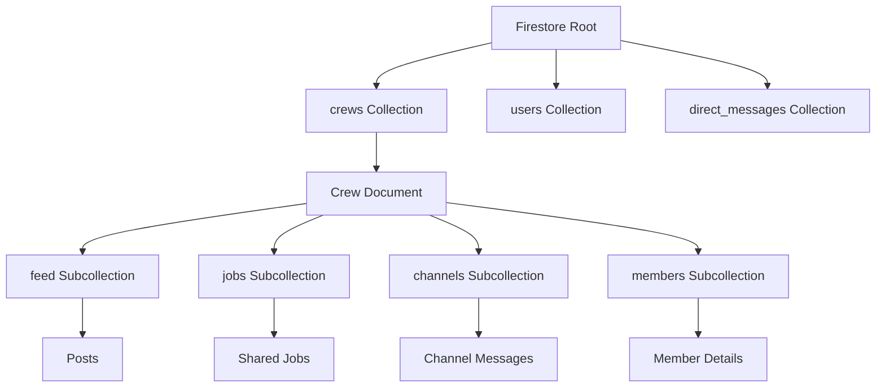

# Tailboard Firestore Schema Design & Analysis

## Executive Summary

This report details the comprehensive Firestore database schema design for the "Tailboard" feature within the Journeyman-Jobs application. The design focuses on the four primary tabs: **Feed**, **Jobs**, **Chat**, and **Members**. It addresses data structure, relationships, query optimization, and real-time event handling requirements.

## 1. High-Level Architecture

The schema follows a **subcollection-heavy** approach nested under `crews/{crewId}` to ensure data isolation and simplify security rules. Global data (like direct messages) exists at the root level.

---

## 2. Detailed Schema by Tab

### A. Feed Tab (`feed` Subcollection)

**Purpose**: Stores posts, announcements, and activity updates for the crew.

#### Schema Structure: `crews/{crewId}/feed/{postId}`

| Field | Type | Description |
| ------- | ------ | ------------- |
| `id` | String | Auto-generated Document ID |
| `authorId` | String | Reference to `users/{userId}` |
| `type` | String | `post`, `announcement`, `alert` |
| `content` | String | Main text content |
| `attachments` | Array<Map> | `[{type: 'image', url: '...'}, {type: 'link', url: '...'}]` |
| `tags` | Array<String> | `['#safety', '#urgent']` |
| `reactionCounts` | Map | `{'like': 5, 'celebrate': 2}` |
| `commentCount` | Number | Total comments (for UI display) |
| `createdAt` | Timestamp | Server timestamp |
| `lastActivityAt` | Timestamp | Updated on new comments (for sorting) |
| `isPinned` | Boolean | For announcements |

#### Subcollections

- `comments`: Stores comments on the post.
- `reactions`: (Optional) If detailed user reaction tracking is needed beyond counts.

#### Query Patterns & Indexes

1. **Main Feed**: `orderBy('createdAt', 'desc')`
    - *Stream*: Yes (Real-time updates)
2. **My Posts**: `where('authorId', '==', currentUser.uid).orderBy('createdAt', 'desc')`
    - *Index Required*: `feed` collection -> `authorId` ASC, `createdAt` DESC
3. **Pinned Posts**: `where('isPinned', '==', true)`

---

### B. Jobs Tab (`jobs` Subcollection)

**Purpose**: specific job opportunities shared within the crew or matched by AI.

#### Schema Structure: `crews/{crewId}/jobs/{jobId}`

| Field | Type | Description |
| ------- | ------ | ------------- |
| `id` | String | Auto-generated Document ID |
| `sharedBy` | String | `userId` or `'AI_MATCHING_SERVICE'` |
| `companyName` | String | Name of the employer |
| `title` | String | Job Title |
| `location` | String | City/State or specific site |
| `coordinates` | GeoPoint | For map view/distance calc |
| `wage` | Number | Hourly rate |
| `wageType` | String | `hourly`, `salary` |
| `description` | String | Full details |
| `status` | String | `open`, `filled`, `expired` |
| `tags` | Array<String> | `['industrial', 'overtime']` |
| `classification` | String | `journeyman`, `apprentice`, `foreman` |
| `constructionType` | String | `commercial`, `industrial`, `residential` |
| `createdAt` | Timestamp | Server timestamp |
| `expiresAt` | Timestamp | TTL for job listing |

#### Query Patterns & Indexes2

1. **All Active Jobs**: `where('status', '==', 'open').orderBy('createdAt', 'desc')`
    - *Stream*: Yes
2. **Filter by Type**: `where('constructionType', '==', 'industrial')`
    - *Index Required*: Composite indexes for multiple filters may be needed.
3. **Local Jobs**: Geo-queries using `geoflutterfire` or simple lat/long bounding box.

---

### C. Chat Tab (`channels` & `direct_messages`)

**Purpose**: Real-time communication. Split into Crew Channels (public to crew) and DMs (private).

#### 1. Crew Channels: `crews/{crewId}/channels/{channelId}/messages/{messageId}`

**Channel Document (`channels/{channelId}`)**

- `name`: "General", "Safety", "Site A"
- `type`: "public", "private"
- `allowedRoles`: `['foreman', 'lead']` (for restricted channels)

**Message Document (`messages/{messageId}`)**

| Field | Type | Description |
| ------- | ------ | ------------- |
| `senderId` | String | User ID |
| `content` | String | Text |
| `type` | String | `text`, `image`, `file` |
| `mediaUrl` | String | If image/file |
| `readBy` | Map<String, Timestamp> | `{'userId1': Timestamp}` (for read receipts) |
| `sentAt` | Timestamp | Server timestamp |

#### 2. Direct Messages: `direct_messages/{conversationId}`

- **Conversation Document**

- `participants`: `[userId1, userId2]`
- `lastMessage`: Map (preview)
- `lastMessageAt`: Timestamp
- `unreadCounts`: `{'userId1': 2}`

**Subcollection**: `messages` (Same schema as channel messages)

#### Query Patterns

1. **Channel Messages**: `collection('messages').orderBy('sentAt', 'desc').limit(50)`
    - *Stream*: Yes (Critical for chat UX)
    - *Pagination*: Load more on scroll up.
2. **My DMs**: `collection('direct_messages').where('participants', 'array-contains', currentUser.uid).orderBy('lastMessageAt', 'desc')`

---

### D. Members Tab (`members` Subcollection)

**Purpose**: Manage crew roster, roles, and status.

#### Schema Structure: `crews/{crewId}/members/{userId}`

**Note**: The document ID is the `userId` for easy lookup/existence checks.

| Field | Type | Description |
| ------- | ------ | ------------- |
| `uid` | String | Redundant but useful |
| `displayName` | String | Cached from user profile |
| `photoUrl` | String | Cached from user profile |
| `role` | String | `foreman`, `lead`, `journeyman`, `apprentice` |
| `status` | String | `active`, `inactive`, `invited` |
| `availability` | String | `available`, `working`, `off` |
| `availabilityNote` | String | "On vacation until Monday" |
| `joinedAt` | Timestamp | |
| `lastActiveAt` | Timestamp | For "Online" status |

#### Query Patterns2

1. **Roster List**: `orderBy('displayName')` or `orderBy('role')`
    - *Stream*: Yes (to see availability updates)
2. **Availability Check**: `where('availability', '==', 'available')`

---

## 3. Event Listeners vs. One-Time Reads

### When to use Streams (Event Listeners)

Streams maintain an open connection and charge for document reads whenever data changes. Use them for:

1. **Chat Messages**: Users expect instant delivery.
2. **Feed (Top ~20 items)**: To see new posts/reactions in real-time.
3. **Member Availability**: To know who is online/working right now.
4. **DM List**: To see unread badges update instantly.

### When to use Futures (One-Time Reads)

Futures fetch data once. Use them for:

1. **Old History**: Loading past chat messages or old feed posts (Pagination).
2. **User Profiles**: When clicking on a user avatar.
3. **Settings/Configuration**: Loaded once on startup.
4. **Job Search Results**: Only update when the user refreshes or changes filters.

## 4. Analysis of "Crews" Feature Constraints

### ID Generation Strategy

- **Crew ID**: As per TODO, logic should be `${nameSanitized}_${counter}_${timestamp}`.
  - *Constraint*: Requires a global counter (sharded counter recommended for high scale, but simple transaction on a `stats/global` doc works for now).
- **User IDs**: Use Firebase Auth UIDs.

### Security Rules Strategy

1. **Read**: `resource.data.crewId in request.auth.token.crews` (Requires custom claims or looking up member doc).
    - *Better*: `exists(/databases/$(database)/documents/crews/$(crewId)/members/$(request.auth.uid))`
2. **Write (Posts/Jobs)**: Member must be `active`.
3. **Write (Admin)**: Member role must be `foreman` or `lead`.

## 5. Next Steps for Implementation

1. **Update Models**: Refactor Dart models (`Job`, `Post`, `CrewMember`) to match this flattened, optimized schema.
2. **Migration**: If data exists, create a migration script.
3. **Security Rules**: Deploy `firestore.rules` implementing the `exists()` checks for membership.
4. **Indexes**: Deploy `firestore.indexes.json` for the specific composite queries identified above.
