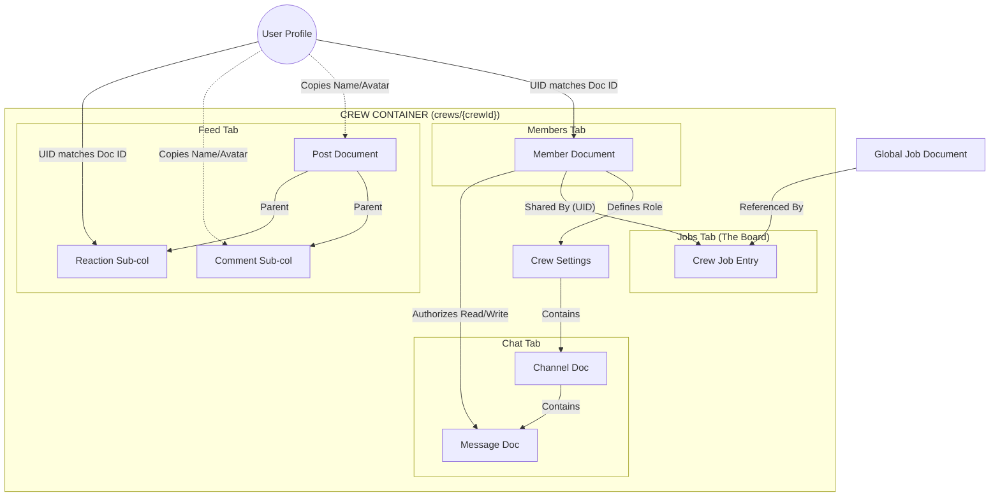

# SCRATCHPAD

This is the **Journeyman Jobs "Tailboard" Master Schema**.

This document is designed to be your **Source of Truth**. It contains the structure, the data types, the optimization strategies (denormalization), and the security logic required to build the feature exactly as we discussed.

## **Architectural Overview**

* **Pattern:** Subcollection-Heavy (Scalable & Secure).
* **Root:** `crews/{crewId}` acts as the container.
* **Security:** Access is determined strictly by the existence of a document in the `members` subcollection.
* **Optimization:** "Snapshots" (User Name/Avatar) are stored on every post/message to prevent excessive reads of the user profile collection.

---

### **1. Root Collection: `crews**

*Stores the settings and meta-data for the crew itself.*

* **Path:** `crews/{crewId}`
* **Doc ID:** Unique String (e.g., `sparky_crew_882` or Auto-ID)

| Field | Type | Description |
| --- | --- | --- |
| `name` | String | Display name of the crew. |
| `description` | String | Short bio/manifesto. |
| `logoUrl` | String | URL to Firebase Storage image. |
| `privacy` | String | Enum: `'open'`, `'inviteOnly'`, `'private'`. |
| `memberCount` | Integer | Counter. Updated via Cloud Function/Transaction on join/leave. |
| `jobCount` | Integer | Counter. Number of active jobs on the board. |
| `createdAt` | Timestamp | When the crew was founded. |
| `updatedAt` | Timestamp | Last settings change. |
| `location` | Map | `{ 'city': 'London', 'state': 'KY', 'zip': '40741' }` |
| `tags` | Array<String> | Search tags (e.g., `['lineman', 'storm', 'traveling']`). |

**Security Logic:**

* **Read:** Public (for search) or Authenticated Only.
* **Write:** **Foreman Only** (Checked via `members` subcollection).

---

### **2. Tab 1: Members (`members` Subcollection)**

*The roster. This is the "Key" to the security system.*

* **Path:** `crews/{crewId}/members/{userId}`
* **Doc ID:** **MUST be the User's Auth UID.**

| Field | Type | Description |
| --- | --- | --- |
| `uid` | String | Redundant, but useful for serialization. |
| `role` | String | Strictly `'Foreman'` or `'Member'`. |
| `joinedAt` | Timestamp | Date joined. |
| `status` | String | `'active'`, `'suspended'`. |
| `userSnapshot` | Map | **Cached Data** (See below). |
| `...displayName` | String | Cached from Users collection. |
| `...avatarUrl` | String | Cached from Users collection. |
| `...jobTitle` | String | e.g., "Journeyman Lineman". |

**Security Logic:**

* **Read:** Crew Members only.
* **Write:**
* **Self:** Can create (join) or delete (leave).
* **Foreman:** Can update (promote/demote - *future proofing*) or delete (kick).

---

### **3. Tab 2: Feed (`feed` Subcollection)**

*The "Wall". Posts, Announcements, and Interactions.*

#### **A. Posts**

* **Path:** `crews/{crewId}/feed/{postId}`

| Field | Type | Description |
| --- | --- | --- |
| `authorId` | String | UID of poster. |
| `authorSnapshot` | Map | `{ displayName, avatarUrl, role }` (Frozen at time of post). |
| `content` | String | Text body of the post. |
| `mediaUrls` | Array<String> | List of image/video URLs. |
| `type` | String | `'text'`, `'image'`, `'announcement'` (Foreman only). |
| `createdAt` | Timestamp | **Crucial for ordering.** |
| `stats` | Map | Counters for UI performance. |
| `...likeCount` | Integer | Total likes. |
| `...lolCount` | Integer | Total LOLs. |
| `...dislikeCount` | Integer | Total dislikes. |
| `...commentCount` | Integer | Total comments. |

#### **B. Reactions (Sub-subcollection)**

*Prevents race conditions and allows "who liked this?" views.*

* **Path:** `crews/{crewId}/feed/{postId}/reactions/{userId}`
* **Doc ID:** **User UID** (Enforces one reaction per user per post).

| Field | Type | Description |
| --- | --- | --- |
| `type` | String | `'like'`, `'lol'`, `'dislike'`. |
| `createdAt` | Timestamp | When they reacted. |
| `userSnapshot` | Map | `{ displayName, avatarUrl }`. |

#### **C. Comments (Sub-subcollection)**

* **Path:** `crews/{crewId}/feed/{postId}/comments/{commentId}`

| Field | Type | Description |
| --- | --- | --- |
| `authorId` | String | UID. |
| `authorSnapshot` | Map | `{ displayName, avatarUrl }`. |
| `content` | String | Comment text. |
| `createdAt` | Timestamp | Sort Ascending. |

---

### **4. Tab 3: Jobs (`jobs` Subcollection)**

*The "Board". Jobs saved/shared to the crew.*

* **Path:** `crews/{crewId}/jobs/{sharedJobId}`

| Field | Type | Description |
| --- | --- | --- |
| `jobReference` | DocRef | Reference to global `/jobs/{jobId}`. |
| `sharedBy` | String | UID of the member who added it. |
| `addedAt` | Timestamp | When it was pinned to the board. |
| `status` | String | `'new'`, `'bidding'`, `'in_progress'`, `'completed'`. |
| `crewNotes` | String | Specific notes for the crew (e.g., "Foreman said apply by Friday"). |
| `jobSnapshot` | Map | **Cached Preview** (To load list fast). |
| `...title` | String | "High Voltage Line Repair". |
| `...location` | String | "Tampa, FL". |
| `...rate` | String | "$55/hr". |

---

### **5. Tab 4: Chat (`chat` Subcollection)**

*The "Walkie-Talkie". Private, real-time messaging.*

#### **A. Channels**

* **Path:** `crews/{crewId}/chat/{channelId}`
* **Standard Docs:** `general`, `leads_only` (Future feature).

| Field | Type | Description |
| --- | --- | --- |
| `name` | String | "General". |
| `lastMessage` | Map | Preview text/author/time for the channel list UI. |

#### **B. Messages**

* **Path:** `crews/{crewId}/chat/{channelId}/messages/{messageId}`

| Field | Type | Description |
| --- | --- | --- |
| `senderId` | String | UID. |
| `senderSnapshot` | Map | `{ displayName, avatarUrl, role }`. |
| `content` | String | Text. |
| `type` | String | `'text'`, `'image'`, `'location'`. |
| `sentAt` | Timestamp | Order by Descending (Newest bottom). |

---

### **6. Implementation Guide: Actions & Functions**

Use these rules when writing your Flutter service methods:

#### **A. Creating a Crew (The "Foreman" Genesis)**

When `createCrew()` is called:

1. Write the `crews/{newId}` document.
2. **IMMEDIATELY** write `crews/{newId}/members/{myUid}` with `role: 'Foreman'`.
3. *Note:* Without step 2, the security rules will lock you out of your own crew.

#### **B. Handling Reactions**

When a user taps "LOL":

1. **Read:** Check if `crews/.../reactions/{myUid}` exists.
2. **If Exists & Type is Different:** Update doc to new type. Update Post counters (decrement old, increment new).
3. **If Exists & Type is Same:** Delete doc (Toggle off). Decrement Post counter.
4. **If Null:** Create doc. Increment Post counter.

#### **C. Conditional UI (Foreman Settings)**

In your Flutter Widget `build` method:

```dart
// Check current user's role from your local Provider/State
bool isForeman = currentCrewMember.role == 'Foreman';

AppBar(
  title: Text('Tailboard'),
  actions: [
    if (isForeman) // Only renders if true
      IconButton(
        icon: Icon(Icons.settings),
        onPressed: () => _openSettings(),
      )
  ]
)

```

#### **D. Firestore Security Rules (Copy/Paste Template)**

```javascript
rules_version = '2';
service cloud.firestore {
  match /databases/{database}/documents {

    // Helper: Check if user is on the roster
    function isMember(crewId) {
      return exists(/databases/$(database)/documents/crews/$(crewId)/members/$(request.auth.uid));
    }

    // Helper: Check if user is the Boss
    function isForeman(crewId) {
      return get(/databases/$(database)/documents/crews/$(crewId)/members/$(request.auth.uid)).data.role == 'Foreman';
    }

    // CREW ROOT
    match /crews/{crewId} {
      allow read: if request.auth != null; // or isMember(crewId) for private
      allow create: if request.auth != null;
      allow update: if isForeman(crewId); // ONLY Foreman edits settings
    }

    // MEMBERS
    match /crews/{crewId}/members/{memberId} {
      allow read: if isMember(crewId);
      allow write: if request.auth.uid == memberId || isForeman(crewId);
    }

    // FEED & COMMENTS & REACTIONS
    match /crews/{crewId}/feed/{postId}/{document=**} {
      allow read: if isMember(crewId);
      allow write: if isMember(crewId); // Members can post/react
    }

    // CHAT
    match /crews/{crewId}/chat/{channelId}/messages/{msgId} {
      allow read, write: if isMember(crewId); // Strictly private
    }
  }
}

```

---

## DATASET RELATIONSHIPS

Here is the **Data Relationship Report** for the Journeyman Jobs "Tailboard" feature.

Since we are building a "Mobile-First" application, standard SQL relationships (like Foreign Keys) don't apply 1:1. Instead, we use **References**, **Embedding**, and **Denormalization** to create relationships that are fast to read.

I have broken this down using a "Job Site" analogy to make the technical relationships clear.

---

## 🏗️ Tailboard Data Relationship Report

### 1. The Core Relationship: User & Crew (The Roster)

**Type:** *Loose Many-to-Many (via Subcollection)*

This is the most critical relationship in the app. It defines **Security** and **Access**.

* **The Concept:** A Crew is a container. A User is an entity. The link between them is the **Member Document**.
* **The Technical Link:**
* We do **not** store a list of users on the Crew document (arrays hit size limits).
* We do **not** store a list of crews on the User document (makes it hard to query "Who is in this crew?").
* **The Solution:** We create a document inside `crews/{crewId}/members/` where the Document ID is the `userId`.

* **Why this works:**
* **Validation:** To check if a user acts, we just check `exists(crews/A/members/UserB)`.
* **Scale:** A crew can have 5 members or 5,000 members; the database speed remains exactly the same.(tHIS IS AN EXAMPLE, NOT AN ACTUAL RULE.)

### 2. The Hierarchy: Foreman vs. Member (The Chain of Command)

**Type:** *Attribute-Based Access Control (ABAC)*

Relationships usually imply connecting two documents. Here, the relationship dictates **Power**.

* **The Concept:** There are only two ranks. The Creator is the Foreman. Everyone else is a Member.
* **The Technical Link:**
* Inside the `member` document defined above, there is a field: `role: 'Foreman'`.

* **The Consequence:**
* The **UI** checks this field to decide whether to render the "Settings" button.
* **Firestore Security Rules** check this field to decide if a write operation to `crews/{crewId}` (changing the name/privacy) is allowed.

### 3. The Feed: Author & Content (The Snapshot)

**Type:** *Denormalized Embedding*

In a traditional SQL database, a Post would just have `authorId: 123`. To show the post, you’d have to "JOIN" the User table to get the name and photo. **In Firestore, joins are impossible.**

* **The Concept:** When a user posts to the Feed, they stamp their current identity onto the post.
* **The Technical Link:**
* The `Post` document contains `authorId` (the link to the profile).
* **CRITICAL:** It *also* contains an `authorSnapshot` map: `{ displayName: "Sparky", avatarUrl: "..." }`.

* **The Relationship:**
* **Read Time:** The relationship is "frozen" at the moment of posting. We do not look up the User profile. This makes the feed load instantly.
* **Write Time:** If the user updates their profile photo later, we have a "Cloud Function" that listens for that change and goes back to update their recent posts (optional maintenance).

### 4. The Feed: Reactions (The Unique Interaction)

**Type:** *One-to-One per Parent*

We need to ensure a user can only "Like" a post once, but can change their mind from "Like" to "LOL".

* **The Technical Link:**
* Reactions live in `crews/{crewId}/feed/{postId}/reactions/{userId}`.

* **The Relationship:**
* By using the `userId` as the document ID for the reaction, we create a **Hard Constraint**. A user physically cannot create two reaction documents for the same post. Writing a new one simply overwrites the old one.

### 5. The Job Board: Crew & Global Jobs (The Pinboard)

**Type:** *Reference / Pointer*

There is a master list of all jobs in the app (Global Jobs). The Crew has a specific list of jobs they are discussing (Crew Jobs). We do not copy the entire job data; we "Reference" it.

* **The Concept:** The Foreman sees a job in the global search and "Pins" it to the Crew Tailboard.
* **The Technical Link:**
* **Collection:** `crews/{crewId}/jobs`.
* **Field:** `jobReference` (Type: `DocumentReference`). This points to `/jobs/{globalJobId}`.

* **The Relationship:**
* The Crew Job document acts as a **Wrapper**. It holds the link to the real job, but adds crew-specific context (e.g., `notes: "Foreman says apply to this one, it pays per diem"`).
* This allows the Global Job to be updated (e.g., Status changes to "Filled") and the Crew sees the update immediately because they are looking at the live reference.

### 6. The Chat: User & Messages (The Walkie-Talkie)

**Type:** *Strictly Parent-Child*

* **The Concept:** Chat messages belong *only* to the Crew. If the Crew is deleted, the messages vanish.
* **The Technical Link:**
* `crews/{crewId}/chat/{channelId}/messages/{messageId}`.

* **The Relationship:**
* **Scope:** Messages are siloed. A message cannot exist outside a crew.
* **Security:** This relationship inherits the security of the root. If you are not in the `members` collection of the parent Crew, you cannot read the children (messages).

---

### 7. Visual Entity Relationship Diagram (ERD)

This text-based diagram visualizes how the IDs link the data.



### Summary for Implementation

1. **Members:** The "Key" that unlocks everything.
2. **Feed:** Optimized for speed (Copy user data).
3. **Jobs:** Optimized for accuracy (Reference global data).
4. **Chat:** Optimized for security (Strict nesting).
